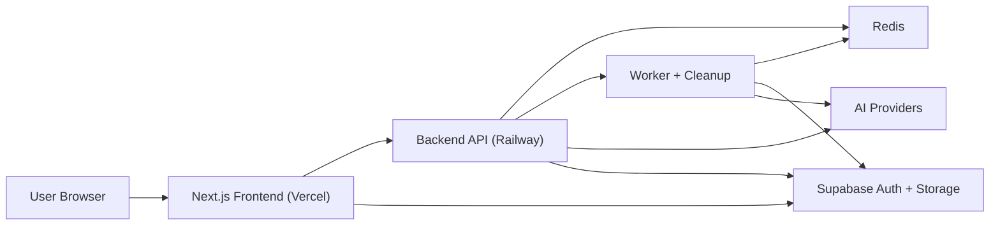
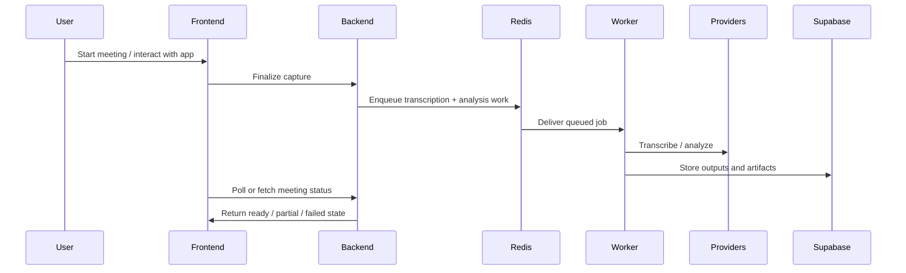
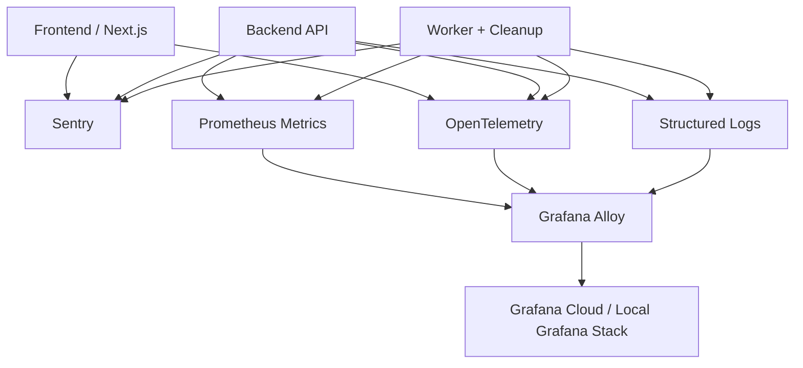
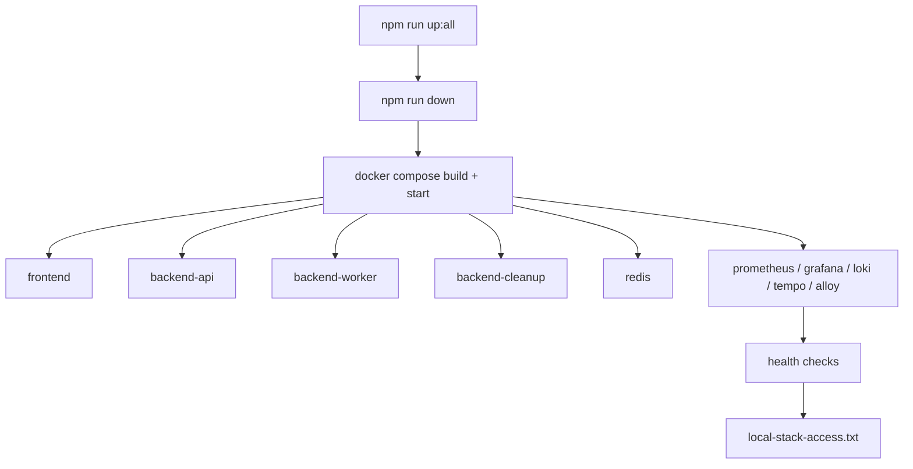

# NextStop.ai Web

NextStop.ai Web is the web deployment of the NextStop.ai meeting workflow: a Next.js application on Vercel backed by a Railway Node.js service, Redis workers, Supabase storage/auth, and a production-oriented observability stack.

The repository is structured as a monorepo, but it deploys as two primary runtime surfaces:

- `frontend/` for the Vercel-hosted product UI
- `backend/` for the Railway-hosted API, workers, cleanup jobs, and AI orchestration

## Production Links

- Public application: [https://next-stop-ai-web.vercel.app](https://next-stop-ai-web.vercel.app)
- Frontend deployment target: Vercel
- Backend deployment target: Railway

For security reasons, this README intentionally does not expose private dashboards, service secrets, internal incident links, or environment-specific backend endpoints.

## What This Project Does

NextStop.ai Web supports a meeting workflow that includes:

- authentication and gated app access
- capture and durable meeting finalization
- asynchronous transcription and AI analysis
- artifact generation and transcript handling
- export flows
- operational readiness and observability

## Architecture



### Runtime Responsibilities

| Surface | Responsibility |
|---|---|
| `frontend/` | product UI, route handling, auth-aware navigation, secure operator summary surfaces |
| `backend/` | API, queue orchestration, workers, cleanup, AI provider integration, metrics and health endpoints |
| Supabase | auth, Postgres, storage, edge functions |
| Redis | job queue and worker coordination |
| Vercel | frontend hosting and build/deploy pipeline |
| Railway | backend hosting and runtime services |

## Meeting Pipeline



## Observability Model

The project includes a production-ready observability layout with metrics, tracing, logs, and error monitoring kept outside the product UI.



Observability components used in this repo:

- Prometheus for metrics
- Grafana for dashboards and alerting
- Tempo for traces
- Loki for logs
- Sentry for application errors and release health
- Grafana Alloy as the telemetry collector/router

The in-app `/dashboard/ops` view is intentionally summary-only and does not expose raw logs, traces, or stack traces.

## Repository Layout

```text
nextstop.ai-web/
├── .github/workflows/         # CI, security, and post-deploy workflows
├── backend/                   # Railway-facing API, worker, cleanup, Supabase assets
│   ├── src/
│   ├── scripts/
│   ├── supabase/
│   │   ├── functions/
│   │   └── migrations/
│   ├── .env.local.example
│   ├── .env.railway.example
│   └── README.md
├── frontend/                  # Vercel-facing Next.js application
│   ├── src/
│   ├── public/
│   ├── scripts/
│   ├── tests/
│   ├── .env.local.example
│   ├── .env.vercel.example
│   └── README.md
├── ops/observability/         # tracked observability configs
├── scripts/                   # root local-stack orchestration scripts
├── docker-compose.local.yml
├── docker-compose.local.dev.yml
├── docker-compose.local.observability.yml
├── local-stack.example.env
├── package.json
└── README.md
```

## Tech Stack

### Frontend

- Next.js
- TypeScript
- React
- Playwright
- Vitest
- Sentry

### Backend

- Node.js
- Fastify
- TypeScript
- Redis
- Prometheus client metrics
- OpenTelemetry
- Sentry

### Platform

- Vercel
- Railway
- Supabase
- Grafana ecosystem

## Local Development

### Prerequisites

- Node.js and npm
- Docker Desktop
- access to the required third-party credentials for local development

### Required env files

Copy these example files before running locally:

- `frontend/.env.local.example` -> `frontend/.env.local`
- `backend/.env.local.example` -> `backend/.env.local`
- optional: `local-stack.example.env` -> `.env.local.stack`

Fill in only the secrets needed for your local run. Do not commit real credentials.

### Recommended one-command startup

The easiest way to start everything locally is:

```bash
npm run up:all
```

That command:

- stops any stale local stack
- rebuilds images
- starts the app stack
- enables observability
- waits for readiness
- writes `local-stack-access.txt` with the active local URLs

### Other useful local commands

```bash
npm run up
npm run up:build
npm run up:obs
npm run up:build:obs
npm run down
npm run restart
npm run logs
npm run health
npm run ps
```

### Typical local services

Actual local ports can be overridden. Always trust `local-stack-access.txt` first, but a typical setup includes:

| Service | Typical local URL |
|---|---|
| Frontend | `http://localhost:3000` |
| Backend health | `http://localhost:8080/health` |
| Backend metrics | `http://localhost:8080/metrics` |
| Redis | `localhost:6379` |
| Prometheus | `http://localhost:9090` or the overridden local port |
| Grafana | `http://localhost:3002` or the overridden local port |
| Loki | `http://localhost:3100` |
| Tempo | `http://localhost:3200` |
| Alloy | `http://localhost:12345` |
| OTLP HTTP receiver | `http://localhost:4318` |

Local Grafana defaults to:

- username: `admin`
- password: `admin`

## How Local Startup Works



## Testing and Validation

### Root commands

```bash
npm run typecheck:frontend
npm run typecheck:backend
npm run health
```

### Frontend

```bash
npm --prefix frontend run typecheck
npm --prefix frontend run lint
npm --prefix frontend run build
npm --prefix frontend run test
npm --prefix frontend run test:e2e
npm --prefix frontend run test:repo-contract
```

### Backend

```bash
npm --prefix backend run typecheck
npm --prefix backend run test
```

## Deployment Model

### Frontend on Vercel

- deploy the `frontend/` workspace
- configure Vercel env vars using `frontend/.env.vercel.example`
- keep operational links and DSNs in environment variables, not in code

### Backend on Railway

- deploy the `backend/` workspace
- configure Railway env vars using `backend/.env.railway.example`
- attach Redis as the queue/runtime dependency

### Supabase

Supabase remains the system of record for:

- auth
- Postgres
- storage
- edge functions
- migrations

## Open Source and Security Notes

This repository is being prepared for a safer open-source posture.

What is intentionally not included here:

- real secrets
- internal dashboards
- raw observability credentials
- internal runbooks or audit documents
- private backend URLs that are not meant for public reference

Please follow these rules when contributing:

- never commit populated `.env` files
- never commit secrets into code or workflows
- keep observability access external to the product UI
- use example env files for setup guidance

## Troubleshooting

### Observability URLs refuse to connect

If Grafana, Prometheus, Loki, or Tempo are not reachable, make sure you started the stack with observability enabled:

```bash
npm run up:all
```

or:

```bash
npm run up:obs
```

### Local ports do not match the README

Use `local-stack-access.txt` and `npm run health`. Port overrides can change the runtime URLs from the default examples shown here.

### Local auth behaves differently from production

Local and production sessions use different browser cookies and different origins. Test local auth from `http://localhost:3000`, not from a production tab.

## Maintainer Notes

- `scripts/` is shared project tooling and should remain tracked
- `ops/observability/` is tracked because observability config is part of the product infrastructure
- database migrations are tracked and should not be removed casually

## License / Usage

Add your project license here before publishing the repository publicly.
