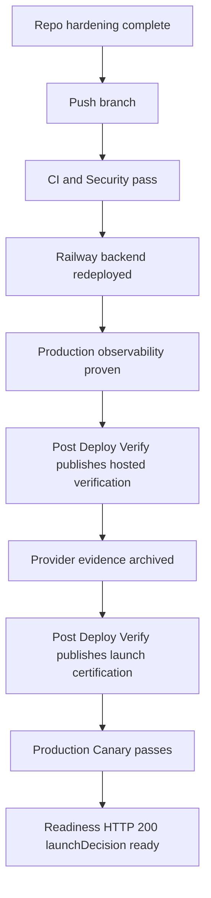

# Final Remediation Tracker - 2026-04-29

This tracker closes the action list from `web-final-production-readiness-security-audit-2026-04-29.md`. It separates repo-verifiable work from provider/operator evidence that must be verified in GitHub, Railway, Vercel, Supabase, Razorpay, Sentry, and the OTLP provider before production certification.

## Closure Flow



## Severity Findings

| ID | Issue | Repo status | User/provider verification required | Required proof |
|---|---|---|---|---|
| C-01 | Hosted verification not published into backend runtime state | Workflow and backend publish path are implemented. | Yes | `Post Deploy Verify` run with `certify_launch=false`, hosted verification artifact, backend `/health` reflection. |
| C-02 | Production observability proof not evidenced live | Backend status and readiness checks are implemented. | Yes | Railway env proof, Sentry event/transaction, OTLP trace/span, readiness production observability pass. |
| C-03 | Launch certification not published after green prerequisites | Gated certification publish path is implemented. | Yes | `Post Deploy Verify` run with `certify_launch=true`, certification artifacts, readiness HTTP 200. |
| H-01 | Provider WAF/rate-limit proof missing | Evidence checklist exists. | Yes | Vercel, Railway, Supabase, Razorpay, and Sentry/OTLP control screenshots or dashboard links. |
| H-02 | Human legal review required | Legal pages and checklist exist. | Yes | Legal approval or accepted legal risk recorded before broad public launch. |
| H-03 | Accepted PostCSS advisory remains time-boxed | Risk acceptance and expiry gate are implemented. | Monthly review required | Security dependency audit pass and unexpired risk metadata. |
| H-04 | Live backend worker/queue behavior not proven | Backend tests and health checks exist. | Yes | Railway services running, backend `/health` worker fields green, Production Canary pass. |
| M-01 | CSP still allows inline script/style | Report-only CSP/Trusted Types posture exists. | Yes | CSP report telemetry reviewed for one release cycle before stricter enforcement. |
| M-02 | Source map exposure needs deployed verification | Public production source maps are disabled in repo; canary verifies `.map` exposure. | Yes | Production security canary artifact shows no exposed `.map` assets. |
| M-03 | CSP report endpoint needs provider rate-limit proof | CSP report endpoint is capped/scrubbed in code. | Yes | Vercel/provider rule or accepted gap for `/api/security/csp-report`. |
| M-04 | Security dashboards/alerts need live setup | Alert requirements are documented. | Yes | Sentry/OTLP alert links with owner, threshold, severity, and response playbook. |
| M-05 | Secret rotation drill not evidenced | Rotation runbook exists. | Yes | `AI_CORE_SHARED_SECRET` rotation date, owner, changed systems, and passing workflow run. |
| M-06 | Production Canary needs first successful run | `Production Canary` workflow and production security verifier are implemented. | Yes | Successful canary run with `production-canary-artifacts`. |
| L-01 | Audit evidence must stay curated | Selected docs are unignored; raw payloads stay in artifacts. | Yes | Clean `git status`, manual secret review of docs, safe summaries committed only. |
| L-02 | Dashboard UX/accessibility coverage should continue | QA checklist and test backlog exist. | Post-launch QA | Dashboard empty/error/tablet/a11y backlog triaged after launch. |

## Additional Verification Gaps

| Area | Verification owner | What to verify | Evidence |
|---|---|---|---|
| Supabase | User/provider | Redirect allowlist, auth abuse controls, server-only service-role key usage. | Dashboard screenshot or sanitized notes. |
| Razorpay | User/provider | Production webhook URL, signing secret, retry/failure visibility, entitlement update rehearsal. | Dashboard screenshot, event ID, sanitized entitlement proof. |
| Railway | User/provider | Backend API and worker are running, env vars set, logs clean, `/health` green. | Deployment/log link and backend health artifact. |
| Vercel | User/provider | Latest commit deployed, security headers present, no public source maps, firewall rules available. | Deployment link and production security canary artifact. |
| GitHub | User/GitHub Actions | CI, Security, Post Deploy Verify, and Production Canary green. | Workflow run links and artifacts. |
| Legal | User/legal | Policies match actual auth, billing, AI processing, integrations, retention, deletion, and support behavior. | Approved checklist or risk acceptance. |
| Observability | User/provider | Production Sentry and OTLP ingestion active with alerts. | Event/trace links and alert screenshots. |

## Production Security Canary

The root command below produces a single JSON artifact that checks production security headers, source-map exposure, readiness blockers, and optional backend worker health:

```powershell
npm run verify:production-security -- https://<production-web-domain> --backend-health-url=https://<railway-backend>/health --output=production-security-verification.json
```

The `Production Canary` workflow runs this command and uploads `production-security-verification.json` inside `production-canary-artifacts`.

## Final Signoff Criteria

- CI `static-checks`, `unit-and-route-tests`, and `browser-smoke` pass.
- Security `secret-scan`, `dependency-audit`, and `codeql` pass.
- `Post Deploy Verify` passes once with `certify_launch=false`.
- Production observability evidence is visible in readiness, Sentry, and OTLP.
- Provider WAF/rate-limit evidence is archived.
- `Post Deploy Verify` passes with `certify_launch=true`.
- `Production Canary` passes and archives production security verification.
- Web readiness returns HTTP `200`, `launchDecision: "ready"`, and `blockingFailures: []`.
