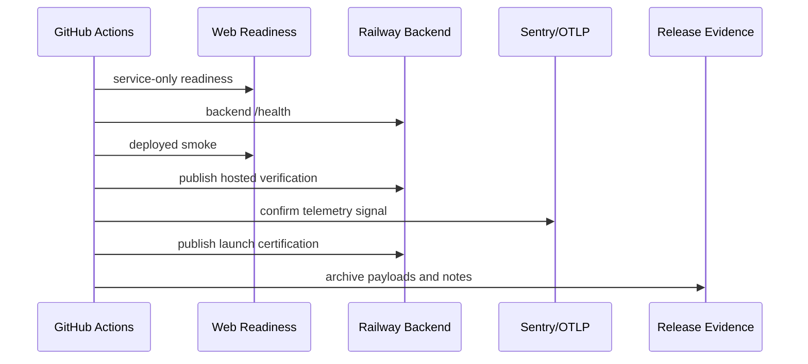

# Operations And Security Hardening Runbook

Last updated: April 29, 2026

## Launch Certification Checklist

Launch certification must not be issued until each item is green or has an explicit accepted risk.

| Area | Required proof | Evidence location |
|---|---|---|
| CI | Static checks, frontend tests, backend tests, browser smoke, security workflows pass | GitHub Actions run |
| Dependency risk | `npm run security:audit` passes and accepted risks are unexpired | `docs/dependency-risk-acceptance-2026-04-28.md` |
| Readiness | Production service-only readiness check passes with no unexpected blockers | `readiness-payload` artifact |
| Backend health | Railway `/health` reports worker ready, direct execution, cleanup healthy | `backend-health-payload` artifact |
| Observability | Sentry and OTLP are configured and show at least one live production signal | release notes screenshot/link |
| Provider abuse controls | Vercel, Railway, Supabase, Razorpay, and observability-provider controls are captured | `provider-security-evidence-checklist` artifact |
| Hosted verification | Hosted verification is published as `pass` | `hosted-verification-payload` artifact |
| Launch certification | Certification payload is published as `certified` only after proof is complete | `launch-certification-payload` artifact |
| Legal | Privacy, terms, cookies, AI processing, retention, deletion, billing language reviewed | legal review checklist |
| Rollback | Frontend and backend rollback path verified for the release | this runbook |

## Release Evidence Archive

Every production release should archive:

- readiness payload
- backend health payload
- hosted verification payload
- launch certification prerequisites
- launch certification payload
- observability proof
- provider security evidence checklist
- deployed Playwright artifacts on failure
- dependency risk status

## Production Alerts

| Signal | Severity | Alert condition | First response |
|---|---:|---|---|
| Readiness blocker | SEV-1 | `/api/health/readiness` has unexpected blocker | Freeze certification and inspect blocker detail |
| Worker stale | SEV-1 | backend `/health.workerStale === true` | Restart worker, inspect queue, verify heartbeat |
| Queue depth | SEV-2 | depth above agreed provider threshold for 10 minutes | Scale worker or pause new AI processing |
| Oldest job age | SEV-2 | oldest active job exceeds SLO | Inspect AI provider and Redis/BullMQ health |
| Webhook failures | SEV-1 for billing, SEV-2 otherwise | repeated 4xx/5xx or duplicate spike | Check signatures, idempotency, provider retries |
| Webhook replay attempts | SEV-2 | stale signed events or duplicate spikes exceed baseline | Confirm Razorpay delivery dashboard and rotate webhook secret if suspicious |
| 5xx spike | SEV-2 | sustained route-level 5xx increase | Check Sentry issues and rollback if release-correlated |
| Observability missing | SEV-2 | no Sentry/OTLP production signal after deploy | Verify env vars and collector endpoint |

## Incident Severity Matrix

| Severity | Examples | Response target | Update cadence | Closure |
|---|---|---:|---:|---|
| SEV-1 | readiness blocked, auth unavailable, billing broken, data exposure | immediate | 30 min | root cause, fix, evidence |
| SEV-2 | AI processing degraded, webhook backlog, integration outage | same business day | 2 hours | mitigation and monitoring stable |
| SEV-3 | partial UI/API degradation | next business day | daily | user impact resolved |
| SEV-4 | docs, cosmetic, low-risk polish | planned | as needed | merged or deferred |

## Rollback

Frontend rollback:

1. Promote the previous known-good Vercel deployment.
2. Verify `/`, `/login`, and `/api/health/readiness`.
3. Rerun deployed smoke and service-only readiness.
4. Record the deployment URL and readiness payload in release notes.

Backend rollback:

1. Redeploy or roll back to the previous Railway backend service version.
2. Verify `/health` and `/metrics`.
3. Confirm worker heartbeat, direct execution, cleanup health, Sentry, and OTLP.
4. Rerun post-deploy verification without launch certification first.

## Source Map Governance

- Public production source maps must not be served as ordinary browser assets.
- `frontend/next.config.ts` sets `productionBrowserSourceMaps: false` so public browser maps remain disabled by default.
- Release source maps may be uploaded to Sentry only when `SENTRY_AUTH_TOKEN`, `SENTRY_ORG`, `SENTRY_PROJECT`, and release metadata are configured.
- Sentry project access is restricted to engineering operators who need production debugging access.
- Source map uploads must be reviewed if a release includes generated files or suspected secret exposure.

## Synthetic Canaries

The `Production Canary` workflow runs daily and can be started manually. It verifies service-only readiness, backend health when `BACKEND_HEALTH_URL` is configured, and deployed homepage/login smoke coverage. It must never publish hosted verification or launch certification; those actions remain restricted to the explicit `Post Deploy Verify` certification flow.

Archive failed canary artifacts with the incident or release note that triaged the failure.

## Webhook Replay Control

Razorpay webhooks are protected by HMAC signature verification, event-id idempotency, and a replay window when the payload includes a reliable `created_at` timestamp. The default accepted event age is 10 minutes and can be changed with `RAZORPAY_WEBHOOK_MAX_EVENT_AGE_SECONDS`.

If Razorpay omits a timestamp for an event type, the route falls back to signature plus idempotency and the provider dashboard should be monitored for duplicate delivery spikes.

## Secret Rotation

Rotate before broad launch and after any suspected exposure:

| Secret | Owner | Verification |
|---|---|---|
| `AI_CORE_SHARED_SECRET` | platform | hosted verification and launch certification publish succeed |
| Supabase service role key | backend | auth and admin routes pass smoke tests |
| Razorpay keys/webhook secret | billing | checkout and webhook tests pass |
| OAuth client secrets | integrations | Google/Notion connect and callback pass |
| Sentry auth/DSN | observability | one test event/trace appears |
| OTLP headers | observability | one trace appears in provider |

Never commit rotated values. Store them in GitHub Actions, Vercel, Railway, Supabase, Razorpay, Sentry, and OTLP providers only.

## Monthly Dependency Review

On the first release week of each month:

1. Run `npm run security:audit`.
2. Review unexpired accepted risks.
3. Check whether upstream packages removed the vulnerable path.
4. Renew, remove, or fix each accepted risk.
5. Record the decision in release verification notes.
