# NextStop 40-Slide Pitch Deck Content Master

**Document type**: detailed slide-content master for the final PowerPoint build  
**Deck output target**: premium 40-slide `.pptx` presentation  
**Project**: NextStop  
**Prepared on**: April 2, 2026  
**Primary audience**: founder, operator, investor-style reviewer, technical stakeholder, product partner  
**Source documents**:
- [NextStop-40-Slide-Deck-Blueprint.md](C:/Users/ADMIN/Desktop/nextstop.ai/nextstop.ai-web/docs/pitch-deck/NextStop-40-Slide-Deck-Blueprint.md)
- [production-readiness-report.md](C:/Users/ADMIN/Desktop/nextstop.ai/nextstop.ai-web/docs/production-readiness-report.md)

---

## Part I. How To Use This Document

This file is the **content master** for the final NextStop pitch deck.

It is designed to sit one level above the existing 40-slide blueprint:

- the earlier blueprint defines the **slide map and visual intent**
- this file provides the **actual on-slide content, expanded copy, diagram code, chart code, layout instructions, and presenter-facing direction**

Use this file when creating the final `.pptx`.

### What this file includes

- the exact 40-slide structure
- narrative guidance for each slide
- proposed on-slide copy
- premium layout direction for each slide
- Mermaid diagram code for required diagram-led slides
- Mermaid statistic/chart code wherever useful
- product UI sketch guidance for experience slides
- brand palette notes extracted from the available SVG
- final deck quality-control instructions

### What this file does not do

- it does not create the PowerPoint by itself
- it does not fabricate investor metrics, market size, or traction data
- it does not add appendix slides
- it does not override the requirement that the deck remain exactly 40 slides

### Working principle

If content must be shortened during slide production, preserve:

1. the slide title
2. the core takeaway
3. the visual focal point
4. the deck-wide premium dark editorial system

---

## Part II. Brand System And Design Rules

### 1. Core brand asset paths

- Primary wordmark:
  - `C:\Users\ADMIN\Desktop\nextstop.ai\nextstop.ai-web\frontend\public\brand\nextstop-wordmark.svg`
- Supporting SVGs already available in repo:
  - `C:\Users\ADMIN\Desktop\nextstop.ai\nextstop.ai-web\frontend\public\file.svg`
  - `C:\Users\ADMIN\Desktop\nextstop.ai\nextstop.ai-web\frontend\public\globe.svg`
  - `C:\Users\ADMIN\Desktop\nextstop.ai\nextstop.ai-web\frontend\public\window.svg`
  - `C:\Users\ADMIN\Desktop\nextstop.ai\nextstop.ai-web\frontend\public\next.svg`
  - `C:\Users\ADMIN\Desktop\nextstop.ai\nextstop.ai-web\frontend\public\vercel.svg`

### 2. Recommended future asset paths

- `C:\Users\ADMIN\Desktop\nextstop.ai\nextstop.ai-web\frontend\public\brand\nextstop-mark.svg`
- `C:\Users\ADMIN\Desktop\nextstop.ai\nextstop.ai-web\frontend\public\brand\nextstop-monogram.svg`
- `C:\Users\ADMIN\Desktop\nextstop.ai\nextstop.ai-web\frontend\public\brand\nextstop-wordmark-dark.svg`
- `C:\Users\ADMIN\Desktop\nextstop.ai\nextstop.ai-web\frontend\public\brand\nextstop-wordmark-light.svg`

### 3. Palette extracted from `nextstop-wordmark.svg`

The current logo contains a high-value gradient system that should become the visual base of the deck:

- `Signal Gold`: `#F8DE4F`
- `Warm Gold`: `#F6D64E`
- `Amber`: `#EFC04C`
- `Bronze`: `#E6A149`
- `Coral Orange`: `#F17635`
- `Burnt Ember`: `#E7743C`
- `Core Blue`: `#3655B9`
- `Bright Blue`: `#415AB2`
- `White`: `#FFFFFF`

### 4. Recommended dark deck neutrals

These are not from the SVG but are necessary to stage the brand palette elegantly:

- `Night Canvas`: `#070A0F`
- `Elevated Panel`: `#0F141E`
- `Soft Panel`: `#141B27`
- `Muted Text`: `#A7B1C2`
- `Grid Line`: `#1E293B`

### 5. Gradient logic for deck production

Use the logo-derived gradient family in these ways:

- gold to orange for heat, urgency, and hero moments
- orange to blue for motion, system flow, and transformation
- blue to deep blue for architecture, structure, and product-state diagrams
- emerald only as a success-semantic accent when necessary

### 6. Typography direction

Recommended headline direction:

- `Sora`, `Geist Sans`, `Manrope`, or similar modern grotesk for headlines

Recommended body direction:

- `Inter`, `Geist Sans`, or `IBM Plex Sans`

Typography rules:

- headlines should be bold to extra-bold
- eyebrow labels should be uppercase with tracking
- body copy should be short and high-signal
- metric numerals should be large and isolated where possible

### 7. Layout system

The deck should repeat a small number of premium compositions:

- hero left / atmospheric right
- insight headline + 3 cards
- 2-column narrative split
- diagram center + commentary band
- grid of capability cards
- product UI concept on one side + rationale on the other
- scoreboard layout
- roadmap lane layout

### 8. Diagram and chart rendering rules

All Mermaid diagrams in this file are **source diagrams**.

For the final PowerPoint:

- render Mermaid into SVG where possible
- or recreate it as polished native/vector PowerPoint artwork
- do not paste raw markdown screenshots into slides
- simplify labels if they become visually dense
- keep rounded nodes, high contrast, and restrained color count

### 9. Suggested global Mermaid theme reference

Use this as a rendering baseline when converting Mermaid to SVG:


### 10. Statistic diagram rule

Statistic-style Mermaid charts included below are **internal strategic visuals**, not external investor metrics.

They should be presented as:

- readiness or maturity scoring
- priority weighting
- risk severity
- release payload emphasis
- execution planning

Do not label them as audited market or financial data.

---

## Part III. Slides 1 To 10

## Slide 1. Cover

**Deck role**: establish brand quality, seriousness, and the product thesis  
**Eyebrow**: `NEXTSTOP / PRODUCT READINESS DECK`

### On-slide title

`NextStop`

### Subtitle

`Post-Production Readiness, Product Narrative, and Scale Plan`

### On-slide copy

- Framing line:
  - `From meeting capture to durable action.`
- Supporting line:
  - `A product and operations deck for the next stage of launch confidence.`
- Footer label:
  - `Founder / Operator Review • April 2026`

### Layout blueprint

- left side:
  - eyebrow
  - title
  - subtitle
  - short framing line
- right side:
  - large atmospheric abstract object built from blurred gradient rings, arcs, or layered orbital geometry

### Visual direction

- main background: `Night Canvas`
- use large amber-to-orange glow in upper or mid-right
- add one deep blue structural ring behind the glow to echo the logo gradient path
- keep the wordmark crisp, not oversized

### Assets

- `C:\Users\ADMIN\Desktop\nextstop.ai\nextstop.ai-web\frontend\public\brand\nextstop-wordmark.svg`

### Speaker intent

Open with confidence: the product is no longer hypothetical. This deck is about shaping what exists into something operationally excellent and presentation-ready.

---

## Slide 2. Deck Thesis

**Deck role**: state the core argument immediately

### On-slide title

`The product is real. The next step is making it operationally excellent.`

### Card set

#### Card 1 — `Live`

- `The core product already works: capture, review, exports, and integrations are all present.`

#### Card 2 — `Local`

- `The next release materially improves production confidence through ops visibility, export telemetry, and post-deploy verification.`

#### Card 3 — `Next`

- `The highest-leverage work now is reliability, visibility, recovery, and clearer backend ownership.`

### Supporting line

`This is no longer a “can we build it?” story. It is a “how do we make it trustworthy at scale?” story.`

### Layout blueprint

- very large headline in the top 45 percent
- three equally weighted premium horizontal cards in the bottom half

### Visual direction

- use 3 tags above cards: `LIVE`, `LOCAL`, `NEXT`
- cards should have distinct accent borders:
  - blue
  - orange
  - gold

### Optional statistic diagram

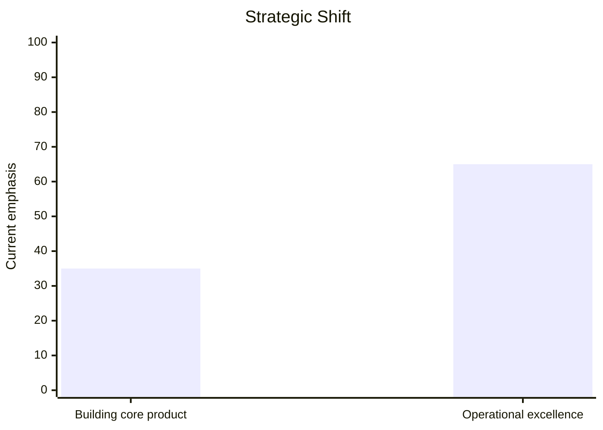

### Speaker intent

Frame the deck as a maturation deck, not a concept deck.

---

## Slide 3. Agenda

**Deck role**: orient the audience without slowing momentum

### On-slide title

`What this deck covers`

### Agenda items

1. `Why this product matters now`
2. `How the user journey and core flows work`
3. `How the system is architected`
4. `What is strong, what is risky, and what is ready next`
5. `How the next release and roadmap should unfold`

### Layout blueprint

- left column:
  - numbered agenda items 1 to 5
- right column:
  - slim descriptor lines under each number or a vertical progress rail

### Visual direction

- use refined numbering chips
- keep the slide clean and elegant
- avoid over-explaining each agenda section

### Speaker intent

Signal that the deck covers product, system, readiness, and execution in one coherent narrative.

---

## Slide 4. The Vision

**Deck role**: define the company/product lens

### On-slide title

`Make every meeting operationally useful`

### Supporting statement

`Meetings already generate context, decisions, and action. The job of the product is to capture that value before it disappears.`

### Manifesto points

- `Capture should happen where the meeting already lives.`
- `Intelligence should arrive as structured output, not buried transcript.`
- `Exports should move insight into the tools people already use to execute work.`

### Layout blueprint

- left column:
  - title + supporting statement
- right column:
  - three manifesto cards or one stacked manifesto panel

### Visual direction

- strong whitespace
- minimal icon use
- use one soft gold-to-orange accent bar behind the manifesto block

### Speaker intent

Keep this elevated and simple. This slide is about product truth, not features.

---

## Slide 5. The Problem

**Deck role**: make pain concrete

### On-slide title

`Meeting value is lost across too many disconnected steps`

### Problem cards

#### `Capture is unreliable`

Meetings often begin before tools are ready, and the recording step itself becomes a point of failure.

#### `Transcript is temporary`

Even when capture works, the transcript often lives in a fragile or short-lived context instead of a durable operational record.

#### `Insight is buried`

Raw text is not the same as usable knowledge. Decisions, action items, and risk signals disappear inside long transcripts.

#### `Export is weak`

Without a reliable path into systems like Notion, PDF, or email workflows, insight stays trapped inside the app.

### Layout blueprint

- 2x2 grid of problem cards
- each card gets a short label, one short paragraph, and a subtle distress accent

### Visual direction

- use amber/red pressure accents
- do not use exaggerated warning icons
- emphasize friction and fragmentation

### Optional statistic diagram

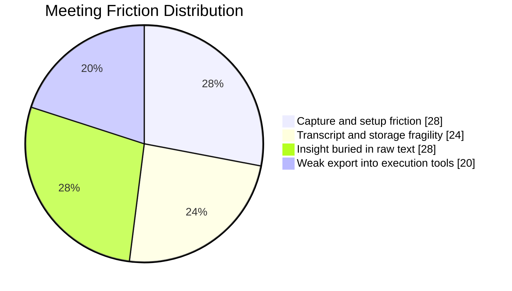

### Speaker intent

Present the problem as workflow fragmentation, not simply “people need AI.”

---

## Slide 6. Why Now

**Deck role**: explain timing

### On-slide title

`The stack is finally good enough to make this useful`

### Pillar cards

#### `Browser-native capture`

Browser capture flows are now strong enough to support practical in-product recording and validation.

#### `Reliable transcription`

Speech APIs like Deepgram make high-quality transcription a dependable production building block.

#### `Structured AI outputs`

Modern LLM workflows make it realistic to turn transcript content into summaries, decisions, action items, and export-ready artifacts.

### Layout blueprint

- three horizontal pillar cards
- each card with a short title, one-line rationale, and one accent badge

### Visual direction

- brighter energy than Slide 5
- use blue/orange/gold accent logic to signal capability maturity

### Speaker intent

This is the “why this product can now exist as a credible experience” slide.

---

## Slide 7. Who This Helps

**Deck role**: make the value legible for real users

### On-slide title

`Primary user profiles`

### Persona card 1

**User**: `Founder / operator`  
**Job to be done**: keep meetings from disappearing into Slack threads and memory gaps  
**Pain**: context gets lost between discussion and execution  
**Desired output**: quick summary, action items, exportable record

### Persona card 2

**User**: `Product / engineering lead`  
**Job to be done**: preserve decisions, risks, and next steps across fast-moving meetings  
**Pain**: review overhead is high and context gets fragmented  
**Desired output**: structured findings, reliable review page, shareable exports

### Persona card 3

**User**: `Consultant / knowledge worker`  
**Job to be done**: capture client or internal meeting value without manual cleanup  
**Pain**: transcript cleanup and recap creation consume time  
**Desired output**: polished meeting summary and destination-ready exports

### Layout blueprint

- three persona cards with balanced spacing
- each card uses the same internal structure

### Visual direction

- polished persona blocks with restrained avatar treatment or abstract role markers
- no cartoon illustrations

### Speaker intent

Keep personas grounded and practical. These are workflow users, not abstract markets.

---

## Slide 8. Core Value Proposition

**Deck role**: show the transformation chain clearly

### On-slide title

`From conversation to durable action`

### Left-side value chain

1. `Capture`
2. `Transcribe`
3. `Structure`
4. `Review`
5. `Export`

### Right-side value panel

**Primary promise**  
`Turn a live meeting into a durable operational artifact without manual recap work.`

**Supporting outcomes**

- `Lower recap overhead`
- `Stronger decision memory`
- `Faster movement into action systems`
- `More confidence in what the meeting actually produced`

### Optional metric chips

- `1 capture path`
- `2 AI stages`
- `4 export surfaces`
- `0 copy-paste workflow as the ideal state`

### Layout blueprint

- left: bold horizontal or vertical transformation chain
- right: large-value callout block

### Visual direction

- use connector lines or a gradient arrow that echoes the logo
- the transformation should feel premium, not instructional

### Speaker intent

This slide answers: what value does the product create in one sentence?

---

## Slide 9. Product Snapshot

**Deck role**: show the product is already substantial

### On-slide title

`What NextStop already does`

### Feature grid

#### `Auth / access`
- status: `Live`
- note: `User identity and gated dashboard access are already in place.`

#### `Billing gate`
- status: `Live`
- note: `Subscription logic exists and is part of the production system.`

#### `Sidebar capture`
- status: `Live`
- note: `Capture controls now live persistently in the dashboard shell.`

#### `Library`
- status: `Live`
- note: `Meetings, states, and review entry points already exist as a working product surface.`

#### `Review`
- status: `Live`
- note: `Structured findings, transcript access, and export actions are present.`

#### `Google`
- status: `Live`
- note: `Google scheduling/connectivity exists inside the workspace flow.`

#### `Notion`
- status: `Live but improving`
- note: `Notion connection and export path exist, with room for stronger destination UX.`

#### `AI pipeline`
- status: `Live and hardening`
- note: `Transcription and findings generation are working, with Railway now positioned as the heavy execution layer.`

### Layout blueprint

- 2x4 grid of evenly sized capability cards

### Visual direction

- use status pills such as `LIVE`, `LIVE / IMPROVING`, `READY LOCALLY`
- cards should feel like product capability tiles, not a checklist

### Optional statistic diagram

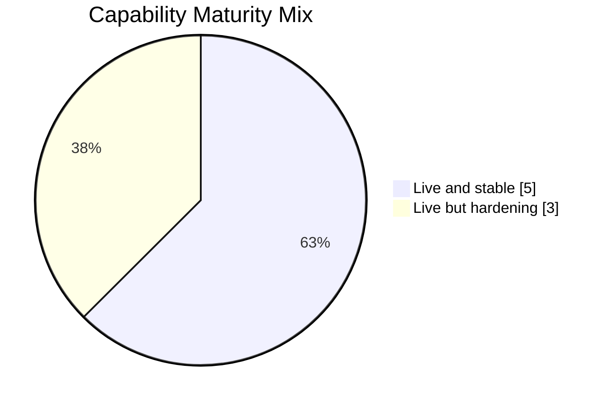

### Speaker intent

The slide should say: there is already a real product here, not just a concept.

---

## Slide 10. Product Flow Overview

**Deck role**: show first-value journey

### On-slide title

`User journey from first login to first value`

### Step sequence

1. `Log in`
2. `Connect integrations`
3. `Create or capture a meeting`
4. `Process audio through AI pipeline`
5. `Review structured output`
6. `Export into action systems`

### Supporting caption

`The product is strongest when the path from raw meeting to durable output feels linear, visible, and low-friction.`

### Layout blueprint

- one clean horizontal journey strip
- each step gets a number, label, and one short descriptor

### Visual direction

- use subtle directional motion
- place step markers on a gradient line derived from gold -> orange -> blue

### Speaker intent

This is the narrative handoff from market/product framing into actual workflow.

---

## Part IV. Slides 11 To 20

## Slide 11. End-To-End User Flow Diagram

**Deck role**: show the entire product value chain in one slide

### On-slide title

`End-to-end user flow`

### Diagram commentary

- `Trust is gained when capture, processing, and review are clearly staged.`
- `Latency is felt most strongly between upload, transcription, and structured findings readiness.`

### Mermaid source


### Layout blueprint

- large diagram in center or left-center
- one side card titled `Where trust is gained`
- one side card titled `Where latency is felt`

### Visual direction

- keep connectors strong and legible
- use one warm accent for initiation and one blue accent for system processing

### Speaker intent

This slide explains the entire product in one look.

---

## Slide 12. Capture Experience

**Deck role**: make the capture surface feel product-grade

### On-slide title

`Capture should feel native, stable, and obvious`

### Core message

`The capture surface should reduce uncertainty before AI even begins: users need clear controls, state visibility, and a recovery path if the session fails.`

### UI sketch content

```text
+------------------------------------------------------+
| Capture Controls                                     |
+------------------------------------------------------+
| [Google Meet]                                        |
| [Start] [Pause] [End]                                |
| [Retry] [Discard]                                    |
+------------------------------------------------------+
| Browser Meeting - Apr 2, 12:26 PM                    |
| Tab shared                                           |
| Mic live                                             |
| Recording in progress                                |
+------------------------------------------------------+
| If issue detected:                                   |
| Needs attention                                      |
| We kept the recorded audio in this browser tab.      |
| Retry finalize or discard this local session.        |
+------------------------------------------------------+
```

### Elements to emphasize

- Start
- Pause
- End
- Retry
- Discard
- status chips:
  - `Tab shared`
  - `Mic live`
  - `Needs attention`

### Layout blueprint

- left: polished UI mock
- right: three design principles

### Principles

- `State must always be visible`
- `Failure must still feel recoverable`
- `Pre-AI validation is part of trust`

### Visual direction

- use glossy dark cards with soft borders
- retain the actual product’s sidebar character, but elevate it

### Speaker intent

The product starts with trust at capture time. That is a UX and reliability issue, not just an AI issue.

---

## Slide 13. Library Experience

**Deck role**: show that the library is an operational surface, not just an archive

### On-slide title

`Library should feel immediate and operational`

### UI sketch content

```text
+----------------------------------------------------------------------------------+
| Library                                                   [Search meetings...]   |
| Scheduled and captured meetings                                                  |
+----------------------------------------------------------------------------------+
| [Skeleton card]                                                                  |
| [Skeleton card]                                                                  |
| [Skeleton card]                                                                  |
+----------------------------------------------------------------------------------+
| Browser Meeting      | Transcript ready | Web       | Open review                |
| Instant NextStop     | Ready            | Google    | Open review                |
| Design Sync          | Failed           | Browser   | Retry / Open review        |
+----------------------------------------------------------------------------------+
```

### Key points

- search should be visible immediately
- loading state should be graceful
- statuses must be legible:
  - `Ready`
  - `Transcript ready`
  - `Failed`
- review entry should be one clear click

### Layout blueprint

- top header bar
- mid loading or skeleton strip
- bottom loaded-state cards

### Visual direction

- make the difference between `loading`, `processing`, and `ready` visually unmistakable

### Speaker intent

This slide reinforces that perceived speed and clarity matter as much as backend performance.

---

## Slide 14. Review Experience

**Deck role**: center the product around outputs

### On-slide title

`The review page should emphasize outputs, not internal machinery`

### UI sketch content

```text
+----------------------------------------------------------------------------------+
| Meeting Title                                            [Copy] [Export PDF]     |
| Time | Source | Status                                                           |
+----------------------------------------------------------------------------------+
| Summary                                                                          |
| Decisions                                                                        |
| Action Items                                                                     |
| Risks / Follow-ups                                                               |
+--------------------------------------+-------------------------------------------+
| Transcript Access                    | Export Actions                            |
| [Temporary transcript]               | [PDF] [Notion] [Email Draft]              |
| Expires at ...                       | History + status + failures               |
+--------------------------------------+-------------------------------------------+
```

### Core message

`Users come to the review page for usable output. Diagnostic detail should stay secondary unless something has gone wrong.`

### Layout blueprint

- left: summary stack
- right: transcript and export column

### Visual direction

- use calmer panels than the ops slides
- keep export buttons high-contrast and easy to spot

### Speaker intent

This is where the product converts technical processing into perceived value.

---

## Slide 15. Export Experience

**Deck role**: show that outputs become action

### On-slide title

`Exports turn insight into action`

### Core export surfaces

- `PDF export`
- `Temporary transcript download`
- `Notion export`
- `Email draft`
- `Export history`

### UI sketch content

```text
+----------------------------------------------------------------------------------+
| Export Actions                                                                   |
+----------------------------------------------------------------------------------+
| PDF export                  Ready         1.2s          [Open] [Retry]           |
| Temporary transcript        Ready         0.3s          [Download]               |
| Notion export               Needs config  --            [Configure]              |
| Email draft                 Ready         0.9s          [Copy]                   |
+----------------------------------------------------------------------------------+
| Export History                                                                    |
| Meeting                 Type          Destination     Status       Duration       |
| Browser Meeting         PDF           local           success      1200 ms        |
| Browser Meeting         Notion        Product wiki    failed       980 ms         |
+----------------------------------------------------------------------------------+
```

### Core message

`The product becomes materially more valuable when outputs are durable, auditable, and easy to retry.`

### Layout blueprint

- left: export action cards
- right: export ledger/history panel

### Visual direction

- crisp status states:
  - success
  - in progress
  - failed
  - needs config

### Speaker intent

Make it obvious that exports are not secondary extras; they are how the product leaves the app and enters work.

---

## Slide 16. System Architecture Diagram

**Deck role**: show the production system in a credible way

### On-slide title

`Current system architecture`

### Commentary strip

- `Vercel owns user-facing application delivery and page composition.`
- `Railway owns heavy AI execution and queue-backed background work.`
- `Supabase is the durable system of record for identity, data, and storage.`

### Mermaid source

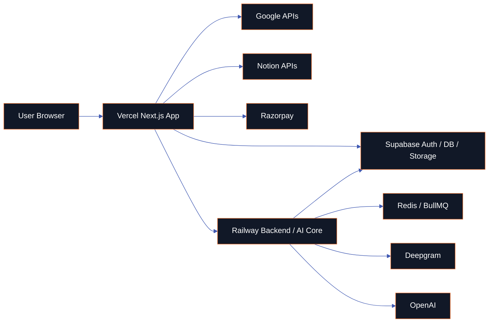

### Layout blueprint

- central wide diagram
- short callout strip beneath or at right edge

### Visual direction

- this should look boardroom-polished
- external services can use cooler panel styling
- the user/browser entry should feel anchored and clear

### Speaker intent

This slide needs to reassure technical and non-technical viewers that the product architecture is real, understandable, and intentionally separated.

---

## Slide 17. Runtime Ownership Diagram

**Deck role**: explain what lives where and why it matters

### On-slide title

`Runtime ownership is clearer now, but not fully clean`

### Right-side analysis bullets

- `Vercel still hosts some authenticated application routes and readiness aggregation.`
- `Railway now handles direct worker execution, queue endpoints, and heavy AI processing.`
- `The remaining work is to reduce split ownership and make failure domains even clearer.`

### Mermaid source

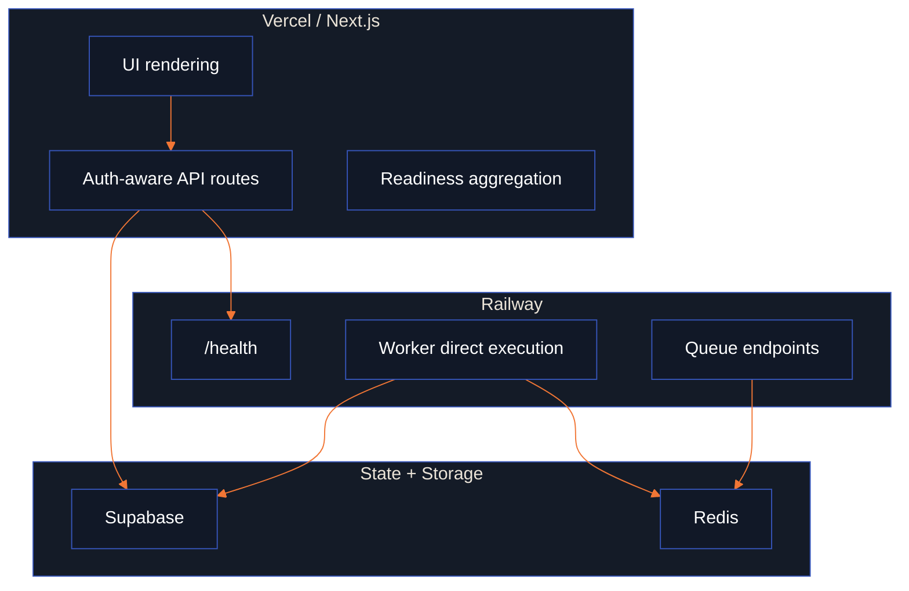

### Layout blueprint

- left: diagram
- right: analysis panel with 3 short paragraphs or bullet blocks

### Visual direction

- distinct cluster framing for `Frontend`, `Backend`, and `Data`
- do not overload the slide with every route; keep the story high-signal

### Speaker intent

This slide should read as honest and credible: the architecture is improving, but there is still cleanup value ahead.

---

## Slide 18. Data Model / ER Diagram

**Deck role**: show that meetings are the durable center of the product

### On-slide title

`Meetings are the hub of the product data model`

### Core explanation

- `A meeting is not just an event. It becomes the anchor point for jobs, assets, findings, artifacts, exports, and operational history.`
- `The product gains durability by preserving structured outputs and export logs, while keeping raw audio more short-lived.`

### Mermaid source

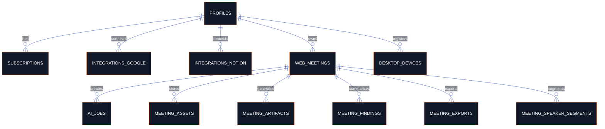

### Supporting notes

- `Temporary assets`: raw audio, transcript access windows
- `Durable records`: findings, exports, meeting metadata, artifact history
- `Operational value`: export logs turn output into something observable and supportable

### Layout blueprint

- large ER diagram takes the majority of the slide
- narrow lower band for the temporary-vs-durable explanation

### Visual direction

- keep the ER slide simplified enough for non-database viewers
- group related entities visually during final rendering

### Speaker intent

This slide is about durability and operational memory, not schema complexity.

---

## Slide 19. AI Pipeline Diagram

**Deck role**: show how raw meeting input becomes structured output

### On-slide title

`Capture to findings pipeline`

### Callout blocks

#### `Best-handled failures`
- capture validation before upload
- real job staging across transcription and analysis

#### `Weak recovery points`
- operator actionability on failed jobs still needs to improve
- export retries are stronger but not yet a full ops surface

#### `Biggest latency zone`
- upload to transcription to structured findings remains the most sensitive experience band

### Mermaid source


### Layout blueprint

- wide flow diagram
- three compact callout panels under or beside the diagram

### Visual direction

- make stage boundaries visually clear:
  - capture
  - transcription
  - analysis
  - delivery

### Speaker intent

This slide is the bridge between product flow and operational reality.

---

## Slide 20. Readiness Scorecard

**Deck role**: compress the audit into one executive slide

### On-slide title

`Current readiness in one view`

### Primary score

- `Live Production`: `3.5 / 5`
- `Next Release Ready Locally`: `4.1 / 5`

### Category score panel

- `Product readiness`: `4.2`
- `UX polish`: `3.8`
- `Performance`: `3.6`
- `Reliability`: `3.7`
- `Security / privacy`: `3.6`
- `Operations`: `3.2`
- `Deployment safety`: `3.8`
- `Documentation`: `4.0`

### Verdict strip

`Stable for controlled production today. Strong candidate for broader confidence after the next release and post-deploy verification.`

### Statistic diagram

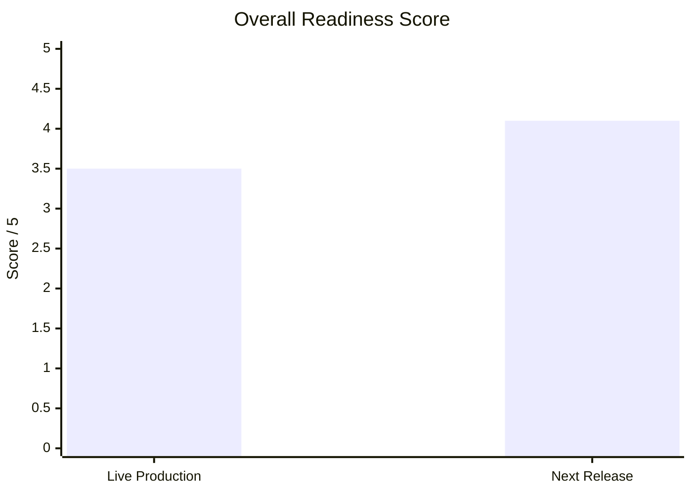

### Layout blueprint

- left: two oversized score panels
- right: category score grid or compact matrix
- bottom: verdict band

### Visual direction

- large numerals
- subtle glow behind the `4.1`
- use gold for score emphasis, blue for category framing

### Speaker intent

This is the slide a busy stakeholder should remember.

---

## Part V. Slides 21 To 30

## Slide 21. Live Production Strengths

**Deck role**: show what is already working well

### On-slide title

`What is already strong in production`

### Strength cards

#### `Auth and access`
- users can reach gated product surfaces through a real application shell

#### `Working core flow`
- capture, review, and exports exist as a coherent product path

#### `AI path is understood`
- the key failure points are now visible and no longer mysterious

#### `Integrations exist`
- Google and Notion are integrated into the product story

#### `Review and exports are usable`
- the user can move from findings into artifacts, not just read a transcript

#### `Build confidence is strong`
- typecheck, lint, tests, and build paths are part of the engineering confidence loop

### Statistic diagram

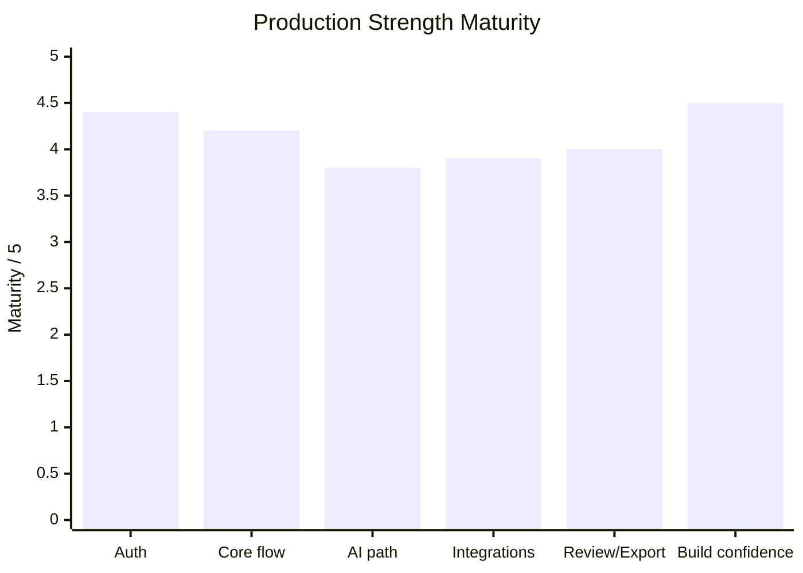

### Layout blueprint

- top: title and one-line framing
- body: 3x2 grid of strength cards
- footer: small bar chart or maturity strip

### Visual direction

- use green/cyan confidence accents carefully
- avoid making the slide feel complacent

### Speaker intent

This slide should build confidence without pretending the product is fully finished.

---

## Slide 22. Next Release Ready Locally

**Deck role**: define the next ship-worthy payload clearly

### On-slide title

`What is ready locally and should ship next`

### Release blocks

#### `Ops console`
- adds a founder/operator view of health, queue state, failures, and readiness

#### `Export telemetry hardening`
- improves visibility into PDF, transcript, Notion, and email export behavior

#### `Post-deploy verification`
- adds automated release validation after CI and deploy

#### `Runtime ownership documentation`
- clarifies where work executes and which runtime owns which responsibility

### Statistic diagram

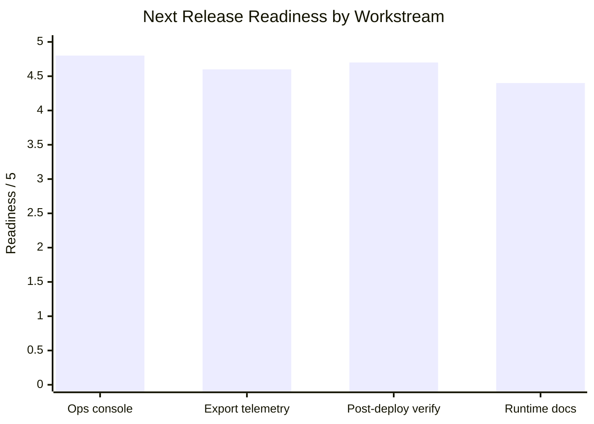

### Layout blueprint

- four high-value release cards in a strong 2x2 grid
- small impact ribbon or readiness bars under each card

### Visual direction

- this slide should feel decisive and release-oriented
- use `SHIP NEXT` or `READY LOCALLY` chips

### Speaker intent

The message is: there is a clear release payload, not vague improvement work.

---

## Slide 23. Risk Register

**Deck role**: be explicit about what still needs attention

### On-slide title

`The biggest remaining risks`

### Risk rows

#### `Split route ownership`
- **Severity**: High
- **Why it matters**: debugging and runtime responsibility stay less clear than ideal
- **Mitigation**: continue backend cleanup and ownership consolidation

#### `Limited operator actionability`
- **Severity**: High
- **Why it matters**: visibility is improving faster than active recovery tooling
- **Mitigation**: add retries and deeper admin actions

#### `Environment-dependent deployment truth`
- **Severity**: High
- **Why it matters**: good local behavior still depends on production env consistency
- **Mitigation**: keep post-deploy verification strict and automated

#### `Alerting is still light`
- **Severity**: Medium
- **Why it matters**: some issues may still be discovered by users first
- **Mitigation**: add worker, queue, readiness, and failure alerts

#### `Export recovery is incomplete`
- **Severity**: Medium
- **Why it matters**: output value depends on reliable retries and clear status
- **Mitigation**: build export center and richer retry controls

### Statistic diagram

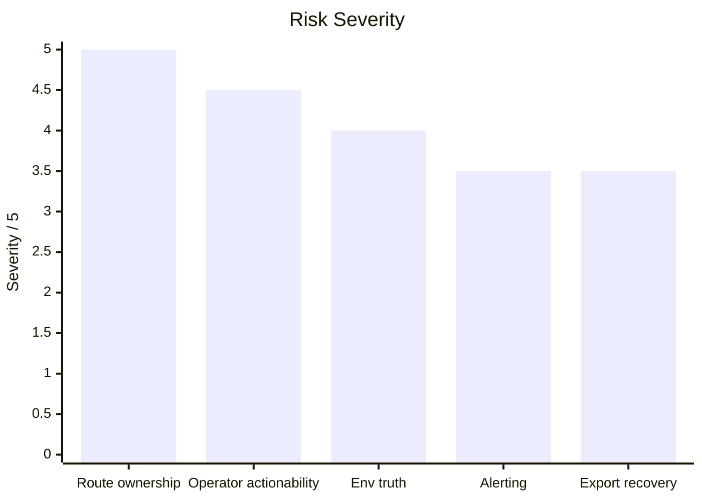

### Layout blueprint

- left: ranked risk list
- right: mitigation column
- bottom or side: severity chart

### Visual direction

- use amber and red accents
- this should feel sober and executive, not alarmist

### Speaker intent

This slide builds credibility by acknowledging the real remaining work.

---

## Slide 24. Reliability State Machine

**Deck role**: show that AI lifecycle management is structured

### On-slide title

`AI lifecycle should be explicit and recoverable`

### Policy notes

- `Every failed meeting should point to a specific failed stage.`
- `Retries should be idempotent and controlled.`
- `Deterministic failures should not spin forever.`

### Mermaid source

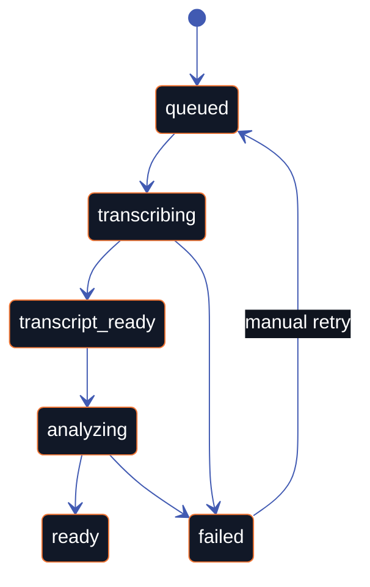

### Layout blueprint

- diagram occupies left 60 percent
- policy notes occupy right 40 percent

### Visual direction

- keep node count low and transitions legible
- emphasize `failed` and `manual retry` without overwhelming the rest

### Speaker intent

This slide signals backend maturity and honest operational thinking.

---

## Slide 25. Performance Strategy

**Deck role**: show that performance is being solved in a user-centered way

### On-slide title

`Performance should optimize perceived trust first`

### Strategy panels

#### `Fast shell first`
- route transitions should paint immediately even while data is loading

#### `Page-specific loaders`
- dashboard, library, and review should not share oversized data contracts

#### `Two-stage AI results`
- transcript-ready value should arrive before full structured findings complete

### Statistic diagram

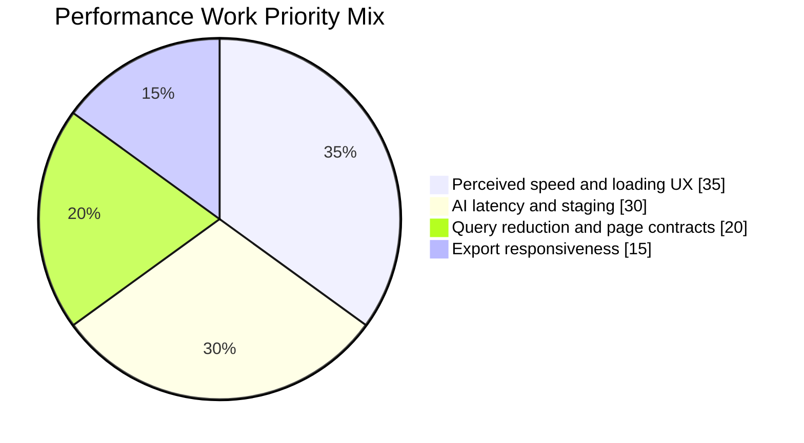

### Layout blueprint

- three tall strategy panels
- optional chart or weight strip beneath them

### Visual direction

- use blue and cyan emphasis
- present performance as a trust-building discipline, not just a benchmark game

### Speaker intent

The deck should show that performance work is tied directly to user confidence.

---

## Slide 26. Ops Console Design

**Deck role**: show the internal operational surface

### On-slide title

`The operator needs a 30-second answer`

### Core message

`The product becomes more supportable when system truth is visible without opening logs or the database.`

### UI sketch content

```text
+----------------------------------------------------------------------------------+
| Production Readiness                                                             |
+----------------------------------------------------------------------------------+
| Frontend: Healthy | Backend: Healthy | Worker: Healthy | Queue: 3 waiting        |
| Supabase: Healthy | Deepgram: Healthy | OpenAI: Healthy | Last deploy: Passed     |
+----------------------------------------------------------------------------------+
| Recent AI failures                                                               |
| Meeting ID     Stage        Error                              Mode               |
| 91e...         transcribe   empty transcript                   railway_remote     |
+----------------------------------------------------------------------------------+
| Recent export failures                                                           |
| Meeting ID     Export       Error                              Duration           |
| a12...         PDF          timeout                            1842 ms            |
+----------------------------------------------------------------------------------+
```

### Must show

- readiness checks
- worker health
- queue depth
- recent AI failures
- recent export failures

### Layout blueprint

- a large control-panel-style UI concept
- supporting rationale column with three bullets

### Visual direction

- strong status logic
- high scanability
- make it feel like an internal command surface, not a generic dashboard

### Speaker intent

This is an operations slide, but it should still feel like product design.

---

## Slide 27. CI/CD And Verification Diagram

**Deck role**: show release safety as a system

### On-slide title

`Release safety is now a real system`

### Bottom commentary cards

#### `Strong today`
- CI, security checks, builds, and deployment paths already exist

#### `Still manual`
- some production truth still depends on environment accuracy and human follow-through

#### `Next improvement`
- push further into alerting, smoke automation, and rollback confidence

### Mermaid source

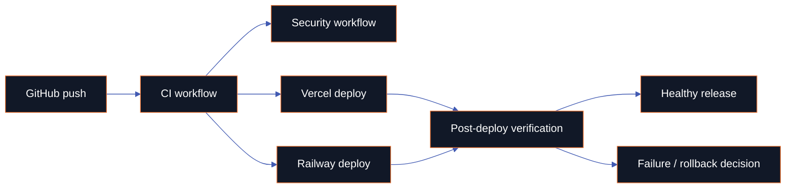

### Layout blueprint

- central diagram
- three cards beneath

### Visual direction

- this slide should feel like release maturity, not bureaucracy

### Speaker intent

This is the slide that says the engineering process is catching up with the ambition of the product.

---

## Slide 28. Security And Privacy

**Deck role**: explain the privacy posture without becoming a security lecture

### On-slide title

`Privacy posture is directionally strong`

### Principle blocks

- `Findings-first durability`
- `Bounded transcript access`
- `Short-lived raw audio`
- `Private storage and secret boundaries`

### Supporting explanation

`The product is strongest when it stores durable value in structured outputs while keeping raw and temporary artifacts tightly bounded.`

### Mermaid lifecycle visual

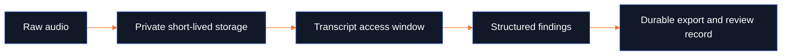

### Layout blueprint

- left: privacy principles
- right: lightweight lifecycle diagram

### Visual direction

- use subtle, mature visual language
- no cliché shield-and-lock overload

### Speaker intent

This slide should signal thoughtful handling of sensitive meeting data.

---

## Slide 29. Code Quality And Maintainability

**Deck role**: provide an honest engineering quality assessment

### On-slide title

`The engineering quality is good, with visible debt`

### Score matrix

- `Architecture`: `3.7 / 5`
- `Maintainability`: `3.9 / 5`
- `Observability`: `3.3 / 5`
- `Testability`: `4.0 / 5`
- `Deployment safety`: `3.8 / 5`
- `Documentation quality`: `4.1 / 5`

### Interpretation notes

- `The codebase is increasingly structured, but runtime boundaries still deserve cleanup.`
- `Operational visibility is improving fast, but remains the most obvious maturity gap.`
- `Tests, docs, and route-specific cleanup are helping the system become more stable.`

### Statistic diagram

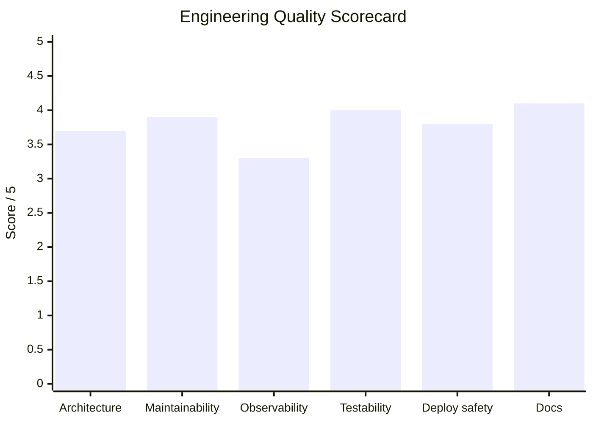

### Layout blueprint

- left: premium score table or stacked score cards
- right: interpretation block
- bottom: supporting chart

### Visual direction

- make it feel executive and technical at once
- avoid spreadsheet vibes

### Speaker intent

This slide should feel candid, not defensive.

---

## Slide 30. Onboarding Opportunity

**Deck role**: show the first-run activation gap and how to close it

### On-slide title

`First-run activation should be guided`

### Core message

`The product will feel dramatically stronger when new users can verify the full value chain through a guided checklist instead of trial and error.`

### UI sketch content

```text
+----------------------------------------------------------------------------------+
| Welcome to NextStop                                                              |
+----------------------------------------------------------------------------------+
| Step 1. Connect Google            [Connected]                                    |
| Step 2. Connect Notion            [Not connected]                                |
| Step 3. Run test capture          [Run test]                                     |
| Step 4. Verify transcript + AI    [Check]                                        |
| Step 5. Export first summary      [Try export]                                   |
+----------------------------------------------------------------------------------+
| Status                                                                            |
| Deepgram configured • Worker healthy • Readiness passed                          |
+----------------------------------------------------------------------------------+
```

### Layout blueprint

- left: onboarding checklist UI concept
- right: activation value bullets

### Visual direction

- elegant checklist cards
- use progress accents rather than gamified illustrations

### Speaker intent

This slide should make activation feel like product design, not setup friction.

---

## Part VI. Slides 31 To 40

## Slide 31. Export Center Opportunity

**Deck role**: elevate export history into a first-class surface

### On-slide title

`Exports should become a first-class product surface`

### Core message

`When exports are visible, searchable, and retryable, the product becomes easier to trust and easier to support.`

### UI sketch content

```text
+----------------------------------------------------------------------------------+
| Export Center                                                                    |
+----------------------------------------------------------------------------------+
| Meeting                  Type         Destination      Status      Duration       |
| Browser Meeting          PDF          local            success     1.2s           |
| Browser Meeting          Notion       Team wiki        failed      0.9s           |
| Design Sync              Email draft  clipboard        success     0.6s           |
| Sprint Review            Transcript   secure download  success     0.3s           |
+----------------------------------------------------------------------------------+
| Filters: [Type] [Status] [Destination] [Meeting]                                 |
| Actions: [Retry failed] [Open log] [Re-export]                                   |
+----------------------------------------------------------------------------------+
```

### Required fields

- type
- meeting
- destination
- status
- duration
- retry

### Layout blueprint

- wide export-center UI mock
- short side panel explaining why this matters

### Visual direction

- feel like a ledger meets operations tool
- use crisp row hierarchy and state coloring

### Speaker intent

This slide should make it obvious that exports deserve their own product thinking.

---

## Slide 32. Searchable Intelligence Opportunity

**Deck role**: show where the library can evolve next

### On-slide title

`The library can evolve into an intelligence layer`

### Core message

`Once meeting outputs are durable and structured, the next product move is not just storage. It is retrieval, filtering, and eventually semantic discovery.`

### UI sketch content

```text
+----------------------------------------------------------------------------------+
| Search meetings [Discussion about AI harness leak..............................]  |
| Filters: [Date] [Source] [Status] [Exports] [Has transcript] [Semantic later]   |
+----------------------------------------------------------------------------------+
| Results                                                                          |
| Browser Meeting     | transcript_ready | Browser Tab | 3 exports                 |
| Design Review       | ready            | Google Meet | 1 export                  |
| Ops Sync            | failed           | Browser Tab | retry available           |
+----------------------------------------------------------------------------------+
| Suggested queries: "open action items" "meetings with risks" "Notion exports"   |
+----------------------------------------------------------------------------------+
```

### Layout blueprint

- full-width search-first product mock
- bottom strip for future-looking retrieval hints

### Visual direction

- grounded, not sci-fi
- the slide should feel like a natural evolution of the current library

### Speaker intent

This is a future-growth slide, but it should still feel plausible and product-led.

---

## Slide 33. Activation Flow Diagram

**Deck role**: show the fastest path to first value

### On-slide title

`How onboarding should activate users`

### Callout copy

- `This is the shortest path to first visible value.`
- `It reduces setup confusion and support load.`
- `It makes success measurable at the workflow level.`

### Mermaid source


### Layout blueprint

- diagram on left or center
- activation logic callout on right

### Visual direction

- use a lighter energy than the ops slides
- show activation as momentum

### Speaker intent

This slide turns onboarding into a measurable product path.

---

## Slide 34. Immediate Next Release

**Deck role**: define what should ship now

### On-slide title

`What should ship now`

### Four release columns

#### `Ops console`
- internal health visibility

#### `Export telemetry`
- status, duration, failure, destination tracking

#### `Verification workflow`
- post-deploy confidence loop

#### `Docs / runbook`
- shared operational truth

### Statistic diagram

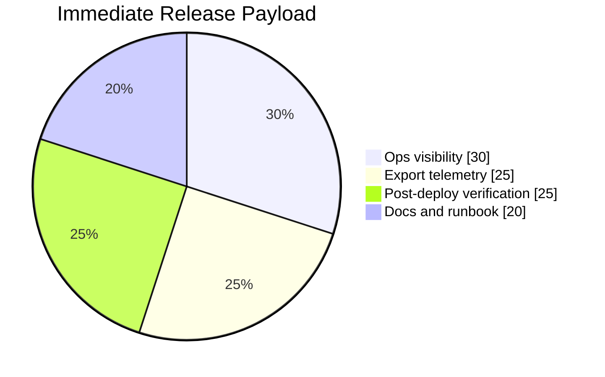

### Layout blueprint

- strong 4-column release board
- optional release impact chart at bottom

### Visual direction

- this slide should feel decisive and ready to act

### Speaker intent

This is the “ship this, not something else” slide.

---

## Slide 35. Next 2 Weeks

**Deck role**: define the immediate hardening sprint

### On-slide title

`Operational hardening sprint`

### Milestones

- `Add alerts for worker, queue, and readiness failures`
- `Add controlled retry tooling for failed AI jobs and exports`
- `Run structured production smoke checks`
- `Verify transcript and retention behavior against live policy`

### Mermaid schedule

```mermaid
gantt
    title Next 2 Weeks
    dateFormat  YYYY-MM-DD
    section Reliability
    Alerts and thresholds        :a1, 2026-04-03, 4d
    Retry tooling                :a2, after a1, 4d
    section Verification
    Production smoke checks      :b1, 2026-04-03, 6d
    Retention verification       :b2, 2026-04-10, 3d
```

### Layout blueprint

- left: milestone summary
- right: compact gantt

### Visual direction

- amber and blue milestone chips
- keep execution urgent but not chaotic

### Speaker intent

This slide says: after shipping, harden quickly and deliberately.

---

## Slide 36. 30 To 60 Days

**Deck role**: show the next structural layer of work

### On-slide title

`Structural improvements after release confidence`

### Workstreams

- `Runtime cleanup`
- `Export center`
- `Onboarding checklist`
- `Timing dashboards`

### Mermaid timeline

```mermaid
timeline
    title 30 to 60 Day Improvement Arc
    30 Days : Runtime cleanup begins
            : Export center design and data model
    45 Days : Onboarding checklist productization
            : Timing and latency dashboards
    60 Days : Cleaner ownership boundaries
            : More supportable export and activation flows
```

### Layout blueprint

- top: strategic statement
- body: timeline plus four initiative cards

### Visual direction

- slightly more future-oriented than Slide 35
- keep the slide strategic, not overloaded with tasks

### Speaker intent

This is where short-term shipping turns into medium-term structural quality.

---

## Slide 37. Scale Phase

**Deck role**: show the next horizon without distracting from current priorities

### On-slide title

`What becomes valuable later`

### Growth cards

#### `Searchable intelligence`
- move from archive to retrieval layer

#### `Collaboration / admin tooling`
- make the system support more than one operator or solo founder

#### `AI evaluation set`
- measure quality and regression over time

#### `Deeper backend consolidation`
- reduce runtime ambiguity and long-term maintenance cost

### Mermaid growth map

```mermaid
mindmap
  root((Scale phase))
    Searchable intelligence
      richer filters
      semantic retrieval
    Collaboration and admin
      shared workspace views
      operator tools
    AI evaluation
      quality baselines
      regression tracking
    Backend consolidation
      clearer ownership
      lower operational complexity
```

### Layout blueprint

- four future-growth cards
- optional mindmap or orbit visual beneath

### Visual direction

- use softer glow and more spacious layout than immediate-priority slides

### Speaker intent

Keep this grounded. This is the later horizon, not the current release payload.

---

## Slide 38. Team And Ownership

**Deck role**: show how work can be owned clearly

### On-slide title

`Suggested ownership map`

### Ownership matrix

#### `Frontend`

- dashboard shell and navigation
- capture UI
- library and review experience
- onboarding and export center surfaces

#### `Backend`

- AI job lifecycle
- export telemetry
- retry behavior
- data contracts and operational records

#### `Infra`

- Railway runtime
- Redis health
- deployment verification
- alerting and rollback confidence

#### `Product / design`

- onboarding path
- review simplification
- export-first UX
- intelligence library evolution

### Layout blueprint

- four equal columns or a clean ownership matrix

### Visual direction

- simple, sharp, accountable
- this slide should feel disciplined and operator-ready

### Speaker intent

Clarify responsibility. This is how the roadmap becomes executable.

---

## Slide 39. Final Recommendation

**Deck role**: make the verdict unmistakable

### On-slide title

`Push the release. Then make operations boring.`

### Recommendation block

- `Ship the locally ready improvements now.`
- `Use post-deploy verification to confirm production truth.`
- `Shift the next sprint toward alerts, retries, and operator actionability.`
- `Treat broader scale work as a second-order priority after operational trust is stronger.`

### Verdict block

- `Controlled production`: `Yes`
- `Broader production`: `Not yet`
- `Recommended sequence`: `Release now → harden next → scale after`

### Layout blueprint

- left: recommendation logic
- right: oversized verdict card

### Visual direction

- bold conclusion
- use one decisive accent treatment
- the verdict should be readable from across a room

### Speaker intent

This slide should land cleanly and confidently.

---

## Slide 40. Closing / Q&A

**Deck role**: close the deck with confidence, not clutter

### On-slide title

`NextStop is ready for the next stage`

### Closing line

`The product is real, the next release is meaningful, and the highest-value work ahead is making the system more observable, recoverable, and scalable.`

### Optional footer

- `Founder / Operator Review`
- `Questions`

### Assets

- `C:\Users\ADMIN\Desktop\nextstop.ai\nextstop.ai-web\frontend\public\brand\nextstop-wordmark.svg`

### Layout blueprint

- central or left-centered closing statement
- subtle logo presence
- minimal footer

### Visual direction

- minimal
- premium
- same brand language as Slide 1

### Speaker intent

End with confidence and composure. No appendix energy.

---

## Part VII. Additional Statistic Diagram Options

These are optional Mermaid statistic visuals that can be placed on backup design layers, used to test visual language, or promoted into the final deck if they improve storytelling.

### A. Readiness category balance

```mermaid
pie showData
    title Audit Attention Split
    "Product and UX" : 27
    "Reliability and ops" : 31
    "Architecture and deployment" : 22
    "Growth and future work" : 20
```

### B. Release focus weighting

```mermaid
xychart-beta
    title "Release Focus Weighting"
    x-axis ["Visibility", "Reliability", "Verification", "Docs", "Growth"]
    y-axis "Priority / 5" 0 --> 5
    bar [5, 4.5, 4.5, 4, 2.5]
```

### C. Product surface emphasis

```mermaid
pie showData
    title Product Surface Emphasis In Deck Narrative
    "Capture and workflow" : 24
    "Architecture and AI" : 22
    "Readiness and ops" : 30
    "Growth opportunities" : 24
```

---

## Part VIII. Final Production Checklist For The Slide Designer

### Non-negotiables

- exactly 40 slides
- 16:9 widescreen format
- premium dark editorial style
- use the NextStop SVG palette as the deck color source
- use the reference PPT only as quality inspiration
- no appendix
- no extra hidden slides

### Visual checklist

- cover slide looks cinematic and expensive
- the first 10 slides establish confidence and polish
- required diagram slides feel boardroom-ready
- UI concept slides look like plausible product surfaces
- charts are editorial, not spreadsheet-like
- logo usage is restrained and intentional
- the last 5 slides feel decisive and elevated

### Diagram checklist

- Mermaid blocks are converted into SVG or re-built as premium vector visuals
- labels remain short and readable
- dark backgrounds are respected
- connector logic is clear
- no diagram feels like raw internal documentation

### Copy checklist

- every title sounds like a takeaway
- body copy stays concise
- no filler language
- no fabricated traction or financial claims
- risk slides remain honest and credible

### Delivery checklist

- deliver the final `.pptx`
- deliver the source `.js` or build file if the deck is generated programmatically
- keep asset links and SVG references intact for reuse

---

## Part IX. Quick Reference Summary

### Mandatory diagram-led slides

- Slide 11
- Slide 16
- Slide 17
- Slide 18
- Slide 19
- Slide 24
- Slide 27
- Slide 33

### Strong statistic-diagram candidates

- Slide 2
- Slide 5
- Slide 9
- Slide 20
- Slide 21
- Slide 22
- Slide 23
- Slide 25
- Slide 29
- Slide 34
- Slide 35
- Slide 36

### Best UI concept slides

- Slide 12
- Slide 13
- Slide 14
- Slide 15
- Slide 26
- Slide 30
- Slide 31
- Slide 32

### Primary brand asset

- `C:\Users\ADMIN\Desktop\nextstop.ai\nextstop.ai-web\frontend\public\brand\nextstop-wordmark.svg`

### Final message of the deck

`NextStop has moved beyond prototype status. The product works, the next release is meaningful, and the highest-leverage work now is operational excellence.`

---

## Part X. Strict Color Guidelines For All 40 Slides

This section defines the **strict color behavior** that the final deck must follow.

The deck should not simply use “dark colors.” It should feel like a direct extension of the **NextStop website and brand system**, using the actual visual personality already present in the logo and product UI.

### 1. Primary brand colors

Use these as the non-negotiable color foundation:

- `Signal Gold`: `#F8DE4F`
- `Warm Gold`: `#F6D64E`
- `Amber`: `#EFC04C`
- `Bronze`: `#E6A149`
- `Coral Orange`: `#F17635`
- `Burnt Ember`: `#E7743C`
- `Core Blue`: `#3655B9`
- `Bright Blue`: `#415AB2`
- `White`: `#FFFFFF`

### 2. Supporting dark neutrals

These should be used for backgrounds, panels, negative space, and diagram staging:

- `Night Canvas`: `#070A0F`
- `Elevated Panel`: `#0F141E`
- `Soft Panel`: `#141B27`
- `Grid Line`: `#1E293B`
- `Muted Text`: `#A7B1C2`

### 3. Semantic support colors

These may be used sparingly where needed:

- `Success Green`: `#18C37E`
- `Warning Amber`: use `#EFC04C` or `#E6A149`
- `Risk Ember`: use `#E7743C`
- `Critical Red`: only when necessary and only in muted form, not neon

### 4. Color hierarchy rule

The deck should visually feel like:

- `80%` dark neutrals and clean space
- `15%` logo-derived brand accents
- `5%` semantic states like success/warning/failure

This ratio keeps the deck premium and avoids visual noise.

### 5. Slide-type color mapping

#### Opening and framing slides

- dominant tones:
  - `Night Canvas`
  - `Signal Gold`
  - `Coral Orange`
  - `Core Blue`
- use:
  - large soft glow
  - elegant amber/orange/blue gradient arcs
- avoid:
  - green or red as dominant opening colors

#### Product and workflow slides

- dominant tones:
  - `Core Blue`
  - `Bright Blue`
  - `Coral Orange`
- use:
  - blue for structure
  - orange for action / current flow
  - gold for highlight moments

#### Architecture and technical diagram slides

- dominant tones:
  - `Core Blue`
  - `Bright Blue`
  - `Signal Gold`
- use:
  - blue for systems and structure
  - gold/orange for key transitions or execution boundaries

#### Risk, reliability, and ops slides

- dominant tones:
  - `Burnt Ember`
  - `Amber`
  - `Core Blue`
- use:
  - ember for risk markers
  - amber for warning and attention
  - blue for system framing and control

#### Growth and future slides

- dominant tones:
  - `Core Blue`
  - `Signal Gold`
  - softer glows
- use:
  - slightly lighter, more spacious compositions
  - less alarm/warning color

#### Final recommendation and closing slides

- dominant tones:
  - `Signal Gold`
  - `Coral Orange`
  - `Core Blue`
- use:
  - stronger hero-style gradients
  - confident high-contrast composition

### 6. Title color rules

- main titles should usually be white
- a **single phrase** or **single keyword** may be highlighted using:
  - `Signal Gold`
  - `Coral Orange`
  - `Core Blue`
- do not rainbow-color titles
- do not split title emphasis into too many colors

### 7. Diagram color rules

All diagrams must follow this logic:

- node backgrounds:
  - `Elevated Panel`
  - `Soft Panel`
- main connector lines:
  - `Bright Blue`
- critical transition or execution handoff lines:
  - `Coral Orange`
- highlight nodes:
  - `Signal Gold`
- text:
  - `White`
  - `Muted Text` for supporting labels

### 8. Chart and statistic color rules

All charts should use brand colors, not default chart palettes.

Preferred chart order:

1. `Signal Gold`
2. `Coral Orange`
3. `Core Blue`
4. `Bright Blue`
5. `Muted neutral` if a fifth color is needed

Avoid:

- Excel-like rainbow chart palettes
- pastel colors unrelated to the brand
- generic corporate greens and blues unless mapped intentionally

### 9. UI mockup color rules

For UI concept slides:

- background surfaces should mirror the product’s dark UI mood
- panel borders should be subtle and premium
- active states can use orange or blue
- success states can use green
- attention states can use amber or ember
- do not make mockups brighter than the actual deck system

### 10. Gradient rules

The deck should use gradients derived from the logo, especially:

- `Gold -> Amber -> Orange`
- `Orange -> Blue`
- `Blue -> transparent`

These gradients should appear in:

- hero glows
- divider accents
- line sweeps
- emphasis borders
- special recommendation slides

### 11. Background rules

No slide should use a flat default black unless it is intentionally layered.

Every major slide should include one or more of:

- soft grid texture
- radial glow
- blurred gradient orb
- light panel layering
- subtle line or ring motif

### 12. Colors that should be avoided

Avoid introducing these as dominant deck colors:

- bright purple
- neon pink
- flat pastel green
- generic template blue
- low-contrast gray-on-gray systems
- unbranded red unless it is truly a failure state

### 13. Website alignment rule

The final deck must feel like it belongs to the same design family as the NextStop product and website:

- dark product-led UI
- strong contrast
- precise status logic
- thoughtful glow use
- high-value gradients
- restrained but memorable accent color

### 14. Executive summary of color behavior

Use this short rule when building:

`Dark foundation, logo-derived gradients, blue for structure, orange for action, gold for emphasis, green only for success, ember only for risk.`

---

## Part XI. Master Prompt For Creating The Final PowerPoint Pitch Deck

Copy the following prompt into the slide-generation workflow, PowerPoint build system, AI deck tool, or design handoff process.

