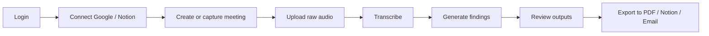
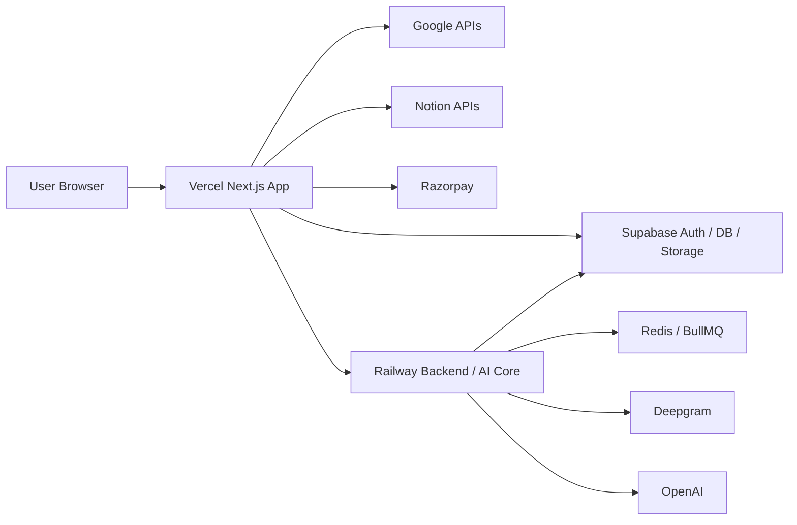
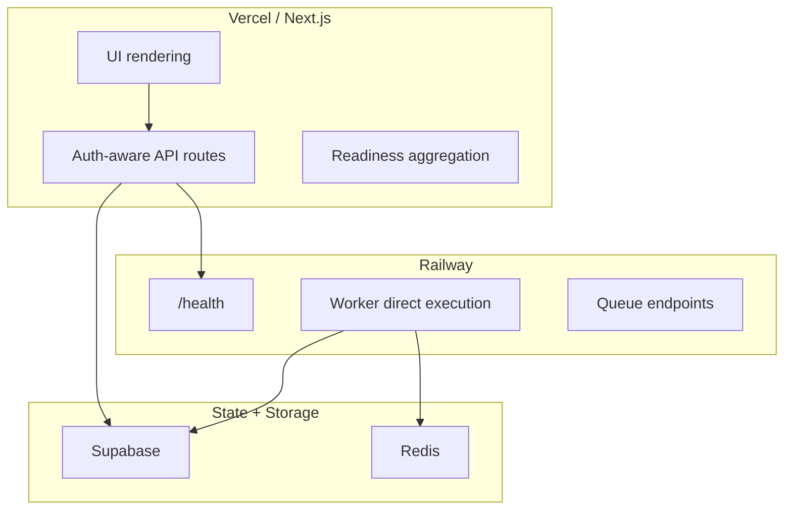
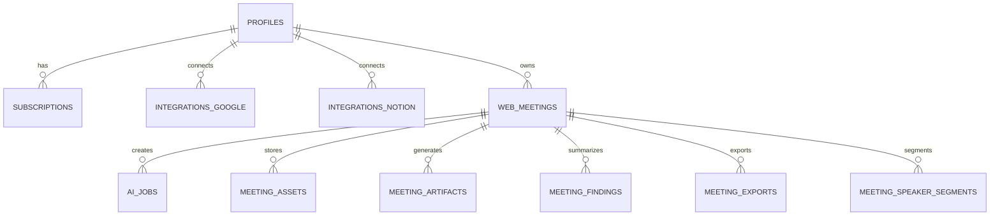
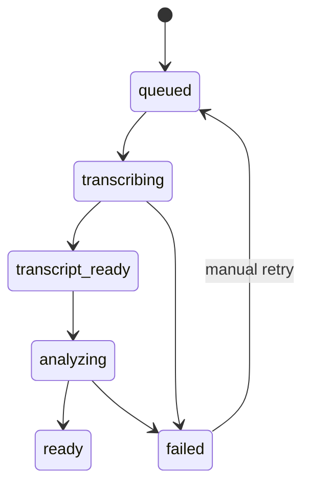
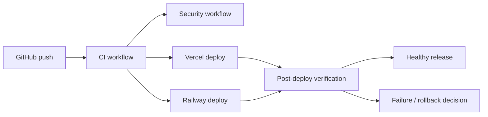
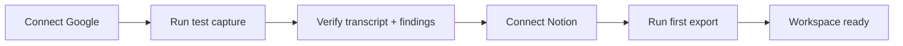

# NextStop 40-Slide Pitch Deck Blueprint

**Document type**: master slide-planning blueprint  
**Purpose**: define a premium 40-slide pitch deck for NextStop with slide content, visual direction, layout guidance, Mermaid diagram requirements, and SVG asset references  
**Audience**: founder, operator, investor-style reviewer, product partner, technical stakeholder  
**Tone**: premium, modern, credible, sharp, founder-led, visually confident  
**Design intent**: the final deck must look expensive, cinematic, and highly intentional, not like a generic SaaS template

---

## 1. Global Deck Direction

### Core visual language

- Use a `dark editorial` presentation style
- Background should feel layered, not flat
- Use deep charcoal or near-black base with subtle grid texture, soft glows, and blurred gradient orbs
- Primary accents should be `amber`, `cyan`, `electric blue`, and `emerald`
- Typography should be clean, bold, and premium
- Large headlines should feel strong and spacious
- Slides should use generous whitespace and asymmetrical balance
- Do not overfill every slide with text
- Use callout cards, metric chips, status pills, and diagram panels
- Avoid purple-heavy generic AI aesthetics
- Avoid plain white backgrounds
- Avoid “default PowerPoint blue title + bullets” look

### Typography direction

- Title font style: clean modern grotesk or neo-grotesk feel
- Body font style: neutral and highly readable
- Headline weight: bold to extra bold
- Supporting copy: medium or regular weight
- Use uppercase eyebrow labels with wide tracking on most slides
- Use big numbers for scores, timelines, and readiness metrics

### Slide motion guidance

- If animation is used later, keep it restrained
- Use slow fade/slide-up transitions only
- No flashy zooms, spins, or gimmick transitions
- Deck should still look excellent even with zero motion

### Layout rules

- Standard ratio: `16:9`
- Use a consistent header zone across the deck
- Keep footer minimal
- Use `60/40`, `50/50`, `3-card`, `4-card`, and `wide-diagram + side-notes` structures repeatedly
- Important slides should prioritize one strong idea, not many equal ideas

### Design quality bar

- Every slide should have a clear focal point
- Every diagram slide should look presentation-grade, not documentation-grade
- Every data slide should use color to guide attention
- Every recommendation slide should feel like a decision slide, not a note dump

---

## 2. Brand Assets And SVG Paths

### Existing repo SVG assets

- Primary NextStop wordmark:
  - `C:\Users\ADMIN\Desktop\nextstop.ai\nextstop.ai-web\frontend\public\brand\nextstop-wordmark.svg`
- Supporting generic SVGs currently in repo:
  - `C:\Users\ADMIN\Desktop\nextstop.ai\nextstop.ai-web\frontend\public\file.svg`
  - `C:\Users\ADMIN\Desktop\nextstop.ai\nextstop.ai-web\frontend\public\globe.svg`
  - `C:\Users\ADMIN\Desktop\nextstop.ai\nextstop.ai-web\frontend\public\window.svg`
  - `C:\Users\ADMIN\Desktop\nextstop.ai\nextstop.ai-web\frontend\public\next.svg`
  - `C:\Users\ADMIN\Desktop\nextstop.ai\nextstop.ai-web\frontend\public\vercel.svg`

### Recommended future SVG asset paths to add

- Brand mark icon:
  - `C:\Users\ADMIN\Desktop\nextstop.ai\nextstop.ai-web\frontend\public\brand\nextstop-mark.svg`
- Monogram or compact logo:
  - `C:\Users\ADMIN\Desktop\nextstop.ai\nextstop.ai-web\frontend\public\brand\nextstop-monogram.svg`
- Dark-background lockup:
  - `C:\Users\ADMIN\Desktop\nextstop.ai\nextstop.ai-web\frontend\public\brand\nextstop-wordmark-dark.svg`
- Light-background lockup:
  - `C:\Users\ADMIN\Desktop\nextstop.ai\nextstop.ai-web\frontend\public\brand\nextstop-wordmark-light.svg`

### Logo usage guidance

- Cover slide should use the main `nextstop-wordmark.svg`
- High-level section divider slides can use a smaller compact mark in the top-left or bottom-right
- Do not place the logo too many times on every slide
- Use logo presence selectively so it feels premium

---

## 3. Diagram Standards

### Mermaid requirement

The final pitch deck should include **Mermaid-driven diagram content**.  
For the slide-production phase, these Mermaid diagrams can either:

- be rendered directly into SVG and placed into slides, or
- be recreated faithfully as presentation-quality vector diagrams based on the Mermaid source

### Diagram styling rules

- Diagram background must match the deck theme
- Use rounded rectangles, clean connectors, and minimal label clutter
- Use 3 to 4 accent colors maximum per diagram
- Node labels should be short and high-signal
- Side commentary cards should be added on diagram slides to explain why the diagram matters

### Mandatory Mermaid diagram slides

- Slide 11
- Slide 16
- Slide 17
- Slide 18
- Slide 19
- Slide 24
- Slide 27
- Slide 33

---

## 4. Slide Blueprint

## Slide 1. Cover

- **Title**: `NextStop`
- **Subtitle**: `Post-Production Readiness, Product Narrative, and Scale Plan`
- **Layout**: full-bleed hero with left-aligned text and a right-side abstract brand object
- **Content**:
  - product name
  - short one-line framing statement
  - date
  - founder/operator presentation label
- **Visual treatment**:
  - very dark background
  - oversized blurred amber glow in top-right
  - concentric ring motif or minimal orbital graphic
  - main wordmark SVG placed top-left or left-center
- **Assets**:
  - `C:\Users\ADMIN\Desktop\nextstop.ai\nextstop.ai-web\frontend\public\brand\nextstop-wordmark.svg`
- **Look goal**:
  - cinematic
  - premium
  - serious

## Slide 2. Deck Thesis

- **Title**: `The product is real. The next step is making it operationally excellent.`
- **Layout**: headline-first with 3 insight cards
- **Content**:
  - live product is working
  - local branch is materially stronger
  - next gains come from reliability, visibility, and recovery
- **Visual treatment**:
  - oversized statement headline
  - 3 horizontal insight cards underneath
  - accent pills for `Live`, `Local`, and `Next`

## Slide 3. Agenda

- **Title**: `What this deck covers`
- **Layout**: 2-column agenda
- **Content**:
  - product and market framing
  - system architecture
  - feature and readiness audit
  - ops and reliability
  - roadmap
- **Visual treatment**:
  - use numbered vertical agenda markers
  - keep each agenda item short

## Slide 4. The Vision

- **Title**: `Make every meeting operationally useful`
- **Layout**: left text, right manifesto block
- **Content**:
  - meetings should not die as raw conversation
  - capture, structure, and export should feel seamless
  - the system should reduce friction between meeting, memory, and execution
- **Visual treatment**:
  - elegant statement slide
  - large whitespace
  - only 3 short points

## Slide 5. The Problem

- **Title**: `Meeting value is lost across too many disconnected steps`
- **Layout**: 4 problem cards
- **Content**:
  - capture is unreliable
  - transcript is temporary and scattered
  - insights are buried in raw text
  - export into action systems is weak
- **Visual treatment**:
  - use red/amber problem cards
  - use minimal iconography

## Slide 6. Why Now

- **Title**: `The stack is finally good enough to make this useful`
- **Layout**: 3 horizontal pillars
- **Content**:
  - browser-native capture maturity
  - reliable transcription APIs
  - structured AI outputs and export automation
- **Visual treatment**:
  - bright accent cards with compact explanation

## Slide 7. Who This Helps

- **Title**: `Primary user profiles`
- **Layout**: 3 persona cards
- **Content**:
  - founder/operator
  - product/engineering lead
  - knowledge worker or consultant
- **Visual treatment**:
  - each card should show job-to-be-done, pain, and desired output

## Slide 8. Core Value Proposition

- **Title**: `From conversation to durable action`
- **Layout**: left value chain, right callout stats or assertions
- **Content**:
  - capture
  - transcribe
  - structure
  - export
  - review
- **Visual treatment**:
  - progressive horizontal chain with step markers

## Slide 9. Product Snapshot

- **Title**: `What NextStop already does`
- **Layout**: 2x4 grid of feature cards
- **Content**:
  - auth/access
  - billing gate
  - sidebar capture
  - library
  - review
  - Google
  - Notion
  - AI pipeline
- **Visual treatment**:
  - status pills on each card
  - use `Live` and `Ready Locally` tags

## Slide 10. Product Flow Overview

- **Title**: `User journey from first login to first value`
- **Layout**: horizontal journey strip
- **Content**:
  - login
  - connect integrations
  - capture or schedule
  - process AI
  - review
  - export
- **Visual treatment**:
  - sleek step timeline
  - each step should have 1-line meaning

## Slide 11. End-To-End User Flow Diagram

- **Title**: `End-to-end user flow`
- **Layout**: large center diagram with small side insight card
- **Diagram requirement**: **Mermaid**

- **Side notes**:
  - point out where trust is gained
  - point out where latency is felt
- **Visual treatment**:
  - big wide dark diagram panel
  - accent connectors

## Slide 12. Capture Experience

- **Title**: `Capture should feel native, stable, and obvious`
- **Layout**: UI sketch slide
- **Content**:
  - left sidebar capture controls
  - meeting state
  - error/recovery state
- **UI sketch guidance**:
  - show static sidebar
  - show `Start`, `Pause`, `End`, `Retry`, `Discard`
  - show status chips like `Tab shared`, `Mic idle`, `Needs attention`
- **Visual treatment**:
  - make the UI sketch look product-grade, not wireframe-only

## Slide 13. Library Experience

- **Title**: `Library should feel immediate and operational`
- **Layout**: top header + skeleton state + loaded state preview
- **Content**:
  - search
  - processing badges
  - ready badges
  - quick jump to review
- **Visual treatment**:
  - include loading skeletons
  - show card hierarchy

## Slide 14. Review Experience

- **Title**: `The review page should emphasize outputs, not internal machinery`
- **Layout**: split UI sketch
- **Content**:
  - summary
  - decisions
  - action items
  - risks
  - transcript access
  - export actions
- **Visual treatment**:
  - make export buttons visually important
  - reduce system-noise look

## Slide 15. Export Experience

- **Title**: `Exports turn insight into action`
- **Layout**: left export cards, right ledger/history panel
- **Content**:
  - PDF export
  - temporary transcript
  - Notion export
  - email draft
  - export history
- **Visual treatment**:
  - use success, processing, and failure color coding

## Slide 16. System Architecture Diagram

- **Title**: `Current system architecture`
- **Layout**: central system diagram + callout strip
- **Diagram requirement**: **Mermaid**

- **Side callouts**:
  - where frontend responsibility ends
  - where heavy AI work happens
- **Visual treatment**:
  - make it polished and boardroom-friendly

## Slide 17. Runtime Ownership Diagram

- **Title**: `Runtime ownership is clearer now, but not fully clean`
- **Layout**: diagram left, analysis right
- **Diagram requirement**: **Mermaid**

- **Content**:
  - what still lives on Vercel
  - what now lives on Railway
  - why this matters

## Slide 18. Data Model / ER Diagram

- **Title**: `Meetings are the hub of the product data model`
- **Layout**: large ER-style diagram
- **Diagram requirement**: **Mermaid**

- **Content**:
  - explain durable artifacts vs temporary assets
  - explain why exports now matter operationally

## Slide 19. AI Pipeline Diagram

- **Title**: `Capture to findings pipeline`
- **Layout**: wide flow diagram with 3 stage callouts
- **Diagram requirement**: **Mermaid**

```mermaid
flowchart LR
    A["User starts capture"] --> B["Browser records audio"]
    B --> C["Local validation"]
    C --> D["Upload audio asset"]
    D --> E["Create meeting + AI job"]
    E --> F["Queue transcribe job"]
    F --> G["Railway worker transcribes"]
    G --> H["Transcript asset + segments stored"]
    H --> I["Analyze job runs"]
    I --> J["Findings + artifacts written"]
    J --> K["Library / Review updates"]
```

- **Callouts**:
  - best-handled failures
  - weak recovery points
  - biggest latency zone

## Slide 20. Readiness Scorecard

- **Title**: `Current readiness in one view`
- **Layout**: score cards + summary band
- **Content**:
  - live production score
  - next release local score
  - category scores
  - verdict
- **Visual treatment**:
  - use big numerals
  - one premium score panel per scope

## Slide 21. Live Production Strengths

- **Title**: `What is already strong in production`
- **Layout**: 6 strength cards
- **Content**:
  - auth and access
  - working core product
  - direct AI path now understood
  - integrations working
  - review and exports usable
  - build/test confidence
- **Visual treatment**:
  - green/cyan strength cards

## Slide 22. Next Release Ready Locally

- **Title**: `What is ready locally and should ship next`
- **Layout**: 4 major release blocks
- **Content**:
  - ops console
  - export telemetry hardening
  - post-deploy verification
  - runtime ownership documentation
- **Visual treatment**:
  - use a “release payload” feel

## Slide 23. Risk Register

- **Title**: `The biggest remaining risks`
- **Layout**: left ranked risk list, right mitigation column
- **Content**:
  - split route ownership
  - limited operator actionability
  - env-dependent deployment truth
  - limited alerting
  - export recovery still weak
- **Visual treatment**:
  - use amber/red severity markers

## Slide 24. Reliability State Machine

- **Title**: `AI lifecycle should be explicit and recoverable`
- **Layout**: state diagram + policy notes
- **Diagram requirement**: **Mermaid**

- **Policy notes**:
  - idempotent retries
  - clear failure stage
  - deterministic errors should not retry forever

## Slide 25. Performance Strategy

- **Title**: `Performance should optimize perceived trust first`
- **Layout**: 3 vertical strategy panels
- **Content**:
  - fast shell first
  - page-specific loaders
  - two-stage AI results
- **Visual treatment**:
  - use blue/cyan accents
  - emphasize that speed is both technical and perceptual

## Slide 26. Ops Console Design

- **Title**: `The operator needs a 30-second answer`
- **Layout**: large UI sketch
- **Content**:
  - readiness checks
  - worker health
  - queue depth
  - recent AI failures
  - recent export failures
- **Visual treatment**:
  - should feel like an internal control panel
  - clean rows, strong status colors, low clutter

## Slide 27. CI/CD And Verification Diagram

- **Title**: `Release safety is now a real system`
- **Layout**: diagram center, 3 cards underneath
- **Diagram requirement**: **Mermaid**

- **Bottom cards**:
  - strong today
  - still manual
  - next improvement

## Slide 28. Security And Privacy

- **Title**: `Privacy posture is directionally strong`
- **Layout**: left principles, right lifecycle diagram-lite
- **Content**:
  - findings-first durability
  - bounded transcript access
  - short-lived raw audio
  - private storage
  - env/secret boundaries
- **Visual treatment**:
  - use shield motifs very lightly
  - no stock lock icons everywhere

## Slide 29. Code Quality And Maintainability

- **Title**: `The engineering quality is good, with visible debt`
- **Layout**: score table + interpretation notes
- **Content**:
  - architecture
  - maintainability
  - observability
  - testability
  - deployment safety
  - documentation quality
- **Visual treatment**:
  - use a premium score table
  - avoid spreadsheet look

## Slide 30. Onboarding Opportunity

- **Title**: `First-run activation should be guided`
- **Layout**: onboarding checklist UI sketch
- **Content**:
  - connect Google
  - connect Notion
  - run test capture
  - verify AI
  - export first summary
- **Visual treatment**:
  - product-style checklist card

## Slide 31. Export Center Opportunity

- **Title**: `Exports should become a first-class product surface`
- **Layout**: export center UI sketch
- **Content**:
  - type
  - meeting
  - destination
  - status
  - duration
  - retry
- **Visual treatment**:
  - ledger feel
  - clear state coloring

## Slide 32. Searchable Intelligence Opportunity

- **Title**: `The library can evolve into an intelligence layer`
- **Layout**: search/filter UI sketch
- **Content**:
  - date filters
  - source filters
  - status filters
  - export state
  - semantic retrieval later
- **Visual treatment**:
  - polished search-focused UI

## Slide 33. Activation Flow Diagram

- **Title**: `How onboarding should activate users`
- **Layout**: diagram plus activation logic callout
- **Diagram requirement**: **Mermaid**

- **Content**:
  - this is the fastest path to first value
  - this reduces setup confusion and support load

## Slide 34. Immediate Next Release

- **Title**: `What should ship now`
- **Layout**: 4-column release board
- **Content**:
  - ops console
  - export telemetry
  - verification workflow
  - docs/runbook
- **Visual treatment**:
  - strong `ship now` energy

## Slide 35. Next 2 Weeks

- **Title**: `Operational hardening sprint`
- **Layout**: milestone slide
- **Content**:
  - alerts
  - retries
  - structured production smoke
  - live retention verification
- **Visual treatment**:
  - amber/blue milestone chips

## Slide 36. 30 To 60 Days

- **Title**: `Structural improvements after release confidence`
- **Layout**: roadmap lane slide
- **Content**:
  - runtime cleanup
  - export center
  - onboarding checklist
  - timing dashboards
- **Visual treatment**:
  - more strategic roadmap style

## Slide 37. Scale Phase

- **Title**: `What becomes valuable later`
- **Layout**: future growth cards
- **Content**:
  - searchable intelligence
  - collaboration/admin tooling
  - AI eval set
  - deeper backend consolidation
- **Visual treatment**:
  - use softer future-looking styling

## Slide 38. Team And Ownership

- **Title**: `Suggested ownership map`
- **Layout**: 4 owner columns
- **Content**:
  - frontend
  - backend
  - infra
  - product/design
- **Visual treatment**:
  - clean organizational matrix

## Slide 39. Final Recommendation

- **Title**: `Push the release. Then make operations boring.`
- **Layout**: left recommendation block, right verdict block
- **Content**:
  - controlled production: yes
  - broad production: not yet
  - release now, harden next, scale after
- **Visual treatment**:
  - bold conclusion slide
  - make the verdict unmistakable

## Slide 40. Closing / Q&A

- **Title**: `NextStop is ready for the next stage`
- **Layout**: elegant closing slide
- **Content**:
  - one-line summary
  - optional contact or founder label
  - subtle logo use
- **Assets**:
  - `C:\Users\ADMIN\Desktop\nextstop.ai\nextstop.ai-web\frontend\public\brand\nextstop-wordmark.svg`
- **Visual treatment**:
  - minimal
  - premium
  - confident

---

## 5. Final Production Notes For The Deck Designer

- The final pitch deck must feel like a designed product artifact, not a documentation export
- Mermaid diagram slides should be converted into high-quality vector visuals
- UI sketch slides should look polished enough that they could plausibly be future product mocks
- Use the NextStop wordmark consistently but sparingly
- Keep the deck visually coherent from slide 1 to slide 40
- Each slide should feel part of one visual system, not 40 separate templates
- The first 10 slides should be especially strong because they define the tone for the whole deck
- The last 5 slides should feel conclusive and founder-level, not repetitive

---

## 6. File Reference Summary

### Main brand asset

- `C:\Users\ADMIN\Desktop\nextstop.ai\nextstop.ai-web\frontend\public\brand\nextstop-wordmark.svg`

### Supporting SVG assets

- `C:\Users\ADMIN\Desktop\nextstop.ai\nextstop.ai-web\frontend\public\file.svg`
- `C:\Users\ADMIN\Desktop\nextstop.ai\nextstop.ai-web\frontend\public\globe.svg`
- `C:\Users\ADMIN\Desktop\nextstop.ai\nextstop.ai-web\frontend\public\window.svg`
- `C:\Users\ADMIN\Desktop\nextstop.ai\nextstop.ai-web\frontend\public\next.svg`
- `C:\Users\ADMIN\Desktop\nextstop.ai\nextstop.ai-web\frontend\public\vercel.svg`

### Recommended new brand SVGs to add later

- `C:\Users\ADMIN\Desktop\nextstop.ai\nextstop.ai-web\frontend\public\brand\nextstop-mark.svg`
- `C:\Users\ADMIN\Desktop\nextstop.ai\nextstop.ai-web\frontend\public\brand\nextstop-monogram.svg`
- `C:\Users\ADMIN\Desktop\nextstop.ai\nextstop.ai-web\frontend\public\brand\nextstop-wordmark-dark.svg`
- `C:\Users\ADMIN\Desktop\nextstop.ai\nextstop.ai-web\frontend\public\brand\nextstop-wordmark-light.svg`
