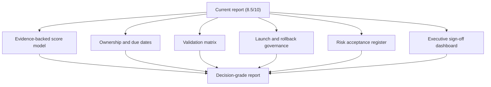
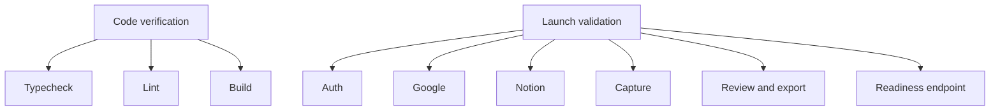
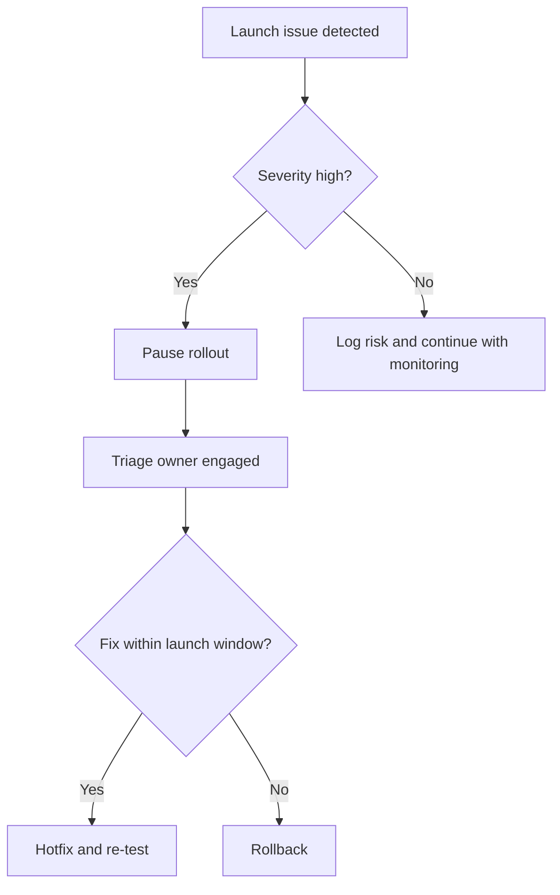
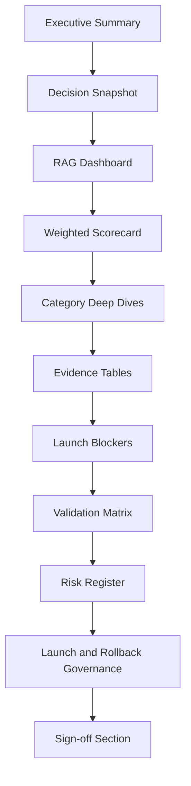

# NextStop Web Production Readiness Report Upgrade Plan

**Date:** March 21, 2026  
**Goal:** Upgrade the current production readiness report from a strong engineering assessment to a true executive and senior-engineering sign-off document  
**Source Report:** [production-readiness-report.md](/C:/Users/ADMIN/Desktop/New%20folder%20(2)/nextstop.ai-web/docs/production-readiness-report.md)  
**Target Outcome:** Move the report quality from approximately **8.5/10** to **10/10** without changing the excluded scope around AI and transcription quality

---

## 1. Objective

The current report is already strong in structure, honesty, diagrams, and product understanding. To reach a 10/10 standard, it needs to become more than a narrative assessment. It needs to become a **decision-grade operational document** that a senior engineer, engineering manager, CTO, investor, or launch owner could use to:

- approve or reject production launch
- see exact blockers versus acceptable risks
- understand ownership of each remaining task
- verify the evidence behind each score
- run the launch, rollback, and incident process without guessing

This plan focuses on improving the **quality, rigor, and actionability of the report itself**, using the current report as the baseline.

---

## 2. Definition of a 10/10 Readiness Report

A 10/10 production readiness report should do all of the following:

- clearly separate product readiness from documentation quality
- back every major score with explicit evidence
- distinguish:
  - hard blockers
  - soft launch risks
  - accepted post-launch debt
- assign owners and due dates to all critical gaps
- include exact production validation steps and pass criteria
- provide a launch-day operating model
- provide rollback criteria and incident paths
- make hidden assumptions visible
- show where the system is strong, weak, and still uncertain
- be useful to both:
  - engineering contributors
  - non-implementing decision-makers

---

## 3. Current Gap Analysis: Why the Report Is 8.5/10 Instead of 10/10

## 3.1 Strengths Already Present

The existing report already does these very well:

- coherent category scorecard
- realistic launch recommendation
- diagrams for architecture and key flows
- UI sketches for operational understanding
- explicit exclusions around AI and transcription quality
- identification of operational launch risks
- good codebase grounding

## 3.2 Missing Elements

The current report is still short of 10/10 because it lacks:

1. **Evidence rigor**
   - scores are reasoned, but not always backed by explicit pass/fail artifacts

2. **Owner-based accountability**
   - the report says what remains, but not who owns each item

3. **Launch gating precision**
   - some sections identify risks, but not a formal sign-off matrix

4. **Operational accountability**
   - there is no named incident playbook structure inside the report

5. **Testing evidence matrix**
   - current testing discussion is good, but still narrative-heavy

6. **Risk acceptance model**
   - accepted risks are named, but not formally logged with rationale

7. **Evidence traceability**
   - file references exist, but not a structured score-to-evidence index

8. **Decision artifact quality**
   - the report is informative, but not yet a full boardroom or CTO review artifact

---

## 4. Upgrade Strategy

We will upgrade the report through six workstreams:

1. Convert narrative scoring into evidence-backed scoring
2. Add blocker, owner, and due-date structures
3. Add a formal validation and test evidence matrix
4. Add launch-day operations, incident, and rollback governance
5. Add a risk acceptance register
6. Add executive-facing summary surfaces

### Upgrade Strategy Diagram



---

## 5. Detailed Workstreams

## 5.1 Workstream A: Convert Scores into Evidence-Backed Scoring

### Problem

The current report scores categories honestly, but some scores are still qualitative judgments. A 10/10 report needs each score to be anchored in specific evidence.

### Changes Required

- add a per-category evidence table with:
  - control or requirement
  - current state
  - evidence reference
  - pass / partial / fail status
- add a short explanation of how the category score was derived
- distinguish between:
  - implemented
  - documented but unverified
  - verified in build
  - verified only in manual testing

### Deliverable

A new sub-section under each score category:

```text
Evidence Table
- Requirement
- Evidence
- Validation method
- Status
```

### Example upgrade

Instead of:

- "`Testing & QA = 63/100 because automated coverage is weak`"

It becomes:

| Requirement | Evidence | Validation | Status |
|---|---|---|---|
| Typecheck clean | `npx tsc --noEmit` | Verified locally | Pass |
| Build clean | `npm run build` | Verified locally | Pass |
| E2E Google connect | No automated suite | Manual only | Partial |
| E2E Notion export | No automated suite | Manual only | Partial |

### Output impact

This makes every score defensible under engineering review.

---

## 5.2 Workstream B: Add Blockers, Owners, and Due Dates

### Problem

The current report identifies what is missing, but it does not tell the team who owns the remaining work or what must be resolved before launch.

### Changes Required

- create a dedicated **Launch Blockers Table**
- create a **Pre-Launch Action Register**
- each item should include:
  - item name
  - category
  - severity
  - owner
  - due time
  - status
  - verification method

### Deliverable

```text
Launch Blockers
- Must fix before launch
- Must verify before launch
- Safe to defer after launch
```

### Example table

| Item | Category | Severity | Owner | Due | Status | Verification |
|---|---|---|---|---|---|---|
| Google OAuth redirect verified | Google | High | Krishna | Before launch | Pending | Real account smoke test |
| Notion destination save tested | Notion | High | Krishna | Before launch | Pending | Real Notion export |
| Transcript mode chosen | Runtime policy | High | Krishna | Before launch | Pending | Env check + readiness route |

### Output impact

This turns the report from "analysis" into "execution control."

---

## 5.3 Workstream C: Add a Formal Validation and Test Evidence Matrix

### Problem

The report currently says testing is light, but it does not provide a true pass/fail launch matrix.

### Changes Required

- add a **Validation Matrix** section with:
  - flow name
  - environment
  - expected result
  - owner
  - result
  - notes
- explicitly split:
  - automated verification
  - manual smoke tests
  - production-only validation

### Required validation groups

1. Build and static checks
2. Auth and access routing
3. Google connect and reconnect
4. Notion connect and destination save
5. Capture start/pause/end
6. Review page open
7. PDF export
8. Notion export
9. Billing gate behavior
10. Readiness endpoint

### Validation Matrix Diagram



### Output impact

This is one of the biggest changes required to make the report 10/10.

---

## 5.4 Workstream D: Add Launch-Day Governance and Incident Handling

### Problem

The current report includes launch advice, but not a full launch operating model.

### Changes Required

- add a dedicated **Launch Command Structure** section:
  - launch owner
  - backup owner
  - technical observer
  - rollback approver
- add an **Incident Response Table** for common issues:
  - Google auth failure
  - Notion redirect mismatch
  - capture finalize failure
  - billing gate failure
  - export failure
- add explicit rollback decision criteria
- define launch communications expectations

### Deliverable

```text
Launch Governance
- Who approves go-live
- Who watches logs
- Who runs smoke tests
- Who decides rollback
```

### Incident Diagram



### Output impact

This is what makes the report feel like a senior-engineering launch artifact rather than a good engineering writeup.

---

## 5.5 Workstream E: Add a Formal Risk Acceptance Register

### Problem

The report names accepted risks, but they are not logged formally enough.

### Changes Required

- add a **Risk Acceptance Register**
- each accepted risk should include:
  - risk statement
  - why it is acceptable for this launch
  - impact if it occurs
  - mitigation
  - owner
  - review date

### Example

| Risk | Acceptance rationale | Impact | Mitigation | Owner | Review date |
|---|---|---|---|---|---|
| Capture cannot truly resume after refresh | Known browser limitation, no data corruption | User friction | Recovery UI + support copy | Krishna | Post-launch week 1 |

### Output impact

This makes the launch risk posture explicit and professional.

---

## 5.6 Workstream F: Add Executive and Stakeholder Summary Surfaces

### Problem

The current report is engineering-readable, but it could be more useful to non-implementing stakeholders.

### Changes Required

- add a top-page **RAG Dashboard**
  - Green = strong
  - Amber = caution
  - Red = blocker
- add a one-page **Executive Summary Block**
  - what is ready
  - what is not ready
  - what must happen tonight
  - what we are intentionally deferring
- add a concise **Decision Snapshot**
  - launch recommendation
  - blockers count
  - accepted risks count
  - top risk category

### Example UI sketch

```text
+----------------------------------------------------------------------------------+
| Production Readiness Dashboard                                                   |
| Overall: 81/100                                                                  |
| Recommendation: Go-live with controlled validation                               |
|                                                                                  |
| Green  : Auth, billing, config, docs                                             |
| Amber  : Google, Notion, capture, transcript policy                              |
| Red    : None                                                                     |
|                                                                                  |
| Must-do tonight: OAuth verification, smoke tests, transcript mode confirmation   |
+----------------------------------------------------------------------------------+
```

### Output impact

This makes the report immediately usable in leadership or launch-review contexts.

---

## 6. Proposed Final Structure for the 10/10 Version

The upgraded report should follow this structure:

1. Title and scope
2. Executive summary
3. Decision snapshot
4. RAG readiness dashboard
5. Weighted scorecard
6. System architecture and UX sketches
7. Category deep dives
8. Per-category evidence tables
9. Launch blockers and pre-launch action register
10. Validation and test evidence matrix
11. Risk acceptance register
12. Launch governance and incident response model
13. Rollback triggers
14. Evidence map by file and by verification artifact
15. Final recommendation and sign-off section

### Structure Diagram



---

## 7. Detailed Implementation Sequence

## Phase 1. Make the report evidence-backed

### Tasks

1. Add per-category evidence tables
2. Add exact verification source for each score
3. Mark each evidence item as:
   - pass
   - partial
   - fail
   - unverified

### Success criteria

- Every score can be defended with explicit evidence
- No major score depends only on prose judgment

## Phase 2. Add blocker and owner structure

### Tasks

1. Add launch blocker table
2. Add owner and due fields
3. Add verification and closure criteria for each blocker

### Success criteria

- A reader can tell what is left, who owns it, and whether it blocks launch

## Phase 3. Add validation matrix

### Tasks

1. Build a full launch test matrix
2. Split automated checks from manual checks
3. Add expected results and actual result placeholders

### Success criteria

- The report can be used as the actual launch test sheet

## Phase 4. Add governance and incident handling

### Tasks

1. Add launch-day command roles
2. Add incident response scenarios
3. Add rollback authority and triggers

### Success criteria

- The report doubles as an operational launch guide

## Phase 5. Add executive surfaces

### Tasks

1. Add RAG dashboard
2. Add top risks list
3. Add one-screen executive snapshot

### Success criteria

- A non-implementing stakeholder can understand the launch position in under two minutes

---

## 8. Deliverables to Produce

To upgrade the report to 10/10, the following artifacts should exist:

1. **Upgraded readiness report**
2. **Launch blockers table**
3. **Validation matrix**
4. **Risk acceptance register**
5. **Launch governance appendix**
6. **Sign-off section**

---

## 9. Example Sign-Off Section to Add

The report should end with a formal sign-off block like this:

```text
Launch Decision
- Recommended: Yes / No / Conditional
- Date:
- Conditions:

Engineering Sign-Off
- Name:
- Status:
- Notes:

Operations Sign-Off
- Name:
- Status:
- Notes:

Business / Product Sign-Off
- Name:
- Status:
- Notes:
```

This is one of the biggest gaps between a very good report and a true production sign-off document.

---

## 10. What Will Raise the Report from 8.5/10 to 10/10 Most Efficiently

If time is limited, the highest-value upgrades are:

1. Add the blocker and owner table
2. Add the validation matrix
3. Add the risk acceptance register
4. Add the executive dashboard
5. Add the launch governance and rollback section

These five additions will raise the report the fastest because they improve:

- decision quality
- accountability
- launch execution clarity
- executive usefulness

---

## 11. Final Recommendation

The current report is already strong. To make it truly 10/10, we do **not** need to rewrite its foundation. We need to **upgrade it from descriptive to operational**.

That means:

- more evidence
- more accountability
- more sign-off structure
- more launch execution detail
- more explicit risk handling

In short:

> The report becomes 10/10 when it stops being only a readiness analysis and becomes a launch-control document.

---

## 12. Acceptance Criteria for the Upgraded Report

The readiness report can be considered 10/10 when all of the following are true:

- every score has explicit evidence
- every blocker has an owner and due time
- every must-pass launch flow exists in the validation matrix
- accepted risks are formally logged
- rollback criteria are explicit
- executive summary and engineering detail both coexist cleanly
- a CTO or senior engineer can sign off directly from the document

---

*This plan is based directly on the current [production-readiness-report.md](/C:/Users/ADMIN/Desktop/New%20folder%20(2)/nextstop.ai-web/docs/production-readiness-report.md) and focuses on upgrading the report quality itself from approximately 8.5/10 to 10/10.*
