# NextStop Post-Production Readiness Report

**Date**: April 1, 2026  
**Repository**: `nextstop.ai-web`  
**Scope**: `Live Production`, `Next Release Ready Locally`, and `Future Recommendation`  
**Audience**: Founder, operator, and engineering stakeholders  
**Assessment method**: repo review, workflow review, docs review, code-path inspection, and locally validated checks

## Evidence Legend

- `Live Production`: confirmed through the current deployment model, operator statements, and production-facing flows already in use
- `Repo-Confirmed`: confirmed from code, routes, workflows, migrations, or docs in this workspace
- `Locally Validated`: confirmed through local commands already run in this workspace
- `Requires Production Verification`: plausible and prepared, but still needs a live deployed check after release

---

## 1. Executive Summary

### Readiness Scores

| Scope | Score | Verdict |
|---|---:|---|
| `Live Production` | 3.5 / 5 | Stable for controlled production, but still needs operational hardening |
| `Next Release Ready Locally` | 4.1 / 5 | Strong candidate for release after push and post-deploy verification |

### Current-State Summary

NextStop is no longer a prototype. The product now has a clear two-runtime deployment model, a working browser-capture path, a direct Railway AI worker, a lighter dashboard and library loading model, structured review and export surfaces, and a new internal operations page. The repo shows a meaningful transition from “all logic in Next.js” toward “Vercel for app rendering, Railway for heavy AI execution,” with Supabase as the durable system of record and Redis/BullMQ handling queue transport. The biggest risks are now less about whether the core product exists and more about whether operations, ownership boundaries, and recovery tooling are mature enough for broader production.

### Release Recommendation

`Next Release Ready Locally` should be pushed. The local evidence is strong: frontend typecheck, lint, coverage run, production build, and backend typecheck all passed in this workspace. The new readiness improvements also close real launch gaps: export telemetry is now persisted, automated post-deploy verification is wired into GitHub Actions, runtime ownership has been documented, and the `/dashboard/ops` surface makes health and recent failures visible. After release, the main focus should shift to operational confidence: worker alerts, incident runbooks, route-ownership cleanup, and richer failure recovery for exports and AI retries.

### Top 5 Immediate Risks

1. Runtime ownership is improved but still split: important authenticated business logic remains inside `frontend/src/app/api/**`.
2. The AI worker path is healthier, but end-to-end failure remediation is still mostly read-only rather than operator-actionable.
3. Post-deploy verification exists, but it still depends on correct environment configuration and successful deployment propagation timing.
4. Exports are now logged better, but export retry tooling and a centralized export center are not complete yet.
5. Production monitoring is visible in-app, but alerting and incident automation are still immature.

### Top 5 Highest-Leverage Improvements

1. Push the current local release so `/dashboard/ops`, post-deploy verification, and export telemetry reach production.
2. Add alerting for stale worker heartbeat, queue backlog, readiness failures, and repeated failed jobs.
3. Finish the runtime-boundary cleanup by migrating more heavy/authenticated backend logic out of Next.js API routes.
4. Add operator retry tools for failed AI jobs and failed exports.
5. Add a first-run onboarding checklist for Google, Notion, capture validation, and first export success.

### Final Verdict

`Live Production`: stable enough for controlled production, but still needs operational hardening.  
`Next Release Ready Locally`: ready to ship after normal CI and post-deploy verification.

**Current status**: Healthy core product with moderate operational debt  
**Risk level**: Medium  
**Recommendation summary**: Push the locally prepared release, verify production automatically, then prioritize ops hardening and runtime cleanup

---

## 2. System Architecture Overview

### System Summary

Today’s system is a hybrid production architecture:

- Browser users access the product through the Vercel-hosted Next.js app
- Supabase provides auth, relational data, and private storage
- Railway hosts the backend service and direct AI worker
- Redis on Railway backs BullMQ job execution
- Deepgram handles transcription
- OpenAI handles downstream findings generation
- Google and Notion power external productivity integrations
- Razorpay handles billing and subscription workflows

### System Context Diagram

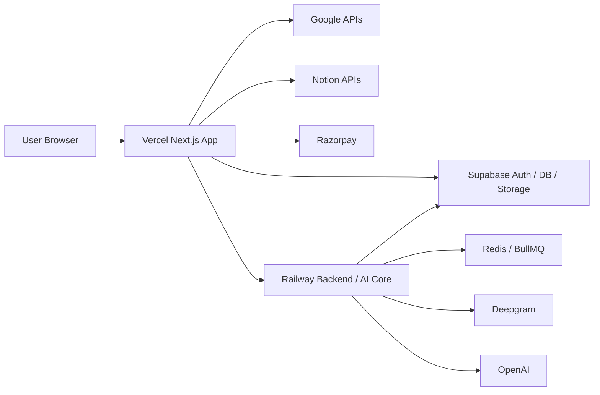

### Runtime Boundary Diagram

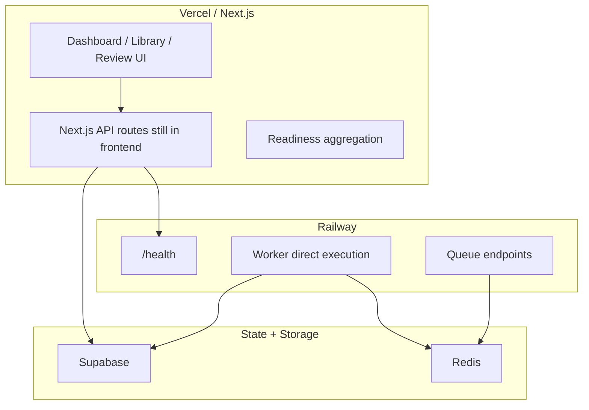

### What Still Runs on Vercel

- App Router UI rendering under `frontend/src/app/(dashboard)/**`
- authenticated page composition and server loaders
- remaining authenticated Next.js API routes under `frontend/src/app/api/**`
- readiness aggregation under [route.ts](C:/Users/ADMIN/Desktop/nextstop.ai/nextstop.ai-web/frontend/src/app/api/health/readiness/route.ts)
- lightweight export orchestration and transcript download handlers

### What Now Runs on Railway

- backend `/health` endpoint under [server.ts](C:/Users/ADMIN/Desktop/nextstop.ai/nextstop.ai-web/backend/src/server.ts)
- direct BullMQ worker execution under [worker.ts](C:/Users/ADMIN/Desktop/nextstop.ai/nextstop.ai-web/backend/src/worker.ts)
- queue-backed AI execution using Redis/BullMQ
- heavy transcription and analysis execution against Deepgram and OpenAI

### Split-Ownership Assessment

The architecture is coherent enough for current scale, but it is not yet “cleanly separated.” The important distinction is that the AI heavy path now has a single clear execution owner, which is Railway, while some authenticated product routes remain on Vercel for practical reasons. This is acceptable for the current stage, but it should be treated as transitional rather than final.

### Evidence

- `Repo-Confirmed`: [README.md](C:/Users/ADMIN/Desktop/nextstop.ai/nextstop.ai-web/README.md)
- `Repo-Confirmed`: [runtime-ownership.md](C:/Users/ADMIN/Desktop/nextstop.ai/nextstop.ai-web/docs/runtime-ownership.md)
- `Repo-Confirmed`: [server.ts](C:/Users/ADMIN/Desktop/nextstop.ai/nextstop.ai-web/backend/src/server.ts)
- `Repo-Confirmed`: [worker.ts](C:/Users/ADMIN/Desktop/nextstop.ai/nextstop.ai-web/backend/src/worker.ts)

**Current status**: Clearer than before, but still partly transitional  
**Risk level**: Medium  
**Recommendation summary**: Keep the current split for now, but continue moving backend-worthy authenticated logic toward Railway

---

## 3. Data Model and Lifecycle

### Core Data Shape

The product is centered on `web_meetings` and its downstream records:

- `profiles` and `subscriptions` define user identity and access
- `integrations_google` and `integrations_notion` store workspace connection state
- `web_meetings` represent scheduled or captured sessions
- `ai_jobs` track transcription, analysis, and regeneration work
- `meeting_assets` store raw audio and transcript assets
- `meeting_artifacts` and `meeting_findings` represent durable structured outputs
- `meeting_exports` records what was delivered, where, how long it took, and whether it failed
- `meeting_speaker_segments` store structured transcript segmentation

### ER Diagram

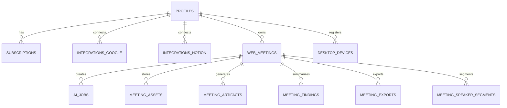

### Lifecycle Summary

1. A meeting is created through scheduling or browser capture.
2. Raw audio is uploaded to private storage and registered in `meeting_assets`.
3. An `ai_jobs` record is created and queued.
4. Railway transcribes, persists transcript data and segments, then runs analyze.
5. Findings and artifacts become the durable “product outputs.”
6. Export actions create `meeting_exports` records for auditing and failure diagnosis.

### Data Lifecycle Notes

- `raw audio` is intentionally short-lived
- `transcript_text` is temporary and policy-bound
- `findings` and `artifacts` are the durable long-term outputs
- `meeting_exports` is now becoming an operational ledger rather than just a history list

### Privacy Implications

The code and docs reflect a “findings-first, transcript-bounded” privacy model. This is directionally strong for production, but it does depend on retention jobs, storage settings, and export behavior staying aligned with what the UI claims. The report should treat privacy promises as only partially complete until live retention behavior is verified after deploy.

### Evidence

- `Repo-Confirmed`: [workspace.ts](C:/Users/ADMIN/Desktop/nextstop.ai/nextstop.ai-web/frontend/src/lib/workspace.ts)
- `Repo-Confirmed`: [production-runbook.md](C:/Users/ADMIN/Desktop/nextstop.ai/nextstop.ai-web/docs/production-runbook.md)
- `Repo-Confirmed`: [20260401_export_ops_hardening.sql](C:/Users/ADMIN/Desktop/nextstop.ai/nextstop.ai-web/backend/supabase/migrations/20260401_export_ops_hardening.sql)
- `Requires Production Verification`: actual transcript and audio cleanup timing in live storage

**Current status**: Strong relational model with improving export and ops telemetry  
**Risk level**: Medium  
**Recommendation summary**: Keep the data model, but tighten retention verification and lifecycle documentation

---

## 4. Feature Audit

### Feature Verification Matrix

| Feature | Live status | Local next release | Risk | Notes |
|---|---|---|---|---|
| Authentication and access control | `Live Production` | no major behavioral change | Low | Billing-aware access gating is already part of the app flow |
| Billing and subscription gating | `Live Production` | no major behavioral change | Medium | Strong enough, but billing readiness still depends on Razorpay env and webhook correctness |
| Dashboard shell | `Live Production` | improved route responsiveness already prepared | Low | Shell-first behavior is materially better in local release |
| Sidebar capture controls | `Live Production` | already cleaned up locally | Medium | Static left-sidebar placement is better than the old floating model |
| Browser capture flow | `Live Production` | local resiliency improvements exist | Medium | Capture is working, but browser and device variability remains a real production risk |
| Library and meeting list | `Live Production` | lighter loader plus skeletons prepared | Medium | Much better perceived performance in local release |
| Review page | `Live Production` | simplified export-first layout prepared | Low | Direction is good; further simplification can continue |
| PDF export | `Live Production` | now logged better locally | Medium | Export exists, but async retry and centralized status are still future work |
| Temporary transcript download | `Live Production` | better logging and bounded messaging locally | Medium | Policy is clearer, but retention must stay aligned with reality |
| Google integration | `Live Production` | no major local contract change | Medium | Works, but token expiry and reconnect flows always deserve attention |
| Notion integration | `Live Production` | export telemetry and settings context improved locally | Medium | Still tied to OAuth and destination configuration |
| AI processing pipeline | `Live Production` | direct Railway execution and richer status already prepared | Medium | Major architecture improvement, but retry tooling is still limited |
| Readiness and ops visibility | `Ready Locally` | new `/dashboard/ops` page | Low | High-value local improvement ready to ship |
| Settings and privacy communication | `Live Production` | small improvements already prepared | Medium | Clearer than before, but still not the final privacy and admin experience |

### Feature Group Notes

#### Auth, Access, Billing

These appear production-credible. They are supported by server-side access checks in page loaders and by readiness checks for billing credentials. The main risk is not the product logic itself, but environment drift and webhook correctness.

#### Capture, Library, Review

This is the heart of user value and is now substantially stronger than earlier iterations. The shift away from a floating capture rail and the improved library loader split are meaningful UX wins. The remaining weakness is not feature absence, but resilience and operational visibility under real-world browser and audio conditions.

#### Exports and Integrations

Exports are now becoming first-class operational objects. That is a real maturity step. Google and Notion are functional, but because they depend on external OAuth and destination state, they should still be treated as “works, but requires strong operational monitoring.”

### Evidence

- `Repo-Confirmed`: [DashboardShell.tsx](C:/Users/ADMIN/Desktop/nextstop.ai/nextstop.ai-web/frontend/src/app/(dashboard)/DashboardShell.tsx)
- `Repo-Confirmed`: [MeetingReview.tsx](C:/Users/ADMIN/Desktop/nextstop.ai/nextstop.ai-web/frontend/src/components/workspace/MeetingReview.tsx)
- `Repo-Confirmed`: [WorkspaceOps.tsx](C:/Users/ADMIN/Desktop/nextstop.ai/nextstop.ai-web/frontend/src/components/workspace/WorkspaceOps.tsx)
- `Repo-Confirmed`: [workspace-page.ts](C:/Users/ADMIN/Desktop/nextstop.ai/nextstop.ai-web/frontend/src/lib/workspace-page.ts)
- `Locally Validated`: typecheck, lint, tests with coverage, frontend build, backend typecheck
- `Requires Production Verification`: full production Google and Notion reconnect and export behavior after release

**Current status**: Broadly strong feature coverage with a few operational weak spots  
**Risk level**: Medium  
**Recommendation summary**: Ship the local ops and export improvements, then concentrate on retries, operator tools, and integration recovery polish

---

## 5. Capture and AI Pipeline Review

### Capture-to-Output DFD

```mermaid
flowchart LR
    A["User starts capture"] --> B["Browser records audio"]
    B --> C["Local validation"]
    C --> D["Upload audio asset"]
    D --> E["Create meeting + AI job"]
    E --> F["Queue transcribe job"]
    F --> G["Railway worker transcribes"]
    G --> H["Transcript asset + segments stored"]
    H --> I["Analyze job runs"]
    I --> J["Findings + artifacts written"]
    J --> K["Library / Review updates"]
```

### What Is Working Well

- Heavy AI execution has a clear runtime owner: Railway
- The worker now reports `workerReady` and `directExecution`, which is a major ops improvement
- AI status shape is richer, including `phase`, timing metadata, transcript and finding readiness, and retry count
- The local release includes clearer failure surfacing and stronger review status presentation

### What Is Still Weak

- Retry tooling is still mostly conceptual rather than operator-friendly
- Failed jobs are visible, but there is no rich internal control surface yet for requeue and retry
- Production still depends on environment correctness and queue health rather than deeper self-healing
- Transcript quality gates are better conceptually than they are operationally automated

### Worker Execution Model Assessment

The current model is directionally correct. The move from “queue then bounce back into Vercel” to “Railway executes jobs directly” is one of the most important readiness improvements in the codebase. This reduces latency uncertainty, clarifies failure ownership, and matches the intended architecture.

### Latency Model Assessment

The user still perceives AI latency because transcription and analysis are inherently non-trivial network operations. The current improvements address perception and architecture, but not the full operator story:

- queue wait time is not yet deeply visualized
- provider timings are not yet surfaced in a central analytics console
- preview-before-final-output is still a future optimization, not a fully shipped one

### Evidence

- `Repo-Confirmed`: [worker.ts](C:/Users/ADMIN/Desktop/nextstop.ai/nextstop.ai-web/backend/src/worker.ts)
- `Repo-Confirmed`: [server.ts](C:/Users/ADMIN/Desktop/nextstop.ai/nextstop.ai-web/backend/src/server.ts)
- `Repo-Confirmed`: [workspace.ts](C:/Users/ADMIN/Desktop/nextstop.ai/nextstop.ai-web/frontend/src/lib/workspace.ts)
- `Live Production`: working capture and AI workflow already in use
- `Requires Production Verification`: stage timings and failure rates after shipping latest local changes

**Current status**: Fundamentally correct architecture, incomplete operational recovery layer  
**Risk level**: Medium  
**Recommendation summary**: Keep the direct Railway execution model, and add retry controls, alerts, and stage metrics next

---

## 6. Export and Review Experience

### Export Flow Diagram

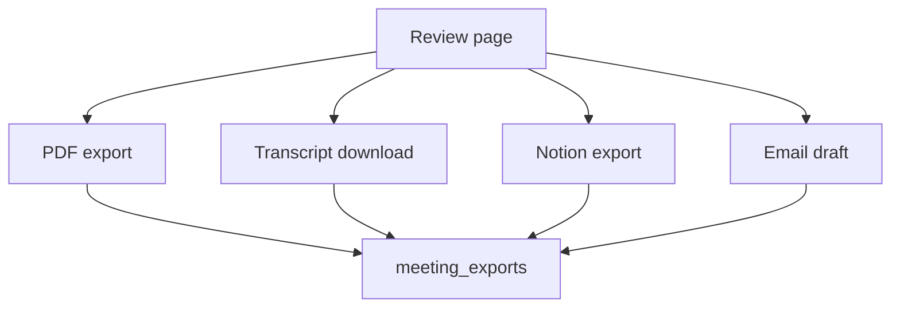

### Review / Export UI Sketch

```text
+----------------------------------------------------------------------------------+
| Meeting Title                                            [Copy] [Export PDF]     |
| Time | Source | Status | Transcript Ready | Findings Ready                       |
+----------------------------------------------------------------------------------+
| Summary                                                                          |
| Decisions                                                                        |
| Action Items                                                                     |
| Risks / Follow-ups                                                               |
+--------------------------------------+-------------------------------------------+
| Transcript Access                    | Export Actions                            |
| [Temporary transcript]               | [PDF] [Notion] [Email Draft]              |
| Expires at ...                       | History + status + failures               |
+--------------------------------------+-------------------------------------------+
```

### Review Assessment

The review page is materially closer to a product-ready surface now. It emphasizes outputs and actions more than internal pipeline detail, which is the right direction. The current local release also removes some lower-value UI clutter and improves export history visibility.

### Export Assessment

The major readiness gain is not just that exports exist, but that exports are now being treated as auditable operations:

- `meeting_exports` now tracks `status`
- failures can store `latest_error`
- duration can be captured in `duration_ms`
- completion can be timestamped

This is exactly the kind of operational data that turns a feature into a production feature.

### Remaining Gaps

- no centralized export center yet
- no first-class retry UX for failed exports
- PDF generation may still need async handling later if latency grows
- transcript availability still depends on policy and storage correctness staying aligned

### Evidence

- `Repo-Confirmed`: [MeetingReview.tsx](C:/Users/ADMIN/Desktop/nextstop.ai/nextstop.ai-web/frontend/src/components/workspace/MeetingReview.tsx)
- `Repo-Confirmed`: [meeting-exports.ts](C:/Users/ADMIN/Desktop/nextstop.ai/nextstop.ai-web/frontend/src/lib/meeting-exports.ts)
- `Repo-Confirmed`: [20260401_export_ops_hardening.sql](C:/Users/ADMIN/Desktop/nextstop.ai/nextstop.ai-web/backend/supabase/migrations/20260401_export_ops_hardening.sql)
- `Requires Production Verification`: export failure logging and duration capture in live traffic

**Current status**: Good UX trajectory with much better export observability  
**Risk level**: Medium  
**Recommendation summary**: Ship the improved export telemetry, then build centralized history and retry controls

---

## 7. Performance and UX Audit

### Library Loading Sketch

```text
+----------------------------------------------------------------------------------+
| Library                                                   [Search..............]  |
+----------------------------------------------------------------------------------+
| [Skeleton card]                                                                  |
| [Skeleton card]                                                                  |
| [Skeleton card]                                                                  |
| [Skeleton card]                                                                  |
+----------------------------------------------------------------------------------+
| After load:                                                                       |
| Meeting A | Ready | 5 artifacts | Open review                                    |
| Meeting B | Transcript ready | Processing | Open review                           |
| Meeting C | Failed | Retry | Open review                                          |
+----------------------------------------------------------------------------------+
```

### What Is Polished

- dashboard shell concept is now coherent
- sidebar capture location is much more stable
- route-level loading states and lighter library data contracts improve perceived speed
- review is less cluttered and more action-oriented

### What Still Feels Rough

- long AI work can still feel slow because the system is doing real asynchronous work without a full “stage analytics” experience
- there is still room to improve user trust messaging during long-running states
- some pages still depend on server-side loaders that are better than before, but not the final ideal architecture

### Performance Assessment

The repo shows good progress on perceived performance:

- page-specific loaders
- server-side search and pagination contracts for library
- reduced over-fetching
- route prefetching from the dashboard shell

This is a meaningful improvement over the earlier broad overview-loader approach. The remaining performance work is now mostly about deeper telemetry, cache behavior, and making asynchronous AI phases feel more explainable to the user.

### Evidence

- `Repo-Confirmed`: [workspace-server.ts](C:/Users/ADMIN/Desktop/nextstop.ai/nextstop.ai-web/frontend/src/lib/workspace-server.ts)
- `Repo-Confirmed`: [workspace-page.ts](C:/Users/ADMIN/Desktop/nextstop.ai/nextstop.ai-web/frontend/src/lib/workspace-page.ts)
- `Repo-Confirmed`: dashboard route loading files under `frontend/src/app/(dashboard)/dashboard/**/loading.tsx`
- `Locally Validated`: frontend build and tests
- `Requires Production Verification`: real route timings and user-perceived latency on live Vercel

**Current status**: Strongly improving; good perceived-speed direction  
**Risk level**: Medium  
**Recommendation summary**: Measure real production timings next and continue simplifying long-running feedback states

---

## 8. Code Quality and Maintainability Review

### Scorecard

| Category | Score | Notes |
|---|---:|---|
| Architecture | 4.0 / 5 | Strong direction, but split runtime ownership still exists |
| Maintainability | 3.8 / 5 | Types and loaders are improving, though some responsibilities are still mixed |
| Observability | 3.6 / 5 | Better than before, especially with readiness and export telemetry, but alerting is still thin |
| Testability | 4.0 / 5 | Strong frontend validation set; could use more end-to-end operational tests |
| Deployment safety | 4.0 / 5 | CI, security, and post-deploy verify are strong improvements |
| Documentation quality | 4.2 / 5 | Repo docs, runtime ownership, and runbook are now useful and aligned |

### Assessment

#### Strengths

- Type contracts in [workspace.ts](C:/Users/ADMIN/Desktop/nextstop.ai/nextstop.ai-web/frontend/src/lib/workspace.ts) are explicit and increasingly production-oriented
- Loader boundaries in [workspace-server.ts](C:/Users/ADMIN/Desktop/nextstop.ai/nextstop.ai-web/frontend/src/lib/workspace-server.ts) are noticeably cleaner than a broad “everything overview” pattern
- Runtime ownership is now documented, which reduces ambiguity
- New docs and runbooks are aligned with the actual repo structure

#### Maintainability Risks

- `frontend/src/app/api/**` still hosts more backend-like logic than ideal
- some operational logic still lives across multiple layers instead of through a single backend boundary
- error handling is improving, but still inconsistent between user-facing recovery copy, export ledger, and ops failure records

#### Technical Debt Classification

Acceptable:

- hybrid runtime split for the current stage
- some orchestration remaining in Next.js while heavy AI runs on Railway

Becoming risky:

- keeping too much authenticated business logic in Vercel long term
- limited operator action tooling for failed jobs and exports
- depending on manual awareness instead of alerting for failures

### Evidence

- `Repo-Confirmed`: [workspace.ts](C:/Users/ADMIN/Desktop/nextstop.ai/nextstop.ai-web/frontend/src/lib/workspace.ts)
- `Repo-Confirmed`: [workspace-server.ts](C:/Users/ADMIN/Desktop/nextstop.ai/nextstop.ai-web/frontend/src/lib/workspace-server.ts)
- `Repo-Confirmed`: [runtime-ownership.md](C:/Users/ADMIN/Desktop/nextstop.ai/nextstop.ai-web/docs/runtime-ownership.md)
- `Repo-Confirmed`: [production-runbook.md](C:/Users/ADMIN/Desktop/nextstop.ai/nextstop.ai-web/docs/production-runbook.md)

**Current status**: Good engineering direction with manageable but real debt  
**Risk level**: Medium  
**Recommendation summary**: Preserve the current structure, but continue consolidating backend ownership and failure handling patterns

---

## 9. CI/CD and Release Safety

### Delivery Flow Diagram

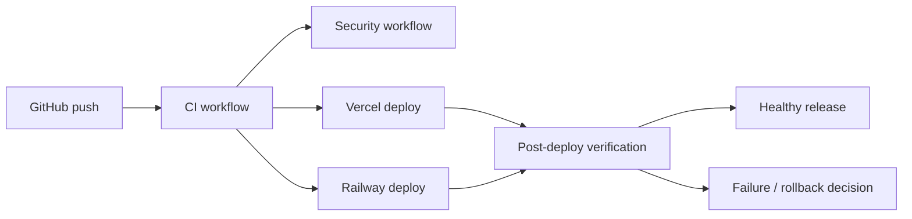

### Current Pipeline Review

The repo now has a sensible release safety story:

- `.github/workflows/ci.yml` runs typecheck, lint, build, repo contract tests, unit and route coverage, and browser smoke
- `.github/workflows/security.yml` runs secret scanning, dependency audit, and CodeQL
- `.github/workflows/post-deploy-verify.yml` can run automatically on `main` using `PRODUCTION_BASE_URL`

### What Is Already Strong

- CI covers the main frontend safety rails
- security checks are present and not merely nominal
- post-deploy verification is now explicitly part of the release model instead of a side note

### What Is Still Manual

- deployment sequencing itself still depends on external platforms succeeding
- some live verification still depends on post-deploy smoke rather than true staged promotion logic
- no automatic rollback is described or implemented yet

### Safety Assessment

This is good enough for current scale. The release process is not enterprise-grade, but it is responsible and increasingly production-conscious. The addition of `PRODUCTION_BASE_URL`-driven deployed verification is a meaningful maturity step.

### Evidence

- `Repo-Confirmed`: [ci.yml](C:/Users/ADMIN/Desktop/nextstop.ai/nextstop.ai-web/.github/workflows/ci.yml)
- `Repo-Confirmed`: [security.yml](C:/Users/ADMIN/Desktop/nextstop.ai/nextstop.ai-web/.github/workflows/security.yml)
- `Repo-Confirmed`: [post-deploy-verify.yml](C:/Users/ADMIN/Desktop/nextstop.ai/nextstop.ai-web/.github/workflows/post-deploy-verify.yml)
- `Locally Validated`: frontend typecheck, lint, tests with coverage, build, backend typecheck
- `Requires Production Verification`: automatic run against the real deployed URL after next release

**Current status**: Strong for the current company stage  
**Risk level**: Low to Medium  
**Recommendation summary**: Keep this pipeline, then add rollback guidance, alerting, and richer smoke assertions over time

---

## 10. Ops and Monitoring Review

### Ops Console Sketch

```text
+----------------------------------------------------------------------------------+
| Production Readiness                                                             |
+----------------------------------------------------------------------------------+
| Frontend: Healthy | Backend: Healthy | Worker: Healthy | Queue: 3 waiting        |
| Supabase: Healthy | Deepgram: Healthy | OpenAI: Healthy | Last deploy: Passed     |
+----------------------------------------------------------------------------------+
| Recent AI failures                                                               |
| Meeting ID     Stage        Error                              Mode               |
| 91e...         transcribe   empty transcript                   railway_remote     |
+----------------------------------------------------------------------------------+
| Recent export failures                                                           |
| Meeting ID     Export       Error                              Duration           |
| a12...         PDF          timeout                            1842 ms            |
+----------------------------------------------------------------------------------+
```

### Ops Assessment

This is one of the most important improvements in the current local release. Before this work, the product had health endpoints and scattered runtime checks, but not a clear internal “is the system okay?” page. The new [WorkspaceOps.tsx](C:/Users/ADMIN/Desktop/nextstop.ai/nextstop.ai-web/frontend/src/components/workspace/WorkspaceOps.tsx) addresses that gap directly by surfacing:

- runtime boundary information
- readiness checks
- recent AI failures
- recent export failures
- worker heartbeat and queue identity

### Monitoring Maturity

Current maturity is good for visibility, but not yet for full automation:

- visibility: improving strongly
- alerting: still limited
- runbooks: now present, but still basic
- incident automation: not mature yet

### Operator Independence

The product is moving in the right direction. An operator can now understand more of the system without directly opening the database, but still cannot fully recover from issues without engineering support. That is acceptable for a young product, but not the final state.

### Evidence

- `Repo-Confirmed`: [WorkspaceOps.tsx](C:/Users/ADMIN/Desktop/nextstop.ai/nextstop.ai-web/frontend/src/components/workspace/WorkspaceOps.tsx)
- `Repo-Confirmed`: [page.tsx](C:/Users/ADMIN/Desktop/nextstop.ai/nextstop.ai-web/frontend/src/app/(dashboard)/dashboard/ops/page.tsx)
- `Repo-Confirmed`: [route.ts](C:/Users/ADMIN/Desktop/nextstop.ai/nextstop.ai-web/frontend/src/app/api/health/readiness/route.ts)
- `Repo-Confirmed`: [production-runbook.md](C:/Users/ADMIN/Desktop/nextstop.ai/nextstop.ai-web/docs/production-runbook.md)
- `Requires Production Verification`: ops page behavior against real live failures after release

**Current status**: Good visibility, limited active operations tooling  
**Risk level**: Medium  
**Recommendation summary**: Ship the ops surface, then add alerting, retry actions, and tighter runbooks

---

## 11. Recommendations and Improvements

### 11.1 Product / UX

#### Recommendation: Add guided onboarding and activation checklist

- `Current gap`: successful first value still depends on the user correctly connecting Google and Notion, understanding capture, and completing a first export
- `Why it matters`: new users can fail before they ever see product value
- `User / business impact`: higher activation, lower support burden
- `Engineering effort`: Medium
- `Priority`: High
- `Suggested owner`: Frontend + Product Design + Backend

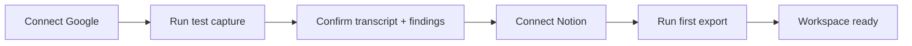

```text
+----------------------------------------------------------------------------------+
| Welcome to NextStop                                                              |
+----------------------------------------------------------------------------------+
| [1] Connect Google                [Connected]                                    |
| [2] Connect Notion                [Not connected]                                |
| [3] Run 30-second test capture    [Start]                                        |
| [4] Verify AI pipeline            [Check]                                        |
| [5] Export your first summary     [PDF / Notion]                                 |
+----------------------------------------------------------------------------------+
```

#### Recommendation: Create a centralized export center

- `Current gap`: export history is still mostly meeting-local and not yet globally explorable
- `Why it matters`: users and operators need to answer “what happened to my export?” quickly
- `User / business impact`: better trust and supportability
- `Engineering effort`: Medium
- `Priority`: High
- `Suggested owner`: Frontend + Backend + Product Design

```text
+----------------------------------------------------------------------------------+
| Export Center                                                                    |
+----------------------------------------------------------------------------------+
| Type       | Meeting                  | Destination      | Status    | Duration   |
| PDF        | Browser Meeting Apr 1    | download         | completed | 1200 ms    |
| Notion     | Team Standup             | Workspace page   | failed    | 930 ms     |
| Transcript | Instant Meet             | download         | completed | 180 ms     |
+----------------------------------------------------------------------------------+
```

### 11.2 Performance

#### Recommendation: Add production timing dashboards

- `Current gap`: loader and AI timings exist conceptually, but not in a central production dashboard
- `Why it matters`: performance work becomes guesswork without comparative timing evidence
- `User / business impact`: faster iteration on latency and responsiveness
- `Engineering effort`: Medium
- `Priority`: High
- `Suggested owner`: Backend + Infra

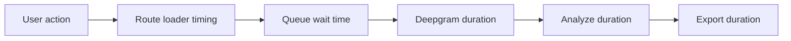

### 11.3 Reliability

#### Recommendation: Add operator retry controls for failed jobs and exports

- `Current gap`: operators can see failures but cannot recover from them directly in the app
- `Why it matters`: visibility without action still creates engineering dependency
- `User / business impact`: faster support resolution, fewer stuck states
- `Engineering effort`: Medium to High
- `Priority`: High
- `Suggested owner`: Frontend + Backend

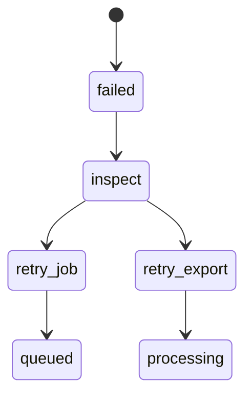

### 11.4 Observability / Ops

#### Recommendation: Add alerting for worker heartbeat, queue backlog, and repeated failures

- `Current gap`: the current system is readable, but not truly proactive
- `Why it matters`: production issues should be caught before users report them
- `User / business impact`: reduced incident duration and better operator confidence
- `Engineering effort`: Medium
- `Priority`: High
- `Suggested owner`: Infra

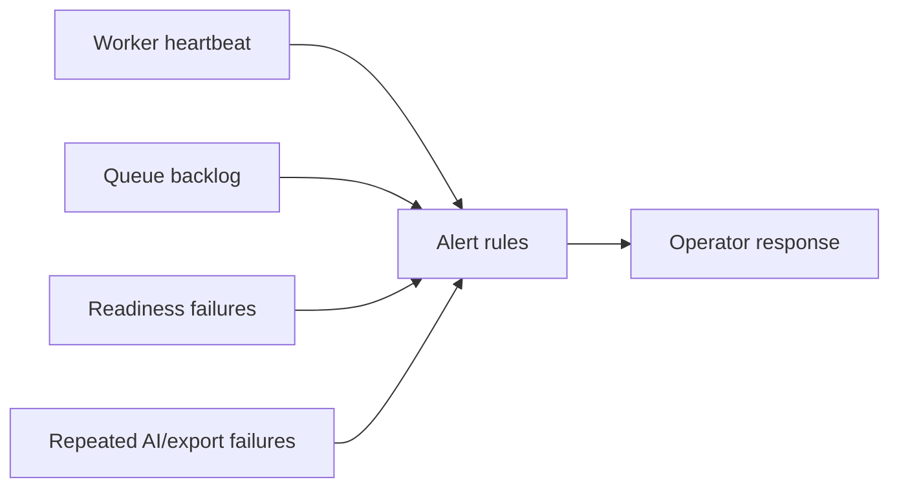

### 11.5 AI / Data Quality

#### Recommendation: Add transcript quality diagnostics and preview-before-final

- `Current gap`: users still often wait for final outputs before getting meaningful confirmation
- `Why it matters`: fast first value improves trust and perceived intelligence
- `User / business impact`: better experience without higher AI cost
- `Engineering effort`: Medium
- `Priority`: Medium
- `Suggested owner`: Backend + Frontend

```text
+--------------------------------------------------------------+
| Status: Transcript ready                                     |
| Quick preview                                                |
| - Discussion centered on ...                                 |
| - Main entities mentioned ...                                |
| Final structured findings are still processing.              |
+--------------------------------------------------------------+
```

### 11.6 Architecture Cleanup

#### Recommendation: Continue migrating backend-worthy routes off Vercel

- `Current gap`: `frontend/src/app/api/**` still contains too much backend-like logic
- `Why it matters`: mixed ownership increases debugging time and long-term maintenance cost
- `User / business impact`: fewer hidden failure modes and clearer scaling path
- `Engineering effort`: High
- `Priority`: Medium
- `Suggested owner`: Backend + Infra

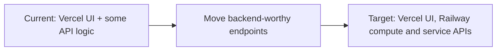

### 11.7 CI/CD and Release Process

#### Recommendation: Add rollback playbook automation and richer deployed smoke assertions

- `Current gap`: post-deploy verification exists, but rollback remains process-driven rather than guided
- `Why it matters`: bad releases need faster, safer operator handling
- `User / business impact`: lower blast radius when something breaks
- `Engineering effort`: Medium
- `Priority`: Medium
- `Suggested owner`: Infra + QA

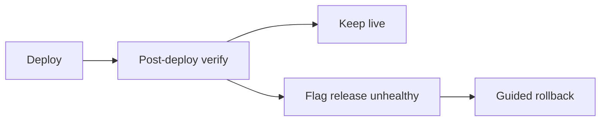

### 11.8 Future Growth Features

#### Recommendation: Build searchable meeting intelligence

- `Current gap`: library is operationally better, but still limited as a knowledge retrieval surface
- `Why it matters`: long-term product value grows when meetings are queryable by meaning, status, and history
- `User / business impact`: stronger retention and better repeat use
- `Engineering effort`: Medium to High
- `Priority`: Medium
- `Suggested owner`: Frontend + Backend + Product

```text
+----------------------------------------------------------------------------------+
| Search meetings [..............................................................]  |
| Filters: [Date] [Source] [Status] [Exports] [Has transcript]                    |
+----------------------------------------------------------------------------------+
| Meeting A | transcript_ready | Google Meet | 3 exports                           |
| Meeting B | ready            | Browser Tab | 1 export                            |
+----------------------------------------------------------------------------------+
```

**Current status**: Strong recommendation backlog with clear near-term priorities  
**Risk level**: Low if prioritized; High if postponed indefinitely  
**Recommendation summary**: Focus next on operator recovery, alerting, onboarding, and route ownership cleanup

---

## 12. Recommended Roadmap

### Push in Next Release

- ship `/dashboard/ops`
- ship export telemetry and failure tracking
- ship post-deploy verification workflow
- ship runtime ownership and runbook docs
- confirm `PRODUCTION_BASE_URL`-driven verification succeeds on `main`

### Do in Next 2 Weeks

- add worker, queue, and readiness alerts
- add operator retry actions for AI jobs and exports
- verify transcript retention and privacy claims against live storage behavior
- run a structured production smoke covering Google, Notion, capture, export, and readiness

### Do in Next 30-60 Days

- migrate more backend-worthy `frontend/src/app/api/**` endpoints toward Railway
- add centralized export center
- add onboarding checklist
- add timing dashboards and stage-level latency analysis

### Later / Scale Phase

- searchable meeting intelligence
- deeper collaboration and admin tooling
- richer AI quality evaluation and regression set
- fuller backend consolidation if the product team wants a stricter runtime boundary

### Release Guidance

The correct next move is not another redesign pass. It is to release the already-prepared local improvements, verify production automatically, and then immediately invest in operational maturity. The product has enough surface area and enough real users now that recovery speed, clarity of ownership, and observable failures matter more than adding broad new features.

### Local Validation Snapshot

The following checks were already run successfully in this workspace:

- `npm --prefix frontend run typecheck`
- `npm --prefix frontend run lint`
- `npm --prefix frontend run test -- --coverage`
- `npm --prefix frontend run build`
- `npm run typecheck:backend`

### Final Sign-Off

`Live Production`: good enough for controlled production, not yet broad-production polished.  
`Next Release Ready Locally`: ready to ship, with strong evidence and clear post-deploy verification steps.

**Current status**: Release-ready local branch with clear next actions  
**Risk level**: Medium, primarily operational  
**Recommendation summary**: Push the current release, watch the automated verification, then harden ops and recovery before chasing larger feature growth
