# NextStop Web Production Readiness Report

**Date**: March 21, 2026  
**Project**: NextStop Web Workspace  
**Deployment Target**: Vercel + Supabase + Railway-ready architecture  
**Assessment Scope**: Web product shell, integrations, capture/runtime, auth/billing, exports, operational readiness  
**Explicitly Excluded From This Report**: AI quality improvements, transcription model improvements, prompting/model upgrades

---

## Executive Summary

NextStop Web is now a **browser-first meeting capture application** with a real production deployment path, hardened Google and Notion integration flows, billing-aware access control, a global capture dock, a unified findings Library, and a safer transcript lifecycle contract than the original in-memory-only prototype.

The application is **conditionally ready for production tonight** provided the final operator-side configuration checks are completed:

- production env variables are set in Vercel
- Google and Notion OAuth redirect URIs are verified
- transcript mode is explicitly chosen for production
- a final smoke test is run against the deployed app

### Overall Production Readiness Score: **82/100**

### Readiness Recommendation: **Go for production with final operator validation**

| Category | Score | Status | Severity |
|---|---:|---|---|
| Security | 80/100 | Good | High |
| Authentication & Authorization | 86/100 | Strong | High |
| Billing & Access Gating | 84/100 | Strong | High |
| Google Integration | 82/100 | Good | High |
| Notion Integration | 79/100 | Good | High |
| Capture Reliability | 74/100 | Acceptable | High |
| Transcript Lifecycle Safety | 78/100 | Good | High |
| Library / Review / Export UX | 83/100 | Strong | Medium |
| Logging & Operational Visibility | 70/100 | Basic-to-Good | Medium |
| Deployment & Configuration | 88/100 | Strong | High |
| Testing & Verification | 62/100 | Needs Improvement | Medium |
| Documentation & Launch Operations | 87/100 | Strong | Medium |

### Weighted Interpretation

- The app is **not a prototype anymore**
- The biggest remaining risks are **operational**, not architectural:
  - provider dashboard misconfiguration
  - real OAuth token expiry paths in production
  - browser capture edge cases under real users
  - light automated test coverage compared with the product surface

---

## 1. Product and Architecture Overview

### 1.1 Product Shape

NextStop Web currently ships these production-facing capabilities:

- authenticated dashboard with billing-aware access
- Google Calendar connection and Google Meet creation
- Notion workspace connection and destination routing
- global floating capture controller on dashboard pages
- browser-tab capture flow
- unified Library for scheduled and captured meetings
- review page with findings, PDF export, transcript access policy, and Notion export

### 1.2 Runtime Architecture

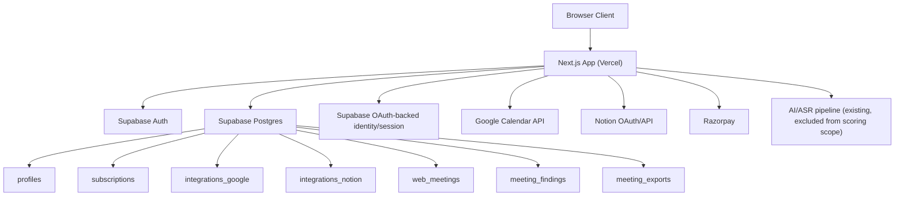

### 1.3 App Surface Map

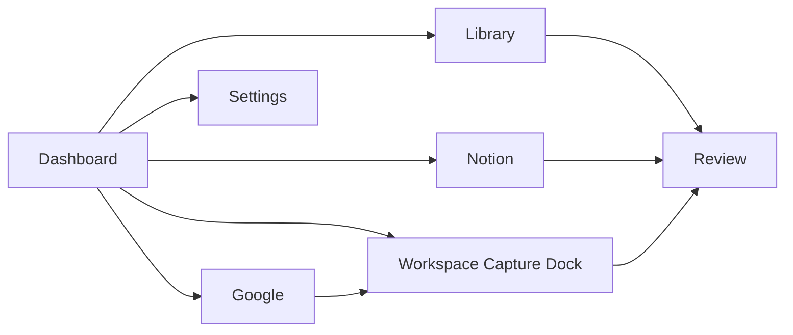

### 1.4 UI Surface Sketch

```text
+----------------------------------- NextStop Dashboard -----------------------------------+
| Sidebar | Main cards / library / integrations                         | Right-side dock  |
|         |                                                             | [logo]           |
|         |                                                             | [Google Meet]    |
|         |                                                             | [Start]          |
|         |                                                             | [Pause/Resume]   |
|         |                                                             | [End]            |
|         |                                                             | [Notion]         |
|         |                                                             | status chips     |
+------------------------------------------------------------------------------------------+
```

---

## 2. Category Scorecard and Rationale

## 2.1 Security - 80/100

### Strengths

- sensitive server operations are kept in server-only modules such as:
  - [env.ts](/C:/Users/ADMIN/Desktop/New%20folder%20(2)/nextstop.ai-web/src/lib/env.ts)
  - [supabase-admin.ts](/C:/Users/ADMIN/Desktop/New%20folder%20(2)/nextstop.ai-web/src/lib/supabase-admin.ts)
  - [google-workspace.ts](/C:/Users/ADMIN/Desktop/New%20folder%20(2)/nextstop.ai-web/src/lib/google-workspace.ts)
  - [notion-workspace.ts](/C:/Users/ADMIN/Desktop/New%20folder%20(2)/nextstop.ai-web/src/lib/notion-workspace.ts)
- raw internal errors are masked by [http.ts](/C:/Users/ADMIN/Desktop/New%20folder%20(2)/nextstop.ai-web/src/lib/http.ts)
- privileged DB writes use the admin client only from server routes/helpers
- `.env.example` exists and the repo no longer depends on hardcoded provider values
- transcript text is explicitly non-durable by design

### Risks

- there is no dedicated security middleware layer for CSP/header hardening documented in this repo
- server logging is still mostly `console.error`/`console.warn`, which is functional but not fully structured
- webhook verification is handled for Razorpay, but broader operational security observability is still light

### Security Diagram

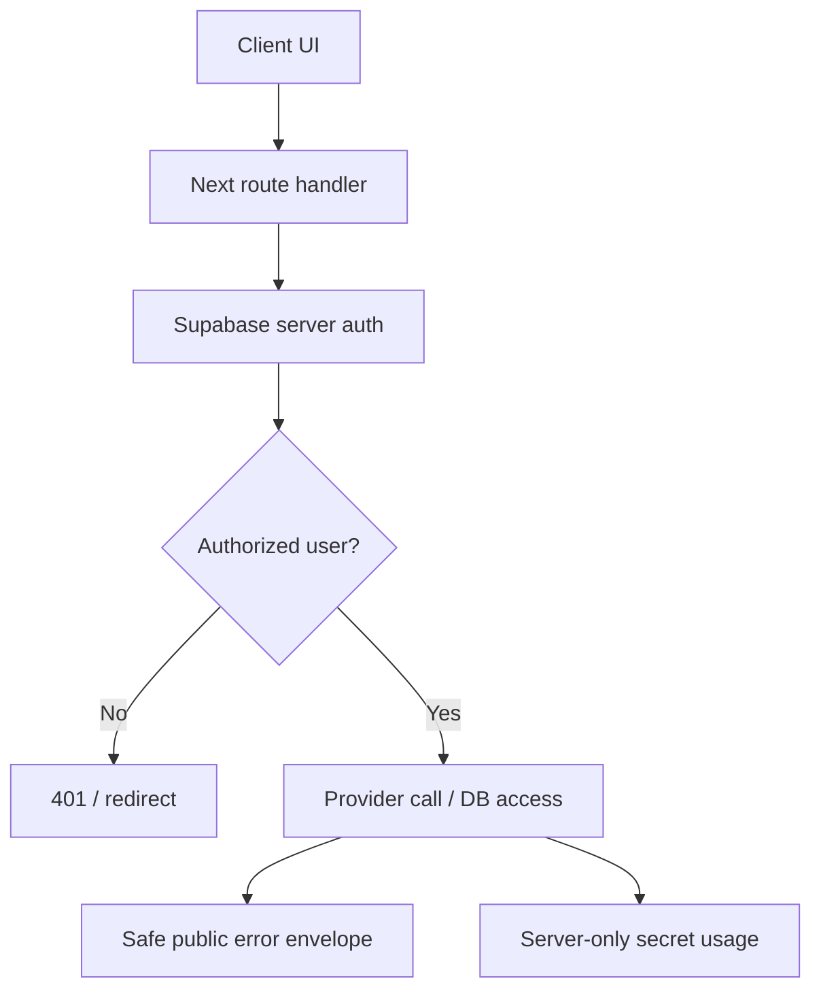

### Launch Verdict

- **Good enough to launch**
- Should be followed by a formal post-launch AppSec review

---

## 2.2 Authentication & Authorization - 86/100

### Strengths

- Supabase session handling is enforced in:
  - [proxy.ts](/C:/Users/ADMIN/Desktop/New%20folder%20(2)/nextstop.ai-web/src/proxy.ts)
  - [workspace-page.ts](/C:/Users/ADMIN/Desktop/New%20folder%20(2)/nextstop.ai-web/src/lib/workspace-page.ts)
- dashboard pages require both:
  - a valid user
  - valid subscription access
- per-meeting ownership checks exist on export/transcript/finalize routes
- auth callback handling routes Google back to the correct page instead of generic failure routes

### Risks

- auth and provider integration flows still share some callback-era legacy in [auth/callback/route.ts](/C:/Users/ADMIN/Desktop/New%20folder%20(2)/nextstop.ai-web/src/app/auth/callback/route.ts)
- there is not yet a full automated regression suite for auth/billing route behavior

### Auth Flow Diagram

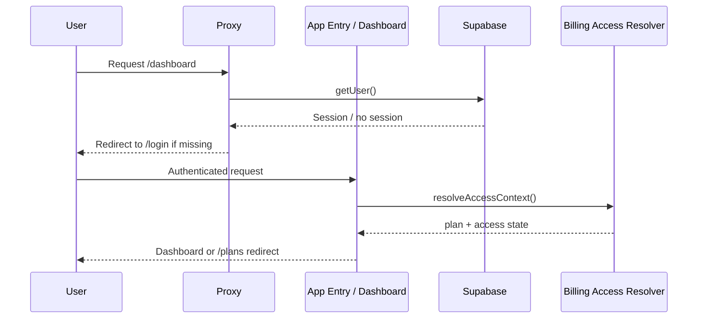

### Verdict

- **Strong**
- One of the more production-ready parts of the app

---

## 2.3 Billing & Access Gating - 84/100

### Strengths

- access state normalization and fallback logic are centralized in [billing-server.ts](/C:/Users/ADMIN/Desktop/New%20folder%20(2)/nextstop.ai-web/src/lib/billing-server.ts)
- trial expiry synchronization exists
- dashboard access gating is handled server-side
- profile/subscription fallback behavior reduces schema fragility

### Risks

- needs stronger automated verification around:
  - expired trials
  - paid-but-expiring states
  - webhook-driven subscription updates

### Billing Verdict

- **Launch-ready with smoke testing**

---

## 2.4 Google Integration - 82/100

### What improved

- stale-token handling now lives in [google-workspace.ts](/C:/Users/ADMIN/Desktop/New%20folder%20(2)/nextstop.ai-web/src/lib/google-workspace.ts)
- Google 401s no longer need to hard-fail the overview route
- refresh-token recovery is supported when:
  - `GOOGLE_CLIENT_ID`
  - `GOOGLE_CLIENT_SECRET`
  are present
- reconnect-required state is now part of the intended runtime behavior

### Flow Diagram

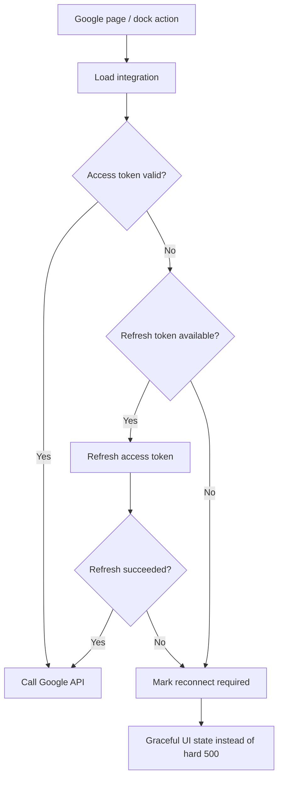

### UI Sketch

```text
+----------------------------------------------------------------------------------+
| Google Workspace                                              [Reconnect Google] |
| Status: Reconnect required                                                    |
| Your Google session expired. Reconnect to create Meets or read calendars.     |
|                                                                                |
| [Reconnect] [Refresh workspace]                                                |
+----------------------------------------------------------------------------------+
```

### Risks

- real production OAuth consent settings still need operator validation
- refresh-token support depends on provider returning refresh tokens consistently

### Verdict

- **Good**
- Production-safe if provider envs and Google console settings are correct

---

## 2.5 Notion Integration - 79/100

### What improved

- Notion now uses a local workspace-owned broker path instead of relying on undeployed Supabase functions
- connection, callback, destination loading, destination selection, and export all live in:
  - [notion-workspace.ts](/C:/Users/ADMIN/Desktop/New%20folder%20(2)/nextstop.ai-web/src/lib/notion-workspace.ts)
  - [connect route](/C:/Users/ADMIN/Desktop/New%20folder%20(2)/nextstop.ai-web/src/app/api/workspace/notion/connect/route.ts)
  - [callback route](/C:/Users/ADMIN/Desktop/New%20folder%20(2)/nextstop.ai-web/src/app/api/workspace/notion/callback/route.ts)
  - [destinations route](/C:/Users/ADMIN/Desktop/New%20folder%20(2)/nextstop.ai-web/src/app/api/workspace/notion/destinations/route.ts)
  - [select route](/C:/Users/ADMIN/Desktop/New%20folder%20(2)/nextstop.ai-web/src/app/api/workspace/notion/destinations/select/route.ts)

### Flow Diagram

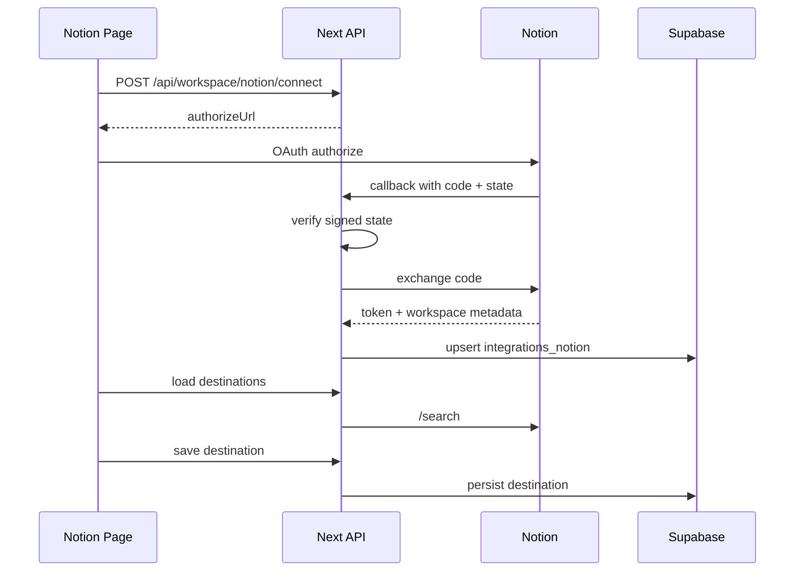

### UI Sketch

```text
+----------------------------------------------------------------------------------+
| Notion Export Workspace                                                          |
| Status: Connected / Destination needed / Reconnect required                      |
|                                                                                  |
| Available destinations                                                           |
| [ Product Notes Page (page)                v ]                                   |
|                                                                                  |
| [Save destination] [Refresh destinations] [Reconnect] [Disconnect]              |
|                                                                                  |
| Current destination: Product Notes Page                                          |
+----------------------------------------------------------------------------------+
```

### Risks

- Notion redirect URI mismatch is still the most likely real-world launch failure
- token refresh is not as mature as Google's flow
- the export UX is solid but not deeply instrumented

### Verdict

- **Good enough for launch**
- Needs exact dashboard config and live smoke validation

---

## 2.6 Capture Reliability - 74/100

### What improved

- capture state is now no longer purely transient in the UI
- [WorkspaceCaptureIsland.tsx](/C:/Users/ADMIN/Desktop/New%20folder%20(2)/nextstop.ai-web/src/components/workspace/WorkspaceCaptureIsland.tsx) now includes:
  - explicit failed state
  - retry finalize action
  - discard local session action
  - local persisted recovery hints across refresh
  - better messaging for track-share endings and failed finalization

### Capture State Diagram

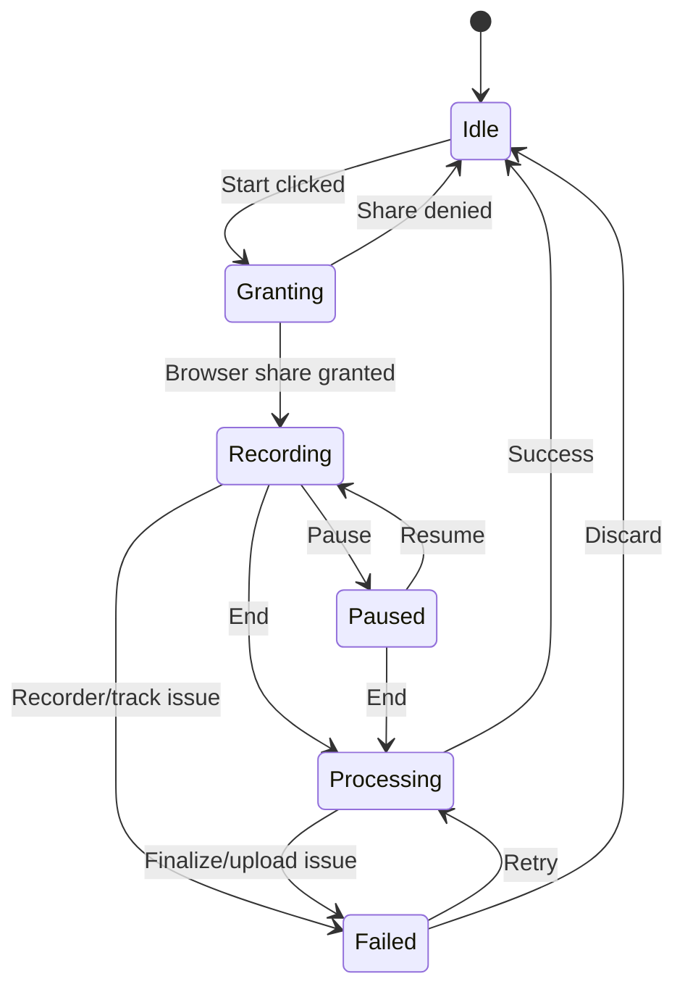

### UI Sketch

```text
Collapsed:
[logo]

Expanded:
+----------------------+
| [logo]               |
| Session live         |
|                      |
| [ Google Meet ]      |
| [ Start ]            |
| [ Pause ]            |
| [ End ]              |
| [ Notion ]           |
|                      |
| Tab shared           |
| Mic live             |
| 12:44                |
|                      |
| Failed? [Retry]      |
|         [Discard]    |
+----------------------+
```

### Remaining weaknesses

- browser capture still cannot truly resume media recording after refresh
- recovery is UX-level, not full media-level session continuation
- one active session per app tab remains the supported model

### Verdict

- **Acceptable for launch**
- This is the main place where real browser QA matters tonight

---

## 2.7 Transcript Lifecycle Safety - 78/100

### Problem solved

The old model was:

- transcript stored only in server memory
- review UI assumed download would work
- behavior would be unpredictable in production/serverless

### Current model

- transcript remains non-durable
- transcript availability is now explicit
- production can disable transcript downloads entirely
- transcript retention is now environment-driven

### Transcript Lifecycle Diagram

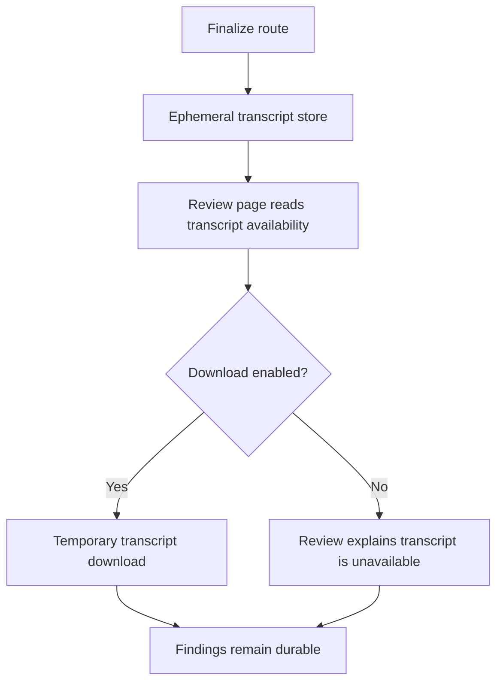

### Production Recommendation

For tonight:

- safest production value:
  - `TRANSCRIPT_STORAGE_MODE=disabled`

If you deliberately want temporary transcript access tonight:

- `TRANSCRIPT_STORAGE_MODE=memory`
- `ALLOW_MEMORY_TRANSCRIPT_DOWNLOADS_IN_PRODUCTION=true`

This is acceptable only if you understand it remains single-instance and ephemeral.

### Verdict

- **Good with explicit operator choice**
- No longer an implicit production landmine

---

## 2.8 Library / Review / Export UX - 83/100

### Strengths

- unified Library exists for scheduled and captured meetings
- Review page includes:
  - findings summary
  - PDF export
  - email draft
  - transcript access state
  - Notion export
  - export history
- stale placeholder copy and encoding artifacts have been cleaned up

### Library State Diagram

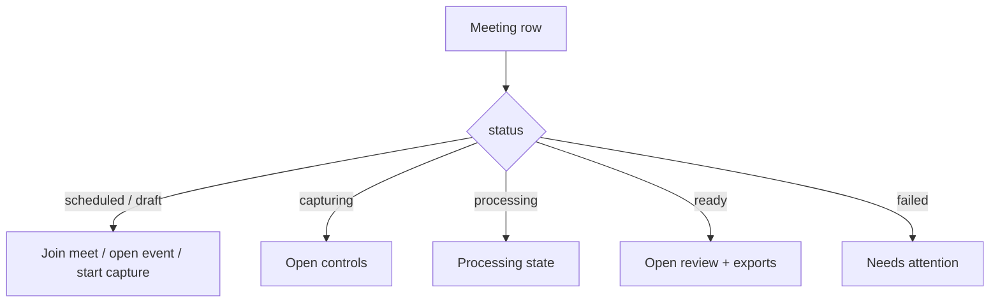

### UI Sketches

```text
Library Card: Scheduled Google Meeting
+----------------------------------------------------------------------------------+
| Product Review                          [Scheduled] [Google Meet]                |
| Mar 24, 4:00 PM                                                              >  |
| Meet created. Capture it when the meeting starts.                               |
| [Join Meet] [Open Event] [Start Capture]                                        |
+----------------------------------------------------------------------------------+

Library Card: Ready Meeting
+----------------------------------------------------------------------------------+
| Candidate Interview                     [Ready] [Browser Tab]                    |
| Mar 21, 6:10 PM                                                              >  |
| Strong alignment on backend ownership and API design...                         |
| Exports: Notion success | PDF ready                                             |
+----------------------------------------------------------------------------------+
```

### Risks

- export history is useful but still not deeply descriptive
- transcript button behavior depends on the chosen transcript mode

### Verdict

- **Strong**

---

## 2.9 Logging, Monitoring, and Operational Visibility - 70/100

### Strengths

- unsafe internal errors are not leaked to users
- context-specific server logging exists in failure paths
- readiness endpoint now exists

### Current weakness

- this app still does not have full structured production telemetry
- no Sentry/Datadog/OpenTelemetry-grade visibility is integrated here
- log events are informative but not centrally modeled

### Monitoring Diagram

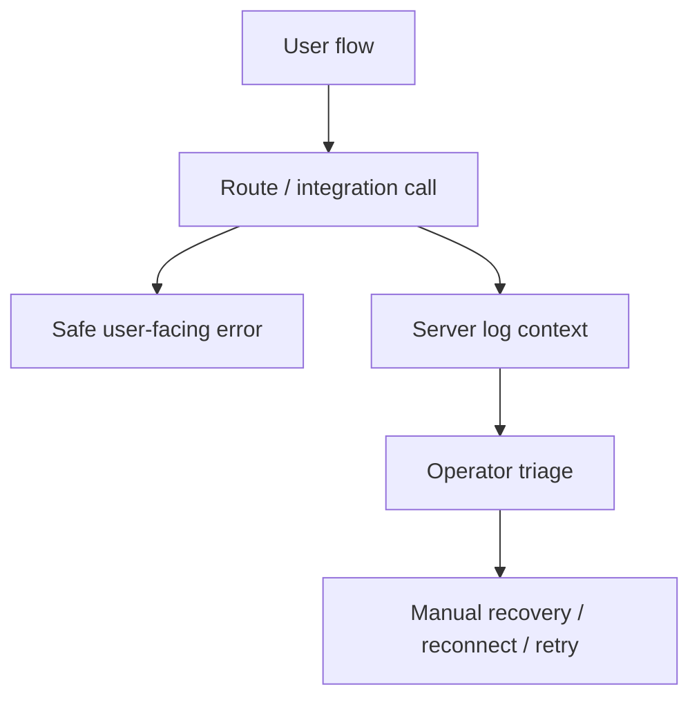

### Verdict

- **Serviceable tonight**
- should be upgraded after launch

---

## 2.10 Deployment & Configuration - 88/100

### What is now in place

- central env/config helper at [env.ts](/C:/Users/ADMIN/Desktop/New%20folder%20(2)/nextstop.ai-web/src/lib/env.ts)
- readiness route at [readiness route](/C:/Users/ADMIN/Desktop/New%20folder%20(2)/nextstop.ai-web/src/app/api/health/readiness/route.ts)
- updated [.env.example](/C:/Users/ADMIN/Desktop/New%20folder%20(2)/nextstop.ai-web/.env.example)
- rewritten [README.md](/C:/Users/ADMIN/Desktop/New%20folder%20(2)/nextstop.ai-web/README.md)
- release checklist in [production-runbook.md](/C:/Users/ADMIN/Desktop/New%20folder%20(2)/nextstop.ai-web/docs/production-runbook.md)

### Deployment Readiness Diagram

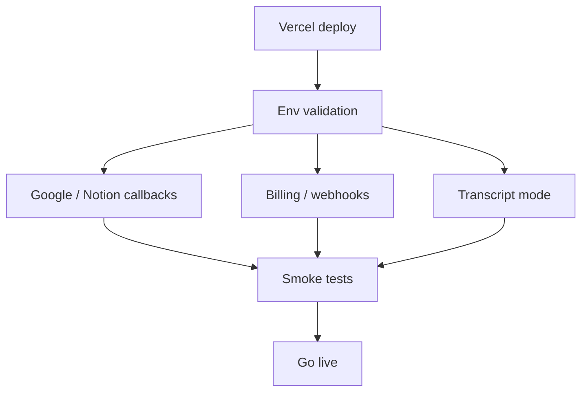

### Verdict

- **Strong**
- probably the most improved category in this pass

---

## 2.11 Testing & Verification - 62/100

### What is good

- current codebase passes:
  - `npx tsc --noEmit`
  - `npm run lint`
  - `npm run build`
- we validated the integrated route surface after the production hardening pass

### What is still missing

- no deep automated e2e suite for:
  - Google connect/reconnect
  - Notion connect/destination/export
  - capture start/pause/end/retry
  - transcript mode differences
- production smoke testing is still partly manual

### Verdict

- **This is the weakest launch category**
- launch is still viable tonight, but only with deliberate smoke testing

---

## 2.12 Documentation & Launch Operations - 87/100

### Strengths

- repo no longer has a template README
- launch/runbook documentation exists
- env surface is documented
- transcript mode is explicitly documented

### Verdict

- **Strong**

---

## 3. Strengths Since the Hardening Pass

| Area | Before | Now |
|---|---|---|
| Env/runtime handling | scattered | centralized |
| Google expired token behavior | raw failures possible | reconnect/refresh-aware |
| Notion connect model | fragmented and misleading | local broker flow |
| Capture recovery | reset-prone | retry/discard recovery model |
| Transcript production behavior | unsafe implicit memory-only | explicit bounded policy |
| Review UX | transcript/export ambiguity | explicit availability state |
| Launch docs | default README | real production docs |
| Legacy paths | conflicting old components remained | retired |

---

## 4. Launch Blockers vs Launch Checks

## 4.1 Hard blockers

These must be correct before launch:

1. Vercel env variables must be set correctly
2. Google OAuth redirect URIs must match live config
3. Notion redirect URI must match live config
4. Transcript mode must be intentionally chosen
5. Supabase service role key must exist in server env only

## 4.2 Soft risks

These are not blockers, but they remain meaningful:

1. no deep automated e2e coverage
2. limited structured monitoring
3. browser capture can still fail for user-environment reasons
4. transcript temporary-download semantics may confuse some users if not communicated clearly

---

## 5. Final Launch Recommendation

> [!IMPORTANT]
> **NextStop Web is ready for production tonight, with operator validation.**

### Go-Live Conditions

Launch if all of the following are true:

- `npm run build` passes on the deployment branch
- `npm run lint` passes on the deployment branch
- `/api/health/readiness` is healthy after deployment
- Google connect/reconnect is smoke-tested
- Notion connect/save destination/export is smoke-tested
- capture start/end and Library/Review path are smoke-tested
- billing-gated access is smoke-tested
- transcript mode is intentionally set, not left accidental

### Recommended Transcript Mode Tonight

- **Recommended**: `TRANSCRIPT_STORAGE_MODE=disabled`

This gives the safest production behavior while keeping findings durable and preventing misleading transcript guarantees.

---

## 6. Immediate Post-Launch Priorities

These are the best next steps after tonight's release:

1. Add end-to-end tests for:
   - Google connect/reconnect
   - Notion connect/destination/export
   - capture flow
   - transcript-mode variants
2. Add structured production monitoring
3. Improve multi-instance-safe transcript delivery if transcript download remains a product requirement
4. Harden capture resilience further for refresh/browser interruptions
5. Move into the separate AI/transcription quality phase

---

## 7. Final Score Summary

```text
Overall Readiness: 82/100

Security......................... 80
Authentication & AuthZ........... 86
Billing & Access Gating.......... 84
Google Integration............... 82
Notion Integration............... 79
Capture Reliability.............. 74
Transcript Lifecycle Safety...... 78
Library / Review / Export........ 83
Logging & Monitoring............. 70
Deployment & Configuration....... 88
Testing & Verification........... 62
Documentation & Operations....... 87
```

### Final Interpretation

- Product shell: **ready**
- Integrations: **ready with operator verification**
- Capture runtime: **good enough, still the highest UX risk area**
- Ops/deployment: **ready**
- AI/transcription improvements: **intentionally deferred**

---

## Appendix A. Weighted Readiness Methodology

This report does not treat every category equally. The weights reflect the launch risk profile of this specific application:

- categories with direct launch-blocking potential such as security, auth, capture runtime, and deployment carry more weight
- categories like documentation matter, but do not outweigh hard runtime risks
- AI and transcription quality are intentionally excluded, so the score focuses on the non-AI product shell

### Weighting Diagram

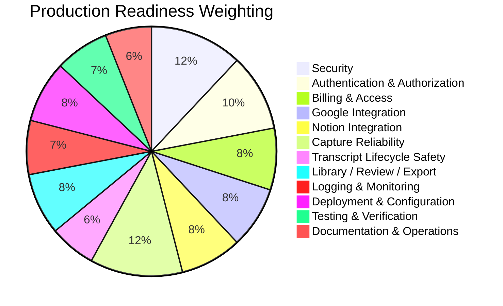

### Scoring Rubric

| Band | Meaning | Launch implication |
|---|---|---|
| 90-100 | Excellent | Very low launch concern |
| 80-89 | Strong | Production-ready with normal operator care |
| 70-79 | Good | Launchable with explicit caution |
| 60-69 | Acceptable | Launchable only with disciplined manual checks |
| Below 60 | Weak | Should block or significantly delay launch |

---

## Appendix B. Launch Gates, No-Go Conditions, and Rollback Triggers

### Go-Live Gates

All of the following should be true before opening the app to production users:

1. `npm run build` passes on the deployment commit
2. `npm run lint` passes on the deployment commit
3. `GET /api/health/readiness` reports healthy or expected-safe warnings only
4. Google connect and Google Meet creation succeed in production
5. Notion connect, destination load, and destination save succeed in production
6. Capture can start, pause, end, and open Review successfully
7. At least one PDF export succeeds
8. Transcript mode is intentionally set for production

### No-Go Conditions

Do not launch if any of these are true:

- Google or Notion OAuth callback settings are still uncertain
- billing gating is routing users incorrectly
- capture cannot reliably complete one end-to-end run
- the readiness endpoint shows missing critical env configuration
- transcript mode is unintentional or unknown

### Rollback Triggers

Rollback the first live deployment if any of these appear after go-live:

- provider connect flows consistently fail for valid accounts
- capture finalize repeatedly fails for clean browser sessions
- review or export routes begin returning server errors
- billing-gated users are getting into the workspace incorrectly

### Go / No-Go Diagram

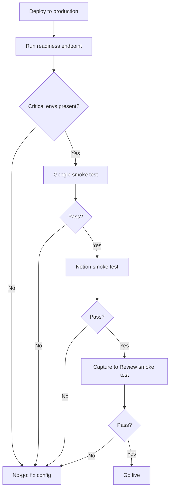

---

## Appendix C. Detailed UI Readiness Sketches

### C.1 Dashboard and Right-Side Capture Dock

```text
+--------------------------------------------------------------------------------------------------+
| Sidebar                           | Main workspace area                         | Action rail    |
|                                   |                                             |                |
| Dashboard                         | Header cards / library / review            | [logo]         |
| Library                           |                                             | [Google Meet]  |
| Google                            |                                             | [Start]        |
| Notion                            |                                             | [Pause]        |
| Settings                          |                                             | [End]          |
|                                   |                                             | [Notion]       |
|                                   |                                             | Tab shared     |
|                                   |                                             | Mic live       |
|                                   |                                             | 12:44          |
+--------------------------------------------------------------------------------------------------+
```

### C.2 Google Reconnect Page State

```text
+----------------------------------------------------------------------------------+
| Google Workspace                                              [Reconnect Google] |
| Status: Reconnect required                                                      |
|                                                                                  |
| Your Google session has expired or become invalid. Reconnect to resume          |
| Meet creation, event scheduling, and calendar reads.                            |
|                                                                                  |
| [Reconnect] [Refresh workspace]                                                  |
+----------------------------------------------------------------------------------+
```

### C.3 Notion Destination-Selection State

```text
+----------------------------------------------------------------------------------+
| Notion Export Workspace                                                          |
| Status: Connected, destination needed                                            |
|                                                                                  |
| Available destinations                                                           |
| [ Product Notes Page                         v ]                                  |
|                                                                                  |
| Current destination: Not selected                                                |
|                                                                                  |
| [Save destination] [Refresh destinations] [Reconnect] [Disconnect]              |
+----------------------------------------------------------------------------------+
```

### C.4 Review Page Transcript States

```text
Transcript available:
+--------------------------------------------------------------+
| Transcript                                                   |
| Available temporarily for download                           |
| Expires after configured retention window                    |
| [Download transcript]                                        |
+--------------------------------------------------------------+

Transcript unavailable:
+--------------------------------------------------------------+
| Transcript                                                   |
| Transcript download is disabled or expired                   |
| Findings remain available permanently                        |
+--------------------------------------------------------------+
```

---

## Appendix D. Priority Matrix for Remaining Non-AI Work

| Priority | Area | Why it matters | When |
|---|---|---|---|
| P0 | Production env validation | Wrong envs can block the whole launch | Before launch |
| P0 | OAuth callback verification | Provider flows depend on exact URL matching | Before launch |
| P0 | Capture smoke test | Highest UX-risk area | Before launch |
| P0 | Transcript mode choice | Prevents accidental production behavior | Before launch |
| P1 | Add E2E tests | Largest reliability multiplier | Next sprint |
| P1 | Structured monitoring | Needed for faster incident response | Next sprint |
| P1 | Capture resilience improvements | Highest user-risk area after launch | Next sprint |
| P2 | Multi-instance transcript strategy | Needed only if transcript download becomes a product promise | Later |
| P2 | Formal security hardening | Improves maturity beyond launch baseline | Later |

### Priority Diagram

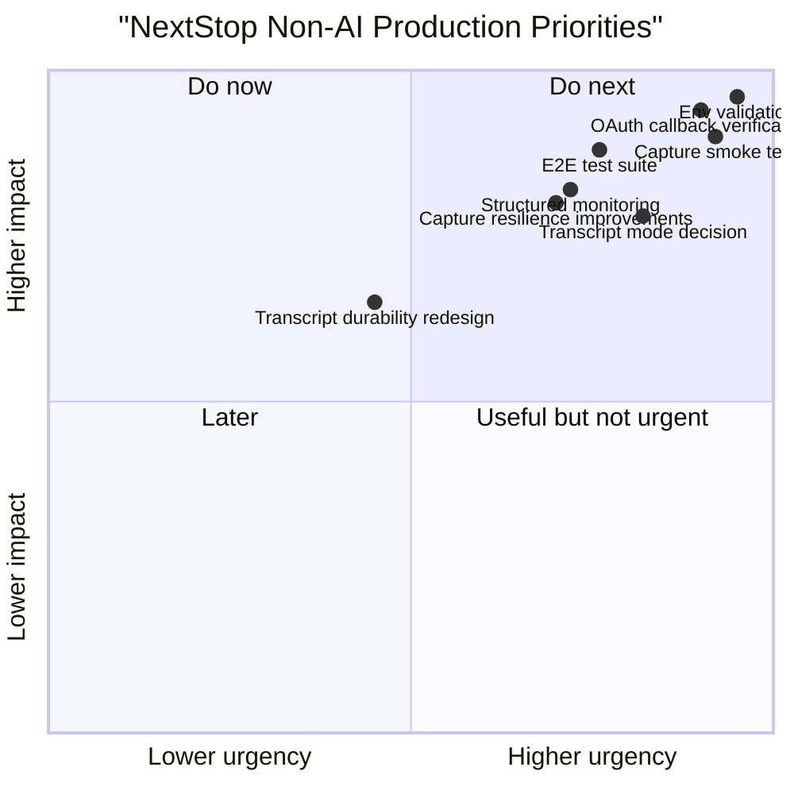

---

## Appendix E. Evidence Map by File

| Readiness area | Primary file references |
|---|---|
| Runtime config | [env.ts](/C:/Users/ADMIN/Desktop/New%20folder%20(2)/nextstop.ai-web/src/lib/env.ts) |
| Readiness checks | [readiness route](/C:/Users/ADMIN/Desktop/New%20folder%20(2)/nextstop.ai-web/src/app/api/health/readiness/route.ts) |
| Google resilience | [google-workspace.ts](/C:/Users/ADMIN/Desktop/New%20folder%20(2)/nextstop.ai-web/src/lib/google-workspace.ts) |
| Notion broker flow | [notion-workspace.ts](/C:/Users/ADMIN/Desktop/New%20folder%20(2)/nextstop.ai-web/src/lib/notion-workspace.ts) |
| Capture recovery | [WorkspaceCaptureIsland.tsx](/C:/Users/ADMIN/Desktop/New%20folder%20(2)/nextstop.ai-web/src/components/workspace/WorkspaceCaptureIsland.tsx) |
| Review and transcript policy | [MeetingReview.tsx](/C:/Users/ADMIN/Desktop/New%20folder%20(2)/nextstop.ai-web/src/components/workspace/MeetingReview.tsx) |
| Runbook | [production-runbook.md](/C:/Users/ADMIN/Desktop/New%20folder%20(2)/nextstop.ai-web/docs/production-runbook.md) |
| App overview and env docs | [README.md](/C:/Users/ADMIN/Desktop/New%20folder%20(2)/nextstop.ai-web/README.md) |

---

*Report generated from the current NextStop Web codebase after the non-AI production-hardening pass on March 21, 2026.*

