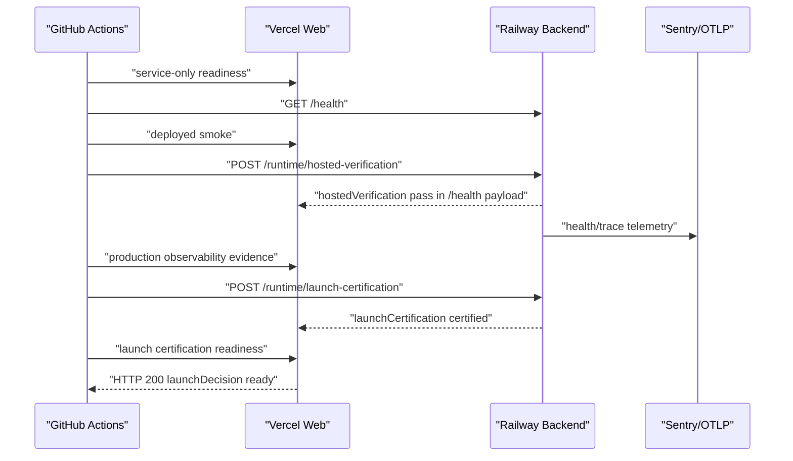

# Release Verification Checklist - 2026-04-28

This checklist closes the production evidence findings from `web-production-readiness-security-audit-2026-04-28.md`.

## Required GitHub Actions Configuration

Repository variables:

- `PRODUCTION_BASE_URL`: production Vercel web URL.
- `BACKEND_HEALTH_URL`: Railway backend `/health` URL.

Repository secret:

- `AI_CORE_SHARED_SECRET`: same value configured on the Railway backend service.

The `Post Deploy Verify` workflow is intentionally strict. If production verification has a base URL but lacks backend publish configuration, the `launch-summary` job fails with a clear preflight error instead of silently passing without runtime evidence.

## Required Railway Backend Configuration

Set these service variables before production certification:

- `NODE_ENV=production`
- `SENTRY_ENVIRONMENT=production`
- `SENTRY_DSN=<secret>`
- `SENTRY_RELEASE=<commit-sha-or-release-version>`
- `SENTRY_TRACES_SAMPLE_RATE=0.05`
- `OTEL_EXPORTER_OTLP_ENDPOINT=<collector-url>/v1/traces`
- `OTEL_EXPORTER_OTLP_HEADERS=<provider-auth-header-if-required>`
- `AI_CORE_SHARED_SECRET=<same-value-as-github-secret>`
- `RAZORPAY_WEBHOOK_MAX_EVENT_AGE_SECONDS=600` unless the default 10-minute replay window is intentionally kept.

Redeploy or restart the backend after changing variables.

## Post-Deploy Certification Flow

## Evidence To Archive

- GitHub Actions run URL.
- `readiness-payload` artifact.
- `backend-health-payload` artifact.
- `hosted-verification-payload` artifact.
- `launch-certification-prerequisites` artifact.
- `launch-certification-payload` artifact.
- Sentry transaction/event screenshot or link.
- OTLP trace/span screenshot or link.
- Provider security evidence checklist artifact.
- Production canary run URL.
- `production-security-verification.json` artifact from the Production Canary workflow.
- Source-map exposure verification note.
- Secret rotation verification note for `AI_CORE_SHARED_SECRET`.
- Legal approval or legal risk acceptance reference.

## Passing Criteria

- CI `static-checks`, `unit-and-route-tests`, and `browser-smoke` pass.
- Security `secret-scan`, `dependency-audit`, and `codeql` pass.
- Post Deploy Verify `readiness-check`, `backend-health`, `preview-smoke`, and `launch-summary` pass.
- Web readiness returns HTTP 200 with `launchDecision: "ready"`.
- `productionEvidenceChecks` marks Hosted verification, Production observability, and Launch certification as `pass`.
- Provider WAF/rate-limit evidence has an owner, proof link, or explicit accepted risk.
- Production canary has passed at least once after the release deploy.
- Production security canary shows required headers present, no public source maps exposed, no unexpected readiness blockers, and healthy backend worker state when `BACKEND_HEALTH_URL` is configured.
