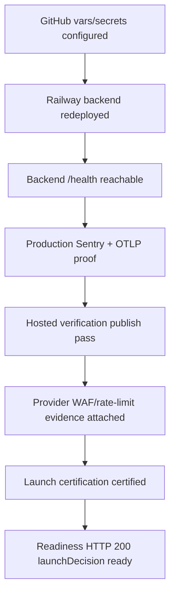

# Security Certification Evidence Plan - 2026-04-29

This document tracks the remaining production security evidence required after the GitHub `BACKEND_HEALTH_URL` variable and `AI_CORE_SHARED_SECRET` secret have been configured, and after the matching `AI_CORE_SHARED_SECRET` has been configured on the Railway backend.

## Certification Evidence Flow



## Remaining Operator Actions

| Area | Required action | Evidence to archive | Status |
|---|---|---|---|
| Railway backend runtime | Redeploy or restart backend after secret/env changes. | Railway deployment/log link showing healthy startup. | Pending live verification |
| Production observability | Configure `NODE_ENV`, Sentry, release, trace sample rate, OTLP endpoint, and OTLP headers. | Backend `/health` payload plus Sentry event and OTLP span screenshot/link. | Pending live verification |
| Hosted verification | Run `Post Deploy Verify` with `certify_launch=false`. | `hosted-verification-payload` artifact and backend `/health` reflection. | Pending workflow run |
| Launch certification | Run `Post Deploy Verify` with `certify_launch=true` only after prerequisites pass. | `launch-certification-prerequisites` and `launch-certification-payload` artifacts. | Pending workflow run |
| Provider WAF/rate limits | Capture Vercel, Railway, Supabase, Razorpay, and Sentry/OTLP controls. | `provider-security-evidence-checklist` artifact plus screenshots/links. | Pending operator proof |
| Source maps | Confirm public production browser source maps are disabled; optionally upload private maps to Sentry. | Vercel build/deployment proof or Sentry release artifact proof. | Repo policy added |
| Secret rotation | Practice `AI_CORE_SHARED_SECRET` rotation before broad launch. | Rotation date, owner, changed systems, verification run. | Pending operator proof |
| Synthetic canaries | Enable scheduled `Production Canary` workflow. | Daily workflow run artifacts. | Workflow added |

## Production Observability Checklist

Set these Railway variables before launch certification:

```text
NODE_ENV=production
SENTRY_ENVIRONMENT=production
SENTRY_DSN=<secret>
SENTRY_RELEASE=<commit-sha-or-release-version>
SENTRY_TRACES_SAMPLE_RATE=0.05
OTEL_EXPORTER_OTLP_ENDPOINT=<collector-url>/v1/traces
OTEL_EXPORTER_OTLP_HEADERS=<provider-auth-header-if-required>
AI_CORE_SHARED_SECRET=<same-value-as-github-secret>
```

After redeploy:

1. Request `https://<railway-backend-domain>/health`.
2. Verify `observability.environment` is `production`.
3. Verify `observability.sentryConfigured` is `true`.
4. Verify `observability.otlpConfigured` is `true`.
5. Confirm one Sentry event/transaction for the release.
6. Confirm one OTLP span/trace for the release.

## Provider Security Evidence Checklist

| Provider | Required proof | Notes |
|---|---|---|
| Vercel | Firewall/WAF, bot/DDoS protection, and any path-specific throttles for `/api/*`, auth, billing, and readiness. | If native rate-limit features are not available on the current plan, record compensating controls. |
| Railway | Public service URL, expected exposed port, `/health` route, resource limits, restart policy, and request/connection controls. | Backend should expose only the intended HTTP service. |
| Supabase | Auth abuse protections, redirect allowlist, enabled providers, and confirmation that service-role keys are server-only. | Public anon key is allowed client-side; service role is not. |
| Razorpay | Webhook signing secret, retry/failure dashboard, event ID visibility, and duplicate event controls. | Repo now rejects stale events when Razorpay supplies `created_at`. |
| Sentry/OTLP | Production ingestion proof and alerts for readiness blockers, webhook failures, queue stale/degraded state, and 5xx spikes. | Alert owners should be named in release notes. |

## Runtime Secret Rotation Drill

Practice this before broad launch for `AI_CORE_SHARED_SECRET`:

1. Generate a new high-entropy secret.
2. Update Railway backend `AI_CORE_SHARED_SECRET`.
3. Update GitHub Actions `AI_CORE_SHARED_SECRET`.
4. Redeploy/restart Railway backend.
5. Run `Post Deploy Verify` with `certify_launch=false`.
6. Confirm hosted verification publish succeeds.
7. Record the rotation date, owner, and workflow run.

Repeat equivalent provider-specific rotations for Supabase service role, Razorpay webhook secret, Sentry auth/DSN, OTLP headers, and OAuth client secrets on the launch schedule.

## Source Map Policy

- Public production browser source maps are disabled in `frontend/next.config.ts`.
- Source maps may be uploaded privately to Sentry only when `SENTRY_AUTH_TOKEN`, `SENTRY_ORG`, `SENTRY_PROJECT`, and release metadata are configured.
- Provider evidence should confirm production users cannot browse `.map` assets directly from the deployed Vercel URL.
- Sentry source map access should be limited to engineering operators who need production debugging access.

## Security Canaries

The `Production Canary` workflow runs daily and can also be dispatched manually. It checks:

- service-only readiness
- backend `/health` when `BACKEND_HEALTH_URL` is configured
- deployed homepage and login page smoke coverage
- production security headers
- public source-map exposure
- unexpected readiness blockers
- backend worker/cleanup health when `BACKEND_HEALTH_URL` is configured

This workflow is intentionally not allowed to publish hosted verification or launch certification.

The production security canary can also be run locally against the deployed application:

```powershell
cd C:\Users\ADMIN\Desktop\nextstop.ai\nextstop.ai-web
npm run verify:production-security -- https://<production-web-domain> --backend-health-url=https://<railway-backend>/health --output=production-security-verification.json
```

Archive the generated `production-security-verification.json` from GitHub Actions rather than committing raw production payloads into the repository.

## Final Certification Commands

```powershell
cd C:\Users\ADMIN\Desktop\nextstop.ai\nextstop.ai-web\frontend
npm run test:readiness -- https://<production-web-domain> --production-observability
npm run test:readiness -- https://<production-web-domain> --hosted-verification
npm run test:readiness -- https://<production-web-domain> --launch-certification
```

Passing production certification means readiness returns HTTP `200`, `launchDecision` is `ready`, and Hosted verification, Production observability, and Launch certification are all `pass`.
