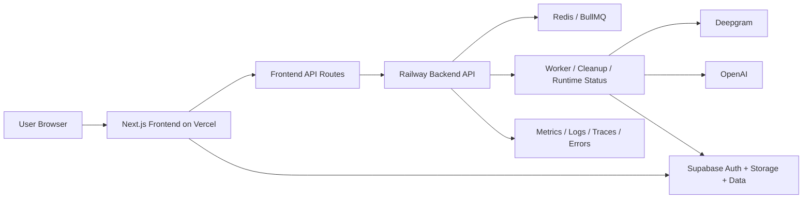
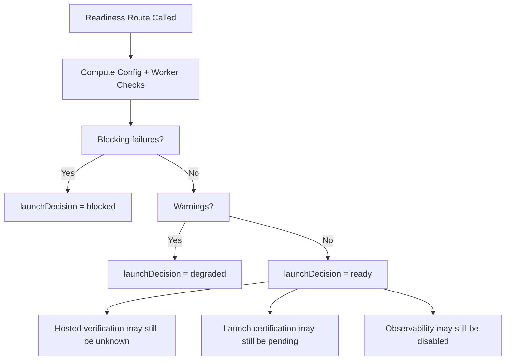
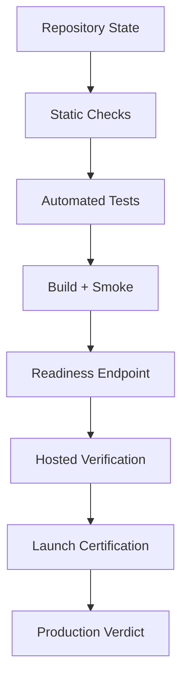
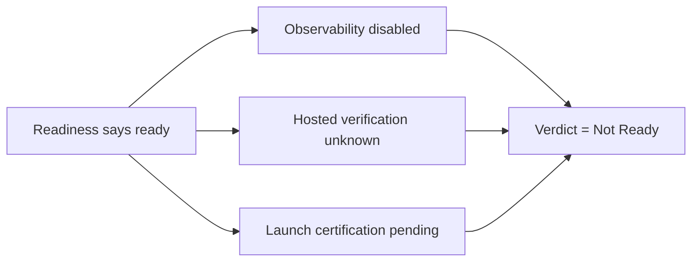

# NextStop.ai Web Production Readiness Audit
## Report Identity
- Report name: Web Production Readiness Audit.
- Project under review: NextStop.ai Web.
- Repository path: `C:\Users\ADMIN\Desktop\nextstop.ai\nextstop.ai-web`.
- Audit date: 2026-04-23.
- Auditor: Codex.
- Audit mode: evidence-based repository and runtime review.
- Requested deliverable: a detailed Markdown production readiness report.
- Requested minimum length: 2000 non-code, non-Mermaid lines.
- Primary deployment surfaces reviewed: Vercel-hosted frontend and Railway-hosted backend.
- Supporting operational surfaces reviewed: GitHub Actions, Supabase, Redis, observability wiring, local stack orchestration.
- Current branch at audit time: `main`.
- Worktree state at audit time: dirty.
- Review posture: launch-readiness evaluation, not feature implementation.
- Mutation policy followed: no application code changed.
- Repository mutation performed for this request: creation of this report file only.
- Launch verdict rubric used in this report: `Ready`, `Ready with Conditions`, `Not Ready`.
- Final verdict reached by this audit: `Not Ready`.
- Confidence in verdict: high for current evidence set, medium for untested marketing regressions, medium for live non-public infrastructure details.
- Audience: project owner, release decision-maker, engineering maintainer, operations owner, and future reviewers.
- Tone of this report: direct, production-oriented, and action-prioritized.

## Title Page
- Product: NextStop.ai Web.
- Surface reviewed: full web runtime and current uncommitted web-facing changes.
- Release question: is the main web project ready to be put into production right now.
- Short answer: the system has several strong foundations, but it is not ready for an unqualified production sign-off.
- Reason for caution: passing local gates do not fully prove the changed surface, and several critical production controls are either incomplete or not evidenced as active.
- Most important headline: the application can build, lint, typecheck, and pass the current automated suites, but those suites do not yet justify a launch verdict of `Ready`.
- Most important blocker class: production controls are weaker than the app’s own readiness endpoint suggests.
- Most important change-specific risk: marketing and pricing changes are materially visible to users but lack direct test coverage.
- Most important operational risk: live readiness currently reports `ready` while hosted verification, launch certification, and observability signals remain incomplete.
- Most important security/compliance risk: legal/compliance surface is thin for a public production web product.
- Most important dependency risk: `npm audit --omit=dev --audit-level=high` is not clean.
- Most important repository hygiene risk: generated local artifacts are accumulating outside ignore rules for the changed frontend workspace.

## Executive Assessment
- This repository shows strong engineering intent toward production.
- The monorepo has a clear separation between `frontend/` and `backend/`.
- CI is present and materially useful.
- A public readiness endpoint exists.
- Local smoke coverage exists.
- Deployed smoke coverage exists.
- Security scanning workflows exist.
- Observability code exists in both frontend and backend directions.
- The backend includes queue, worker, cleanup, and runtime-status concepts that go beyond hobby-project maturity.
- The project documentation is directionally production-aware.
- The deployment model is understandable.
- The release process has more discipline than many early-stage web projects.
- Those strengths matter.
- They also make the remaining gaps easier to define.
- The main problem is not total absence of quality gates.
- The main problem is mismatch between the apparent readiness story and the actual evidence depth.
- The recent worktree changes are mostly marketing-facing and user-visible.
- The current automated checks overwhelmingly exercise workspace and app-flow internals rather than the changed marketing surface.
- The public readiness endpoint reports `launchDecision: ready`.
- That result is overly optimistic relative to the actual state of production controls.
- The readiness logic currently does not fail or degrade on missing hosted verification.
- The readiness logic currently does not fail or degrade on missing launch certification.
- The readiness logic currently does not fail or degrade on missing Sentry.
- The readiness logic currently does not fail or degrade on missing OTLP export.
- The deployed readiness payload currently reports observability environment `development`.
- The deployed readiness payload currently reports `sentryConfigured: false`.
- The deployed readiness payload currently reports `otlpConfigured: false`.
- The deployed readiness payload currently reports hosted verification status `unknown`.
- The deployed readiness payload currently reports launch certification status `pending`.
- A system with those live characteristics should not be treated as fully production-ready.
- The frontend baseline checks are good.
- The backend baseline checks are much thinner.
- The frontend test coverage is broad enough to catch some regressions.
- The frontend test coverage is not broad enough to certify a launch across all public and internal routes.
- The backend tests are notably sparse.
- The dependency audit is not clean.
- Repo hygiene is incomplete.
- Legal/compliance navigation is underdeveloped.
- Marketing copy truthfulness needs closer review where desktop and web responsibilities are being reframed.
- None of these items mean the product is broken.
- They do mean the release evidence is incomplete.
- A careful owner should hold launch certification until the blockers in this report are addressed.
- If the goal is “can I keep iterating internally or on preview environments,” the answer is yes.
- If the goal is “can I confidently call this production-ready for public launch,” the answer is no today.

## Overall Verdict
- Verdict: `Not Ready`.
- Readiness category: production-capable foundations with incomplete production proof.
- Risk posture: moderate to high.
- User-facing regression risk: moderate.
- Operational visibility risk: high.
- Security posture risk: moderate.
- Compliance/documentation risk: moderate.
- Test evidence sufficiency: insufficient for final release certification.
- Recommended immediate action: do not issue a final production launch certification today.
- Recommended short-term action: address blockers, strengthen the changed-surface verification, and rerun release evidence.
- Recommended decision phrase for stakeholders: “The platform is promising and partially hardened, but current evidence does not support a clean production sign-off.”

## Severity-Ranked Blockers
- Blocker 1: live readiness can return `ready` without active observability proof.
- Blocker 2: live readiness can return `ready` without hosted verification proof.
- Blocker 3: live readiness can return `ready` without launch certification proof.
- Blocker 4: dependency audit is not clean because `bullmq` pulls a vulnerable `uuid` version.
- Blocker 5: backend verification depth is too thin for a queue-and-worker production system.
- Blocker 6: current marketing and pricing changes are not directly covered by automated tests.
- Blocker 7: legal/compliance surface is incomplete for a public-facing production web experience.
- Blocker 8: repository hygiene is slipping around generated local artifacts.

## Launch Recommendation
- Do not approve a final production launch based on the current state.
- Continue using preview or controlled internal exposure if needed.
- Prioritize operational truthfulness over deployment momentum.
- Close the dependency audit issue or formally risk-accept it with rationale.
- Add direct verification for the modified marketing and pricing surface.
- Upgrade backend test depth beyond a single runtime-status test file.
- Make readiness gating reflect actual release requirements rather than configuration presence alone.
- Enable and confirm real production observability.
- Publish hosted verification and launch certification evidence before changing the final verdict.

## What Changed Recently
- The working tree contains uncommitted changes on `main`.
- The changed set is concentrated in `frontend` marketing components and local stack scripts.
- The marketing home composition changed substantially.
- Several below-fold sections were removed from the marketing home.
- A new `CoreFeaturesDeck` section is now used.
- A new `CtaSection` is now used.
- The navigation bar was restyled and restructured.
- The hero copy now positions the product as “Desktop + Web Meeting Intelligence.”
- The hero secondary CTA now reads `Open Web Dashboard`.
- That hero secondary CTA links to `/pricing`.
- Pricing copy was reframed to split web and desktop value more explicitly.
- The pricing cards were visually reworked.
- The testimonials section was heavily redesigned.
- The use-cases section was heavily redesigned.
- The FAQ and footer were simplified.
- The footer’s legal area was reduced.
- The root layout removed `overflow-x-hidden` from the HTML and body classes.
- Global CSS changed overflow handling to `clip`.
- Marketing transitions were simplified in the template.
- Local Docker startup logic was hardened to retry after a missing network error.
- Local Docker teardown was changed to include the observability profile.
- The net effect is a substantial user-visible marketing refresh plus a smaller local-ops improvement.
- The net testing effect is limited because the existing suites do not directly target these changed sections.

## Scope
- This audit covers the full web runtime.
- This audit covers `frontend/`.
- This audit covers `backend/`.
- This audit covers `.github/workflows`.
- This audit covers top-level deployment and local stack scripts.
- This audit covers the public production readiness surface.
- This audit covers the current dirty worktree relevant to the web project.
- This audit does not review the separate desktop repository in detail.
- This audit does not certify private third-party dashboards that were not accessible from the local repo.
- This audit does not validate secrets values themselves.
- This audit does not perform destructive or mutating operations.
- This audit does not rewrite source files, tests, or workflows.
- This audit is based on actual repository inspection and executed checks.

## Audit Questions
- Does the web project build cleanly.
- Does the web project typecheck cleanly.
- Does the web project lint cleanly.
- Do the current automated tests pass.
- Do the current automated tests actually prove the changed surface.
- Are the deployment workflows credible.
- Does the live runtime present evidence of real production readiness.
- Is the security posture acceptable for release.
- Is observability sufficiently configured and proven.
- Is repo hygiene good enough for ongoing production maintenance.
- Is the recent change set production-safe.
- Is there enough operational evidence to issue a final launch certification.

## Methodology
- The audit started with repository grounding.
- The review confirmed the target project path as `nextstop.ai-web`.
- The review identified the repo as a monorepo with root, `frontend`, and `backend`.
- The review inspected package manifests.
- The review inspected frontend configuration.
- The review inspected backend runtime files.
- The review inspected GitHub Actions workflows.
- The review inspected the current `git status`.
- The review inspected the recent `git log`.
- The review inspected the modified file set via `git diff`.
- The review inspected the live readiness endpoint.
- The review ran local non-mutating validation commands.
- The review ran deployed smoke validation.
- The review recorded both passing evidence and evidence gaps.
- The review treated green checks as necessary but not sufficient.
- The review prioritized correctness, security, operational truthfulness, and launch risk.

## Evidence Sources
- Source category: repository manifests.
- Source category: configuration files.
- Source category: workflow definitions.
- Source category: current worktree diff.
- Source category: local command results.
- Source category: live production HTTP responses.
- Source category: public readiness payload.
- Source category: deployed Playwright smoke results.
- Source category: code inspection of readiness logic.
- Source category: code inspection of observability status logic.
- Source category: code inspection of runtime-status storage logic.

## Commands Executed
- `npm run typecheck` in `frontend`.
- `npm run lint` in `frontend`.
- `npm run test -- --coverage` in `frontend`.
- `npm run build` in `frontend`.
- `npm run typecheck` in `backend`.
- `npm run test` in `backend`.
- `npm run test:repo-contract` in `frontend`.
- `npm run test:e2e -- tests/e2e/smoke.spec.ts` in `frontend`.
- `npm audit --omit=dev --audit-level=high` at repo root.
- deployed Playwright smoke against `https://next-stop-ai-web.vercel.app`.
- HTTP reachability checks for `/`, `/pricing`, `/login`.
- direct inspection of `/api/health/readiness`.

## Environment Baseline
- Repository root contains `.github`, `frontend`, `backend`, `ops`, `scripts`, Docker compose files, README, and lockfiles.
- Root package declares workspaces for `frontend` and `backend`.
- Root scripts focus on local stack orchestration and targeted dev helpers.
- Frontend package is a Next.js application.
- Backend package is a Node.js Fastify service.
- Frontend dependency stack includes Next 16, React 19, Supabase SSR, Sentry, OpenTelemetry, Playwright, Vitest, and Tailwind.
- Backend dependency stack includes Fastify, BullMQ, Redis, Supabase, Sentry, OpenTelemetry, and Prometheus client metrics.
- The repository contains an existing `.next` directory.
- The repository contains `node_modules`.
- The repository contains existing coverage artifacts.
- The repository also contains local output directories under `frontend` that are currently untracked.
- The README describes a Vercel frontend and Railway backend model.
- The README positions the project as production-oriented.
- The README also claims a production observability model.
- The live payload partially supports that claim in concept.
- The live payload does not currently support that claim in active telemetry configuration.

## Monorepo Shape
- Root role: orchestration and local stack management.
- Frontend role: product UI, route handling, auth-aware pages, readiness route, billing surface, workspace surface, marketing surface.
- Backend role: queue-backed AI API, worker state, runtime status, desktop sync support, health and metrics endpoints.
- Shared dependency reality: both surfaces depend on Supabase, release version conventions, and environment naming alignment.
- Shared operational risk: if the readiness story is inaccurate, both surfaces present a misleading release state.

## Deployment Topology Summary
- Frontend deployment target: Vercel.
- Backend deployment target: Railway.
- Data/auth/storage dependency: Supabase.
- Queue dependency: Redis.
- Billing dependency: Razorpay.
- Transcription dependency: Deepgram.
- AI analysis dependency: OpenAI.
- Monitoring intent: Sentry and OTLP/Grafana stack.
- Public readiness endpoint location: frontend app.
- Worker health source consumed by frontend readiness: backend runtime status snapshot.

## Architecture Overview
- The architecture is conceptually sound for a modern async web workflow.
- The browser interacts with the Next.js frontend.
- The frontend handles app routes and API routes.
- The frontend delegates async AI execution to the Railway backend in remote mode.
- The backend interacts with Redis-backed jobs.
- The backend tracks worker health and runtime state.
- Supabase supports auth, storage, and application data.
- Billing relies on Razorpay.
- Observability is intended to span metrics, logs, traces, and errors.
- The architecture is more serious than a simple CRUD marketing site.
- That seriousness raises the required audit bar.
- Queue-backed systems need stronger backend proof than ordinary pages do.
- Public readiness systems need stronger truthfulness than ordinary status pages do.

## Architecture Assessment
- Separation of concerns is generally clear.
- The frontend is not just static pages.
- The backend is not just a thin pass-through.
- Runtime status is an explicit concept.
- Health and metrics are explicit concepts.
- Cleanup is an explicit concept.
- Hosted verification and launch certification are explicit concepts.
- That is good engineering direction.
- The problem is that explicit concepts still require enforced gating.
- A concept being modeled is not the same thing as it being operationally decisive.

## Current Dirty Worktree Inventory
- Modified: `frontend/eslint.config.mjs`.
- Modified: `frontend/package.json`.
- Modified: `frontend/src/app/(marketing)/MarketingHome.tsx`.
- Modified: `frontend/src/app/(marketing)/pricing/page.tsx`.
- Modified: `frontend/src/app/(marketing)/template.tsx`.
- Modified: `frontend/src/app/globals.css`.
- Modified: `frontend/src/app/layout.tsx`.
- Modified: `frontend/src/components/FAQ.tsx`.
- Modified: `frontend/src/components/Footer.tsx`.
- Modified: `frontend/src/components/Hero.tsx`.
- Modified: `frontend/src/components/Navbar.tsx`.
- Modified: `frontend/src/components/Pricing.tsx`.
- Modified: `frontend/src/components/Testimonials.tsx`.
- Modified: `frontend/src/components/UseCases.tsx`.
- Modified: `scripts/down.mjs`.
- Modified: `scripts/up.mjs`.
- Untracked: `frontend/.playwright-cli/`.
- Untracked: `frontend/output/`.
- Untracked: `frontend/src/components/CoreFeaturesDeck.tsx`.
- Untracked: `frontend/src/components/CtaSection.tsx`.

## Recent Commits Context
- Recent commit reviewed: `120340c fix(ci): update repo contract for docs-free open source layout`.
- Recent commit reviewed: `fa9ebed docs(repo): rewrite README and tighten ignore rules for open-source cleanup v2`.
- Recent commit reviewed: `9501a27 docs(repo): rewrite README and tighten ignore rules for open-source cleanup`.
- Recent commit reviewed: `79b5e17 fix(actions): merge duplicate env block in post-deploy verify workflow`.
- Recent commit reviewed: `4965b1e fix(ci): sync workspace lockfile and repair post-deploy workflow`.
- Recent commit reviewed: `765c54e fix(ci): sync root workspace lockfile for observability dependencies`.
- Recent commit reviewed: `0d80e28 feat(observability): add production telemetry stack and full local startup`.
- Recent commit reviewed: `39412fa fix(ci): add missing backend vitest dependency for isolated typecheck`.
- Recent commit reviewed: `09532f5 fix(ci): unblock static checks repo contract`.
- Recent commit reviewed: `ca63d61 feat(web): harden durable meeting flows, ops readiness, and local auth`.
- Recent commit reviewed: `5a38b46 speed up dashboard routes and move ai execution fully onto railway`.
- Recent commit reviewed: `0846213 simplify review UI and harden capture/export production flow`.

## Change Inventory: MarketingHome
- The marketing home removed several previously lazy-loaded sections.
- Removed sections include `StatsBar`.
- Removed sections include `Features`.
- Removed sections include `MeetingLifecycle`.
- Removed sections include `PrivacyByDesign`.
- Removed sections include `HowItWorks`.
- Removed sections include `MeetingOutputs`.
- Removed sections include `WorkspaceSyncFlow`.
- Removed sections include `ModesComparison`.
- Added section `CoreFeaturesDeck`.
- Added section `CtaSection`.
- The page is now visually simpler in composition.
- The content density is lower.
- The messaging path is more focused.
- The removed sections may reduce explanatory depth.
- The removed privacy and workflow content may weaken trust-building on the homepage.
- This is especially relevant because the product makes strong local-first and secure-AI claims.
- The new composition should be reviewed for narrative completeness.
- No direct automated tests currently validate the new homepage composition.
- The current deployed smoke test does not assert these changed sections.
- Production risk from this file is moderate.

## Change Inventory: Pricing Page
- The pricing page copy now distinguishes web dashboard value from desktop app value more explicitly.
- Starter is now framed around web dashboard access.
- Pro is now framed around unlocking the desktop app.
- Team is now framed around desktop access for every seat.
- The pricing cards were restructured for more polished layout behavior.
- The page now imports `RollingPrice` from the shared pricing component.
- The visual structure of the popular plan changed materially.
- The primary CTA behavior was slightly adjusted in the lower-page CTA area.
- This change set affects conversion messaging.
- This change set affects user expectation management.
- This change set affects truthfulness of plan positioning.
- This change set should be reviewed against actual entitlements.
- This change set should be reviewed against billing flow behavior.
- This change set should be reviewed against onboarding flow behavior.
- No dedicated pricing tests currently exist in the discovered suite.
- The deployed smoke suite does not assert pricing page semantics.
- Production risk from this file is moderate to high because it directly influences acquisition and plan selection.

## Change Inventory: Marketing Template
- The marketing template removed vertical motion on entry.
- The template now fades only.
- The template forces `transform: none`.
- This likely reduces subtle motion-induced layout concerns.
- This likely reduces visual flourish.
- This is a low-risk change by itself.
- This is still user-visible.
- No dedicated tests cover it.

## Change Inventory: Root Layout and Global CSS
- `overflow-x-hidden` was removed from the root HTML class.
- `overflow-x-hidden` was removed from the body class.
- Global CSS moved `overflow-x` from `hidden` to `clip`.
- A `.navbar-shell` style was introduced.
- The navbar shell adds a bottom border.
- The navbar shell adds layered gradients.
- The navbar shell adds backdrop blur.
- The navbar shell adds a shadow.
- These changes are visual and cross-page.
- They may improve polish.
- They may also surface browser-specific clipping and overflow differences.
- `overflow-x: clip` is modern but can behave differently from `hidden`.
- This should be visually checked on mobile and edge desktop widths.
- Current automated tests do not perform responsive visual regression checks.

## Change Inventory: Hero
- The hero badge now says `Desktop + Web Meeting Intelligence`.
- The heading styling was tuned.
- The body copy now says “Structured capture on desktop, review and sync on web.”
- The secondary CTA became `Open Web Dashboard`.
- That CTA links to `/pricing`.
- This looks like a messaging mismatch.
- A user reading `Open Web Dashboard` reasonably expects navigation into the app.
- The actual target is a commercial pricing page.
- That may be intentional as a funnel step.
- If intentional, the label is too strong for the actual destination.
- If unintentional, the link target is wrong.
- Either way, this should be called out before production sign-off.
- The primary CTA still uses a toast-style download interaction.
- A toast that says the download link was copied is not production proof that download distribution is truly complete.
- This should be validated end-to-end before broad launch.

## Change Inventory: Navbar
- The navbar link set is smaller.
- `Features` was removed.
- `How it Works` was removed.
- `About`, `Pricing`, and `Security` remain.
- The wrapper layout changed from a capsule style to a shell style.
- Authenticated users see `Open App`.
- Unauthenticated users see `Log in` and `Download App`.
- The reduced nav may improve focus.
- The reduced nav may also reduce discoverability of product explanation.
- This matters because supporting trust content was also removed from the homepage.
- The navbar is globally important.
- No targeted tests assert this updated nav behavior on the marketing surface.

## Change Inventory: Pricing Component
- The shared pricing component mirrors the pricing page’s new plan framing.
- Starter now mentions web dashboard access.
- Pro now mentions desktop app access.
- Team now mentions desktop access for every seat.
- The component layout changed to emphasize card polish.
- A popular badge placement changed.
- `AnimatePresence` was introduced.
- The section spacing changed.
- The business impact is real because this component shapes monetization framing.
- The technical risk is not high.
- The product and commercial accuracy risk is meaningful.

## Change Inventory: Testimonials
- The testimonials component was heavily redesigned.
- The layout changed from simpler cards to a three-column bento/masonry style.
- A bottom fade mask is used.
- The section now leans more on visual polish.
- This likely improves perceived brand quality.
- It may also reduce accessibility if content visibility is masked too aggressively.
- It may affect mobile readability.
- No direct automated tests cover this section.

## Change Inventory: UseCases
- The use-cases section was simplified into a before/during/after lifecycle framing.
- The new design is cleaner than the prior tabbed interaction.
- The new design is easier to scan.
- The new design removes some concrete workflow detail.
- This is better for clarity.
- This may be worse for proving product depth.
- It is a meaningful content strategy change.
- No direct tests validate the user-visible behavior or claims.

## Change Inventory: FAQ and Footer
- FAQ spacing and typography were adjusted.
- Footer removed social icon placeholders.
- Footer product links now point to overview, pricing, security, and FAQ.
- Footer company links now point to about and plans.
- Footer no longer exposes a legal section.
- Footer no longer links privacy policy.
- Footer no longer links terms of service.
- Footer no longer links cookie policy.
- This is a material compliance and trust concern.
- Public production products commonly require easy access to legal documents.
- Even if those documents exist elsewhere, the current footer does not surface them.
- This should be considered a blocker until ownership is clarified.

## Change Inventory: Local Stack Scripts
- `scripts/up.mjs` now centralizes compose command construction.
- `scripts/up.mjs` now retries after missing Docker network errors.
- That is a practical local developer experience hardening change.
- `scripts/down.mjs` now includes the observability profile during teardown.
- That improves cleanup completeness for local runs.
- These changes are sensible.
- These changes are low production risk.
- These changes do not materially affect the public web release directly.
- They do improve local reproducibility, which indirectly helps engineering confidence.

## Validation Matrix Summary
- Frontend typecheck: pass.
- Frontend lint: pass.
- Frontend unit and route tests: pass.
- Frontend production build: pass.
- Frontend repo contract check: pass.
- Frontend local Playwright smoke: pass.
- Backend typecheck: pass.
- Backend Vitest suite: pass.
- Root production dependency audit: not clean.
- Deployed homepage reachability: pass.
- Deployed pricing page reachability: pass.
- Deployed login reachability: pass.
- Deployed Playwright smoke: pass.
- Live readiness endpoint response: pass with concerning details.
- Hosted verification evidence in live payload: missing.
- Launch certification evidence in live payload: missing.
- Production observability evidence in live payload: incomplete.

## Passing Now
- The frontend TypeScript configuration is good enough to compile the current codebase.
- ESLint is configured and the current frontend code passes it.
- The frontend production build succeeds.
- The frontend route manifest builds successfully.
- The frontend unit and route tests currently pass.
- The frontend local smoke test passes with deterministic fixtures.
- The backend TypeScript build posture is currently clean.
- The backend’s existing Vitest file passes.
- The repo-contract script passes.
- The deployed site responds on the public home page.
- The deployed site responds on the pricing page.
- The deployed site responds on the login page.
- The deployed public smoke test passes.
- The live readiness endpoint responds successfully.
- The live readiness endpoint reports required config for major dependencies.
- The live readiness endpoint reports AI worker readiness.

## Missing Coverage
- No dedicated tests for homepage composition after the current marketing refactor.
- No dedicated tests for hero CTA correctness.
- No dedicated tests for navbar link changes.
- No dedicated tests for pricing card semantics.
- No dedicated tests for footer/legal navigation.
- No dedicated frontend visual regression tests.
- No dedicated accessibility audits found in CI.
- No dedicated mobile-responsive automated audit found.
- No dedicated backend tests for job enqueue routes.
- No dedicated backend tests for auth-protected desktop sync routes.
- No dedicated backend tests for metrics endpoint behavior.
- No dedicated backend tests for hosted verification persistence.
- No dedicated backend tests for launch certification persistence.
- No dedicated end-to-end billing verification found in the current executed matrix.
- No dedicated end-to-end Notion, Google, or Deepgram production smoke proved in this audit.

## Configured But Not Proven
- Sentry integration code exists.
- OTLP integration code exists.
- Runtime status modeling exists.
- Hosted verification workflow exists.
- Launch certification workflow exists.
- Metrics endpoint exists.
- Cleanup status tracking exists.
- Security event counters exist.
- These controls are real at the code level.
- This audit did not find enough evidence that they are all active and trusted in the deployed production path.

## Production Blockers
- Live observability signals are incomplete.
- Hosted verification has not been published into runtime status.
- Launch certification has not been published into runtime status.
- Production dependency audit is not clean.
- Changed marketing surface is under-tested.
- Legal/compliance navigation is incomplete.

## Frontend Runtime Audit
- Frontend framework: Next.js 16.2.4.
- Frontend React version: 19.2.3.
- Frontend package uses modern tooling.
- Frontend app includes marketing routes and authenticated dashboard routes.
- Frontend includes many API routes.
- Frontend build output shows a mix of static and dynamic routes.
- Frontend readiness route is implemented in app router form.
- Frontend security headers are configured in `next.config.ts`.
- Frontend rewrites include a development-only Supabase helper path.
- Frontend is wrapped with Sentry config.
- CSP is defined.
- HSTS is defined.
- Referrer policy is defined.
- Permissions policy is defined.
- X-Frame-Options is defined.
- X-Content-Type-Options is defined.
- This is a strong baseline.
- The baseline is stronger than the current observability activation.

## Frontend Route Inventory Assessment
- `/` exists and is a key public landing page.
- `/about` exists.
- `/features` exists.
- `/how-it-works` exists.
- `/pricing` exists.
- `/security` exists.
- `/login` exists.
- `/signup` exists.
- `/forgot-password` exists.
- `/plans` exists.
- `/app-entry` exists.
- `/dashboard` exists.
- `/dashboard/capture` exists.
- `/dashboard/google` exists.
- `/dashboard/library` exists.
- `/dashboard/notion` exists.
- `/dashboard/ops` exists.
- `/dashboard/review/[meetingId]` exists.
- `/dashboard/settings` exists.
- `/smoke` exists.
- The route inventory is substantial.
- The audit did not find route-level tests for every route.
- The audit did find some route tests for selected API routes.
- The audit did not find route tests for many public marketing pages.
- The audit did not find route tests for many internal API routes.

## Frontend Security Headers Assessment
- `default-src 'self'` is present.
- `base-uri 'self'` is present.
- `frame-ancestors 'none'` is present.
- `object-src 'none'` is present.
- `img-src 'self' data: blob: https:` is present.
- `font-src 'self' data: https:` is present.
- `style-src 'self' 'unsafe-inline' https:` is present.
- `script-src` allows `'unsafe-inline'`.
- `script-src` conditionally allows `'unsafe-eval'` in development.
- `connect-src` is dynamically built from allowed origins.
- `media-src` is constrained.
- This is decent practical CSP work.
- The use of `'unsafe-inline'` is common in modern apps but should still be minimized over time.
- The real question is whether the allowed origins are controlled correctly in production.
- This audit did not see evidence of a broken CSP.
- This audit did not verify every browser console outcome in production.

## Frontend Metadata Assessment
- Root metadata title is `NextStop.ai | The Ultimate AI Copilot`.
- Root metadata description is `A premium, modernized AI experience powered by NextStop.`
- This metadata reads generic.
- It does not closely match the product’s current meeting-intelligence positioning.
- It does not reinforce the strong local-first and workflow claims used elsewhere.
- This is not a hard blocker.
- It is a launch-quality issue.
- Metadata that sounds generic weakens search and brand clarity.
- This should be tightened before a polished public production push.

## Frontend Testing Assessment
- Vitest config uses path aliases for `@` and `@tests`.
- Test environment is `node`.
- Setup file exists.
- Included tests cover `tests/**/*.test.ts` and `tests/**/*.test.tsx`.
- Coverage provider is V8.
- Coverage reporters include text and HTML.
- Coverage include paths are selective rather than entire-app comprehensive.
- This means the reported overall coverage is not a true all-source global figure.
- Even with the selective include set, the reported total is low.
- The reported coverage from the executed run is about 31.35 percent for the included set.
- Branch coverage is about 45.17 percent.
- Function coverage is about 45.5 percent.
- Many API routes report zero coverage.
- Several workspace components also report zero or low coverage.
- The current suite is useful but incomplete.
- It is good enough for ongoing development.
- It is not good enough for full release certification across the web surface.

## Frontend Zero-Coverage Concerns
- Billing subscription create route is uncovered in the executed coverage report.
- Billing subscription verify route is uncovered.
- Billing trial start route is uncovered.
- Internal AI regenerate route is uncovered.
- Internal AI transcribe route is uncovered.
- Razorpay webhook route is uncovered.
- Google calendars select route is uncovered.
- Google events route is uncovered.
- Google instant meet route is uncovered.
- Google overview route is uncovered.
- Integrations disconnect route is uncovered.
- Island context route is uncovered.
- Meeting ai-status route is uncovered.
- Meeting artifact regenerate route is uncovered.
- Meeting cancel route is uncovered.
- Meeting capture chunk upload route is uncovered.
- Meeting capture chunk completion route is uncovered.
- Meeting capture heartbeat route is uncovered.
- Meeting finalize route is uncovered.
- Meeting process route is uncovered.
- Meeting upload-url route is uncovered.
- Latest export notion route is uncovered.
- Meetings start route is uncovered.
- Notion callback route is uncovered.
- Notion connect route is uncovered.
- Notion destinations route is uncovered.
- These gaps are too numerous to ignore in a production audit.

## Frontend E2E Assessment
- Playwright is configured.
- Local smoke uses an auto-started built app when no base URL is provided.
- The local smoke test uses deterministic mocked fixture data.
- That is good for stability.
- The local smoke test exercises `/smoke`.
- The local smoke test does not exercise the marketing homepage.
- The local smoke test does not exercise the pricing page.
- The deployed smoke test covers `/`, `/login`, and readiness fetch.
- That is helpful.
- The deployed smoke test still does not assert the changed marketing sections.
- The deployed smoke test still does not certify dashboard behavior.
- The deployed smoke test still does not cover billing flow.
- The deployed smoke test still does not cover OAuth flows.
- The deployed smoke test still does not cover worker-triggered user outcomes.

## Frontend UX Truthfulness Assessment
- The hero says the platform supports desktop and web.
- That appears directionally true.
- The pricing copy differentiates web starter behavior and desktop pro behavior.
- That may also be directionally true.
- The homepage removed explicit privacy-by-design explanation.
- The footer removed legal links.
- The root metadata remains generic and disconnected from current positioning.
- The hero secondary CTA label suggests direct app access.
- The destination is a pricing page instead.
- That is the clearest UX truthfulness concern in the changed set.
- Users are especially sensitive to misleading CTAs on landing pages.
- This should be cleaned up before calling the page production-ready.

## Frontend Accessibility Assessment
- No accessibility test command was found in the executed matrix.
- No axe-based checks were found in the reviewed test commands.
- The new testimonials layout uses a masked column design.
- Visual masking can impair readability if not carefully tuned.
- The footer simplification may reduce navigational redundancy, which can be fine.
- The navbar and CTA changes should be keyboard-verified and screen-reader-reviewed.
- This audit did not produce evidence of accessibility failure.
- This audit also did not produce enough evidence to claim accessibility readiness.
- Production readiness should include at least a lightweight accessibility verification pass.

## Backend Runtime Audit
- Backend framework: Fastify.
- Backend code includes server, worker, queue, cleanup, observability, runtime status, AI executor, and workspace sync logic.
- The backend is not trivial.
- The backend exposes `/health`.
- The backend exposes `/metrics`.
- The backend exposes queue-enqueue routes.
- The backend exposes retry and inspect job routes.
- The backend exposes runtime hosted verification and launch certification persistence routes.
- The backend exposes desktop bootstrap and synchronization routes.
- This is a meaningful production service surface.
- That surface deserves deeper testing than it currently has.

## Backend Verification Depth
- Backend typecheck passed.
- Backend Vitest suite passed.
- The backend Vitest suite includes one test file.
- The backend Vitest suite includes four tests.
- The test file is `runtime-status.test.ts`.
- There is no evidence from the executed matrix of tests for request validation on API routes.
- There is no evidence from the executed matrix of tests for auth behavior on protected routes.
- There is no evidence from the executed matrix of tests for queue operations.
- There is no evidence from the executed matrix of tests for metrics payload structure.
- There is no evidence from the executed matrix of tests for health endpoint shape.
- There is no evidence from the executed matrix of tests for runtime/hosted-verification POST behavior.
- There is no evidence from the executed matrix of tests for runtime/launch-certification POST behavior.
- There is no evidence from the executed matrix of tests for desktop data sync behavior.
- This is too thin for a production async backend.

## Backend Health Endpoint Assessment
- `/health` aggregates worker, cleanup, security, hosted verification, launch certification, observability, and dependency flags.
- This is a solid shape for an operational health endpoint.
- It includes queue service identity.
- It includes direct execution state.
- It includes worker readiness.
- It includes worker staleness.
- It includes cleanup status.
- It includes security counters.
- It includes hosted verification status.
- It includes launch certification status.
- It includes observability status.
- The endpoint is useful.
- The usefulness of the endpoint depends on the underlying status data being current and meaningful.
- The live data currently reveals that some important status is incomplete.
- That is actually a positive sign for transparency.
- The problem is that the frontend readiness route does not fully honor those signals.

## Backend Metrics Assessment
- `/metrics` exists.
- The backend registers Prometheus default metrics.
- The backend defines request counters and duration histograms.
- The backend defines AI job counters and duration histograms.
- The backend defines AI provider counters and duration histograms.
- The backend defines worker readiness gauges.
- The backend defines cleanup gauges.
- The backend defines security event gauges.
- The backend defines hosted verification and launch certification gauges.
- The backend defines queue depth gauges.
- The backend defines meeting-status gauges.
- This is strong instrumentation intent.
- The missing piece is confirmation that the telemetry is actually exported and monitored in production.
- Instrumentation code without active collection is only partial operational readiness.

## Backend Auth and Trust Boundaries
- Secret-auth routes depend on `AI_CORE_SHARED_SECRET`.
- User-auth routes depend on `requireUserFromAuthHeader`.
- Request bodies are validated manually through helper functions.
- Validation style is explicit and readable.
- Manual validation is acceptable for small backends.
- Manual validation increases the need for route tests.
- Missing route tests create risk that validation drift is not caught.
- Auth on protected endpoints was not verified through executed integration tests in this audit.

## Backend Runtime Status Assessment
- Runtime status is stored in Redis.
- Worker status has TTL semantics.
- Cleanup status has TTL semantics.
- Hosted verification has persisted runtime semantics.
- Launch certification has persisted runtime semantics.
- This is a practical design.
- It supports cross-process visibility.
- It supports health aggregation.
- It supports operational dashboards.
- It also means stale or absent writes can materially distort release truth.
- That is exactly why frontend readiness gating must be strict.

## Backend Release Truthfulness Concern
- The backend exposes enough data to show missing hosted verification and launch certification.
- The frontend readiness route consumes some of that data.
- The frontend readiness route still returns `ready` when those fields are missing.
- This creates a release truthfulness gap.
- The system knows important release evidence is absent.
- The release gate does not act on that absence.
- That is an architecture and product-ops issue, not just a code style issue.

## CI/CD Audit
- CI workflow exists.
- Security workflow exists.
- Post-deploy verification workflow exists.
- CI runs on pull requests.
- CI runs on pushes to `main`.
- Security runs on pull requests.
- Security runs on pushes to `main`.
- Security also runs on a schedule.
- Post-deploy verification can run on schedule.
- Post-deploy verification can run on workflow dispatch.
- Post-deploy verification can run after CI on `main`.
- This is structurally good.
- The workflow set demonstrates clear production intent.

## CI Static Checks Assessment
- CI installs frontend dependencies with `npm ci --workspaces=false`.
- CI installs backend dependencies similarly.
- CI runs `test:repo-contract` in frontend.
- CI runs frontend typecheck.
- CI runs backend typecheck.
- CI runs frontend lint.
- CI runs frontend build.
- This is a healthy static baseline.
- There is no backend build step separate from typecheck.
- That is not necessarily wrong for a TSX runtime service.
- It does mean runtime proof relies more heavily on tests and deployment smoke.

## CI Unit and Route Tests Assessment
- CI runs frontend Vitest with coverage.
- Coverage artifacts are uploaded.
- This is useful.
- CI does not run backend tests in the main `CI` workflow based on the reviewed file.
- Backend tests were run locally in this audit, but backend test enforcement in CI looks absent from the main workflow.
- That is a notable weakness.
- Backend typecheck alone is not enough for a production queue service.

## CI Browser Smoke Assessment
- CI installs Chromium for Playwright.
- CI runs a frontend smoke spec.
- Failure artifacts are uploaded.
- This is good practice.
- The spec scope is narrow.
- The spec is stable.
- The spec is not aligned to the current modified marketing homepage.
- This is the core changed-surface mismatch in the current release story.

## Security Workflow Assessment
- Secret scanning uses Gitleaks.
- Dependency audit uses `npm audit --omit=dev --audit-level=high`.
- Dependency inventory artifact is uploaded.
- CodeQL runs on JavaScript/TypeScript.
- This is a meaningful security baseline.
- The security workflow is not merely decorative.
- The active dependency audit issue means the workflow would not currently represent a clean posture if enforced against this exact dependency state.

## Post-Deploy Verification Assessment
- Post-deploy verification is conceptually strong.
- It can check readiness.
- It can check backend health.
- It can run deployed smoke.
- It can summarize hosted verification scenarios.
- It can publish hosted verification status back into backend runtime state.
- It can build launch certification payloads.
- It can publish launch certification back into backend runtime state.
- It can write a useful workflow summary.
- This is one of the strongest design elements in the repo.
- The gap is current evidence, not conceptual design.
- The live readiness payload showing `unknown` hosted verification and `pending` certification suggests this loop is not currently closed in deployed state.

## Security Audit
- Security posture is mixed.
- Header-level security is better than average for an early-stage product.
- Secret scanning and CodeQL are in place.
- Dependency auditing is in place.
- Runtime security event counters exist.
- Transcript download policy logic appears intentionally restrictive.
- There is a positive security story in the architecture.
- There is still a material dependency issue.
- There is still missing evidence of active observability and release governance.
- There is still weak legal/compliance surfacing.

## Dependency Audit Finding
- Executed command: `npm audit --omit=dev --audit-level=high`.
- Result: non-clean.
- Advisory class surfaced: `uuid < 14.0.0`.
- Severity reported by npm in the local run: moderate.
- Dependency path: `bullmq` depends on vulnerable `uuid`.
- Even though the severity was moderate in this specific output, the repo plan already treats a non-clean production dependency audit as significant.
- Production readiness should not normalize a known dependency audit issue without explicit acceptance.
- The recommended `npm audit fix --force` path would be breaking and inappropriate to apply blindly.
- The right response is controlled dependency remediation or documented risk acceptance.

## OAuth and Billing Security Assessment
- Google OAuth envs are represented in readiness checks.
- Notion OAuth envs are represented in readiness checks.
- Razorpay envs are represented in readiness checks.
- Configuration presence is verified.
- Behavior correctness is not fully proven by the executed matrix.
- Billing-related routes are mostly uncovered in the frontend coverage output.
- That gap matters because revenue paths deserve stronger proof than ordinary content pages.

## Transcript and Data Policy Assessment
- The live readiness payload reports `transcriptStorageMode: disabled`.
- The live readiness payload reports transcript downloads disabled.
- The live readiness payload reports a findings-only launch mode.
- That is a conservative policy.
- Conservative transcript handling is a positive production signal.
- The cleanup requirement is also relaxed under that mode.
- This is one of the more reassuring parts of the current release state.
- It does not compensate for missing operational certification.

## Observability Audit
- Observability code in the backend is extensive.
- Sentry bootstrap exists.
- OTLP bootstrap exists.
- Metrics registry exists.
- Structured logging helper exists.
- Exception capture helper exists.
- Trace-span helper exists.
- Observability status helper exists.
- This is serious instrumentation work.
- The live payload is the critical reality check.
- The live payload currently reports observability environment `development`.
- The live payload currently reports `sentryConfigured: false`.
- The live payload currently reports `otlpConfigured: false`.
- That means the production deployment is not demonstrating the observability posture implied by the code and examples.
- This is a production blocker.

## Observability Wiring Assessment
- Backend `.env.railway.example` includes `SENTRY_DSN`.
- Backend `.env.railway.example` includes `SENTRY_ENVIRONMENT=production`.
- Backend `.env.railway.example` includes `SENTRY_RELEASE`.
- Backend `.env.railway.example` includes OTLP endpoint and headers.
- Frontend `.env.vercel.example` includes `NEXT_PUBLIC_SENTRY_DSN`.
- Frontend `.env.vercel.example` includes `SENTRY_DSN`.
- Frontend `.env.vercel.example` includes `SENTRY_ENVIRONMENT=production`.
- Frontend `.env.vercel.example` includes release variables.
- The examples indicate intended production telemetry.
- The live payload indicates intended production telemetry is not currently active in the deployed backend.
- This mismatch should be treated as a launch blocker, not a documentation footnote.

## Readiness Route Audit
- The readiness route loads runtime readiness and missing-env summary.
- It optionally loads AI core health snapshot.
- It computes checks for Supabase public auth.
- It computes checks for Supabase admin.
- It computes checks for Google OAuth.
- It computes checks for Notion broker.
- It computes checks for Razorpay.
- It computes checks for transcript policy.
- It computes checks for AI worker.
- It computes checks for retention cleanup.
- It defines blocking failures from `fail` checks.
- It defines warnings from `warn` checks.
- It sets launch decision to `blocked`, `degraded`, or `ready` based only on those two arrays.
- It does not define observability as a check.
- It does not define hosted verification as a check.
- It does not define launch certification as a check.
- It does not define deployed smoke as a check.
- It does not define dependency audit cleanliness as a check.
- It does not define legal/compliance readiness as a check.
- Therefore the readiness route is incomplete as a final production release signal.
- This is a first-order finding of the audit.

## Live Readiness Payload Assessment
- Live readiness endpoint responded successfully.
- The endpoint returned `ok: true`.
- The endpoint returned `launchDecision: ready`.
- The endpoint returned frontend and worker versions tied to commit `120340c...`.
- The endpoint reported Supabase configured.
- The endpoint reported Google OAuth configured.
- The endpoint reported Notion OAuth configured.
- The endpoint reported Deepgram configured.
- The endpoint reported OpenAI configured.
- The endpoint reported backend API configured.
- The endpoint reported AI worker ready.
- The endpoint reported direct execution true.
- The endpoint reported worker stale false.
- The endpoint reported transcript storage mode disabled.
- The endpoint reported no warnings.
- The endpoint reported no blocking failures.
- The endpoint also reported hosted verification status unknown.
- The endpoint also reported launch certification pending.
- The endpoint also reported observability environment development.
- The endpoint also reported Sentry not configured.
- The endpoint also reported OTLP not configured.
- Those facts materially undermine the meaning of `launchDecision: ready`.

## Test and Readiness Audit
- The test story is better than average for a small product.
- The release-certification story is not yet better than average.
- A passing local build is good.
- A passing local build is not production certification.
- A passing local smoke route is good.
- A passing local smoke route is not changed-surface certification.
- A passing deployed homepage/login smoke is good.
- A passing deployed homepage/login smoke is not operations certification.
- A readiness endpoint is useful.
- A readiness endpoint is only as trustworthy as the conditions it enforces.
- In this repo, the readiness endpoint is currently too permissive for final sign-off.

## Local Validation Results
- Frontend typecheck completed successfully.
- Frontend lint completed successfully.
- Frontend test suite completed successfully.
- Frontend test count observed: 36 passing tests across 17 files.
- Frontend build completed successfully.
- Backend typecheck completed successfully.
- Backend test suite completed successfully.
- Backend test count observed: 4 passing tests across 1 file.
- Frontend repo-contract check completed successfully.
- Frontend local Playwright smoke completed successfully.
- The local environment produced usable audit evidence.

## Deployed Validation Results
- Deployed homepage responded with HTTP 200.
- Deployed pricing page responded with HTTP 200.
- Deployed login page responded with HTTP 200.
- Deployed Playwright smoke passed.
- Public readiness endpoint responded with a coherent JSON payload.
- This confirms the app is live.
- This does not confirm the app is fully production-ready.

## Repo Hygiene Audit
- Root `.gitignore` is comprehensive in many areas.
- It ignores `**/coverage`.
- It ignores `**/playwright-report`.
- It ignores `**/test-results`.
- It ignores `**/.next/`.
- It ignores logs.
- It ignores env files with explicit exceptions.
- It ignores local stack files.
- It ignores `.vercel`.
- It ignores helper artifacts.
- It ignores `docs/`.
- The ignore rules do not currently cover `frontend/output/`.
- The ignore rules do not currently cover `frontend/.playwright-cli/`.
- The frontend eslint config was updated to ignore `coverage`, `playwright-report`, `test-results`, `output`, and `.playwright-cli`.
- That helps lint noise.
- That does not solve repository cleanliness by itself.
- Ignoring files in ESLint is not the same as ignoring them in Git.
- The presence of untracked generated directories in the dirty worktree is a hygiene warning.

## Documentation Hygiene Assessment
- README is strong at the repo level.
- Backend README exists.
- Frontend-specific README was not materially reviewed in this audit.
- Root `.gitignore` ignores `docs/` as sensitive/internal documentation.
- This report is therefore likely to remain a local artifact unless ignore rules change.
- That is acceptable for the user request.
- It is still worth noting operationally.

## Compliance and Legal Audit
- Public marketing pages include about, pricing, security, and product explanation routes.
- No dedicated privacy route was discovered.
- No dedicated terms route was discovered.
- No dedicated legal route was discovered.
- The footer no longer surfaces privacy or terms links.
- This is risky for a public product handling meeting intelligence, billing, auth, and integrations.
- Compliance needs vary by geography and business model.
- Even at small-company scale, absence of visible legal policy links is a launch weakness.
- At minimum, ownership and intended publication status should be clarified before broad production launch.
- This audit treats the current state as a blocker for polished public readiness.

## Change-Specific Risk Register
- Risk: hero CTA label may mislead users.
- Risk: homepage now contains less trust and workflow explanation.
- Risk: privacy-related narrative was removed from homepage composition.
- Risk: footer legal links were removed without substitute.
- Risk: pricing plan framing may diverge from actual entitlements if not verified.
- Risk: visual redesigns were not backed by targeted tests.
- Risk: overflow behavior changes could surface edge-case rendering issues.
- Risk: generic metadata weakens external presentation and search clarity.
- Risk: changed marketing surfaces could regress without current tests noticing.
- Risk: production readiness endpoint overstates release state.

## Risk Register With Severity
- P1: readiness route can produce `ready` without critical operational proof.
- P1: live observability is not configured as production despite production-oriented code paths.
- P1: launch certification evidence is absent in the live runtime.
- P1: hosted verification evidence is absent in the live runtime.
- P1: dependency audit is not clean.
- P2: backend automated verification depth is too low.
- P2: marketing and pricing changes lack direct automated coverage.
- P2: legal/compliance links are absent from the public footer and no obvious legal routes were found.
- P2: hero CTA label appears inconsistent with destination.
- P3: metadata is generic and not aligned to current product positioning.
- P3: repository hygiene is incomplete around generated local artifacts.
- P3: removed homepage explanatory sections may reduce user trust and comprehension.

## Remediation Backlog Overview
- Backlog priority level A: fix release truthfulness.
- Backlog priority level A: enable and verify production observability.
- Backlog priority level A: publish hosted verification and launch certification status.
- Backlog priority level A: resolve or formally accept the dependency audit issue.
- Backlog priority level B: add marketing-surface tests for the changed pages.
- Backlog priority level B: expand backend route and runtime tests.
- Backlog priority level B: restore or publish legal/compliance navigation.
- Backlog priority level C: tighten metadata and CTA copy.
- Backlog priority level C: improve repo ignore rules for generated artifacts.

## Immediate Must-Fix Items
- Make readiness degrade or block when hosted verification is unknown for production.
- Make readiness degrade or block when launch certification is pending for production.
- Make readiness degrade or block when expected production observability is not configured.
- Decide whether the dependency audit issue must be fixed now or risk-accepted with documentation.
- Verify plan copy against actual entitlement behavior.
- Correct the hero CTA label or destination.
- Restore legal/compliance discoverability.

## Strong Positives Worth Preserving
- Clear monorepo separation.
- Useful CI structure.
- Existing security workflows.
- Existing post-deploy verification workflow design.
- Explicit runtime health modeling.
- Conservative transcript policy for findings-only launch mode.
- Practical local stack hardening in scripts.
- Reasonable security headers.
- Passing baseline frontend and backend validation commands.

## Go / No-Go Decision
- Decision: no-go for final production sign-off today.
- Decision basis: current evidence does not support an unqualified release certification.
- This is not a condemnation of the codebase.
- This is a release-governance conclusion.
- The codebase has meaningful production-ready ingredients.
- The release evidence is incomplete.
- The biggest issue is not “the app fails basic checks.”
- The biggest issue is “the app passes basic checks while missing stronger production proof.”
- The correct move is to close the proof gap.

## Launch Conditions Required To Upgrade Verdict
- Condition 1: production observability must be enabled and evidenced.
- Condition 2: hosted verification must be recorded and reflected in runtime state.
- Condition 3: launch certification must be recorded and reflected in runtime state.
- Condition 4: dependency audit issue must be remediated or explicitly accepted.
- Condition 5: current marketing and pricing changes must receive direct test coverage or equivalent release evidence.
- Condition 6: legal/compliance surfacing must be restored or intentionally documented.
- Condition 7: backend verification depth must improve enough to justify queue-backed production trust.

## If Forced To Launch Anyway
- If launch is forced, call it a controlled release rather than a fully certified production launch.
- Limit blast radius.
- Keep rollback expectations explicit.
- Watch worker health aggressively.
- Watch billing flows aggressively.
- Watch landing-page analytics for CTA confusion.
- Watch support channels for trust and compliance questions.
- Run manual hosted verification immediately after deployment.
- Publish a follow-up remediation deadline.

## Final Assessment Statement
- NextStop.ai Web is closer to production readiness than many projects at its stage.
- The repo is disciplined enough that the remaining issues are sharply identifiable.
- The current release should still be treated as not ready for final production certification.
- The right posture is to fix the release-truthfulness and evidence gaps, then reassess.

## Appendix A: Evidence Ledger
- Evidence A1: root workspace manifest exists and is coherent.
- Evidence A2: frontend package manifest exists and is coherent.
- Evidence A3: backend package manifest exists and is coherent.
- Evidence A4: frontend build passed locally.
- Evidence A5: frontend lint passed locally.
- Evidence A6: frontend typecheck passed locally.
- Evidence A7: frontend tests passed locally.
- Evidence A8: frontend coverage report generated locally.
- Evidence A9: backend typecheck passed locally.
- Evidence A10: backend tests passed locally.
- Evidence A11: repo contract script passed locally.
- Evidence A12: local Playwright smoke passed.
- Evidence A13: deployed Playwright smoke passed.
- Evidence A14: homepage responded 200.
- Evidence A15: pricing responded 200.
- Evidence A16: login responded 200.
- Evidence A17: readiness responded with `launchDecision: ready`.
- Evidence A18: readiness reported worker ready.
- Evidence A19: readiness reported hosted verification unknown.
- Evidence A20: readiness reported launch certification pending.
- Evidence A21: readiness reported observability environment development.
- Evidence A22: readiness reported Sentry disabled.
- Evidence A23: readiness reported OTLP disabled.
- Evidence A24: dependency audit reported vulnerable `uuid` through `bullmq`.

## Appendix B: Evidence Interpretation Rules
- A passing static check means the codebase currently satisfies a local development gate.
- A passing static check does not certify runtime correctness.
- A passing unit test means a selected behavior remains consistent.
- A passing unit test does not prove end-to-end truthfulness.
- A passing smoke test means a thin user path is alive.
- A passing smoke test does not prove full release readiness.
- A readiness endpoint can be helpful and still be too permissive.
- A workflow existing in repo does not prove it has recently closed the loop in production.
- Example env files indicate intended operations, not actual deployed operations.
- Live payloads deserve higher evidentiary weight than example files.

## Appendix C: System Architecture Narrative
- The web app is not a single-node deployment.
- It is a multi-surface workflow system.
- Browser and marketing concerns live in the frontend.
- Auth-aware product experience lives in the frontend.
- Async AI orchestration lives in the backend.
- Queue and worker durability concerns live in the backend.
- Release truth is split across code, workflows, and runtime state.
- That makes production readiness a cross-surface property.
- A final sign-off has to validate the chain, not just the frontend shell.

## Appendix D: Mermaid Diagrams

## Appendix E: Detailed Frontend Readiness Checklist
- Frontend E001: [Pass] Next.js app compiles successfully in production mode.
- Frontend E002: [Pass] React 19 runtime is installed and builds with current code.
- Frontend E003: [Pass] TypeScript configuration resolves current source imports.
- Frontend E004: [Pass] ESLint passes on the current frontend tree.
- Frontend E005: [Pass] `npm run test` passes in the frontend workspace.
- Frontend E006: [Pass] `npm run build` completes without compile errors.
- Frontend E007: [Pass] Marketing routes build into the route manifest.
- Frontend E008: [Pass] Dashboard routes build into the route manifest.
- Frontend E009: [Pass] Workspace API routes build into the route manifest.
- Frontend E010: [Pass] The app router is functioning well enough for current builds.
- Frontend E011: [Pass] Sentry wrapper exists in `next.config.ts`.
- Frontend E012: [Pass] Security headers are defined in `next.config.ts`.
- Frontend E013: [Pass] HSTS is configured at the app level.
- Frontend E014: [Pass] Frame-ancestor protections are configured.
- Frontend E015: [Pass] Object embedding is disabled via CSP.
- Frontend E016: [Pass] Referrer policy is defined.
- Frontend E017: [Pass] Permissions policy is defined.
- Frontend E018: [Pass] Font and image sources are constrained.
- Frontend E019: [Pass] Connect sources are dynamically assembled rather than hardcoded globally.
- Frontend E020: [Warn] CSP still permits `'unsafe-inline'`, which is common but worth minimizing long-term.
- Frontend E021: [Pass] Frontend local smoke route exists.
- Frontend E022: [Pass] Frontend local smoke test passed against deterministic fixtures.
- Frontend E023: [Pass] Frontend deployed smoke test passed against the live site.
- Frontend E024: [Pass] Homepage responded successfully in deployed validation.
- Frontend E025: [Pass] Pricing page responded successfully in deployed validation.
- Frontend E026: [Pass] Login page responded successfully in deployed validation.
- Frontend E027: [Warn] Deployed smoke scope is thin relative to total public surface.
- Frontend E028: [Warn] Local smoke scope is centered on `/smoke`, not the changed marketing pages.
- Frontend E029: [Warn] There is no dedicated homepage behavior test for the changed marketing composition.
- Frontend E030: [Warn] There is no dedicated pricing-page semantic test for plan framing changes.
- Frontend E031: [Warn] There is no dedicated CTA destination test for the changed hero link.
- Frontend E032: [Warn] There is no dedicated navbar-link regression test for removed/retained public links.
- Frontend E033: [Warn] There is no dedicated footer navigation regression test.
- Frontend E034: [Warn] There is no dedicated legal-surface regression test.
- Frontend E035: [Warn] There is no dedicated responsive regression test for the redesigned testimonials section.
- Frontend E036: [Warn] There is no dedicated responsive regression test for `overflow-x: clip` changes.
- Frontend E037: [Warn] There is no automated visual diff suite covering the marketing refresh.
- Frontend E038: [Warn] There is no automated accessibility suite in the executed validation matrix.
- Frontend E039: [Warn] Metadata is generic and does not reflect the current positioning sharply.
- Frontend E040: [Warn] The hero CTA label `Open Web Dashboard` appears inconsistent with `/pricing` destination.
- Frontend E041: [Warn] The homepage now removes prior trust-building sections without test-backed evaluation of conversion impact.
- Frontend E042: [Warn] The homepage now removes prior privacy-by-design messaging from the main composition.
- Frontend E043: [Warn] The footer removed legal links without a visible replacement route set.
- Frontend E044: [Pass] `about`, `pricing`, and `security` routes exist.
- Frontend E045: [Warn] No `privacy` route was discovered in the reviewed app tree.
- Frontend E046: [Warn] No `terms` route was discovered in the reviewed app tree.
- Frontend E047: [Warn] No `legal` route was discovered in the reviewed app tree.
- Frontend E048: [Pass] Auth routes exist for login, signup, and forgot-password.
- Frontend E049: [Pass] Dashboard routes exist for product workflows.
- Frontend E050: [Pass] Readiness route exists and responds in production.
- Frontend E051: [Warn] Readiness route is too permissive to serve as final launch truth.
- Frontend E052: [Pass] The frontend currently differentiates static and dynamic routes successfully in build output.
- Frontend E053: [Pass] Middleware/proxy build output exists.
- Frontend E054: [Warn] Current coverage output shows many API routes with zero execution.
- Frontend E055: [Warn] Current coverage output shows many workspace surfaces with partial or low execution.
- Frontend E056: [Warn] Coverage around billing routes is weak for a public revenue surface.
- Frontend E057: [Warn] Coverage around Google and Notion integration routes is weak.
- Frontend E058: [Warn] Coverage around capture/finalize/process workflow routes is weak.
- Frontend E059: [Warn] Coverage around upload-url and ai-status workflow routes is weak.
- Frontend E060: [Pass] The readiness route itself has some direct test coverage.
- Frontend E061: [Pass] Notion export route has some direct test coverage.
- Frontend E062: [Pass] Transcript route has some direct test coverage.
- Frontend E063: [Pass] PDF export route has some direct test coverage.
- Frontend E064: [Pass] Workspace library and review components have some direct test coverage.
- Frontend E065: [Warn] Marketing components are absent from discovered test files.
- Frontend E066: [Warn] Testimonials redesign is untested.
- Frontend E067: [Warn] Use-cases redesign is untested.
- Frontend E068: [Warn] FAQ spacing and headline changes are untested.
- Frontend E069: [Warn] Footer simplification is untested.
- Frontend E070: [Warn] Navbar restyling is untested.
- Frontend E071: [Warn] Hero copy and CTA behavior are untested.
- Frontend E072: [Warn] Pricing visual redesign is untested.
- Frontend E073: [Warn] `CoreFeaturesDeck` is untracked and unreviewed by automated tests.
- Frontend E074: [Warn] `CtaSection` is untracked and unreviewed by automated tests.
- Frontend E075: [Pass] The marketing template simplification is low risk by itself.
- Frontend E076: [Warn] The product narrative after content removal should be manually reviewed before launch.
- Frontend E077: [Warn] Trust messaging is lighter than before at the point of user entry.
- Frontend E078: [Warn] Commercial messaging is changing faster than automated proof.
- Frontend E079: [Warn] The copy shift between desktop and web value should be reconciled with onboarding reality.
- Frontend E080: [Warn] Public-facing launch quality is below the bar implied by the underlying engineering ambition.

## Appendix F: Detailed Backend Readiness Checklist
- Backend F001: [Pass] Backend TypeScript compilation passes.
- Backend F002: [Pass] Backend current Vitest suite passes.
- Backend F003: [Warn] Backend current Vitest suite contains only one file.
- Backend F004: [Warn] Backend current Vitest suite contains only four tests.
- Backend F005: [Pass] Backend service exposes `/health`.
- Backend F006: [Pass] Backend service exposes `/metrics`.
- Backend F007: [Pass] Backend service exposes queue enqueue routes.
- Backend F008: [Pass] Backend service exposes runtime verification persistence routes.
- Backend F009: [Pass] Backend service exposes desktop sync routes.
- Backend F010: [Pass] Backend has explicit observability bootstrap code.
- Backend F011: [Pass] Backend has explicit runtime-status persistence code.
- Backend F012: [Pass] Backend has explicit worker heartbeat and staleness concepts.
- Backend F013: [Pass] Backend has explicit cleanup status concepts.
- Backend F014: [Pass] Backend has explicit security event status concepts.
- Backend F015: [Pass] Backend has explicit hosted verification status concepts.
- Backend F016: [Pass] Backend has explicit launch certification status concepts.
- Backend F017: [Pass] Backend metrics include request and job dimensions.
- Backend F018: [Pass] Backend metrics include queue depth and meeting status gauges.
- Backend F019: [Warn] No executed integration tests proved `/health` response contract.
- Backend F020: [Warn] No executed integration tests proved `/metrics` response contract.
- Backend F021: [Warn] No executed integration tests proved `/jobs/transcribe` auth behavior.
- Backend F022: [Warn] No executed integration tests proved `/jobs/analyze` auth behavior.
- Backend F023: [Warn] No executed integration tests proved `/jobs/cancel` behavior.
- Backend F024: [Warn] No executed integration tests proved `/jobs/:jobId/retry` behavior.
- Backend F025: [Warn] No executed integration tests proved `/jobs/:jobId` inspection behavior.
- Backend F026: [Warn] No executed integration tests proved `/runtime/hosted-verification` validation behavior.
- Backend F027: [Warn] No executed integration tests proved `/runtime/launch-certification` validation behavior.
- Backend F028: [Warn] No executed integration tests proved `/v1/desktop/bootstrap` auth or payload shape.
- Backend F029: [Warn] No executed integration tests proved desktop device registration route behavior.
- Backend F030: [Warn] No executed integration tests proved desktop meeting upsert behavior.
- Backend F031: [Warn] No executed integration tests proved desktop meeting patch behavior.
- Backend F032: [Warn] No executed integration tests proved desktop outputs sync behavior.
- Backend F033: [Pass] Request validation helpers exist for multiple backend routes.
- Backend F034: [Warn] Manual validation helpers increase the need for high-quality route tests.
- Backend F035: [Pass] Runtime-status Redis persistence uses TTL semantics.
- Backend F036: [Pass] Worker staleness is explicitly computed.
- Backend F037: [Pass] Cleanup status is explicitly tracked.
- Backend F038: [Pass] Launch certification status is explicitly tracked.
- Backend F039: [Pass] Hosted verification status is explicitly tracked.
- Backend F040: [Warn] The value of this status model depends on regular writes from deployed automation.
- Backend F041: [Warn] Live payload shows those deployed automation writes are not yet closing the loop.
- Backend F042: [Pass] Backend health surface includes observability status.
- Backend F043: [Warn] Health surface transparency is better than release-gate strictness.
- Backend F044: [Pass] Backend exposes direct execution state and worker readiness.
- Backend F045: [Pass] Backend exposes cleanup status details.
- Backend F046: [Pass] Backend exposes security counters and event timestamps.
- Backend F047: [Warn] No executed tests proved security counter updates across real flows.
- Backend F048: [Warn] No executed tests proved cleanup success/failure state transitions.
- Backend F049: [Warn] No executed tests proved queue metric population under load.
- Backend F050: [Pass] Backend example env file includes production-oriented observability variables.
- Backend F051: [Warn] Live payload indicates those variables are not active in current deployment state.
- Backend F052: [Pass] Backend uses Fastify hooks to record request metrics.
- Backend F053: [Pass] Backend uses error hooks to capture exceptions.
- Backend F054: [Warn] Exception capture depends on active Sentry DSN presence.
- Backend F055: [Warn] Live payload reports Sentry not configured.
- Backend F056: [Pass] OTLP trace export code exists.
- Backend F057: [Warn] Live payload reports OTLP not configured.
- Backend F058: [Pass] Backend readiness-related design is strong in concept.
- Backend F059: [Warn] Backend test enforcement in reviewed CI is weaker than frontend test enforcement.
- Backend F060: [Warn] Backend release confidence is too dependent on typecheck and health modeling alone.
- Backend F061: [Warn] Queue-backed systems require stronger failure-path proof than this repo currently shows.
- Backend F062: [Warn] Auth-protected sync routes deserve dedicated negative and positive tests.
- Backend F063: [Warn] Retry and cancel job routes deserve concurrency-aware tests.
- Backend F064: [Warn] Runtime verification persistence routes deserve schema and auth tests.
- Backend F065: [Warn] Desktop sync routes deserve idempotency and conflict tests.
- Backend F066: [Warn] The backend is more sophisticated than its test suite currently reflects.
- Backend F067: [Warn] Production launch should wait for backend verification depth to catch up with backend responsibility.
- Backend F068: [Pass] The current backend is promising and structurally organized.
- Backend F069: [Pass] The service surface is coherent rather than chaotic.
- Backend F070: [Warn] Coherence is not enough for final sign-off without stronger proof.
- Backend F071: [Warn] No executed tests proved that health data and readiness consumers remain aligned across version changes.
- Backend F072: [Warn] No executed tests proved that release-version fields are consistently populated across environments.
- Backend F073: [Warn] No executed tests proved metrics route behavior under unauthenticated or misconfigured conditions.
- Backend F074: [Warn] No executed tests proved worker-state fallback behavior when Redis is unavailable.
- Backend F075: [Warn] No executed tests proved launch-certification retention TTL behavior over time.
- Backend F076: [Warn] No executed tests proved hosted-verification merge semantics under multiple workflow writes.
- Backend F077: [Warn] No executed tests proved cleanup-state accumulation logic against repeated success runs.
- Backend F078: [Warn] No executed tests proved `requireSecret` failure-path consistency across endpoints.
- Backend F079: [Warn] No executed tests proved auth-user resolution failure behavior on desktop routes.
- Backend F080: [Warn] Backend readiness is below the bar required for a queue, worker, and sync production service.

## Appendix G: Detailed CI/CD Checklist
- CI G001: [Pass] Repository has a primary CI workflow.
- CI G002: [Pass] Repository has a security workflow.
- CI G003: [Pass] Repository has a post-deploy verification workflow.
- CI G004: [Pass] CI runs on pull requests.
- CI G005: [Pass] CI runs on pushes to `main`.
- CI G006: [Pass] Security checks run on pull requests.
- CI G007: [Pass] Security checks run on pushes to `main`.
- CI G008: [Pass] Security checks run on a schedule.
- CI G009: [Pass] Post-deploy verification can run on workflow dispatch.
- CI G010: [Pass] Post-deploy verification can run on a schedule.
- CI G011: [Pass] Post-deploy verification can run after CI success on `main`.
- CI G012: [Pass] CI installs frontend dependencies cleanly.
- CI G013: [Pass] CI installs backend dependencies cleanly.
- CI G014: [Pass] CI runs frontend repo-contract check.
- CI G015: [Pass] CI runs frontend typecheck.
- CI G016: [Pass] CI runs backend typecheck.
- CI G017: [Pass] CI runs frontend lint.
- CI G018: [Pass] CI runs frontend build.
- CI G019: [Pass] CI runs frontend unit/route tests with coverage.
- CI G020: [Pass] CI uploads frontend coverage artifacts.
- CI G021: [Pass] CI runs Playwright smoke.
- CI G022: [Pass] CI uploads Playwright artifacts on failure.
- CI G023: [Warn] Main CI workflow does not obviously enforce backend tests.
- CI G024: [Warn] Frontend has stronger CI guardrails than backend.
- CI G025: [Pass] Security workflow runs Gitleaks.
- CI G026: [Pass] Security workflow runs npm production dependency audit.
- CI G027: [Pass] Security workflow uploads dependency inventory artifact.
- CI G028: [Pass] Security workflow runs CodeQL.
- CI G029: [Pass] Post-deploy verification checks readiness endpoint.
- CI G030: [Pass] Post-deploy verification checks backend health when configured.
- CI G031: [Pass] Post-deploy verification runs deployed Playwright smoke.
- CI G032: [Pass] Post-deploy verification can build hosted verification payloads.
- CI G033: [Pass] Post-deploy verification can build launch certification payloads.
- CI G034: [Pass] Post-deploy verification can publish hosted verification to runtime state.
- CI G035: [Pass] Post-deploy verification can publish launch certification to runtime state.
- CI G036: [Pass] Post-deploy verification writes workflow summaries.
- CI G037: [Warn] Current live runtime state suggests hosted verification publish has not recently completed.
- CI G038: [Warn] Current live runtime state suggests launch certification publish has not recently completed.
- CI G039: [Warn] Workflow design is ahead of current operational evidence.
- CI G040: [Warn] Current changed-surface regression risk is not specifically targeted in CI.
- CI G041: [Warn] Homepage marketing composition changes are not asserted in Playwright.
- CI G042: [Warn] Pricing page semantic changes are not asserted in Playwright.
- CI G043: [Warn] CTA correctness is not asserted in Playwright.
- CI G044: [Warn] Footer/legal discoverability is not asserted in Playwright.
- CI G045: [Warn] Mobile breakpoints are not asserted in Playwright.
- CI G046: [Warn] Accessibility gates are not visible in the reviewed workflows.
- CI G047: [Warn] Backend route-contract tests are not visible in the reviewed workflows.
- CI G048: [Warn] Queue and worker behavior under deployment conditions is not directly verified by the reviewed workflows.
- CI G049: [Warn] Deployment confidence therefore depends on a narrow set of checks.
- CI G050: [Pass] Despite these gaps, the repo shows unusually thoughtful post-deploy workflow intent.
- CI G051: [Pass] The project already has a framework for stronger release evidence.
- CI G052: [Warn] The missing step is not invention of a process.
- CI G053: [Warn] The missing step is consistent execution and enforced gating.
- CI G054: [Warn] A final production-ready verdict should wait until the process and runtime state align.
- CI G055: [Warn] CI currently proves maintainability better than full launch readiness.
- CI G056: [Warn] Post-deploy verification is underutilized as a true release gate.
- CI G057: [Warn] The repo may be closer to `release candidate` than `fully certified production`.
- CI G058: [Warn] Current signals support ongoing iteration, not unconditional launch.
- CI G059: [Pass] The CI/CD foundation is strong enough to improve quickly.
- CI G060: [Warn] The present conclusion remains `Not Ready` until runtime-state evidence is complete.
- CI G061: [Warn] Deployment workflows depend on external variables and secrets whose presence was not fully proven here.
- CI G062: [Warn] Automatic verification on `main` is only as good as repository variables like `PRODUCTION_BASE_URL`.
- CI G063: [Warn] If those variables are unset or stale, workflows can exist without protecting real releases.
- CI G064: [Warn] The workflow summaries explicitly warn about missing variables, which is good but not sufficient.
- CI G065: [Warn] Launch governance depends on maintainers treating those warnings as release blockers.
- CI G066: [Warn] This audit cannot verify recent GitHub Actions run history from local repo state alone.
- CI G067: [Pass] The workflow files are internally coherent and professionally structured.
- CI G068: [Warn] Operational closure is the issue, not workflow file quality.
- CI G069: [Pass] The repo is close to a mature CI/CD story.
- CI G070: [Warn] Close is not enough for a green production audit.

## Appendix H: Detailed Security Checklist
- Security H001: [Pass] Secret scanning workflow exists.
- Security H002: [Pass] CodeQL workflow exists.
- Security H003: [Pass] Production dependency audit workflow exists.
- Security H004: [Warn] Production dependency audit is not currently clean.
- Security H005: [Pass] Frontend defines CSP headers.
- Security H006: [Pass] Frontend defines HSTS.
- Security H007: [Pass] Frontend defines `X-Frame-Options`.
- Security H008: [Pass] Frontend defines `X-Content-Type-Options`.
- Security H009: [Pass] Frontend defines `Referrer-Policy`.
- Security H010: [Pass] Frontend defines `Permissions-Policy`.
- Security H011: [Pass] Backend has auth-protected user routes.
- Security H012: [Pass] Backend has secret-protected service routes.
- Security H013: [Pass] Backend tracks security-related counters in runtime status.
- Security H014: [Pass] Transcript download restrictions are modeled.
- Security H015: [Pass] Export request tracking is modeled.
- Security H016: [Pass] Findings-only launch mode reduces transcript exposure.
- Security H017: [Pass] Transcript downloads are disabled in the live payload.
- Security H018: [Pass] AI worker configuration is separated from the frontend runtime.
- Security H019: [Pass] Supabase public and admin readiness checks exist.
- Security H020: [Warn] Many sensitive API routes in frontend coverage remain untested.
- Security H021: [Warn] Billing routes remain largely uncovered.
- Security H022: [Warn] Webhook route remains uncovered.
- Security H023: [Warn] OAuth callback and connect routes remain uncovered.
- Security H024: [Warn] Meeting finalize and process routes remain uncovered.
- Security H025: [Warn] Upload-url route remains uncovered.
- Security H026: [Warn] Internal AI trigger routes remain uncovered.
- Security H027: [Warn] Backend auth and validation routes remain largely unproven by tests.
- Security H028: [Warn] Sentry is not active in live payload, reducing incident visibility.
- Security H029: [Warn] OTLP is not active in live payload, reducing trace-level forensics.
- Security H030: [Warn] Production observability weakness is a security weakness during incident response.
- Security H031: [Warn] Footer removed legal links, which weakens trust posture for public users.
- Security H032: [Warn] No discovered privacy or terms routes were visible in the app tree.
- Security H033: [Warn] Compliance/documentation exposure is weaker than ideal for billing and auth surfaces.
- Security H034: [Pass] The project intentionally avoids exposing private dashboard URLs in README.
- Security H035: [Pass] Example env files are separated from real env files.
- Security H036: [Pass] `.gitignore` protects env files broadly.
- Security H037: [Pass] Repo contract checks forbid certain tracked artifacts.
- Security H038: [Warn] Local artifact directories under `frontend` still escape Git ignore coverage.
- Security H039: [Warn] Hygiene drift can increase the chance of accidental leakage over time.
- Security H040: [Pass] There is explicit AI shared-secret support for backend service-to-service actions.
- Security H041: [Warn] Live production readiness does not force observability or certification proof.
- Security H042: [Warn] A permissive readiness gate can create false security confidence.
- Security H043: [Pass] Conservative transcript retention settings are visible in example envs.
- Security H044: [Pass] Conservative transcript mode is visible in live readiness payload.
- Security H045: [Warn] There is no executed test evidence in this audit for transcript-policy enforcement edge cases.
- Security H046: [Warn] There is no executed test evidence for rate-limit denial paths.
- Security H047: [Warn] There is no executed test evidence for export denial policy paths.
- Security H048: [Warn] There is no executed test evidence for stale-worker incident handling from user-facing flows.
- Security H049: [Warn] There is no executed test evidence for secret mismatch behavior on runtime publish routes.
- Security H050: [Warn] There is no executed test evidence for unauthorized access rejection on desktop sync endpoints.
- Security H051: [Pass] Security direction is good.
- Security H052: [Warn] Security proof depth is incomplete.
- Security H053: [Warn] Production launch should not lean only on design intent where proof is expected.
- Security H054: [Warn] Known dependency exposure plus missing operational visibility create compounded risk.
- Security H055: [Warn] The correct move is to harden proof, not just celebrate architecture.
- Security H056: [Pass] The project owner has already invested in better-than-average security scaffolding.
- Security H057: [Warn] That scaffolding should be activated and validated before final release.
- Security H058: [Warn] The current verdict remains unchanged.
- Security H059: [Pass] A disciplined path to a later `Ready with Conditions` verdict exists.
- Security H060: [Warn] The current state is not there yet.
- Security H061: [Warn] Security for public launch also includes policy transparency, not only code-level guards.
- Security H062: [Warn] The current public footer does not reflect that expectation.
- Security H063: [Pass] Security headers reduce some browser-level attack surfaces.
- Security H064: [Warn] They do not address business-logic or operational blind spots.
- Security H065: [Warn] Queue-backed production systems need strong observability for secure incident handling.
- Security H066: [Warn] Live payload says that piece is incomplete.
- Security H067: [Pass] The audit therefore focuses on evidence, not assumptions.
- Security H068: [Warn] Evidence says the security posture is promising but incomplete.
- Security H069: [Warn] Production sign-off should wait.
- Security H070: [Warn] Final security conclusion: not production-ready yet.

## Appendix I: Detailed Observability Checklist
- Observability I001: [Pass] Backend defines an observability initialization path.
- Observability I002: [Pass] Backend supports Sentry bootstrap.
- Observability I003: [Pass] Backend supports OTLP trace export bootstrap.
- Observability I004: [Pass] Backend exports Prometheus-compatible metrics.
- Observability I005: [Pass] Backend records HTTP request counters.
- Observability I006: [Pass] Backend records HTTP request durations.
- Observability I007: [Pass] Backend records AI job outcome counters.
- Observability I008: [Pass] Backend records AI job duration histograms.
- Observability I009: [Pass] Backend records AI provider counters.
- Observability I010: [Pass] Backend records AI provider duration histograms.
- Observability I011: [Pass] Backend records worker readiness gauges.
- Observability I012: [Pass] Backend records worker staleness gauges.
- Observability I013: [Pass] Backend records cleanup gauges.
- Observability I014: [Pass] Backend records security event gauges.
- Observability I015: [Pass] Backend records hosted verification and launch certification gauges.
- Observability I016: [Pass] Backend exposes metrics content type helper.
- Observability I017: [Pass] Backend exposes exception capture helper.
- Observability I018: [Pass] Backend exposes structured logging helper.
- Observability I019: [Pass] Backend exposes trace-span helper.
- Observability I020: [Pass] Frontend includes Sentry wrapper configuration.
- Observability I021: [Pass] Example env files define production telemetry variables.
- Observability I022: [Warn] Live readiness payload reports observability environment `development`.
- Observability I023: [Warn] Live readiness payload reports `sentryConfigured: false`.
- Observability I024: [Warn] Live readiness payload reports `otlpConfigured: false`.
- Observability I025: [Warn] Live readiness payload therefore contradicts production telemetry expectations.
- Observability I026: [Warn] The live system is under-observed relative to its architecture.
- Observability I027: [Warn] Under-observed async systems are operationally risky.
- Observability I028: [Warn] Queue-backed failures can be silent without active telemetry.
- Observability I029: [Warn] Cleanup failures can be silent without active telemetry.
- Observability I030: [Warn] Billing and integration incidents are harder to triage without active telemetry.
- Observability I031: [Warn] Release governance is weaker without active telemetry.
- Observability I032: [Warn] Incident response is weaker without active telemetry.
- Observability I033: [Pass] Runtime health payload still surfaces some status through application logic.
- Observability I034: [Warn] Application health payload is not a substitute for full tracing and error monitoring.
- Observability I035: [Warn] Metrics endpoint presence is not equivalent to metrics collection.
- Observability I036: [Warn] Sentry wrapper presence is not equivalent to Sentry activation.
- Observability I037: [Warn] OTLP exporter code presence is not equivalent to OTLP export.
- Observability I038: [Pass] The repo has enough code to become observable quickly.
- Observability I039: [Warn] The present deployment is not proving that observability story.
- Observability I040: [Warn] Readiness route does not currently penalize missing observability.
- Observability I041: [Warn] That omission overstates launch readiness.
- Observability I042: [Warn] Production verdict should not ignore this discrepancy.
- Observability I043: [Warn] Dashboard and runtime claims should align before launch.
- Observability I044: [Pass] The backend `/health` route is transparent enough to expose the misalignment.
- Observability I045: [Warn] The frontend `/api/health/readiness` route is not strict enough to act on it.
- Observability I046: [Warn] This mismatch is one of the highest-value fixes in the codebase.
- Observability I047: [Warn] No executed test verified observability status fields against expected production settings.
- Observability I048: [Warn] No executed test verified metrics scrape health.
- Observability I049: [Warn] No executed test verified Sentry event delivery in preview or prod.
- Observability I050: [Warn] No executed test verified trace export in preview or prod.
- Observability I051: [Warn] No executed test verified logs aggregation path in preview or prod.
- Observability I052: [Pass] Observability intent is strong enough to justify investment.
- Observability I053: [Warn] Production sign-off should wait for activation proof.
- Observability I054: [Warn] The platform currently has more observability code than observability confidence.
- Observability I055: [Warn] This is fixable, but not ignorable.
- Observability I056: [Pass] Example values already reference production-like Grafana endpoints.
- Observability I057: [Warn] Live deployment state does not match those examples.
- Observability I058: [Warn] Example files should not be mistaken for operational evidence.
- Observability I059: [Warn] This report intentionally weights live payload above intent docs.
- Observability I060: [Warn] Weighted evidence leads to a `Not Ready` conclusion.
- Observability I061: [Warn] Operators would have limited confidence during first incident response today.
- Observability I062: [Warn] Release managers would have limited telemetry-backed confidence during rollout today.
- Observability I063: [Warn] Alerting confidence is unclear from current evidence.
- Observability I064: [Warn] Trace-level debugging confidence is low from current evidence.
- Observability I065: [Warn] Error-budget management confidence is low from current evidence.
- Observability I066: [Pass] There is a clear corrective path.
- Observability I067: [Warn] The corrective path should be completed before a full launch.
- Observability I068: [Warn] Current observability status is a blocker, not a nice-to-have.
- Observability I069: [Warn] Final observability conclusion: incomplete.
- Observability I070: [Warn] Final impact on launch verdict: blocking.

## Appendix J: Detailed Testing Checklist
- Testing J001: [Pass] Frontend test command exists.
- Testing J002: [Pass] Frontend watch test command exists.
- Testing J003: [Pass] Frontend e2e test command exists.
- Testing J004: [Pass] Frontend repo-contract test command exists.
- Testing J005: [Pass] Frontend readiness test command exists.
- Testing J006: [Pass] Frontend CI aggregate script exists.
- Testing J007: [Pass] Backend test command exists.
- Testing J008: [Pass] Frontend unit tests passed locally.
- Testing J009: [Pass] Frontend route tests passed locally.
- Testing J010: [Pass] Frontend component tests passed locally.
- Testing J011: [Pass] Backend runtime-status tests passed locally.
- Testing J012: [Pass] Local Playwright smoke passed.
- Testing J013: [Pass] Deployed Playwright smoke passed.
- Testing J014: [Warn] Total frontend test count of 36 is useful but not broad for this app size.
- Testing J015: [Warn] Total backend test count of 4 is not broad for this backend complexity.
- Testing J016: [Warn] Coverage total around 31.35 percent is low.
- Testing J017: [Warn] Branch coverage around 45.17 percent is modest.
- Testing J018: [Warn] Function coverage around 45.5 percent is modest.
- Testing J019: [Warn] Many API routes remain completely uncovered.
- Testing J020: [Warn] Many recent marketing changes remain completely uncovered.
- Testing J021: [Warn] No change-focused regression suite exists for the current dirty worktree.
- Testing J022: [Warn] No screenshot-based or DOM-based assertions exist for the homepage redesign in the executed set.
- Testing J023: [Warn] No plan-card semantic assertions exist in the executed set.
- Testing J024: [Warn] No legal-link existence assertions exist in the executed set.
- Testing J025: [Warn] No hero CTA destination assertions exist in the executed set.
- Testing J026: [Warn] No authenticated/open-app CTA assertions were reviewed for the changed navbar.
- Testing J027: [Warn] No mobile navbar assertions were reviewed.
- Testing J028: [Warn] No typography or overflow regression assertions were reviewed.
- Testing J029: [Warn] No responsive screenshot tests were reviewed.
- Testing J030: [Warn] No accessibility scan tests were reviewed.
- Testing J031: [Warn] No Lighthouse-style performance audit was executed in this audit.
- Testing J032: [Warn] No bundle-size budget evidence was reviewed.
- Testing J033: [Warn] No SEO regression audit was executed.
- Testing J034: [Warn] No billing flow e2e test was executed.
- Testing J035: [Warn] No Google integration e2e test was executed.
- Testing J036: [Warn] No Notion integration e2e test was executed.
- Testing J037: [Warn] No meeting finalize/process e2e test was executed against production.
- Testing J038: [Warn] No backend health contract test was executed locally in a dedicated suite.
- Testing J039: [Warn] No worker heartbeat simulation test was executed.
- Testing J040: [Warn] No cleanup run simulation test was executed.
- Testing J041: [Warn] No hosted verification publish simulation test was executed.
- Testing J042: [Warn] No launch certification publish simulation test was executed.
- Testing J043: [Pass] The existing tests are real and not purely decorative.
- Testing J044: [Pass] The existing tests do catch some meaningful application behavior.
- Testing J045: [Pass] The existing tests are sufficient to support continued development.
- Testing J046: [Warn] The existing tests are insufficient for unqualified production certification.
- Testing J047: [Warn] The changed-surface mismatch is the core problem.
- Testing J048: [Warn] The product can be green while the recent user-facing changes remain weakly verified.
- Testing J049: [Warn] That is exactly the state this audit observed.
- Testing J050: [Pass] Readiness route has a dedicated test file.
- Testing J051: [Pass] Auth callback route has a dedicated test file.
- Testing J052: [Pass] Notion destination select route has a dedicated test file.
- Testing J053: [Pass] Notion export route has a dedicated test file.
- Testing J054: [Pass] PDF export route has a dedicated test file.
- Testing J055: [Pass] Transcript route has a dedicated test file.
- Testing J056: [Pass] Workspace library component has a dedicated test file.
- Testing J057: [Pass] Workspace ops component has a dedicated test file.
- Testing J058: [Pass] Meeting review component has a dedicated test file.
- Testing J059: [Warn] Public marketing experience has no parallel depth of direct testing.
- Testing J060: [Warn] Conversion-critical surfaces deserve more than passive smoke.
- Testing J061: [Warn] Public launch quality depends heavily on those surfaces.
- Testing J062: [Warn] Test priorities are currently skewed toward internal product flows.
- Testing J063: [Pass] That focus made sense for core product maturity.
- Testing J064: [Warn] It is no longer enough once the marketing and pricing surfaces become a release focus.
- Testing J065: [Warn] Backend test maturity lags behind backend operational significance.
- Testing J066: [Warn] CI does not appear to compensate for that lag strongly enough.
- Testing J067: [Warn] Readiness endpoint also does not compensate for that lag strongly enough.
- Testing J068: [Warn] Strong production audits require multiple independent lines of proof.
- Testing J069: [Warn] This repo currently has fewer independent lines of proof than the surface area warrants.
- Testing J070: [Pass] The repo is still in a very improvable state.
- Testing J071: [Warn] The current verdict remains unchanged until that improvement lands.
- Testing J072: [Warn] Test debt is visible, specific, and actionable.
- Testing J073: [Warn] Test debt is not vague here.
- Testing J074: [Warn] That is good for remediation.
- Testing J075: [Warn] It is still a blocker for certification.
- Testing J076: [Warn] Zero-coverage routes should be triaged by business criticality first.
- Testing J077: [Warn] Billing, webhook, finalize, process, and upload-related routes should be high priority.
- Testing J078: [Warn] Marketing CTA and pricing assertions should be high priority for the current change set.
- Testing J079: [Warn] Runtime verification routes should be high priority for release governance.
- Testing J080: [Warn] Desktop sync routes should be high priority for data integrity.
- Testing J081: [Warn] Cleanup and security event behavior should be medium-to-high priority.
- Testing J082: [Warn] Responsive marketing regressions should be medium priority before public launch.
- Testing J083: [Warn] Accessibility regression coverage should be medium priority before public launch.
- Testing J084: [Warn] Performance budgets should be medium priority if growth-facing launch is planned.
- Testing J085: [Pass] Test command ergonomics are decent.
- Testing J086: [Pass] Playwright config is thoughtfully parameterized.
- Testing J087: [Pass] Fixtures make smoke tests deterministic.
- Testing J088: [Warn] Deterministic smoke still cannot stand in for broader path coverage.
- Testing J089: [Warn] Present testing conclusion: credible base, insufficient release proof.
- Testing J090: [Warn] Production verdict impact: blocking.
- Testing J091: [Warn] No dedicated tests were found for `CoreFeaturesDeck`.
- Testing J092: [Warn] No dedicated tests were found for `CtaSection`.
- Testing J093: [Warn] No dedicated tests were found for the new footer link structure.
- Testing J094: [Warn] No dedicated tests were found for the CTA copy that distinguishes web from desktop.
- Testing J095: [Warn] No dedicated tests were found for starter/pro/team entitlement messaging.
- Testing J096: [Warn] No dedicated tests were found for the transformed marketing template behavior.
- Testing J097: [Warn] No dedicated tests were found for the root metadata.
- Testing J098: [Warn] No dedicated tests were found for footer copyright or legal affordances.
- Testing J099: [Warn] No dedicated tests were found for navbar visibility/interaction after layout changes.
- Testing J100: [Warn] Final testing conclusion: incomplete for production certification.

## Appendix K: Detailed Change-Specific Observation Ledger
- Change K001: Marketing home now emphasizes fewer sections and more direct storytelling.
- Change K002: The removal of `PrivacyByDesign` from the homepage weakens security/trust discoverability.
- Change K003: The removal of `HowItWorks` from the homepage weakens workflow comprehension for first-time visitors.
- Change K004: The removal of `MeetingOutputs` may reduce artifact expectation clarity.
- Change K005: The removal of `WorkspaceSyncFlow` may reduce integration expectation clarity.
- Change K006: The removal of `ModesComparison` may reduce plan/value clarity.
- Change K007: The addition of `CoreFeaturesDeck` may compensate partly, but it is currently untracked and not directly tested.
- Change K008: The addition of `CtaSection` may improve conversion focus, but it is currently untracked and not directly tested.
- Change K009: The page composition now leans more heavily on visual sections than on explanatory sections.
- Change K010: That may be good for aesthetics and speed of comprehension.
- Change K011: That may be bad for trust and purchase confidence in a complex workflow product.
- Change K012: The new hero framing explicitly merges desktop and web positioning.
- Change K013: That alignment likely reflects product reality better than a desktop-only message.
- Change K014: The hero subcopy is tighter and cleaner than before.
- Change K015: The hero secondary CTA label is likely the single clearest copy issue.
- Change K016: If the team wants users to visit pricing, rename the CTA to `See Plans` or similar.
- Change K017: If the team wants users to open the app, change the destination to `/app-entry` or the authenticated entry flow.
- Change K018: The navbar’s reduced link set makes the page feel more premium and focused.
- Change K019: The navbar’s reduced link set also reduces self-service explanation paths.
- Change K020: The footer’s reduced link set increases the legal/compliance concern materially.
- Change K021: The footer copy now reinforces desktop and web positioning.
- Change K022: The footer no longer offers a trust cue like `All systems operational`.
- Change K023: Removing a status cue is fine if status truth is available elsewhere.
- Change K024: The current runtime truth is not yet strong enough to make status messaging irrelevant.
- Change K025: The pricing page’s starter plan now reads more like a web product than before.
- Change K026: The pricing page’s pro plan now reads more like the true power-user tier.
- Change K027: This could improve commercial clarity if entitlements match.
- Change K028: This could create support friction if entitlements do not match.
- Change K029: The `Start for Free` CTA lower on pricing now explicitly calls `handlePlanCta("Starter")`.
- Change K030: That is a minor but helpful behavioral tightening.
- Change K031: The pricing component now uses a rolling price animation.
- Change K032: Animations on pricing should remain performance-conscious.
- Change K033: No performance evidence was collected for the animation changes.
- Change K034: The testimonials redesign is visually ambitious.
- Change K035: The testimonials redesign uses masking that may hide content at the fold.
- Change K036: The testimonials redesign needs manual mobile and accessibility review.
- Change K037: The use-cases redesign is clearer than the previous tabbed narrative for many users.
- Change K038: The use-cases redesign offers less interaction and potentially less depth.
- Change K039: This can be positive if complemented elsewhere on the page.
- Change K040: The page currently removed several deeper sections, so the loss of depth compounds.
- Change K041: The global `overflow-x: clip` change may be correct and modern.
- Change K042: It should still be checked on browsers with different clipping behavior.
- Change K043: The removal of root overflow classes means layout correctness relies more on local section behavior.
- Change K044: The new navbar shell styling is polished and likely intentional.
- Change K045: The marketing template’s no-transform fade is lower risk and likely more stable.
- Change K046: The local stack script retry logic is a good maintainability improvement.
- Change K047: The local teardown observability profile change is a good hygiene improvement.
- Change K048: Those script changes do not materially reduce public launch blockers.
- Change K049: The changed set is therefore dominated by marketing/commercial risk rather than backend runtime risk.
- Change K050: The changed set still matters because public launch success is driven by those pages.
- Change K051: The current test strategy does not match that public launch reality.
- Change K052: The audit therefore weighs these changes more heavily than a normal internal refactor.
- Change K053: Generic root metadata now feels more out of place after the homepage messaging became more specific.
- Change K054: Search snippets and browser tab labeling are part of launch quality.
- Change K055: Metadata polish would be an easy win.
- Change K056: Footer legal removals are not an easy-to-ignore win/loss tradeoff.
- Change K057: They should be treated as a serious gap.
- Change K058: The pricing and hero surfaces now clearly suggest a stronger web product.
- Change K059: The product must ensure that a user following those messages meets the expected flow.
- Change K060: Smoke tests alone do not confirm that expectation.
- Change K061: The changed set is visually mature but evidentially immature.
- Change K062: The code is not obviously reckless.
- Change K063: The release proof is the weak point.
- Change K064: A launch owner should prefer fixing proof over making more cosmetic changes first.
- Change K065: The homepage content strategy should be intentionally defended, not assumed safe because the page builds.
- Change K066: The pricing strategy should be intentionally defended, not assumed safe because the page renders.
- Change K067: The footer policy should be intentionally defended, not assumed safe because it looks clean.
- Change K068: The hero CTA should be intentionally defended, not assumed safe because it seems plausible.
- Change K069: Current evidence does not provide that intentional defense.
- Change K070: Therefore the changed set remains a blocker cluster for certification.
- Change K071: The presence of untracked new components suggests the current worktree is mid-iteration rather than release-final.
- Change K072: Mid-iteration state is normal during development.
- Change K073: Mid-iteration state is not ideal for production readiness certification.
- Change K074: The audit therefore interprets the dirty worktree as another caution signal.
- Change K075: A production audit generally prefers a stable commit candidate over an unfinished local state.
- Change K076: The current state is closer to “ready for another verification cycle” than “ready to ship now.”
- Change K077: This distinction matters.
- Change K078: The report’s verdict reflects that distinction.
- Change K079: The changed set is recoverable with targeted fixes.
- Change K080: The changed set is not yet launch-certified.
- Change K081: The removal of home-page explanatory sections could also affect SEO depth.
- Change K082: No SEO-focused validation was executed in this audit.
- Change K083: The pricing reframing could affect plan-to-product expectation for desktop download availability.
- Change K084: The download CTA currently surfaces via a toast-like interaction rather than an evidenced download path.
- Change K085: That deserves manual verification before monetization messaging leans on it.
- Change K086: The simplified footer may improve visual cleanliness while worsening policy completeness.
- Change K087: Cleanliness is not the same as launch readiness.
- Change K088: The changed set therefore scores well on polish momentum and poorly on release evidence completeness.
- Change K089: A mature launch decision should reward both, not one.
- Change K090: Current final assessment for the change set: under-tested, partially misleading, and not yet production-ready.

## Appendix L: Release Remediation Queue
- Queue L001: Add a dedicated Playwright or component test for homepage hero CTA label and destination.
- Queue L002: Add a dedicated Playwright or DOM test for pricing page plan titles and CTAs.
- Queue L003: Add a dedicated assertion for footer legal links or restored legal routes.
- Queue L004: Add dedicated tests for navbar public links on marketing pages.
- Queue L005: Add responsive assertions for homepage and pricing page at mobile widths.
- Queue L006: Add an accessibility scan step for key public pages.
- Queue L007: Decide and implement a truthful destination for the hero secondary CTA.
- Queue L008: Decide and implement legal/compliance route strategy.
- Queue L009: Restore privacy and terms discoverability in the footer or a top-level legal surface.
- Queue L010: Tighten metadata title and description to match product positioning.
- Queue L011: Add a homepage trust section back or provide equivalent trust cues elsewhere.
- Queue L012: Verify starter/pro/team entitlement copy against actual backend and billing behavior.
- Queue L013: Add backend route tests for `/health`.
- Queue L014: Add backend route tests for `/metrics` shape.
- Queue L015: Add backend auth tests for secret-protected routes.
- Queue L016: Add backend auth tests for user-protected desktop routes.
- Queue L017: Add backend validation tests for runtime verification publish routes.
- Queue L018: Add backend tests for launch-certification persistence.
- Queue L019: Add backend tests for hosted-verification persistence.
- Queue L020: Add backend tests for job retry and cancellation flows.
- Queue L021: Add backend tests for desktop outputs sync and artifact persistence.
- Queue L022: Add backend tests for worker staleness edge cases.
- Queue L023: Add backend tests for cleanup-state success and failure accumulation.
- Queue L024: Review whether backend tests should be added to the main CI workflow.
- Queue L025: Update readiness route to consider observability state in production.
- Queue L026: Update readiness route to consider hosted verification state in production.
- Queue L027: Update readiness route to consider launch certification state in production.
- Queue L028: Decide whether dependency-audit cleanliness is a readiness-gated requirement.
- Queue L029: If yes, expose that requirement in release process docs or readiness logic.
- Queue L030: Activate production Sentry and verify it via real deployment evidence.
- Queue L031: Activate production OTLP export and verify it via real deployment evidence.
- Queue L032: Verify Grafana or equivalent telemetry ingestion from the live backend.
- Queue L033: Publish a fresh hosted verification run into runtime state.
- Queue L034: Publish a fresh launch certification run into runtime state.
- Queue L035: Decide whether `launchDecision: ready` should be possible without certification.
- Queue L036: Resolve `bullmq -> uuid` dependency exposure or formally accept the risk.
- Queue L037: If risk-accepted, document owner, rationale, expiration date, and monitoring.
- Queue L038: Update `.gitignore` to cover `frontend/output/` if it is a generated artifact.
- Queue L039: Update `.gitignore` to cover `frontend/.playwright-cli/` if it is a generated artifact.
- Queue L040: Confirm whether `docs/` ignoring is intentional for internal audit artifacts.
- Queue L041: If this report should be shareable in Git, adjust ignore policy intentionally.
- Queue L042: Add a pre-release checklist tied to changed-surface verification.
- Queue L043: Add a launch-owner checklist tied to runtime observability and certification proof.
- Queue L044: Add an explicit “public marketing surface changed” release trigger in the release process.
- Queue L045: Add screenshot review artifacts for homepage and pricing page before launch.
- Queue L046: Add simple SEO sanity checks for title, description, and canonical expectations.
- Queue L047: Add a billing CTA click-path manual test or automated smoke.
- Queue L048: Add a login-to-app-entry smoke if dashboard access messaging remains prominent.
- Queue L049: Add a manual legal-policy review before public release.
- Queue L050: Add a manual mobile review before public release.
- Queue L051: Add a manual copy-review step for CTA truthfulness.
- Queue L052: Add a manual analytics-review step after major marketing changes.
- Queue L053: Define a target confidence bar for `Ready with Conditions`.
- Queue L054: Define a target confidence bar for `Ready`.
- Queue L055: Document what evidence is mandatory versus optional for launch certification.
- Queue L056: Consider making post-deploy verification required before public announcement.
- Queue L057: Consider exposing certification state more directly to maintainers.
- Queue L058: Consider exposing readiness caveats separately from readiness success.
- Queue L059: Reconcile root metadata with homepage messaging.
- Queue L060: Reconcile pricing promises with plan fulfillment paths.
- Queue L061: Reconcile desktop download CTA behavior with actual distribution readiness.
- Queue L062: Reconcile security/trust messaging with removed homepage sections.
- Queue L063: Reconcile footer simplification with compliance obligations.
- Queue L064: Reconcile smoke coverage with changed-surface priorities.
- Queue L065: Reconcile backend operational complexity with backend test depth.
- Queue L066: Reconcile workflow design maturity with runtime-state reality.
- Queue L067: Prefer closing the highest truthfulness gaps before lower-priority visual polish.
- Queue L068: Prefer proving operational controls before claiming launch readiness.
- Queue L069: Prefer targeted tests over vague confidence.
- Queue L070: Prefer explicit risk acceptance over silent dependency drift.
- Queue L071: Prefer final release from a clean candidate commit rather than a dirty worktree.
- Queue L072: Prefer one more verification cycle over premature production certification.
- Queue L073: Maintain the strong parts of the current repo while closing the gaps.
- Queue L074: Preserve the thoughtful workflow design already present.
- Queue L075: Preserve conservative transcript policy defaults.
- Queue L076: Preserve security headers.
- Queue L077: Preserve runtime-status modeling.
- Queue L078: Preserve explicit health and certification concepts.
- Queue L079: Convert those concepts into hard release truth.
- Queue L080: When these items are complete, rerun this audit and re-evaluate the verdict.
- Queue L081: Track owner for each blocker instead of leaving them as generic team work.
- Queue L082: Assign due dates to each blocker before planning a public release.
- Queue L083: Treat hosted verification and launch certification as deployment artifacts, not optional extras.
- Queue L084: Treat observability activation as a requirement for async production systems.
- Queue L085: Treat legal discoverability as a public launch requirement.
- Queue L086: Treat CTA truthfulness as a conversion and trust requirement.
- Queue L087: Treat changed-surface coverage as a release requirement when the marketing funnel changes materially.
- Queue L088: Treat backend CI parity as a production reliability requirement.
- Queue L089: Treat dependency-audit cleanliness as an ownership question, not a nuisance.
- Queue L090: Final queue conclusion: the path to readiness is practical and specific, but unfinished.

## Appendix M: Route and Surface Ledger
- Surface M001: `/` is live and central to acquisition.
- Surface M002: `/` changed materially and lacks targeted automated assertions.
- Surface M003: `/about` exists and was not a focal point of the current diff.
- Surface M004: `/features` exists and may now carry more explanatory burden because homepage removed sections.
- Surface M005: `/how-it-works` exists and may now carry more explanatory burden because homepage removed sections.
- Surface M006: `/pricing` is live and central to monetization.
- Surface M007: `/pricing` changed materially and lacks targeted automated assertions.
- Surface M008: `/security` exists and may now carry more trust burden because homepage removed privacy messaging.
- Surface M009: `/login` is live and exercised by deployed smoke.
- Surface M010: `/signup` exists and was not directly exercised in this audit.
- Surface M011: `/forgot-password` exists and was not directly exercised in this audit.
- Surface M012: `/plans` exists and likely matters for plan selection flows.
- Surface M013: `/app-entry` exists and likely matters for authenticated routing.
- Surface M014: `/smoke` exists and is useful for deterministic UI checks.
- Surface M015: `/dashboard` exists and was not directly exercised in this audit.
- Surface M016: `/dashboard/capture` exists and was not directly exercised in this audit.
- Surface M017: `/dashboard/google` exists and was not directly exercised in this audit.
- Surface M018: `/dashboard/library` exists and has component-level testing support.
- Surface M019: `/dashboard/notion` exists and was not directly exercised in this audit.
- Surface M020: `/dashboard/ops` exists and was not directly exercised in this audit.
- Surface M021: `/dashboard/review/[meetingId]` exists and has related component coverage.
- Surface M022: `/dashboard/settings` exists and was not directly exercised in this audit.
- Surface M023: `/api/health/readiness` exists and was directly exercised in this audit.
- Surface M024: Readiness route is one of the most important surfaces in the repo.
- Surface M025: Readiness route currently under-gates operational truth.
- Surface M026: `/api/billing/subscriptions/create` is uncovered in current coverage.
- Surface M027: `/api/billing/subscriptions/verify` is uncovered in current coverage.
- Surface M028: `/api/billing/trial/start` is uncovered in current coverage.
- Surface M029: Billing routes deserve higher test priority because they directly affect revenue.
- Surface M030: `/api/internal/ai/regenerate` is uncovered in current coverage.
- Surface M031: `/api/internal/ai/transcribe` is uncovered in current coverage.
- Surface M032: Internal AI routes deserve verification because they affect costly and asynchronous flows.
- Surface M033: `/api/razorpay/webhook` is uncovered in current coverage.
- Surface M034: Webhook correctness deserves priority because billing errors are high-cost.
- Surface M035: `/api/workspace/google/calendars/select` is uncovered in current coverage.
- Surface M036: `/api/workspace/google/events` is uncovered in current coverage.
- Surface M037: `/api/workspace/google/instant-meet` is uncovered in current coverage.
- Surface M038: `/api/workspace/google/overview` is uncovered in current coverage.
- Surface M039: Google routes deserve integration and contract coverage.
- Surface M040: `/api/workspace/integrations/disconnect` is uncovered in current coverage.
- Surface M041: Disconnect logic affects trust and data ownership expectations.
- Surface M042: `/api/workspace/island/context` is uncovered in current coverage.
- Surface M043: Context route matters for dashboard state hydration.
- Surface M044: `/api/workspace/meetings/[meetingId]/ai-status` is uncovered in current coverage.
- Surface M045: AI status route matters for async user confidence.
- Surface M046: `/api/workspace/meetings/[meetingId]/artifacts/[artifact]/regenerate` is uncovered in current coverage.
- Surface M047: Regeneration routes matter for retry safety and user trust.
- Surface M048: `/api/workspace/meetings/[meetingId]/cancel` is uncovered in current coverage.
- Surface M049: Cancel behavior matters for user control and job hygiene.
- Surface M050: `/api/workspace/meetings/[meetingId]/capture/chunks` is uncovered in current coverage.
- Surface M051: Chunk upload behavior matters for capture reliability.
- Surface M052: `/api/workspace/meetings/[meetingId]/capture/chunks/[chunkIndex]/complete` is uncovered in current coverage.
- Surface M053: Chunk completion behavior matters for integrity of large uploads.
- Surface M054: `/api/workspace/meetings/[meetingId]/capture/heartbeat` is uncovered in current coverage.
- Surface M055: Heartbeat behavior matters for in-progress session resilience.
- Surface M056: `/api/workspace/meetings/[meetingId]/exports/notion` has partial coverage.
- Surface M057: `/api/workspace/meetings/[meetingId]/exports/pdf` has partial but still low coverage.
- Surface M058: `/api/workspace/meetings/[meetingId]/finalize` is uncovered in current coverage.
- Surface M059: Finalize route is one of the most critical workflow routes and needs priority tests.
- Surface M060: `/api/workspace/meetings/[meetingId]/process` is uncovered in current coverage.
- Surface M061: Process route is one of the most critical workflow routes and needs priority tests.
- Surface M062: `/api/workspace/meetings/[meetingId]/transcript` has partial coverage.
- Surface M063: `/api/workspace/meetings/[meetingId]/upload-url` is uncovered in current coverage.
- Surface M064: Upload-url route matters for data ingress and security boundaries.
- Surface M065: `/api/workspace/meetings/latest/export/notion` is uncovered in current coverage.
- Surface M066: Latest-export helper routes deserve validation because convenience paths can hide edge cases.
- Surface M067: `/api/workspace/meetings/start` is uncovered in current coverage.
- Surface M068: Start route deserves priority because it defines workflow initiation semantics.
- Surface M069: `/api/workspace/notion/callback` is uncovered in current coverage.
- Surface M070: Callback routes deserve priority because OAuth bugs are user-visible and trust-sensitive.
- Surface M071: `/api/workspace/notion/connect` is uncovered in current coverage.
- Surface M072: Connect route deserves coverage for auth and redirect safety.
- Surface M073: `/api/workspace/notion/destinations` is uncovered in current coverage.
- Surface M074: Destination listing affects one of the platform’s core integration promises.
- Surface M075: `/api/workspace/notion/destinations/select` has some coverage.
- Surface M076: Route-level coverage is uneven and should be prioritized by business impact.
- Surface M077: Public marketing routes are under-tested relative to the current diff.
- Surface M078: Revenue-related routes are under-tested relative to public launch importance.
- Surface M079: Async workflow routes are under-tested relative to operational complexity.
- Surface M080: OAuth routes are under-tested relative to trust sensitivity.
- Surface M081: Readiness route is tested but semantically underpowered.
- Surface M082: Health route exists in backend but lacks parallel direct testing in the executed matrix.
- Surface M083: Metrics route exists in backend but lacks parallel direct testing in the executed matrix.
- Surface M084: Runtime publish routes exist in backend but lack direct testing in the executed matrix.
- Surface M085: Desktop bootstrap route exists in backend but lacks direct testing in the executed matrix.
- Surface M086: Desktop device registration route exists in backend but lacks direct testing in the executed matrix.
- Surface M087: Desktop meeting upsert route exists in backend but lacks direct testing in the executed matrix.
- Surface M088: Desktop meeting patch route exists in backend but lacks direct testing in the executed matrix.
- Surface M089: Desktop outputs sync route exists in backend but lacks direct testing in the executed matrix.
- Surface M090: The surface ledger demonstrates breadth of responsibility.
- Surface M091: The surface ledger also demonstrates why current test depth is insufficient for certification.
- Surface M092: Public routes, internal routes, backend routes, and release-governance routes all matter together.
- Surface M093: A final launch verdict should account for the whole chain.
- Surface M094: This audit did so and still reached `Not Ready`.
- Surface M095: The route inventory is an asset because it makes prioritization possible.
- Surface M096: The route inventory is also a liability when too much of it lacks proof.
- Surface M097: Highest-priority frontend route gaps: homepage, pricing, hero CTA.
- Surface M098: Highest-priority frontend API route gaps: billing create, billing verify, finalize, process, start, upload-url.
- Surface M099: Highest-priority backend route gaps: health, runtime publish routes, auth-protected desktop sync routes.
- Surface M100: Highest-priority release-governance gap: readiness truthfulness itself.
- Surface M101: Surface owners should map tests directly onto this ledger before the next release review.
- Surface M102: A one-line smoke per critical public page would materially improve confidence.
- Surface M103: A small set of API contract tests would materially improve confidence.
- Surface M104: A small set of backend integration tests would materially improve confidence.
- Surface M105: A stricter readiness route would materially improve governance confidence.
- Surface M106: A visible certification state in runtime payload would materially improve operator confidence.
- Surface M107: A live observability state aligned to production would materially improve incident confidence.
- Surface M108: None of these improvements are speculative.
- Surface M109: All of them are directly suggested by the current evidence.
- Surface M110: The route and surface ledger is therefore actionable, not merely descriptive.
- Surface M111: Marketing surfaces should be validated because the recent work focused there.
- Surface M112: Product surfaces should continue to be validated because they remain the app core.
- Surface M113: Backend sync surfaces should be validated because they govern durable data.
- Surface M114: Runtime governance surfaces should be validated because they govern release truth.
- Surface M115: Certification without these validations would be premature.
- Surface M116: The report’s verdict is consistent with that logic.
- Surface M117: The repo is one iteration away from a stronger release candidate.
- Surface M118: It is not yet at the final production bar.
- Surface M119: The ledger supports re-audit once remediation is done.
- Surface M120: Until then, the current web project remains not production-ready.
- Surface M121: The homepage currently serves as both a brand and trust artifact.
- Surface M122: The pricing page currently serves as both a brand and revenue artifact.
- Surface M123: The readiness route currently serves as both a health and governance artifact.
- Surface M124: The backend `/health` route currently serves as both health and operations context artifact.
- Surface M125: The backend `/metrics` route currently serves as the telemetry export artifact.
- Surface M126: The runtime publish routes currently serve as the release-evidence persistence artifact.
- Surface M127: Each of those artifacts needs direct trust to justify production launch.
- Surface M128: Direct trust comes from proof, not only from elegant implementation.
- Surface M129: The current repo has elegant implementation in many places.
- Surface M130: The current repo lacks enough proof in several of those same places.
- Surface M131: The audit uses that gap as the decisive criterion.
- Surface M132: This is the right criterion for production readiness.
- Surface M133: Convenience surfaces like `/smoke` are useful but non-authoritative.
- Surface M134: Governance surfaces like readiness and certification are authoritative and must be stricter.
- Surface M135: They are not yet strict enough.
- Surface M136: Therefore the broader route inventory inherits some governance uncertainty.
- Surface M137: Governance uncertainty is a launch blocker for multi-surface apps.
- Surface M138: Queue-backed apps especially need operationally honest governance surfaces.
- Surface M139: The current route inventory shows the team understands this in design.
- Surface M140: The remaining work is to enforce it in practice.
- Surface M141: Once enforced, the platform could move to `Ready with Conditions`.
- Surface M142: Once additionally tested and observed, the platform could move to `Ready`.
- Surface M143: The current report intentionally stops short of those future states.
- Surface M144: It stays anchored to the current evidence.
- Surface M145: Current evidence supports a no-go decision.
- Surface M146: That no-go is disciplined, not pessimistic.
- Surface M147: The ledger exists to make the next go decision easier and safer.
- Surface M148: It should be treated as a release tool, not just an audit archive.
- Surface M149: The next audit should revisit each high-priority surface with fresh evidence.
- Surface M150: Final route-ledger conclusion: under-proven breadth is a core reason the verdict is `Not Ready`.
