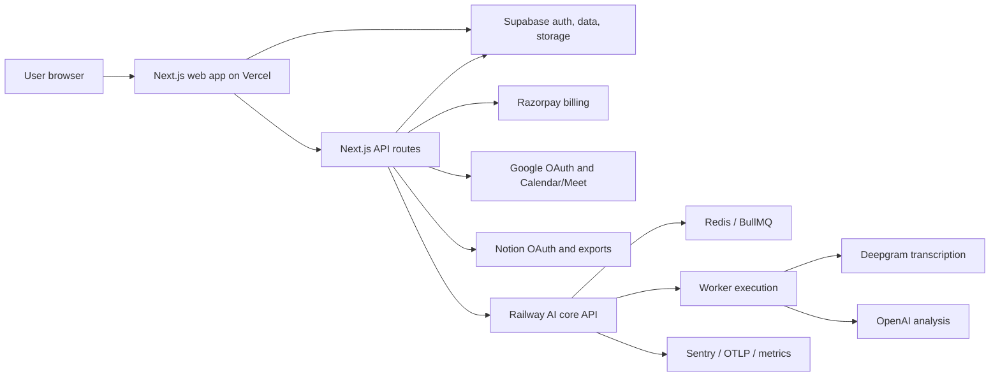
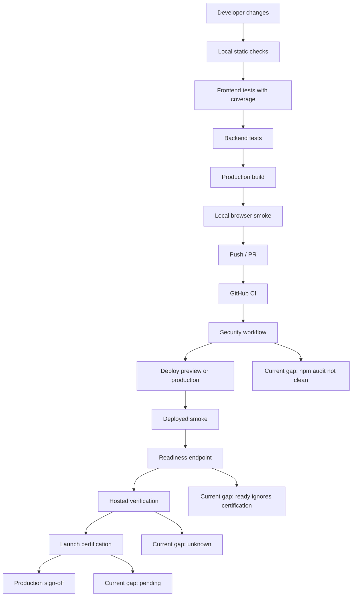
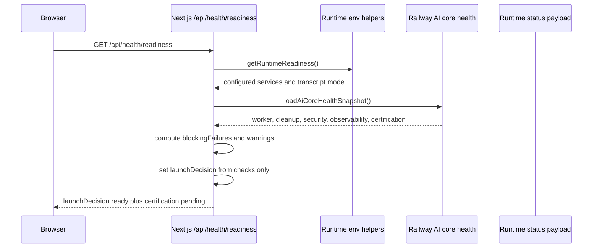
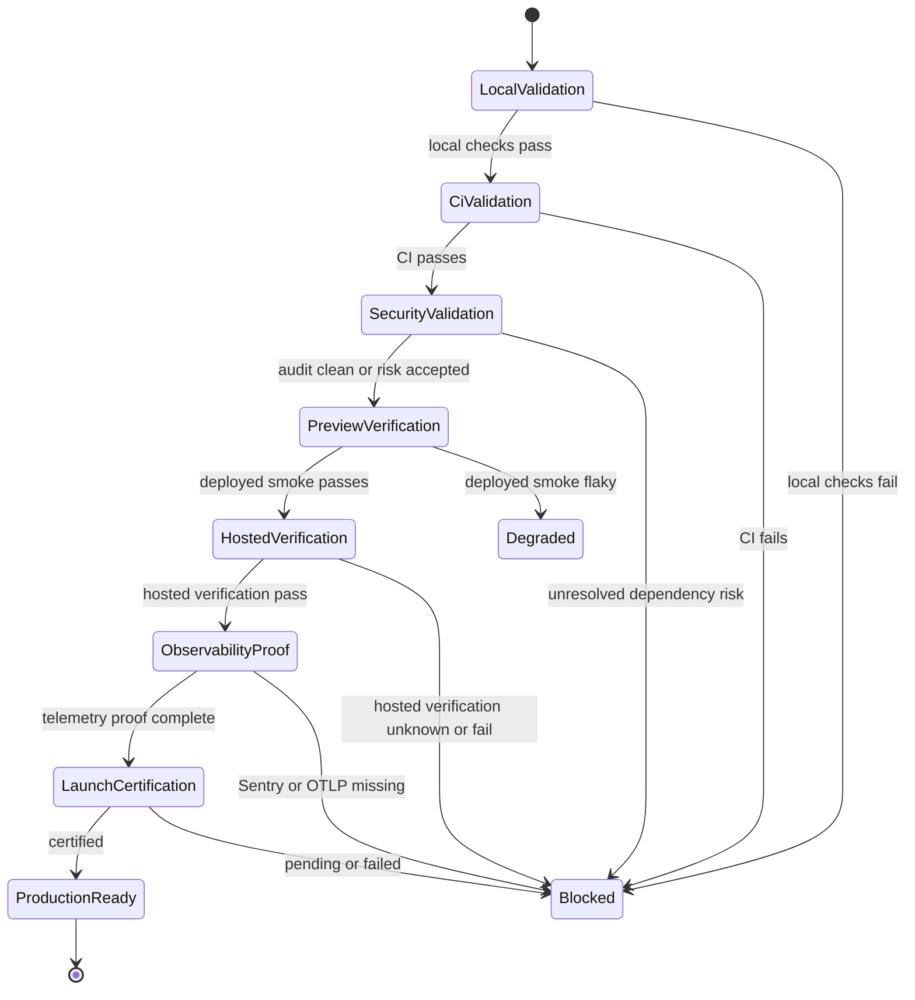
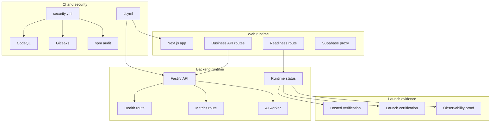
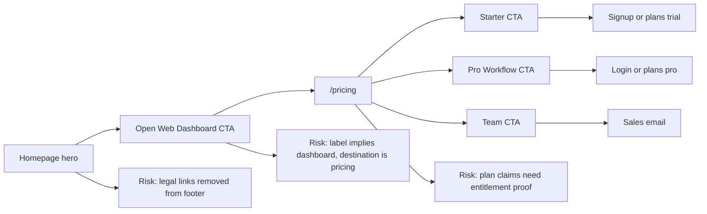
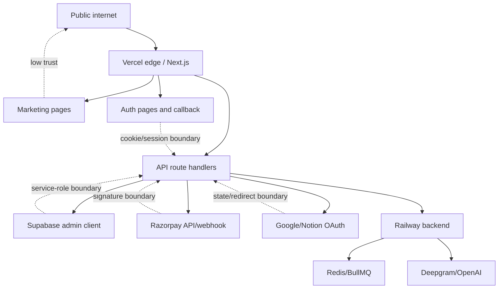
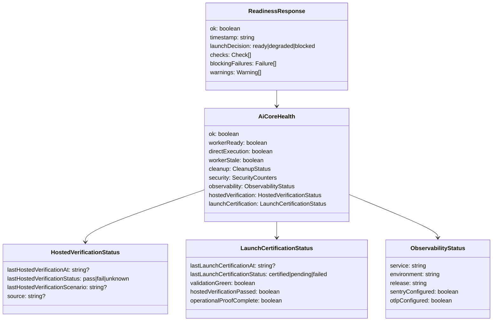

# NextStop.ai Web Production Readiness And Audit Report

Date: 2026-04-27
Repository: `nextstop.ai-web`
Path: `C:\Users\ADMIN\Desktop\nextstop.ai\nextstop.ai-web`
Audit type: Production readiness, CI readiness, code quality, security, release governance, and recent-change review
Mode: Report-only. No product code, tests, runtime schemas, or CI files were changed.
Verdict: Not ready for full production sign-off.
Recommended release state: Continue preview/internal use; do not push as a production-certified release until blockers are closed or explicitly risk-accepted.

## Document Status

- Version: `v2-expanded`
- Expansion request: Make the report match the depth and structure of the April 24 readiness audit.
- Current document purpose: Serve as a production-readiness decision artifact, not only a test summary.
- Current recommendation: Do not issue full production sign-off.
- Controlled rollout recommendation: Acceptable only with explicit known-risk acceptance.
- Confidence level for local CI-equivalent checks: High.
- Confidence level for deployed public reachability: High for the smoke paths tested.
- Confidence level for private dashboards, secrets, third-party consoles, and billing provider configuration: Not directly verified.
- Confidence level for code-review findings: High where file and line evidence is cited; medium where findings rely on missing test proof.
- Mutation policy followed: Product code was not changed.
- Report mutation performed: Created and expanded this Markdown report only.
- Important repo note: `docs/` is ignored by `.gitignore`, so this report is local-only unless intentionally force-added or ignore policy changes.

## Audit Intent

This audit answers one practical release question:

Can the current `nextstop.ai-web` worktree be pushed and treated as production-ready for the public web product?

The answer is separated into two decisions:

1. Can the current branch pass the important local and CI-style checks?
2. Does the total evidence justify full production launch certification?

The first answer is mostly yes, except for dependency-audit cleanliness in the security workflow.

The second answer is no. The app is alive, buildable, testable, and reachable, but production certification is not supported because runtime release governance and observability proof are incomplete.

This audit treats production readiness as a proof standard. It does not treat "the app builds" or "the site loads" as equivalent to "production-certified."

## Reading Guide

For the fastest decision, read:

1. Executive Summary
2. Current Go / No-Go Call
3. Validation Snapshot
4. Production Readiness Scorecard
5. Severity-Ranked Findings
6. Launch Blockers

For engineering execution, read:

1. Category Deep Dives
2. Security Review Notes
3. Risk-Based Test Plan
4. Remediation Roadmap
5. Suggested Acceptance Criteria

For product and launch stakeholders, read:

1. Recent Changes Review
2. Marketing And Pricing Readiness Diagram
3. Legal And Trust Surface Audit
4. Operational Rollout Checklist

## Evidence Legend

- `Locally validated`: Confirmed by running commands in this workspace.
- `Live validated`: Confirmed against the deployed public URL during this audit.
- `Repo confirmed`: Confirmed through local source/config/workflow inspection.
- `Diff confirmed`: Confirmed through the current uncommitted worktree diff.
- `Inferred with high confidence`: Derived from multiple repo/runtime signals, but not directly executed end to end.
- `Not verified`: Outside this audit's access or not exercised in this pass.

## Scope

In scope:

- `frontend/` Next.js app.
- `backend/` Node/Fastify runtime.
- GitHub Actions CI and security workflows.
- Current dirty worktree and untracked files.
- Local validation commands.
- Deployed public smoke routes.
- Live readiness endpoint.
- Security posture visible in code and dependency audit.
- Recent marketing/pricing/footer/navigation changes.

Out of scope:

- Desktop repository implementation details.
- Private Supabase, Railway, Vercel, Razorpay, Google, Notion, Sentry, and telemetry console settings that are not visible from repo/runtime payloads.
- Real billing transactions.
- Real OAuth round trips.
- Real meeting capture/upload/process/export lifecycle with production data.
- Product code fixes.

## Executive Summary

The web project has strong production foundations. The current local validation pass shows that the core CI-style checks are mostly green:

- Frontend repo contract passed.
- Frontend typecheck passed.
- Backend typecheck passed.
- Frontend lint passed.
- Frontend unit and route tests passed: 17 files, 36 tests.
- Backend tests passed: 1 file, 4 tests.
- Frontend production build passed and generated 41 app routes.
- Local Playwright smoke passed.
- Deployed homepage, pricing, login, readiness, and deployed smoke paths are reachable.

However, the project is not ready for a clean production launch certification. The main blocker is not basic build health. The main blocker is that production-readiness evidence is still weaker than the live readiness endpoint claims.

The live readiness endpoint currently returns `launchDecision: ready`, but the same payload reports:

- hosted verification status: `unknown`
- launch certification status: `pending`
- launch certification `validationGreen: false`
- launch certification `hostedVerificationPassed: false`
- launch certification `operationalProofComplete: false`
- observability environment: `development`
- Sentry configured: `false`
- OTLP configured: `false`

That combination should block full production sign-off. A production readiness endpoint can be useful only if it is truthful about missing launch evidence. Right now it can say `ready` while important production controls are missing.

The recent changes are mostly user-facing marketing, pricing, footer, navigation, global layout/CSS, and local stack script changes. They compile and pass the current test suite, but they are not directly covered by targeted marketing/pricing tests. The most visible change-specific risks are the hero CTA text mismatch, removed legal links, changed plan promises, and untracked generated artifacts.

## Current Go / No-Go Call

Full production launch: No-go.

Pre-push code-health confidence: Mostly good for the checked CI gates, except the security workflow is expected to fail or warn because `npm audit --omit=dev --audit-level=high` is not clean.

Controlled rollout or preview: Acceptable if the team explicitly accepts the observability, certification, dependency-audit, and coverage gaps.

## Validation Snapshot

| Check | Command | Result | Release impact |
|---|---|---:|---|
| Repo contract | `npm run test:repo-contract` in `frontend` | Pass | Good pre-push signal |
| Frontend typecheck | `npm run typecheck` in `frontend` | Pass | Good pre-push signal |
| Backend typecheck | `npm run typecheck` in `backend` | Pass | Good pre-push signal |
| Frontend lint | `npm run lint` in `frontend` | Pass | Good pre-push signal |
| Frontend tests with coverage | `npm run test -- --coverage` in `frontend` | Pass | Good, but coverage is weak |
| Frontend test count | Vitest | 17 files, 36 tests | Thin relative to route surface |
| Frontend coverage | V8 coverage | 31.33 percent statements/lines | Not production-certifying |
| Backend tests | `npm run test` in `backend` | Pass | Too thin: 1 file, 4 tests |
| Frontend production build | `npm run build` in `frontend` | Pass | Required release gate passed |
| Local browser smoke | `npm run test:e2e -- tests/e2e/smoke.spec.ts` | Pass | Deterministic smoke passed |
| Deployed HTTP smoke | `/`, `/pricing`, `/login`, `/api/health/readiness` | Pass, HTTP 200 | Public reachability good |
| Deployed Playwright smoke | `PLAYWRIGHT_BASE_URL=https://next-stop-ai-web.vercel.app npm run test:e2e -- tests/e2e/deployed-smoke.spec.ts` | Pass | Public smoke good |
| Dependency audit | `npm audit --omit=dev --audit-level=high` at repo root | Not clean | Blocks clean security workflow |

## Production Readiness Scorecard

| Category | Score | Verdict | Evidence | Confidence |
|---|---:|---|---|---|
| CI/build/test readiness | 4.0 / 5 | Strong local gates, one security audit concern | Typecheck, lint, build, frontend tests, backend tests, smoke all pass; dependency audit not clean | High |
| Frontend code quality | 3.8 / 5 | Good, but changed surface is under-tested | Build/lint pass; route surface is broad; recent marketing refactor compiles | High |
| Backend code quality | 3.2 / 5 | Structurally solid, under-verified | Backend typecheck/tests pass, but only 4 backend tests ran | High |
| Security and dependency posture | 3.0 / 5 | Baseline controls exist; audit is not clean | Security workflow exists; headers/rate limits/webhook checks exist; npm audit reports moderate issues | High |
| Auth/session/API route safety | 3.4 / 5 | Reasonable patterns, insufficient route tests | Supabase proxy exists; redirect helpers exist; many state-changing routes have zero coverage | Medium-high |
| Billing/webhook readiness | 2.8 / 5 | Important controls present, weak proof | Razorpay signature verification exists; webhook route has zero coverage | High |
| AI/worker/queue readiness | 3.4 / 5 | Live worker healthy, lifecycle under-proven | Readiness reports worker healthy; queue dependency audit issue remains; lifecycle tests are thin | Medium-high |
| Observability/incident readiness | 1.8 / 5 | Not production-ready | Live payload says environment `development`, Sentry false, OTLP false | High |
| Deployment/release governance | 2.4 / 5 | Workflow exists, runtime truth incomplete | Post-deploy concepts exist; hosted verification unknown and certification pending | High |
| Marketing/pricing UX readiness | 2.9 / 5 | Polished but under-verified | Current diff changes hero, pricing, footer, navbar, testimonials, use cases | High |
| Legal/privacy/compliance surface | 2.0 / 5 | Missing public legal links | Footer only links Overview, Pricing, Security, FAQ, About, Plans | High |
| Repo hygiene | 2.7 / 5 | Generally controlled, current drift | `.gitignore` ignores common artifacts and docs, but not `frontend/output/` or `frontend/.playwright-cli/` | High |
| Overall launch confidence | 2.8 / 5 | Not production-certified | CI mostly green, but governance, observability, audit, and coverage gaps remain | High |

## Production Readiness Diagrams

### System Context

Interpretation:

- The web app is not a static marketing site.
- The web app controls auth, billing, integrations, meeting workflow routes, exports, readiness, and runtime delegation.
- Production readiness must cover the whole chain, not only homepage availability.

### Deployment And Verification Flow

Interpretation:

- The local engineering checks mostly pass.
- The release-governance checks are not complete.
- Dependency audit remains a security workflow risk.

### UML Sequence: Current Readiness Request

Risk shown:

- Hosted verification, launch certification, and observability are included in the response but not decisive in the launch decision.

### UML State Model: Desired Launch Gate

Desired behavior:

- `ready` should be possible only after verification and certification evidence exists.
- Service health can be green while launch certification remains blocked.

### UML Component Diagram: Production Control Surfaces

### Marketing And Pricing Funnel Risk

### Trust Boundary Diagram

Security interpretation:

- Public traffic reaches both marketing and request-facing API surfaces.
- TypeScript is not a security boundary.
- Runtime validation, auth, signatures, rate limits, and allowlisted redirects are the important controls.

## UML Class Sketch: Release Evidence Model

Design gap:

- The model already carries the right evidence fields.
- The readiness decision does not yet enforce them.

## Severity-Ranked Findings

### Critical Findings

#### C-01: Readiness endpoint can report `ready` without production certification evidence

Severity: Critical
Area: Release governance
Evidence:

- `frontend/src/app/api/health/readiness/route.ts:120-127` computes `launchDecision` only from local check failures and warnings.
- `frontend/src/app/api/health/readiness/route.ts:132-157` includes hosted verification and launch certification in the response.
- Those hosted verification and certification fields are not used to block or degrade `launchDecision`.
- Live readiness returned `launchDecision: ready`.
- Live readiness also returned hosted verification `unknown`, launch certification `pending`, `validationGreen: false`, `hostedVerificationPassed: false`, and `operationalProofComplete: false`.

Impact:

The release-governance surface can create false confidence. A stakeholder or deployment gate could treat the app as production-ready while the endpoint itself exposes missing production proof.

Recommendation:

Make production readiness distinguish service health from release certification. In production mode, return `degraded` or `blocked` when hosted verification is not passing, launch certification is not certified, or operational proof is incomplete.

#### C-02: Production observability is not active in the live runtime payload

Severity: Critical
Area: Observability and incident response
Evidence:

- Live readiness payload reports observability `environment: development`.
- Live readiness payload reports `sentryConfigured: false`.
- Live readiness payload reports `otlpConfigured: false`.

Impact:

This is an async, queue-backed AI product. Without production error tracking and trace export, failures in job processing, billing, OAuth, upload/finalize/process flows, and background worker behavior will be harder to detect and diagnose.

Recommendation:

Configure production Sentry and OTLP or an equivalent production telemetry path. Add a launch gate that verifies ingestion before certification.

#### C-03: Security workflow dependency audit is not clean

Severity: Critical for pre-push CI/security confidence; High for runtime exploitability based on npm's moderate severity
Area: Dependency and supply-chain hygiene
Evidence:

- `.github/workflows/security.yml:28-41` runs `npm audit --omit=dev --audit-level=high`.
- Local `npm audit --omit=dev --audit-level=high` reported 5 moderate vulnerabilities.
- Reported chain includes `next -> postcss` through `@sentry/nextjs`.
- Reported chain includes `bullmq -> uuid`.
- npm suggested one forced path that would install an unsafe/breaking `next@9.3.3` downgrade for the PostCSS chain.

Impact:

Pushing this state can create a red security workflow or at minimum leave a known dependency-audit exception unresolved. The fix path is not a simple blind `npm audit fix --force`.

Recommendation:

Do not use forced downgrade fixes. Investigate package updates/overrides compatible with Next 16 and BullMQ 5, then document any remaining advisory as a time-boxed risk acceptance with owner and expiry.

### High Findings

#### H-01: Backend tests are far too thin for the backend's production role

Severity: High
Area: Backend reliability
Evidence:

- Backend tests passed, but only `src/runtime-status.test.ts` ran.
- Total backend test count: 1 file, 4 tests.
- The backend owns health, metrics, runtime status, worker state, desktop sync, Supabase persistence, and AI job execution surfaces.
- `.github/workflows/ci.yml:44-53` runs backend typecheck in static checks but does not run backend tests in main CI.

Impact:

The backend has production responsibilities that are much broader than the current test evidence. A passing backend typecheck is not enough to prove runtime behavior.

Recommendation:

Add backend tests for `/health`, `/metrics`, runtime hosted-verification publish, launch-certification publish, secret-protected routes, desktop sync auth/ownership, and worker-state edge cases. Add `npm run test` for `backend` to CI.

#### H-02: Frontend route coverage is weak across business-critical API routes

Severity: High
Area: Frontend API reliability
Evidence:

- Frontend coverage is 31.33 percent.
- Coverage report shows zero coverage for billing create/verify/trial routes.
- Coverage report shows zero coverage for Razorpay webhook.
- Coverage report shows zero coverage for internal AI transcribe/regenerate.
- Coverage report shows zero coverage for multiple Google, Notion, meeting start/finalize/process/upload/cancel/capture routes.

Impact:

The routes with the weakest coverage include revenue, integration, data ingress, AI workflow, and meeting lifecycle paths. These are not cosmetic paths.

Recommendation:

Prioritize tests for billing create/verify, Razorpay webhook, meeting start/finalize/process/upload-url, Notion callback/connect, and Google event/Meet flows. Include success, unauthenticated, invalid payload, dependency failure, and idempotency/duplicate cases.

#### H-03: Recent marketing and pricing changes lack direct automated coverage

Severity: High
Area: Changed-surface verification
Evidence:

- Current diff changes 16 tracked files with 624 insertions and 591 deletions.
- Major changed files include `MarketingHome`, `Hero`, `Navbar`, `Footer`, `Pricing`, `Testimonials`, `UseCases`, pricing page, global CSS, and local stack scripts.
- `frontend/src/app/(marketing)/MarketingHome.tsx:27-35` now composes the homepage with `Hero`, `UseCases`, `CoreFeaturesDeck`, `Testimonials`, `Pricing`, `FAQ`, `CtaSection`, and `Footer`.
- No targeted Playwright test asserts the new hero, footer, pricing cards, CTA paths, or legal/trust links.

Impact:

The current checks prove the app builds and smoke routes load, but they do not prove the changed acquisition and pricing funnel is correct.

Recommendation:

Add Playwright assertions for homepage hero CTA labels/destinations, navbar links, pricing cards, pricing CTA behavior, footer links, and mobile viewport rendering.

#### H-04: Footer no longer exposes legal/compliance links

Severity: High
Area: Legal, privacy, and public trust
Evidence:

- `frontend/src/components/Footer.tsx:28-68` now exposes Product and Company link groups only.
- The footer links Overview, Pricing, Security, FAQ, About Us, and Plans.
- No `privacy`, `terms`, `cookie`, or `legal` app routes were found under `frontend/src/app`.

Impact:

The app handles auth, billing, meeting data, AI processing, integrations, and exports. Public production launch needs visible legal and privacy surfaces.

Recommendation:

Add or restore Privacy Policy, Terms of Service, and Cookie Policy pages/links. Link them from the footer and relevant auth/billing flows.

#### H-05: Pricing claims changed and need entitlement verification

Severity: High
Area: Product truthfulness and billing
Evidence:

- `frontend/src/components/Pricing.tsx:12-60` now claims web dashboard access, manual upload/transcript generation, desktop app access, advanced AI, Google Calendar/Meet, Notion sync, and team seats.
- `frontend/src/app/(marketing)/pricing/page.tsx` has a parallel plan definition with similar claims.
- No tests directly verify these plan claims against actual `/plans`, subscription, entitlement, or desktop distribution behavior.

Impact:

Pricing copy is effectively a product contract. If the app does not grant exactly what the copy promises, the launch risks user trust and support issues.

Recommendation:

Create an entitlement matrix and test Starter, Pro Workflow, and Team behaviors against billing/subscription state. Keep the marketing pricing component and pricing page plan definitions synchronized or centralize the plan data.

### Medium Findings

#### M-01: Hero CTA label does not match its destination

Severity: Medium
Area: UX and conversion trust
Evidence:

- `frontend/src/components/Hero.tsx:92-100` renders a button labeled `Open Web Dashboard`.
- The same button links to `/pricing`.

Impact:

Users expect "Open Web Dashboard" to enter the dashboard or app-entry flow, not pricing. This can reduce trust and confuse analytics.

Recommendation:

Either change the label to `View Plans` / `See Pricing`, or change the destination to `/app-entry` or another dashboard entry path.

#### M-02: Repo hygiene has untracked generated artifacts

Severity: Medium
Area: Repository hygiene
Evidence:

- `git status --short` shows untracked `frontend/.playwright-cli/`.
- `git status --short` shows untracked `frontend/output/`.
- `.gitignore:13-21` ignores coverage, playwright-report, test-results, `.next`, and `out`, but not `frontend/output/` or `frontend/.playwright-cli/`.

Impact:

Generated artifacts can pollute reviews or be accidentally committed.

Recommendation:

Add generated artifact paths to `.gitignore` if they are local-only. Keep generated screenshot artifacts out of release commits unless intentionally published.

#### M-03: Backend tests are not enforced in CI

Severity: Medium
Area: CI completeness
Evidence:

- `.github/workflows/ci.yml:44-53` runs repo contract, frontend typecheck, backend typecheck, frontend lint, and frontend build.
- `.github/workflows/ci.yml:67-70` runs frontend coverage tests only.
- No `backend` `npm run test` step appears in CI.

Impact:

Local backend tests can pass while CI never enforces them. This allows regressions in backend runtime behavior to reach main.

Recommendation:

Add backend `npm run test` to the CI matrix after backend install and typecheck.

#### M-04: Rate limiting exists, but it is uneven and degraded-open

Severity: Medium
Area: Abuse controls
Evidence:

- Several high-cost routes import and enforce `enforceRateLimit`.
- `frontend/src/lib/rate-limit.ts` logs a degraded-open warning when rate limiting fails.
- Login/signup/password-reset are mostly delegated to Supabase and are not visibly app-rate-limited here.

Impact:

Degraded-open is often a practical availability choice, but production launch should know where abuse controls depend on external infrastructure.

Recommendation:

Document which endpoints are protected by app-level rate limits, which rely on Supabase/Vercel/Railway controls, and which should be added before public launch.

### Low Findings

#### L-01: `docs/` is ignored, so this audit may remain local-only

Severity: Low
Area: Documentation governance
Evidence:

- `.gitignore:70-71` ignores `docs/`.

Impact:

The report will not be committed by default unless ignore policy is changed or the file is force-added.

Recommendation:

Decide whether production audit reports should remain local artifacts or be tracked in a release/audit branch.

#### L-02: Marketing home removed several explanatory sections

Severity: Low to Medium
Area: Product education
Evidence:

- The current diff removed prior homepage sections such as stats, features, lifecycle, privacy-by-design, how-it-works, outputs, sync flow, and modes comparison.
- `frontend/src/app/(marketing)/MarketingHome.tsx:27-35` now uses a shorter composition.

Impact:

The new page is likely cleaner, but it may carry less explanatory and trust-building context above and below the fold.

Recommendation:

Validate with user review or analytics. If conversion or comprehension drops, restore a compact trust/how-it-works section.

## Security Review Notes

Positive findings:

- Razorpay webhook signature verification is present: `frontend/src/app/api/razorpay/webhook/route.ts:64-77` reads raw body, requires `x-razorpay-signature`, and validates the signature.
- Razorpay HMAC verification is implemented in `frontend/src/lib/razorpay.ts:58-70`.
- Duplicate billing events are handled by provider event ID in `frontend/src/app/api/razorpay/webhook/route.ts:90-98`.
- Several expensive workspace routes use `enforceRateLimit`.
- Auth redirects use local URL objects and encoded path parameters rather than raw external redirect targets in the reviewed paths.
- No obvious `dangerouslySetInnerHTML` use was surfaced by the security sweep.

Open security concerns:

- Dependency audit is not clean.
- Billing/webhook route behavior is not covered by tests.
- OAuth callback/connect route behavior is not covered deeply enough.
- Production observability is disabled in the live payload.
- Public legal/privacy surfacing is incomplete.
- Rate-limit and abuse-control coverage should be documented route by route.
- CSP/security-header runtime proof was not fully validated in this report beyond source/workflow inspection.

## Code Quality Review

Strengths:

- TypeScript, lint, and production build are clean.
- The codebase has explicit readiness, runtime status, health, metrics, rate-limit, billing, and worker concepts.
- The frontend build successfully produces the expected public, dashboard, and API route surface.
- Local stack scripts were hardened to retry missing Docker network failures.

Concerns:

- Two pricing plan arrays exist in separate surfaces, raising drift risk.
- The marketing refactor removed a large amount of explanatory content without targeted smoke coverage.
- Backend test evidence is too small for the backend responsibility set.
- Current repo state is dirty and includes untracked generated artifacts.
- CI does not enforce backend tests.

## Recent Changes Review

| Change area | Assessment | Risk |
|---|---|---|
| Marketing home composition | Cleaner, shorter, uses new `CoreFeaturesDeck` and `CtaSection` | Removed trust/explanation sections are not validated |
| Hero | New Desktop + Web positioning is clear | CTA says dashboard but links to pricing |
| Pricing | More explicit web vs desktop positioning | Claims require entitlement and onboarding verification |
| Footer | Simpler and cleaner | Legal/privacy/cookie links removed |
| Navbar/testimonials/use-cases | Large visual/content churn | Needs visual/mobile smoke |
| Global CSS/layout | Build passes | Needs mobile/overflow visual verification |
| Local stack scripts | Missing-network retry is sensible | Should be tested manually with Docker if relied on |
| Untracked components | Build proves they compile | Must be intentionally added or removed before commit |
| Untracked artifacts | Useful local screenshots/logs | Should be ignored or cleaned before release commit |

## Category Deep Dives

### Category Audit: CI, Build, And Test Readiness

Score: 4.0 / 5
Verdict: Strong local engineering signal; security workflow risk remains.
Evidence level: Locally validated and repo confirmed.

What is working:

- The frontend repo contract passed.
- Frontend TypeScript passed.
- Backend TypeScript passed.
- Frontend ESLint passed.
- Frontend Vitest suite passed.
- Backend Vitest suite passed.
- Frontend production build passed.
- Local browser smoke passed.
- Deployed browser smoke passed.
- CI workflow has static checks, unit/route tests, and browser smoke jobs.

What is weak:

- Backend tests are not enforced in the main CI workflow.
- Frontend tests pass but coverage is only about 31.33 percent.
- Security workflow dependency audit is not clean.
- Browser smoke is useful but narrow.
- Changed marketing/pricing surfaces are not directly asserted.

Production interpretation:

The project is likely to pass the standard CI workflow's frontend and static jobs, but the security workflow remains a real risk because local `npm audit` is not clean. The current validation is enough to say "basic engineering gates pass." It is not enough to say "production launch is certified."

Recommended next step:

Add backend tests to CI and either fix or formally risk-accept dependency advisories before push.

### Category Audit: Frontend Code Quality

Score: 3.8 / 5
Verdict: Good technical baseline, changed surface needs targeted proof.
Evidence level: Locally validated and diff confirmed.

Strengths:

- Next.js production build succeeds.
- Typecheck and lint pass.
- App router route generation succeeds.
- The public route set is coherent.
- Components compile after the marketing/pricing refactor.
- The app has explicit runtime readiness and workspace runtime concepts.

Concerns:

- The frontend API route surface is broad and under-tested.
- The marketing page changed substantially without targeted public-page assertions.
- Pricing data appears duplicated across the homepage pricing component and the dedicated pricing page.
- CTA behavior is not fully aligned with user expectations.
- Visual and mobile regressions were not checked through screenshots in this pass.

Recommended next step:

Add public-route Playwright coverage for homepage, pricing, footer, navbar, and CTA behavior. Add API route tests prioritized by business risk.

### Category Audit: Backend Code Quality

Score: 3.2 / 5
Verdict: Good architecture, insufficient behavioral evidence.
Evidence level: Locally validated and repo confirmed.

Strengths:

- Backend typecheck passes.
- Backend tests pass.
- Backend runtime exposes health, metrics, worker state, security counters, cleanup state, hosted verification, and launch certification concepts.
- Runtime status is modeled explicitly.
- Observability structures are present in code.

Concerns:

- Only one backend test file ran.
- Only four backend tests ran.
- Backend tests are not part of the main CI workflow.
- Route-level behavior for health, metrics, desktop sync, verification publish, launch certification, and secrets is not adequately proven.

Recommended next step:

Treat backend tests as release blockers, not optional local checks. Add tests and wire them into CI.

### Category Audit: Security And Dependency Posture

Score: 3.0 / 5
Verdict: Good scaffolding, unresolved dependency and proof gaps.
Evidence level: Locally validated and repo confirmed.

Strengths:

- Gitleaks workflow exists.
- CodeQL workflow exists.
- npm audit workflow exists.
- Razorpay webhook signature verification exists.
- Rate limiting exists on several high-cost workspace routes.
- Transcript storage mode is conservative in the live payload.
- Security counters are represented in runtime state.

Concerns:

- Dependency audit is not clean.
- Webhook route has no direct coverage in the current coverage report.
- OAuth callback/connect routes have weak coverage.
- Rate-limit coverage is uneven.
- Production observability is disabled, weakening incident response.
- Legal/privacy surfaces are missing from the public footer.

Recommended next step:

Fix or risk-accept dependency advisories, add billing/webhook/OAuth tests, and verify production telemetry.

### Category Audit: Auth, Session, And Redirect Safety

Score: 3.4 / 5
Verdict: Reasonable patterns, more route-level tests needed.
Evidence level: Repo confirmed.

Strengths:

- Supabase SSR proxy is present.
- Auth pages redirect through app-entry/dashboard/plans flows.
- Several redirect paths use local route strings or encoded path parameters.
- Auth-origin helper is covered by unit tests.

Concerns:

- The route inventory is broad enough that each redirect-sensitive path should have explicit tests.
- Notion callback builds redirects using request origin fallback through app URL helpers.
- Login/signup password reset flows depend on Supabase and should be tested against allowed redirect behavior.
- Cookie/session and CSRF posture were not fully runtime-tested in this pass.

Recommended next step:

Add redirect safety tests for auth callback, login/signup next parameters, app-entry, plans, and Notion OAuth callback.

### Category Audit: Billing And Webhook Readiness

Score: 2.8 / 5
Verdict: Controls exist, proof is too thin for revenue paths.
Evidence level: Repo confirmed and locally validated.

Strengths:

- Razorpay credentials are required server-side.
- Checkout signature verification exists.
- Webhook signature verification exists.
- Webhook duplicate handling exists through provider event IDs.
- Billing routes are visible and build successfully.

Concerns:

- Billing create, verify, trial start, and webhook routes show zero coverage.
- Billing route failures can directly affect revenue and entitlement state.
- Pricing plan claims changed and need to match actual billing/entitlement behavior.

Recommended next step:

Add tests for subscription create, checkout verify, trial start, webhook valid signature, webhook invalid signature, duplicate webhook, missing notes/user ID, and subscription status transitions.

### Category Audit: AI, Worker, And Queue Readiness

Score: 3.4 / 5
Verdict: Live worker healthy, full lifecycle under-proven.
Evidence level: Live validated and repo confirmed.

Strengths:

- Live readiness reports AI worker healthy.
- Live readiness reports direct execution true.
- Live readiness reports worker stale false.
- Backend runtime status includes worker and cleanup state.
- Queue-backed architecture is appropriate for AI work.

Concerns:

- The full meeting lifecycle was not exercised end to end.
- Queue retry, cancellation, partial failure, and recovery behavior are not deeply covered.
- `bullmq -> uuid` advisory remains in dependency audit.
- Worker health being green does not prove all AI workflow routes are correct.

Recommended next step:

Add representative hosted verification scenarios for meeting start, upload, finalize, process, AI output readiness, export, and failure recovery.

### Category Audit: Observability And Incident Readiness

Score: 1.8 / 5
Verdict: Not production-ready.
Evidence level: Live validated.

Strengths:

- Observability model exists.
- Metrics concept exists.
- Runtime payload includes observability fields.
- Security counters and worker state are visible.

Concerns:

- Live runtime reports environment `development`.
- Live runtime reports Sentry disabled.
- Live runtime reports OTLP disabled.
- Launch certification says operational proof is incomplete.
- Readiness does not treat missing observability as a blocker.

Recommended next step:

Enable production Sentry and OTLP or equivalent telemetry. Verify real event/trace ingestion and gate launch certification on it.

### Category Audit: Deployment And Release Governance

Score: 2.4 / 5
Verdict: Good workflow concepts, weak runtime enforcement.
Evidence level: Repo confirmed and live validated.

Strengths:

- CI exists.
- Security workflow exists.
- Post-deploy verification workflow exists.
- Readiness endpoint exists.
- Runtime status carries hosted verification and launch certification fields.

Concerns:

- Hosted verification status is `unknown`.
- Launch certification is `pending`.
- Readiness says `ready` despite missing launch evidence.
- Dependency audit is not clean.
- Backend tests are not enforced in CI.

Recommended next step:

Make launch evidence decisive. A production readiness endpoint should not return `ready` when certification is pending or observability proof is incomplete.

### Category Audit: Marketing And Pricing UX

Score: 2.9 / 5
Verdict: Cleaner story, under-tested public funnel.
Evidence level: Diff confirmed and locally validated.

Strengths:

- Desktop plus web positioning is clearer.
- Pricing copy is more explicit about web dashboard vs desktop app.
- New homepage composition is simpler.
- Production build proves the new components compile.

Concerns:

- The hero CTA says `Open Web Dashboard` but links to `/pricing`.
- Footer legal links are missing.
- Pricing claims require entitlement validation.
- Mobile and visual regression checks were not run as screenshot assertions in this pass.
- Removed sections may reduce product explanation and trust.

Recommended next step:

Add public-page Playwright tests and perform a visual review for desktop and mobile.

### Category Audit: Legal, Privacy, And Compliance Surface

Score: 2.0 / 5
Verdict: Not sufficient for public launch.
Evidence level: Repo confirmed.

Strengths:

- Security page route exists.
- Transcript launch mode is conservative.
- Transcript downloads are disabled in the live readiness payload.
- Runtime exposes retention settings.

Concerns:

- Footer lacks Privacy Policy.
- Footer lacks Terms of Service.
- Footer lacks Cookie Policy.
- No privacy/terms/cookie/legal app route was found.
- The product handles auth, billing, meeting data, AI processing, and integrations.

Recommended next step:

Add or restore legal pages and link them from footer, signup/login, and billing surfaces.

### Category Audit: Repository Hygiene

Score: 2.7 / 5
Verdict: Mostly controlled, current drift should be cleaned before release.
Evidence level: Repo confirmed.

Strengths:

- `.gitignore` covers dependencies, coverage, reports, `.next`, build/dist, env files, logs, Vercel state, TypeScript build info, and docs.
- Repo contract check passes.

Concerns:

- `frontend/.playwright-cli/` is untracked.
- `frontend/output/` is untracked.
- New components are untracked and must be intentionally included if part of the release.
- `docs/` is ignored, so audit artifacts are local-only by default.

Recommended next step:

Before release, make a clean candidate commit with only intentional tracked source changes and explicitly ignored generated artifacts.

## Production Issues Matrix

| ID | Severity | Issue | Owner area | Evidence | Release impact |
|---|---|---|---|---|---|
| C-01 | Critical | Readiness says `ready` while certification evidence is missing | Release governance | Live readiness and readiness route | Blocks full production sign-off |
| C-02 | Critical | Production observability inactive in live payload | Ops/backend | Live readiness | Blocks full production sign-off |
| C-03 | Critical/High | Dependency audit not clean | Security/supply chain | `npm audit` | Blocks clean security workflow |
| H-01 | High | Backend tests too thin | Backend | 1 file, 4 tests | Blocks confidence |
| H-02 | High | Critical frontend API routes uncovered | Frontend/API | Coverage report | Blocks confidence |
| H-03 | High | Marketing/pricing diff lacks targeted tests | Frontend/product | Current diff | Public funnel risk |
| H-04 | High | Footer legal links missing | Product/legal | Footer source | Public launch trust risk |
| H-05 | High | Pricing claims need entitlement proof | Product/billing | Pricing source | Revenue/support risk |
| M-01 | Medium | Hero CTA label/destination mismatch | UX/product | Hero source | Conversion/trust risk |
| M-02 | Medium | Untracked generated artifacts | Repo hygiene | Git status | Accidental commit risk |
| M-03 | Medium | Backend tests not enforced in CI | CI/backend | CI workflow | Regression risk |
| M-04 | Medium | Rate-limit coverage/degraded-open behavior needs documentation | Security | Source sweep | Abuse-control risk |
| L-01 | Low | Audit reports ignored by git | Docs/governance | `.gitignore` | Sharing/traceability risk |
| L-02 | Low/Medium | Removed explanatory sections may reduce product understanding | Product/UX | Marketing diff | Conversion risk |

## Risk Matrix

| Risk | Likelihood | Impact | Current control | Target control |
|---|---:|---:|---|---|
| Misleading readiness green state | High | High | Readiness exposes caveats but does not gate on them | Gate production `ready` on certification and observability |
| Security workflow failure on push | Medium | Medium/High | npm audit catches advisories | Fix or risk-accept advisories |
| Billing entitlement regression | Medium | High | Signature verification and billing code exist | Route tests and entitlement matrix |
| AI workflow failure after launch | Medium | High | Worker health and remote queue mode | Hosted lifecycle verification |
| Public trust gap from missing legal links | High | Medium | Security page exists | Privacy/terms/cookie pages and footer links |
| Marketing CTA confusion | High | Medium | User can still reach pricing | Align CTA label and destination |
| Backend regression | Medium | High | Typecheck and tiny test suite | Backend tests in CI |
| Generated artifact commit noise | Medium | Low/Medium | Repo contract and git status awareness | Ignore generated artifact paths |

## Risk-Based Test Plan

| Test area | Priority | Scenario | Expected proof |
|---|---:|---|---|
| Readiness route | P0 | Certification pending should not return production `ready` | Governance truth |
| Observability gate | P0 | Sentry/OTLP missing should block or degrade production readiness | Incident readiness |
| Hosted verification | P0 | Publish pass/fail and verify readiness behavior | Release proof |
| Backend health | P1 | `/health` returns expected fields and statuses | Backend contract |
| Backend metrics | P1 | `/metrics` exposes expected metrics content type and counters | Ops contract |
| Backend runtime publish | P1 | Secret-protected publish accepts valid secret and rejects invalid secret | Release evidence integrity |
| Razorpay webhook | P1 | Valid signature, invalid signature, duplicate event | Billing integrity |
| Billing checkout verify | P1 | Valid checkout signature grants expected entitlement | Revenue path |
| Meeting start | P1 | Authenticated user starts meeting, unauthenticated rejected | Core workflow |
| Meeting upload URL | P1 | Auth, ownership, invalid meeting ID, storage failure | Data ingress |
| Meeting finalize/process | P1 | Queue enqueue, invalid state, rate limit, dependency failure | AI workflow |
| Notion callback | P1 | Missing code, bad state, success redirect, failure redirect | OAuth trust |
| Google routes | P2 | Calendar select/events/instant meet success and dependency errors | Integration trust |
| Homepage public smoke | P1 | Hero, navbar, primary CTAs, footer render on desktop/mobile | Changed-surface proof |
| Pricing public smoke | P1 | Plans, billing toggle, CTA destinations, plan claims render | Revenue funnel proof |
| Legal links | P1 | Privacy, terms, cookie links exist and resolve | Compliance surface |
| Accessibility smoke | P2 | Keyboard reachability and role/name assertions on public pages | UX baseline |
| Visual smoke | P2 | Desktop and mobile screenshots for homepage/pricing | Layout confidence |

## Remediation Roadmap

### Priority 0: Launch Blockers

1. Make readiness semantics truthful.
2. Enable production observability and verify ingestion.
3. Publish hosted verification status.
4. Publish launch certification status only after required checks pass.
5. Resolve or risk-accept dependency advisories.
6. Restore legal/privacy/compliance surfaces.

### Priority 1: High-Confidence Engineering Hardening

1. Add backend tests and enforce them in CI.
2. Add frontend route tests for billing, webhook, OAuth, and meeting lifecycle.
3. Add public marketing/pricing Playwright tests.
4. Align pricing claims with actual entitlements.
5. Fix CTA label/destination mismatch.

### Priority 2: Release Polish

1. Add generated artifact ignore rules.
2. Add mobile visual review artifacts.
3. Add SEO metadata sanity checks.
4. Add accessibility smoke checks.
5. Decide whether audit reports should be committed.

## Release Gate Proposal

Use a three-tier readiness model instead of one overloaded `ready` flag:

| Gate | Meaning | Required for |
|---|---|---|
| Service health | App and backend dependencies are responding | Incident triage and uptime status |
| Release verification | CI, smoke, hosted verification, and dependency checks passed or risk-accepted | Deployment approval |
| Launch certification | Observability, legal, billing, critical user flows, and rollback proof complete | Public launch sign-off |

Proposed status mapping:

- `serviceReady`: May be true when core services are up.
- `releaseVerified`: True only when CI/security/deployed smoke/hosted verification pass.
- `launchCertified`: True only when operational proof, observability, legal, and business-critical flows are complete.
- `launchDecision`: Should be `ready` only when all required gates for the current environment pass.

## Suggested Report Owner Notes

- The project is closer to production than a prototype.
- The most important weakness is not lack of engineering effort.
- The most important weakness is missing proof in the exact places production needs proof.
- The readiness route has the right raw ingredients but needs stricter decision logic.
- Observability is modeled but not active in the live payload.
- The current changed surface is mostly public funnel work, so public funnel tests are the highest-value addition.
- Legal links matter because this product handles sensitive meeting and billing workflows.
- The dependency audit issue should be handled deliberately, not through forced downgrade commands.

## Pre-Push Risk Assessment

Likely green based on local validation:

- Frontend repo contract
- Frontend typecheck
- Backend typecheck
- Frontend lint
- Frontend build
- Frontend coverage test job
- Browser smoke job

Likely problematic:

- Security dependency audit, because local `npm audit --omit=dev --audit-level=high` is not clean.

Not enforced enough:

- Backend runtime tests are passing locally but are not enforced in CI.

## Launch Blockers

1. Fix readiness semantics so missing hosted verification, launch certification, and production observability prevent `ready`.
2. Enable and verify production Sentry and OTLP or equivalent telemetry.
3. Run hosted verification and publish a passing result to runtime status.
4. Publish launch certification only when validation is green and operational proof is complete.
5. Resolve or formally risk-accept dependency audit findings.
6. Restore legal/privacy/compliance links before public launch.

## High-Priority Recommendations

1. Add backend tests and enforce them in CI.
2. Add route tests for billing, Razorpay webhook, meeting start/finalize/process/upload-url, Notion callback/connect, and Google integration flows.
3. Add Playwright tests for homepage, pricing, footer, and CTA behavior.
4. Fix the hero CTA label/destination mismatch.
5. Centralize plan/pricing data or add tests that prove both pricing surfaces stay consistent.
6. Add `frontend/output/` and `frontend/.playwright-cli/` to `.gitignore` if they are generated artifacts.
7. Document dependency-audit risk acceptance if no safe package fix is available immediately.

## Suggested Acceptance Criteria For A Future Production Sign-Off

A future production sign-off should require:

- CI static checks pass.
- Frontend tests pass with targeted coverage for changed surfaces.
- Backend tests pass and are enforced in CI.
- Browser smoke passes locally and after deployment.
- Dependency audit is clean or formally risk-accepted.
- Live readiness returns `ready` only when hosted verification is passing.
- Live readiness returns `ready` only when launch certification is certified.
- Live readiness returns `ready` only when observability proof is complete.
- Production Sentry and trace export are verified with real ingestion.
- Legal/privacy/terms/cookie links are visible.
- Pricing claims match actual plan entitlements.
- No unexpected generated artifacts are present in the release worktree.

## Operational Rollout Checklist

Before public launch:

- Freeze a release candidate commit.
- Confirm worktree contains only intended changes.
- Run all local validation commands.
- Push to a branch and confirm CI and security workflows are green.
- Deploy preview.
- Run deployed smoke.
- Check readiness endpoint.
- Confirm hosted verification status is passing.
- Confirm launch certification status is certified.
- Confirm Sentry and OTLP ingestion.
- Manually verify homepage, pricing, signup/login, plan selection, billing, Google/Notion integration, dashboard, meeting capture, meeting processing, export, and rollback instructions.

## Final Verdict

The web app is not production-certified today.

It is in a good engineering state for continued iteration: the key local checks pass, build passes, browser smoke passes, and deployed smoke passes. But production readiness is not just "the app loads." The project still needs stricter release truth, active production observability, dependency-audit resolution or risk acceptance, stronger backend and route testing, legal surface restoration, and targeted verification for the recent marketing/pricing changes.

Recommended status: Not ready for full production sign-off; ready for a focused hardening pass and then re-audit.
