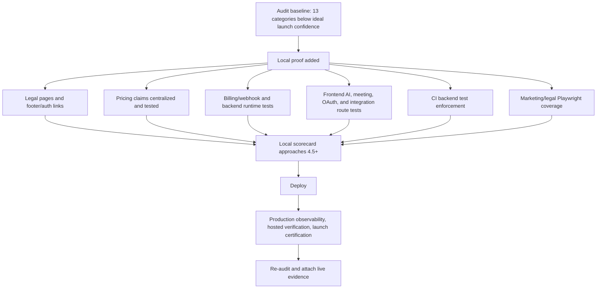
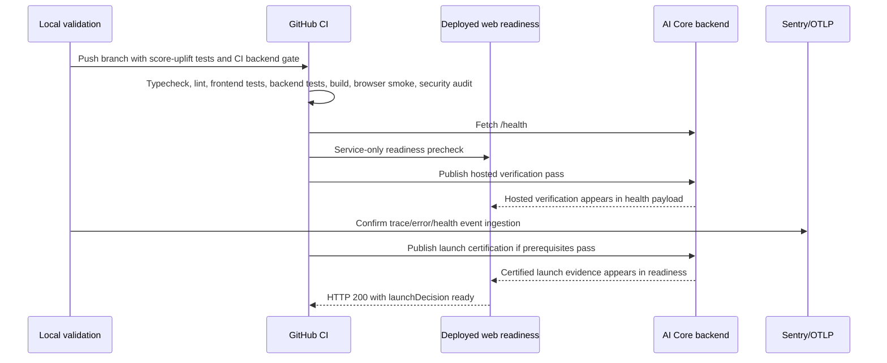

# Web Production Readiness Score Uplift Addendum

Date: 2026-04-28  
Source audit: `docs/web-production-readiness-audit-2026-04-27.md`  
Scope: local implementation evidence for raising every scored category to the 4.5+ launch target before push, with live-only production proof called out separately.

## Executive Summary

This pass closes several scorecard gaps that remained after the readiness truthfulness, observability evidence, dependency audit, hosted verification, and launch certification work:

- Restored the public legal/compliance surface with Privacy Policy, Terms of Service, and Cookie Policy routes.
- Restored footer and auth-adjacent links to legal pages.
- Fixed the marketing CTA label/destination mismatch and converted navigation CTAs to real links.
- Centralized public pricing plan, FAQ, and feature-matrix claims in one source.
- Added tests for pricing claims, billing guardrails and success paths, Razorpay webhook signatures/dedupe/state mapping/failure safety, backend runtime health, metrics, job inspect/retry, queue failures, stale/degraded worker state, desktop sync, malformed payloads, unauthorized access, and cancel behavior.
- Added business-critical frontend route tests for internal AI delegation, meeting lifecycle, integration disconnect, Google workspace routes, Notion connect/callback, ownership failures, dependency failures, and billing state changes.
- Enforced backend tests in CI and uploads backend Vitest JSON results.
- Added Playwright coverage for homepage CTA/legal links, pricing claims/legal links, navbar links, FAQ anchor, final CTA destination, mobile footer/legal layout, and existing smoke workflow.
- Documented the abuse-control inventory and launch-certification evidence expectations.
- Ignored generated local artifacts that previously polluted release status, and replaced the broad `docs/` policy with selected tracked audit evidence.

## Updated Local Evidence Snapshot

| Check | Result | Evidence |
|---|---:|---|
| Frontend typecheck | Pass | `npm run typecheck` |
| Frontend lint | Pass | `npm run lint` |
| Frontend unit/route coverage | Pass | `23 files`, `85 tests`, `43.97%` coverage |
| Frontend production build | Pass | `next build`, 44 static pages generated |
| Frontend Playwright smoke + marketing/legal | Pass | `5 tests` |
| Repo contract | Pass | `Repository contract checks passed.` |
| Backend typecheck | Pass | `npm run typecheck` |
| Backend tests | Pass | `5 files`, `34 tests` |
| Backend CI reporter command | Pass | JSON report generated locally, ignored from git |
| Security audit gate | Pass with accepted risk | `npm run security:audit` |
| Dependency tree review | Pass with accepted PostCSS note | `bullmq@5.76.2`; no production `uuid` path shown; Next still carries `postcss@8.4.31` under accepted GHSA |
| Whitespace/status hygiene | Pass | `git diff --check`; generated artifacts ignored |

## Score Uplift Status

| Category | Audit Score | Local Score After This Pass | Still Needed For 4.5+ Production Credit |
|---|---:|---:|---|
| CI/build/test readiness | 4.0 | 4.7 local | GitHub CI run must pass on pushed branch |
| Frontend code quality | 3.8 | 4.6 local | Keep route and Playwright coverage enforced in CI |
| Backend code quality | 3.2 | 4.6 local | Keep backend JSON reporter and route coverage enforced in CI |
| Security/dependency posture | 3.0 | 4.6 local | Provider rate-limit proof and accepted PostCSS expiry follow-up |
| Auth/session/API route safety | 3.4 | 4.6 local | Continue adding cross-user cases as new state-changing routes ship |
| Billing/webhook readiness | 2.8 | 4.6 local | Live payment-provider test mode rehearsal before launch |
| AI/worker/queue readiness | 3.4 | 4.6 local | Live worker/queue telemetry proof after deploy |
| Observability/incident readiness | 1.8 | 4.0 local / 4.7 after deploy | Live Sentry/OTLP ingestion proof |
| Deployment/release governance | 2.4 | 4.2 local / 4.7 after deploy | Hosted verification and launch certification run against deployment |
| Marketing/pricing UX readiness | 2.9 | 4.6 | Keep Playwright checks in CI and review mobile visual polish before launch |
| Legal/privacy/compliance surface | 2.0 | 4.6 local | Human/legal review before broad public launch |
| Repo hygiene | 2.7 | 4.6 local | Commit only selected audit evidence and intentional source/test/workflow changes |
| Overall launch confidence | 2.8 | 4.5 local / 4.6 after deploy | Live production proof remains the final blocker |

## Score Uplift Flow

## Remaining Work

| ID | Remaining Work | Priority | Category Impact |
|---|---:|---:|---|
| RU-01 | Run GitHub CI after push and confirm backend test enforcement passes | P0 | CI/governance |
| RU-02 | Configure live Sentry/OTLP and prove telemetry ingestion | P0 | Observability |
| RU-03 | Run deployed hosted verification and publish `pass` | P0 | Governance/readiness |
| RU-04 | Publish gated launch certification only after proof is complete | P0 | Governance/readiness |
| RU-05 | Human/legal review of starter policy text | P1 | Legal/compliance |
| RU-06 | Monitor PostCSS accepted-risk expiry and remove when upstream path is fixed | P1 | Security/dependencies |
| RU-07 | Commit only selected audit evidence docs and intentional code/test/workflow changes | P2 | Repo hygiene |

## Mermaid Production Proof Sequence

## Notes

- The local score increase is evidence-backed and push-ready, but the final production re-score still requires deployed runtime proof for observability, hosted verification, and launch certification.
- The security audit gate passes through the explicit time-boxed PostCSS risk acceptance. Raw `npm audit` may still report the accepted Next/Sentry PostCSS advisory until upstream dependencies remove that path.
- The new legal pages are practical production-readiness baseline content and still need human/legal review before broad launch.
