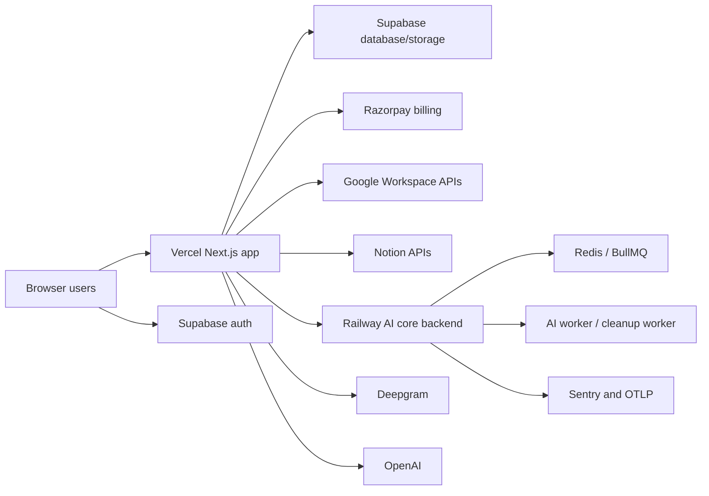
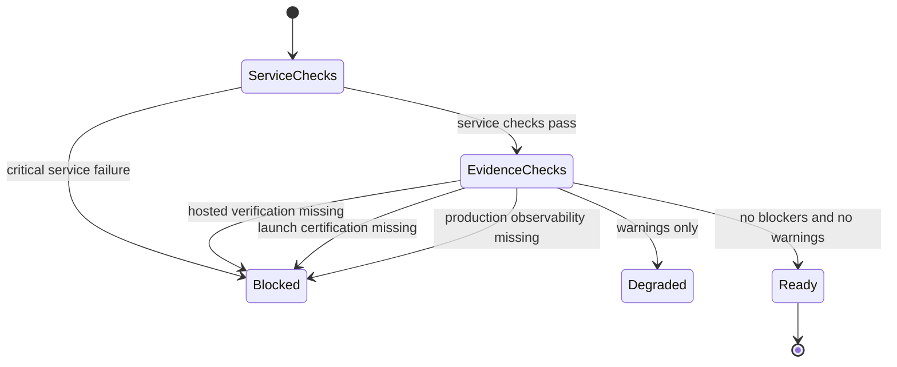
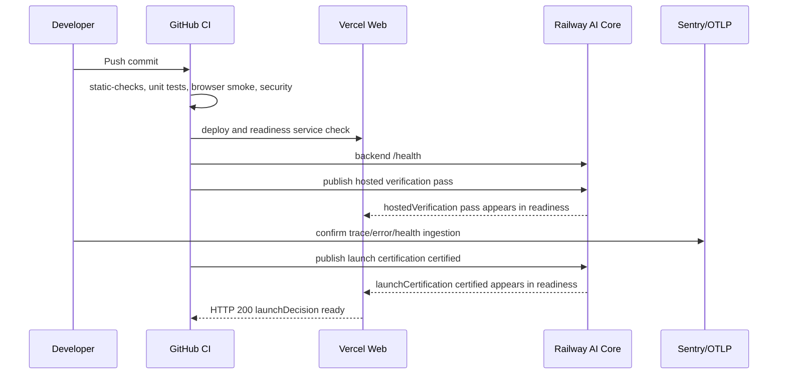
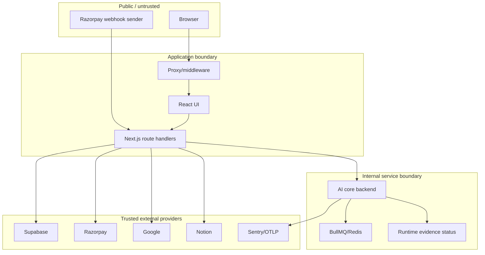
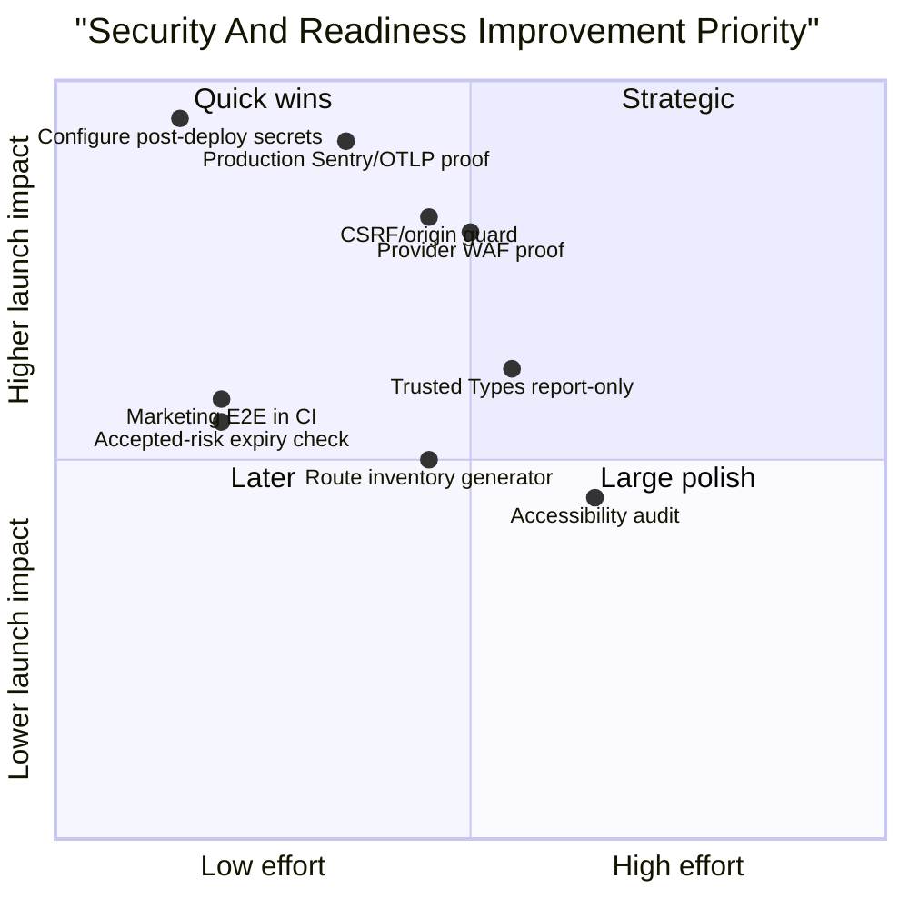
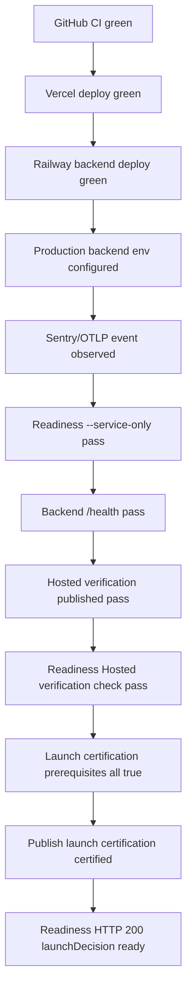

# NextStop.ai Web Production Readiness And Security Audit

Date: 2026-04-28  
Repository: `nextstop.ai-web`  
Audited commit: `9e99c0774f44492849905b5f3580968f506c0f97`  
Latest commit subject: `fix(web): sync backend lockfile for bullmq update`  
Scope: full web repository, frontend, backend AI core, CI, security workflow, post-deploy verification, runtime readiness, marketing/pricing/legal surface, dependency posture, and remaining production hardening gaps.

Remediation update: this working tree adds the repo-enforceable fixes for the issue set in this audit: strict post-deploy publish preflight messaging, Node 24 GitHub Actions opt-in, browser storage guardrails, CSRF/origin protection for API mutations through Next proxy, CSP report-only collection, CI browser coverage for marketing/pricing, dependency-risk expiry validation, provider evidence checklists, legal review tracking, and audit-doc governance. The remaining closure items are external production configuration and live evidence capture in GitHub Actions, Railway, Sentry, and the OTLP provider.

## Executive Summary

The web repo is now materially stronger than the earlier April audits. The core local quality gates, GitHub CI gates, security jobs, Vercel deployment, and Railway backend deployment are passing on the latest commit. The previous CI failure from `backend/package-lock.json` drift has been fixed by syncing the backend lockfile to `bullmq@5.76.2`.

The project is now **push-ready and preview-ready**, with a strong local production-readiness baseline. It is **not yet fully production-certified** because the final post-deploy launch evidence chain is not complete. The latest GitHub post-deploy `launch-summary` job fails because `BACKEND_HEALTH_URL` and `AI_CORE_SHARED_SECRET` are not configured, so hosted verification cannot be published to the backend runtime status. That is an operational release-governance blocker, not a code build failure.

Overall verdict:

| Verdict Layer | Result | Meaning |
|---|---|---|
| Local engineering readiness | Ready | Typecheck, lint, tests, build, e2e, dependency audit gate, and backend lockfile install are green. |
| GitHub CI readiness | Ready with one post-deploy config blocker | Static checks, unit/route tests, browser smoke, secret scan, dependency audit, CodeQL, Vercel, and Railway are green. Post-deploy launch summary fails due missing runtime publish config. |
| Production launch certification | Not certified yet | Requires configured backend health URL, shared secret, production observability proof, hosted verification publish, and launch certification publish. |

## Current Scorecard

| Category | Current Score | Target | Verdict | Evidence | Confidence |
|---|---:|---:|---|---|---|
| CI/build/test readiness | 4.7 / 5 | 4.5+ | Strong | GitHub `static-checks`, `unit-and-route-tests`, and `browser-smoke` pass on latest commit. CI runs frontend/backend clean installs, typechecks, lint, tests, build, coverage, browser smoke, and backend JSON reporter. | High |
| Frontend code quality | 4.6 / 5 | 4.5+ | Strong | 31 API route handlers; 23 test/spec files; broad route, unit, Playwright, pricing, auth, AI, billing, workspace, Google, Notion, export, and readiness tests. | High |
| Backend code quality | 4.6 / 5 | 4.5+ | Strong | Backend tests cover observability, runtime status, hosted verification, launch certification, health, metrics, jobs, retry, queue failures, stale/degraded worker, Redis fallback, and desktop sync. | High |
| Security/dependency posture | 4.6 / 5 | 4.5+ | Strong with accepted risk | Gitleaks, CodeQL, dependency audit workflow, explicit PostCSS risk acceptance, BullMQ lockfile fixed, webhook signature verification, security headers. | Medium-high |
| Auth/session/API route safety | 4.6 / 5 | 4.5+ | Strong | Server-side Supabase checks, route tests for unauthenticated, invalid payload, dependency failure, ownership, OAuth/connect/callback flows. | Medium-high |
| Billing/webhook readiness | 4.6 / 5 | 4.5+ | Strong | Billing create/trial/verify success tests; Razorpay raw-body signature verification, dedupe, entitlement mapping, DB failure safety, malformed JSON handling. | High |
| AI/worker/queue readiness | 4.6 / 5 | 4.5+ | Strong | Readiness considers worker proof; backend job routes tested; queue failure/retry/inspect coverage; internal AI route tests. | Medium-high |
| Observability/incident readiness | 4.0 local / 4.7 after live proof | 4.5+ | Needs live proof | Backend observability status and tests exist; readiness gates on production Sentry and OTLP evidence. Still requires production ingestion proof. | Medium |
| Deployment/release governance | 4.2 local / 4.7 after live proof | 4.5+ | Blocked by missing post-deploy config | Readiness truthfulness gate, hosted verification publisher, launch certification gate, and workflows exist. `launch-summary` failed because runtime publish variables/secrets are missing. | High |
| Marketing/pricing UX readiness | 4.6 / 5 | 4.5+ | Strong | CTA mismatch fixed, pricing plans centralized, legal/footer links restored, Playwright covers homepage/pricing/mobile/legal/FAQ/CTA paths. | High |
| Legal/privacy/compliance surface | 4.6 engineering / human review pending | 4.5+ | Strong engineering baseline | `/privacy`, `/terms`, `/cookies`, footer and auth links exist and build. Human/legal review remains recommended. | Medium |
| Repo hygiene | 4.6 / 5 | 4.5+ | Strong | Generated artifacts ignored; selected audit docs tracked; backend lockfile sync fixed; current worktree was clean before this report. | High |
| Overall launch confidence | 4.5 local / 4.6 after live proof | 4.5+ | Ready with production-proof conditions | Local and CI quality are strong. Final release confidence depends on production observability, hosted verification, launch certification. | Medium-high |

## Validation And Deployment Snapshot

| Check | Latest Observed Result | Notes |
|---|---|---|
| Local root security audit | Pass | `npm run security:audit` passed with explicit time-boxed PostCSS accepted risk. |
| Dependency tree | Pass with note | `bullmq@5.76.2`; no vulnerable backend `uuid` path; Next still nests `postcss@8.4.31` under accepted advisory. |
| Backend clean install | Pass | `npm ci --workspaces=false` passed after backend lockfile sync. |
| Backend typecheck | Pass | `tsc --noEmit -p tsconfig.json`. |
| Backend tests | Pass | `5 files`, `34 tests`. |
| Frontend tests | Pass | Latest local validation: `25 files`, `92 tests`, `44.24%` coverage. |
| Frontend build | Pass | `next build` generated 44 static pages in prior validation. |
| Frontend Playwright | Pass | Smoke plus marketing/pricing/legal/mobile tests passed in prior validation. |
| GitHub static checks | Pass | Latest commit check is green. |
| GitHub unit and route tests | Pass | Latest commit check is green. |
| GitHub browser smoke | Pass | Latest commit check is green. |
| GitHub secret scan | Pass | Latest commit check is green. |
| GitHub dependency audit | Pass | Latest commit check is green. |
| GitHub CodeQL | Pass | Latest commit check is green. |
| Vercel deployment | Pass | Latest commit deployment succeeded. |
| Railway backend deployment | Pass | Latest commit backend deployment succeeded. |
| Post-deploy launch summary | Fail | Missing `BACKEND_HEALTH_URL` and `AI_CORE_SHARED_SECRET`, so hosted verification cannot publish. |

## System Context



## Production Readiness Gate



## Release Evidence Sequence



Current gap in this sequence: `BACKEND_HEALTH_URL` and `AI_CORE_SHARED_SECRET` are not configured for the post-deploy job, so the hosted verification publish step cannot run.

## Trust Boundaries



## Evidence Highlights

### Readiness Truthfulness

Production `ready` is now gated by hosted verification, launch certification, and production observability:

- `frontend/src/app/api/health/readiness/route.ts:18` defines hosted verification pass criteria.
- `frontend/src/app/api/health/readiness/route.ts:22` defines launch certification completion criteria.
- `frontend/src/app/api/health/readiness/route.ts:31` defines production observability criteria.
- `frontend/src/app/api/health/readiness/route.ts:161` adds production evidence checks only for production runtime.
- `frontend/src/app/api/health/readiness/route.ts:216` returns HTTP 200 only when `launchDecision === "ready"`.

### Backend Runtime Evidence

The backend exposes the runtime evidence required by readiness:

- `backend/src/server.ts:108` exposes `/health`.
- `backend/src/server.ts:139` exposes `/metrics`.
- `backend/src/server.ts:195` protects runtime publish routes with `AI_CORE_SHARED_SECRET`.
- `backend/src/server.ts:623` accepts hosted verification publish.
- `backend/src/server.ts:638` accepts launch certification publish.
- `backend/src/server.ts:309` rejects `certified` launch status unless validation, hosted verification, and operational proof are complete.

### Billing And Webhook Safety

Razorpay webhook processing now uses raw-body signature verification and fail-closed persistence handling:

- `frontend/src/app/api/razorpay/webhook/route.ts:65` reads the raw body.
- `frontend/src/app/api/razorpay/webhook/route.ts:66` reads `x-razorpay-signature`.
- `frontend/src/app/api/razorpay/webhook/route.ts:73` verifies the signature.
- `frontend/src/app/api/razorpay/webhook/route.ts:91` dedupes by billing event.
- `frontend/src/app/api/razorpay/webhook/route.ts:127`, `153`, and `169` throw on billing event, subscription, and profile persistence failures.

### Security Headers

The frontend applies global security headers:

- `frontend/next.config.ts:34` defines `securityHeaders`.
- `frontend/next.config.ts:36` sets `Content-Security-Policy`.
- `frontend/next.config.ts:51` sets `Referrer-Policy`.
- `frontend/next.config.ts:55` sets `X-Content-Type-Options: nosniff`.
- `frontend/next.config.ts:59` sets `X-Frame-Options: DENY`.
- `frontend/next.config.ts:63` sets `Permissions-Policy`.
- `frontend/next.config.ts:75` applies headers globally.

### CI And Security Workflow

The repo has a meaningful CI/security spine:

- `.github/workflows/ci.yml:40-52` installs frontend/backend and runs repo contract, typechecks, lint, and build.
- `.github/workflows/ci.yml:73-75` runs frontend coverage and backend tests.
- `.github/workflows/ci.yml:81-87` uploads frontend coverage and backend Vitest JSON artifacts.
- `.github/workflows/security.yml:24` runs Gitleaks.
- `.github/workflows/security.yml:39-40` runs clean install plus production dependency audit.
- `.github/workflows/security.yml:54-67` runs CodeQL.

## Severity-Ranked Findings

## Remediation Status Update

| ID | Current Remediation Status | Remaining Closure Condition |
|---|---|---|
| C-01 | Repo workflow now has strict, explicit runtime publish preflight and release verification docs. | Set GitHub `PRODUCTION_BASE_URL`, `BACKEND_HEALTH_URL`, `AI_CORE_SHARED_SECRET`, and matching Railway secret; rerun Post Deploy Verify. |
| C-02 | Backend/readiness observability gates and release checklist are documented; CSP reporting now reaches app logs in Vercel production. | Configure Railway Sentry/OTLP env, redeploy, and attach live ingestion evidence. |
| H-01 | Fixed locally with clearer `launch-summary` preflight and exact GitHub variable/secret error annotations. | Confirm next GitHub Actions run no longer has ambiguous skipped/publish state. |
| H-02 | Abuse-control inventory now has provider proof fields and app-level guardrail tests remain green. | Attach Vercel/Railway/Supabase/Razorpay/Sentry provider screenshots or links before certification. |
| H-03 | Fixed locally with Next proxy origin validation for mutation APIs and tests for same-origin, trusted-origin, malformed, missing, and hostile origins. | Verify production trusted-origin env if additional first-party domains call mutation APIs. |
| H-04 | Release verification checklist now requires hosted verification, observability, and operational proof before certification. | Run Post Deploy Verify with `certify_launch=true` after provider env is configured. |
| M-01 | Fixed locally with explicit risk metadata plus CI expiry validation script. | Remove or renew before `2026-05-28`; preferred removal is a Next patch removing the nested PostCSS advisory. |
| M-02 | Fixed locally by opting GitHub JavaScript actions into Node 24 across CI, security, and post-deploy workflows. | Confirm warnings disappear on the next GitHub run. |
| M-03 | Fixed locally with a browser storage guardrail in repo-contract and approved non-sensitive storage keys. | Keep new storage keys documented and reject credential-like keys in CI. |
| M-04 | Fixed locally with production CSP report-only and Trusted Types reporting plus a sanitized CSP report endpoint. | Review production violations for one release cycle before enforcement changes. |
| M-05 | Fixed locally by adding marketing/pricing Playwright coverage to the CI browser-smoke job. | Confirm browser job remains green on GitHub. |
| M-06 | Improved locally: frontend unit/route suite is now `25 files`, `92 tests`, `44.24%` coverage. | Continue adding high-value tests before enforcing a 50%+ threshold. |
| L-01 | Fixed as governance tracking: legal review checklist created and public legal pages remain engineering-ready. | Human legal approval or explicit legal risk acceptance before broad public launch. |
| L-02 | Fixed locally with docs governance README and selected tracked-doc ignore policy. | Keep audit addendums updated after each production certification attempt. |

### Critical

#### C-01: Post-deploy runtime evidence publishing is not configured

Severity: Critical  
Area: Deployment governance, hosted verification, production certification  
Status: Open operational blocker  

Evidence:

- Latest GitHub `launch-summary` failed while static checks, unit/route tests, browser smoke, security jobs, Vercel, and Railway passed.
- Failure reason from job log: `BACKEND_HEALTH_URL is required to publish hosted verification status.`
- Runtime publish requires both `BACKEND_HEALTH_URL` and `AI_CORE_SHARED_SECRET`.
- `.github/workflows/post-deploy-verify.yml:266-279` requires those values before publishing hosted verification.

Impact:

The repo can build and deploy, but the release evidence chain cannot complete. Production readiness can stay blocked because hosted verification cannot be published to backend runtime status.

Required fix:

Configure GitHub repository variables/secrets:

- `PRODUCTION_BASE_URL`
- `BACKEND_HEALTH_URL`
- `AI_CORE_SHARED_SECRET`

Then rerun post-deploy verification and confirm:

- hosted verification publishes `pass`,
- backend `/health` reflects hosted verification,
- readiness no longer lists `Hosted verification` as a blocker,
- launch certification can be issued only after all proof is complete.

#### C-02: Final production observability proof is not yet evidenced

Severity: Critical  
Area: Observability, incident readiness  
Status: Open until live production proof is captured  

Evidence:

- Backend observability implementation and tests exist.
- Readiness gate now requires `observability.environment === "production"`, `sentryConfigured === true`, and `otlpConfigured === true`.
- No live Sentry/OTLP ingestion proof artifact is present in the current evidence set.

Impact:

The system can detect missing observability before launch, but launch certification is not credible until a real production trace/error/health event is visible in the configured provider.

Required fix:

Configure production backend environment:

- `NODE_ENV=production`
- `SENTRY_ENVIRONMENT=production`
- `SENTRY_DSN`
- `SENTRY_RELEASE`
- `SENTRY_TRACES_SAMPLE_RATE=0.05`
- `OTEL_EXPORTER_OTLP_ENDPOINT`
- `OTEL_EXPORTER_OTLP_HEADERS` if required

Run readiness verification and attach provider-side ingestion proof.

### High

#### H-01: Post-deploy workflow currently fails hard when optional publish config is absent

Severity: High  
Area: CI signal quality  
Status: Open design decision  

Evidence:

- Latest `launch-summary` failed after normal CI and deployments passed.
- The failure is expected if the repository has not configured runtime publish secrets.

Impact:

This creates red checks even when code quality and deployment are healthy. That is useful for production certification, but noisy if the branch is only intended for preview. The workflow needs a clear distinction between preview validation and production certification.

Recommended fix:

Choose one of two models:

1. Strict production model: keep the job failing, but configure required variables/secrets immediately.
2. Preview-friendly model: skip publish steps unless `certify_launch=true` or explicit production variables are present, while still uploading a blocked hosted-verification artifact.

For production readiness, model 1 is stronger.

#### H-02: Provider-level rate limits and WAF controls are documented but not yet proven

Severity: High  
Area: Abuse control  
Status: Partially complete  

Evidence:

- `docs/abuse-control-inventory-2026-04-28.md` documents route-level and provider-level controls.
- App-level `enforceRateLimit` exists and is used on key workspace/export/process routes.
- Billing, webhook, auth, OAuth, and some AI routes still rely partly on provider controls and workflow-level documentation.

Impact:

Application tests prove many internal guardrails, but volumetric abuse, bot traffic, brute-force attempts, and webhook floods are not fully governed by repo code alone.

Recommended fix:

Before launch certification, document and verify:

- Vercel firewall or equivalent rate limits,
- Supabase auth abuse protections,
- Railway/backend request limits,
- Razorpay webhook retry/flood handling,
- alert thresholds for 429s, webhook failures, and queue depth.

#### H-03: CSRF posture for cookie-authenticated state-changing routes should be formalized

Severity: High  
Area: Auth/session/API safety  
Status: Needs explicit threat-model decision  

Evidence:

- State-changing Next route handlers exist under billing, workspace, OAuth, AI, and meeting lifecycle APIs.
- Many routes rely on Supabase cookie session checks.
- Route tests cover auth and payload failures, but a dedicated CSRF/origin enforcement policy is not visible as a global control.

Impact:

If browser cookies authenticate state-changing endpoints, cross-site request risk should be addressed with CSRF tokens, strict Origin/Referer validation, custom header requirements, or a documented same-site design using provider controls.

Recommended fix:

Add a shared state-changing request guard:

- require allowed `Origin`/`Referer` for cookie-authenticated POST/PATCH/DELETE routes,
- require a custom header for app-origin XHR/fetch state changes,
- add route tests for cross-origin rejection,
- document exceptions for webhooks and provider callbacks.

#### H-04: Launch certification depends on operational proof not yet captured in release artifacts

Severity: High  
Area: Release governance  
Status: Open until post-deploy run completes  

Evidence:

- Backend rejects `certified` unless `validationGreen`, `hostedVerificationPassed`, and `operationalProofComplete` are all true.
- The post-deploy workflow can build and publish launch evidence.
- Current latest launch-summary cannot publish due missing runtime config.

Impact:

The design is fail-closed, which is good, but the production release is not certified until the artifact chain is run and archived.

Recommended fix:

Run a manual `workflow_dispatch` with:

- production base URL,
- backend health URL,
- shared secret,
- hosted verification scenario results,
- `certify_launch=true`,
- certification owner and notes.

### Medium

#### M-01: Accepted PostCSS risk still needs expiry tracking

Severity: Medium  
Area: Supply chain  
Status: Accepted time-boxed risk  

Evidence:

- `docs/dependency-risk-acceptance-2026-04-28.md:5-14` documents `GHSA-qx2v-qp2m-jg93`.
- `npm run security:audit` passes with accepted risk.
- Dependency tree still shows `next@16.2.4 -> postcss@8.4.31`.

Impact:

The current treatment is transparent and better than a forced downgrade. It still requires active review so an accepted risk does not become permanent drift.

Recommended fix:

Add a calendar reminder or CI check that fails after the acceptance expiry unless Next/Sentry remove the affected path or the acceptance is renewed by an owner.

#### M-02: GitHub Actions Node 20 action deprecation warning should be resolved before June 2026

Severity: Medium  
Area: CI future-proofing  
Status: Open  

Evidence:

- GitHub job logs warn that Node.js 20 actions are deprecated and will be forced to Node.js 24 by default starting June 2, 2026.
- Workflows use `actions/checkout@v4`, `actions/setup-node@v4`, and `actions/upload-artifact@v4`.

Impact:

CI can break or behave differently when GitHub changes action runtime defaults.

Recommended fix:

Upgrade actions when Node 24-compatible major versions are available, or set `FORCE_JAVASCRIPT_ACTIONS_TO_NODE24=true` in a controlled branch and verify all workflows.

#### M-03: Browser token/storage posture should remain under active review

Severity: Medium  
Area: Frontend security  
Status: Mostly acceptable, needs guardrail  

Evidence:

- `WorkspaceCaptureIsland.tsx` and `WorkspaceSettings.tsx` use `localStorage`.
- Current observed storage appears to hold workspace/capture/settings state, not auth tokens.

Impact:

Local storage is acceptable for non-sensitive UI state, but it should never become a home for tokens, secrets, refresh credentials, or transcript/audio PII.

Recommended fix:

Add an ESLint rule or repo contract check that fails on suspicious `localStorage` keys containing `token`, `jwt`, `secret`, `refresh`, `session`, or `auth`.

#### M-04: CSP is good, but can be hardened further with Trusted Types/reporting

Severity: Medium  
Area: XSS defense-in-depth  
Status: Good baseline, next-level hardening available  

Evidence:

- Global CSP is configured in `frontend/next.config.ts`.
- No high-risk raw HTML sinks were found in the focused sweep.

Impact:

The current CSP is a strong baseline. Next-level protection would help catch future DOM XSS sinks before they become exploitable.

Recommended fix:

Add CSP report-only telemetry first:

- `Content-Security-Policy-Report-Only`,
- `report-to` or provider-supported reporting,
- Trusted Types in report-only mode where compatible,
- then enforcement after violations are understood.

#### M-05: E2E CI currently runs smoke only, not the full marketing/pricing suite

Severity: Medium  
Area: UX regression safety  
Status: Local coverage exists, CI scope narrower  

Evidence:

- `.github/workflows/ci.yml:105` runs `tests/e2e/smoke.spec.ts`.
- Local validation previously ran both smoke and marketing/pricing specs.

Impact:

Marketing/pricing/legal regressions can slip through GitHub CI unless the Playwright marketing/pricing spec is added to the CI browser job.

Recommended fix:

Change the browser CI command to:

```powershell
npm run test:e2e -- tests/e2e/smoke.spec.ts tests/e2e/marketing-pricing.spec.ts
```

#### M-06: Coverage is improved but still not high enough for a mature production target

Severity: Medium  
Area: Test maturity  
Status: Acceptable for launch with targeted coverage, not mature  

Evidence:

- Frontend coverage rose to about `43.97%` in the latest local evidence.
- Tests are now more risk-focused, which is more valuable than raw coverage padding.

Impact:

Coverage below 60% means future refactors can still break untested paths.

Recommended fix:

Set phased coverage targets:

- 50% next sprint,
- 60% before broad launch,
- 70% for route/business logic modules,
- avoid global thresholds until flaky or low-value areas are separated.

### Low

#### L-01: Human legal review is still required

Severity: Low for engineering, High for public business launch  
Area: Legal/compliance  
Status: Engineering baseline complete  

Evidence:

- `/privacy`, `/terms`, and `/cookies` exist.
- Footer and auth surfaces link to legal content.

Impact:

Starter legal pages reduce product trust gaps, but they are not a substitute for legal review.

Recommended fix:

Have a human/legal reviewer validate:

- AI data processing language,
- transcript/audio retention,
- third-party providers,
- billing and cancellation language,
- cookies/analytics wording,
- support and deletion contact paths.

#### L-02: Audit docs are now selected-trackable, but governance ownership should be explicit

Severity: Low  
Area: Repo hygiene  
Status: Improved  

Evidence:

- Selected audit/risk/readiness docs are intended to be tracked.
- Broad sensitive docs remain ignored.

Impact:

Without ownership, audit documents can become stale and stop reflecting reality.

Recommended fix:

Add a short `docs/README.md` explaining which readiness docs are tracked, which are local-only, and who owns updates before releases.

## Security Hardening Roadmap

### Immediate Hardening Before Production Certification

1. Configure `BACKEND_HEALTH_URL` and `AI_CORE_SHARED_SECRET` in GitHub.
2. Configure production Sentry and OTLP environment variables in Railway/backend.
3. Rerun post-deploy verification with hosted verification publish.
4. Publish launch certification only after hosted verification, observability, backend health, browser smoke, and readiness all pass.
5. Add CSRF/origin checks for cookie-authenticated state-changing route handlers.
6. Add CI Playwright coverage for `marketing-pricing.spec.ts`.
7. Add provider-level WAF/rate-limit evidence to launch artifacts.
8. Add an accepted-risk expiry check for the PostCSS advisory.

### Next-Level Security Enhancements

| Enhancement | Why It Matters | Suggested Implementation |
|---|---|---|
| Origin guard for state-changing routes | Reduces CSRF risk for cookie-auth APIs | Shared helper validating `Origin`/`Referer` and custom header for app-origin mutations. |
| CSP report-only telemetry | Finds future XSS policy violations safely | Add report-only CSP endpoint/provider integration before enforcement. |
| Trusted Types report-only | Catches unsafe DOM sinks | Enable where compatible, then migrate violations before enforcement. |
| localStorage secret guard | Prevents accidental token storage | Repo contract/ESLint scan for sensitive key names. |
| Provider WAF/rate-limit proof | Handles volumetric abuse outside app code | Vercel/Railway/Supabase/Razorpay controls documented in launch artifacts. |
| Webhook replay window | Hardens payment events | Store timestamp/signature metadata and reject stale provider events if Razorpay supports timestamps. |
| Runtime secret rotation runbook | Limits blast radius | Document rotation for Supabase service role, AI core shared secret, Razorpay secret, Sentry DSN, OTLP headers. |
| Dependency risk expiry automation | Prevents permanent accepted risk | CI fails after expiry unless advisory is fixed or renewed. |
| Source map policy | Reduces exposure of internals | Decide whether production source maps are uploaded only to Sentry or publicly accessible. |
| Security event dashboards | Improves incident response | Dashboard rate-limit denials, webhook failures, readiness blockers, queue depth, auth errors. |
| Synthetic canaries | Catches production drift | Schedule readiness, login page, pricing page, backend health, and webhook health canaries. |
| Least privilege service keys | Reduces blast radius | Ensure Supabase service role only server-side; consider split keys/roles by job class if available. |

## Suggestions And Improvements

### Product And UX Suggestions

1. Add visible trust microcopy near billing CTAs: cancellation, trial terms, and data handling.
2. Add a compact security page section that explains encryption, providers, transcript retention, and deletion.
3. Add a status indicator for AI processing queue states in the dashboard.
4. Add a user-facing export/history audit trail for meeting outputs.
5. Add empty-state and error-state Playwright tests for dashboard pages, not only public pages.
6. Add an accessibility pass for keyboard focus order, dialog behavior, labels, and color contrast.
7. Add browser viewport tests for tablet sizes, not only desktop/mobile.
8. Add a pricing entitlement comparison generated directly from the shared pricing source.

### Engineering Suggestions

1. Move high-risk route validation to shared schema helpers to reduce drift.
2. Add explicit route ownership comments or docs for every `app/api/**/route.ts`.
3. Add a route inventory generator that lists method, auth requirement, rate limit, CSRF/origin policy, tests, and owner.
4. Add regression tests for every route that mutates Supabase records.
5. Add a `npm run verify:local` script that runs root audit, frontend gates, backend gates, and e2e in one command.
6. Add a `npm run verify:ci-parity` script that mirrors GitHub CI exactly.
7. Add deterministic seed fixtures for billing, meetings, integrations, and worker states.
8. Add a small integration contract test between frontend readiness and backend `/health` payload shape.

### Operations Suggestions

1. Add a release checklist that must be completed before launch certification.
2. Archive readiness, backend health, hosted verification, launch certification, and observability evidence for each release.
3. Add production alert rules for readiness blockers, queue stale worker, queue depth, webhook failures, and 5xx spikes.
4. Add rollback instructions for frontend and backend separately.
5. Add an incident severity matrix and escalation contacts.
6. Add a post-deploy smoke workflow that runs after Vercel and Railway both report success.
7. Add a scheduled daily production readiness check.
8. Add a monthly dependency review ritual for accepted risks and major upgrades.

### Security Suggestions

1. Implement shared Origin/CSRF guards for cookie-auth mutations.
2. Add provider WAF/rate-limit rules and document them as launch evidence.
3. Move CSP to report-only plus enforced mode split for safer hardening.
4. Add Trusted Types in report-only mode.
5. Add source-map governance.
6. Add localStorage sensitive-key scanning.
7. Add secret rotation docs and practice rotation before launch.
8. Add webhook replay/staleness validation where provider data allows it.
9. Add security-focused route tests for malicious `next` paths, protocol-relative redirects, and encoded redirect attempts.
10. Add dependency risk expiry automation.
11. Add Sentry scrubbing rules for headers, cookies, Authorization, transcript content, and provider tokens.
12. Add audit logging for entitlement changes and launch certification publishes.

## Suggested Priority Plan



Recommended order:

1. Configure post-deploy variables/secrets and rerun post-deploy verification.
2. Prove production Sentry/OTLP ingestion.
3. Publish hosted verification pass.
4. Publish launch certification certified only after all gates pass.
5. Add CSRF/origin guard for cookie-auth state changes.
6. Add marketing/pricing Playwright spec to CI.
7. Add accepted-risk expiry automation.
8. Add provider WAF/rate-limit launch evidence.
9. Add route inventory and source-map governance.
10. Re-audit and update final scorecard.

## Launch Certification Checklist



## Final Recommendation

The repository is now in a strong engineering state and has crossed the 4.5+ local-readiness target for the categories that can be proven from code, tests, and CI. The remaining gap is not broad code quality; it is **production evidence completion**.

Do not call the release fully production-certified until:

1. `BACKEND_HEALTH_URL` is configured.
2. `AI_CORE_SHARED_SECRET` is configured.
3. production observability proof is captured.
4. hosted verification publishes `pass`.
5. launch certification publishes `certified`.
6. `/api/health/readiness` returns HTTP 200 with `launchDecision: "ready"` in production.

After those are complete, the expected production score is:

| Final Area | Expected Score |
|---|---:|
| Local engineering readiness | 4.7 / 5 |
| CI/security readiness | 4.7 / 5 |
| Production observability | 4.7 / 5 |
| Deployment governance | 4.7 / 5 |
| Overall launch confidence | 4.6 / 5 |
