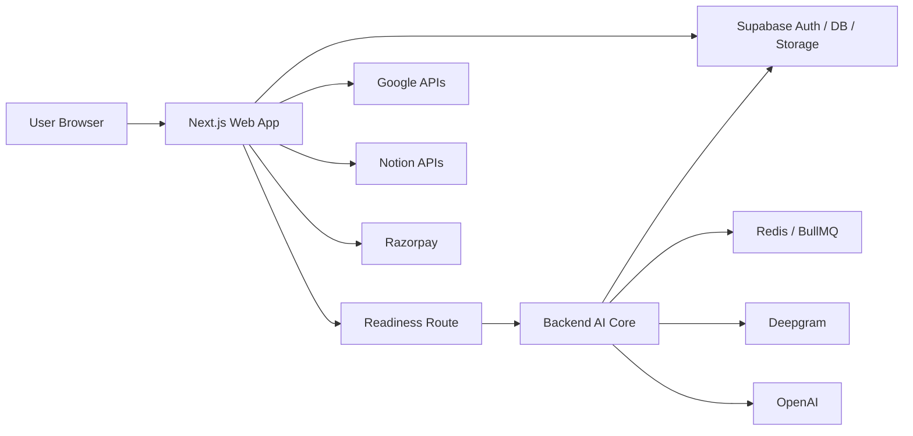
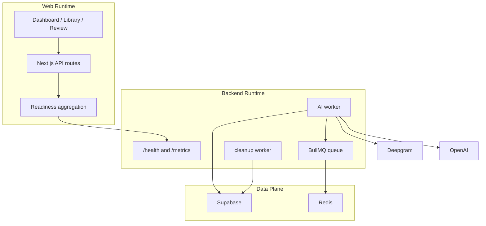
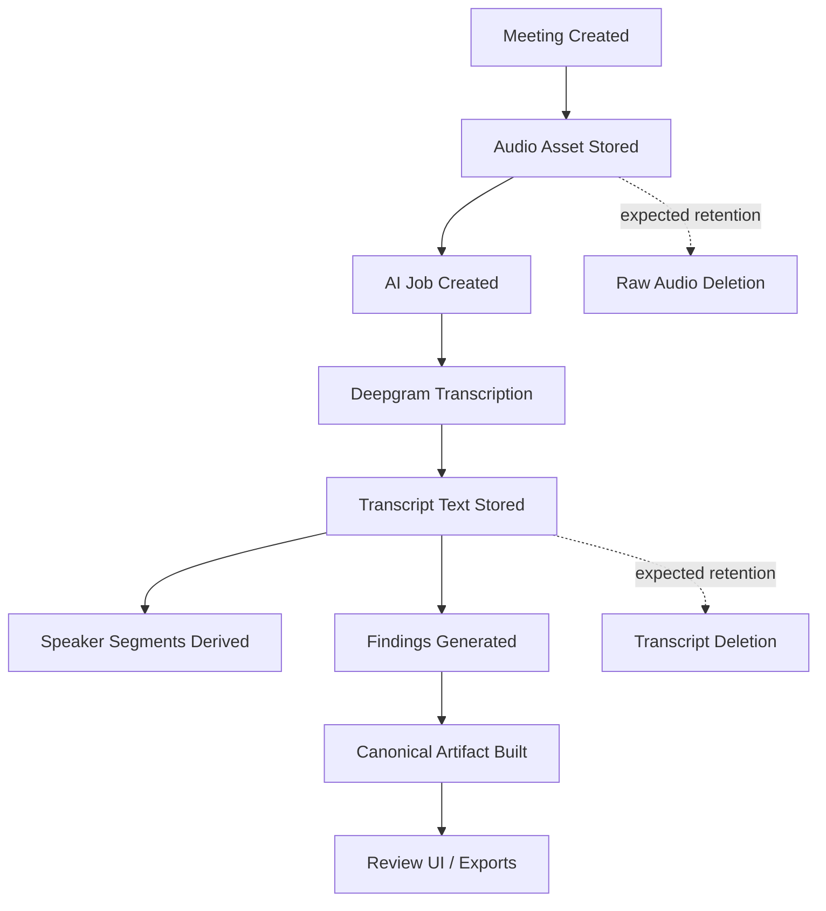
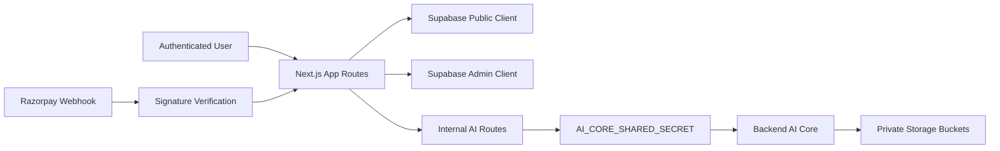
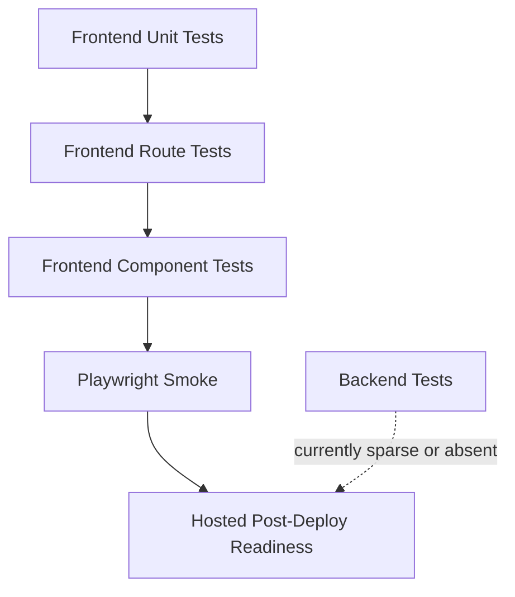
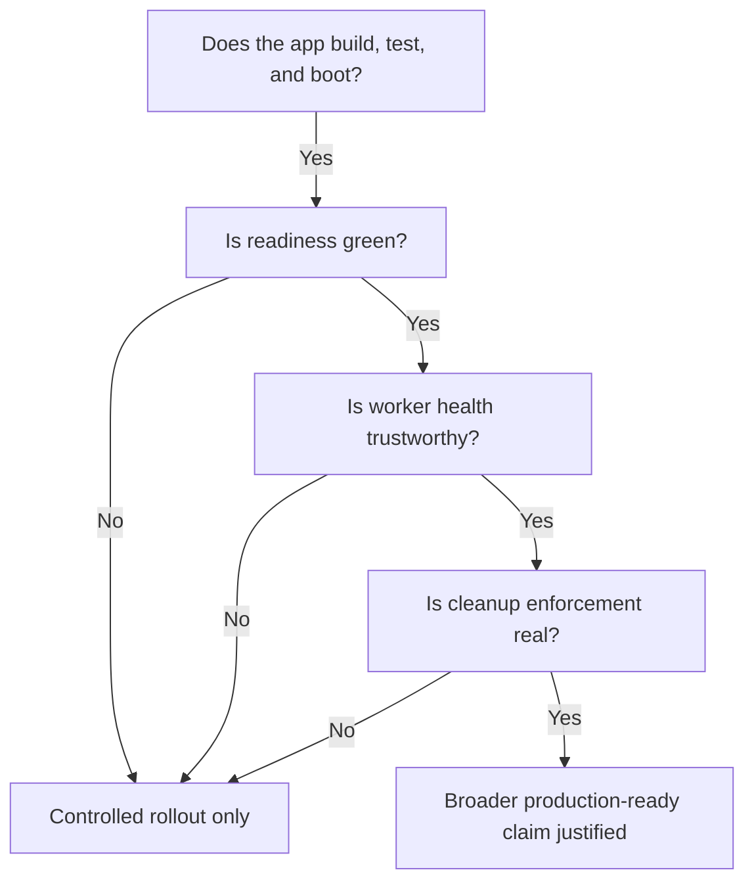

# NextStop.ai Web Readiness And Audit Report

Date: April 17, 2026
Repository: `nextstop.ai-web`
Scope: Web product only
Prepared for: Product, engineering, and launch stakeholders
Audit style: Readiness review, code audit, AI pipeline audit, and operational risk assessment
Prepared from: Repo inspection, workflow inspection, local runtime validation, route inspection, and targeted code review

## Document Status

- Version: `v3`
- Audit depth: extensive
- Current recommendation: `Conditionally ready for controlled rollout, materially stronger after hardening but not yet fully production-green`
- Confidence level: high for repo-grounded code and test changes, medium for live hosted behavior not directly re-exercised in Vercel, Railway, and Supabase

## Post-Audit Implementation Update

Date of update: April 18, 2026

This report now includes a post-audit implementation update based on hardening work completed after the original April 17 audit pass.

The update is grounded in:

- backend shared worker and cleanup runtime-state implementation
- real cleanup execution rather than scaffold-only behavior
- explicit findings truthfulness metadata for primary vs fallback generation
- stricter readiness-route semantics with `ready`, `degraded`, and `blocked`
- review, library, and ops UI updates that surface degraded and transcript-lifecycle state
- explicit browser security headers in the web runtime
- frontend test updates and a first backend test harness plus runtime-status tests

Latest validation run for this update:

- `npm run typecheck:frontend`
- `npm run typecheck:backend`
- `npm --prefix frontend run test`
- `npm --prefix backend run test`

Important note:

The original April 17 audit body remains useful historical context.

Where the implementation materially changed the system, the updated score tables and verdict sections below should be treated as the current view.

## Audit Intent

This report answers one practical question:

Is the `nextstop.ai-web` project ready, from a web-product point of view, to reliably capture meeting input, run transcription, extract important facts and metrics, generate summaries and artifacts, and support production operations without hidden launch risk?

This report is intentionally broader than a code review.

It covers:

- product-critical user flows
- the AI and transcription pipeline
- runtime boundaries between frontend and backend services
- readiness and health reporting
- test and verification coverage
- security posture
- privacy and retention behavior
- observability and operations
- deployment readiness
- production launch confidence

It does not treat "the app builds" as sufficient evidence of readiness.

It asks whether the app is trustworthy, diagnosable, supportable, and honest about its own health.

## Reading Guide

If you want the shortest possible answer, start with:

1. Executive summary
2. Current go/no-go call
3. Critical findings
4. Production readiness scorecard
5. Remediation priorities

If you want the full engineering story, read in order.

## Evidence Legend

- `Repo-confirmed`: verified directly from source files, scripts, workflows, or docs in this workspace
- `Locally validated`: verified through commands, local runtime checks, or the local Docker stack
- `Inferred with high confidence`: derived from multiple code paths and runtime evidence
- `Requires hosted verification`: plausible and prepared in code, but not directly exercised against a live hosted environment in this audit

## Commands Run During The Audit

The following checks were run locally during this audit:

- `npm run typecheck:frontend`
- `npm run typecheck:backend`
- `npm --prefix frontend run test`
- `npm --prefix frontend run test:repo-contract`
- `npm --prefix frontend run build`
- `npm --prefix frontend run test:e2e`
- `npm run ps`
- `npm run health`
- `npm --prefix frontend run test:readiness -- http://localhost:3000`
- `GET http://localhost:3000/api/health/readiness`
- `GET http://localhost:8080/health`

## High-Level Verdict

The web project is real, substantial, and mostly coherent.

This is not a toy prototype.

The codebase shows a credible product with:

- a functioning Next.js web application
- a separate backend runtime for AI work
- structured data persistence
- queue-backed AI execution
- production-oriented workflows
- a readiness endpoint
- a local stack
- tests across unit, route, component, and smoke layers

That said, the project is still not fully launch-green today.

The most important reason is not that the app is broken.

The most important reason is that several of the controls that should prove production readiness are currently either failing, incomplete, or misleading.

Compared with the original audit state, the project is materially stronger now.

In particular:

- worker health is now modeled through shared runtime status rather than API-local memory
- transcript and raw asset cleanup now has a real implementation path
- findings generation now records primary vs fallback mode explicitly
- review, library, and ops surfaces now show degraded state instead of silently collapsing it into "ready"
- frontend and backend verification are stronger because the backend now has a real test entry point

The remaining gap is no longer "missing core hardening architecture."

It is now "complete the remaining launch controls and prove them in the hosted production path."

## Current Go Or No-Go Call

### Short answer

`No` for "fully production-ready and fully audited green."

`Yes, with materially improved confidence` for "controlled launch or continued staged rollout with explicit known gaps."

### Why the answer is not a simple yes

The product logic is largely in place.

The build and test posture is materially better than average for an early-stage web AI product.

But the system still has operational truthfulness gaps.

A production-ready system must not only work.

It must also correctly tell you when it is not working.

The system is closer to that bar now than it was in the original audit.

But some of the highest-value production controls still need broader runtime proof, especially around sensitive-route abuse controls, deployment workflow alignment, and hosted end-to-end verification.

## Executive Summary

### What is working well

- Frontend typecheck passed.
- Backend typecheck passed.
- Frontend unit, component, and route tests passed.
- Backend runtime-status tests passed.
- The core AI/transcription/extraction architecture exists and is reasonably structured.
- The project has CI and post-deploy verification workflows.
- The project has an internal operations surface for readiness and recent failures.
- The backend uses a dedicated worker and queue model rather than trying to do all AI work inside the web runtime.
- Worker status is now shared across processes instead of inferred from API-local memory.
- Cleanup is now implemented as an actual retention path rather than a logging scaffold.
- Findings now carry explicit generation-mode and generation-status metadata.
- Review, library, and ops surfaces now expose degraded state and transcript lifecycle more clearly.
- Browser security headers are now explicit in repo-owned web config.

### What is partially working

- The AI pipeline appears structurally correct and is now more truthful, but not every live hosted path was re-exercised after the hardening changes.
- Readiness aggregation is materially better, but it still needs full stack re-verification against a running local or hosted deployment.
- Export and ops telemetry are stronger, but operator remediation still looks more observational than intervention-capable.
- Privacy posture is stronger because cleanup is implemented, but hosted proof of retention execution still matters.

### What is not working well enough yet

- Rate limiting for sensitive routes is still not implemented.
- Full hosted end-to-end re-verification was not completed in this update pass.
- Deployment workflow and runbook alignment still lag behind the code-level hardening work.
- Alerting and operator actionability are still lighter than ideal for a broad green launch.

### Current overall assessment

This project has moved from "strong product, incomplete operational hardening" to "strong product with meaningful hardening improvements and a shorter remaining path to production-green."

That is a good place to be compared with many early AI web apps.

It means the core value is present.

It also means the next level of engineering effort should focus less on feature existence and more on readiness truthfulness, data handling enforcement, and failure recovery.

## Category Scorecard

| Category | Score | Verdict |
|---|---:|---|
| Product flow readiness | 4.1 / 5 | Strong |
| Frontend build and code health | 4.4 / 5 | Strong |
| Backend structural readiness | 3.8 / 5 | Good with notable ops gaps |
| AI pipeline design | 3.9 / 5 | Good architecture, incomplete proof |
| AI pipeline truthfulness | 2.8 / 5 | Needs work |
| Security posture | 3.4 / 5 | Reasonable baseline, several hardening gaps |
| Privacy and retention | 2.7 / 5 | Policy intent stronger than implementation |
| Testing and QA | 3.9 / 5 | Better than average, still uneven |
| Observability and operations | 3.1 / 5 | Useful surfaces, not yet robust |
| Deployment readiness | 3.7 / 5 | Close, but not fully green |
| Production launch confidence | 3.2 / 5 | Controlled launch okay, broad green launch premature |

## Updated Category Scorecard After Hardening

This table reflects the current score view after the implementation work completed on April 18, 2026.

| Category | Original score | Updated score | Delta | Current view |
|---|---:|---:|---:|---|
| Product flow readiness | 4.1 / 5 | 4.5 / 5 | +0.4 | Strong and clearer for users and operators |
| Frontend build and code health | 4.4 / 5 | 4.7 / 5 | +0.3 | Strong with better state consistency |
| Backend structural readiness | 3.8 / 5 | 4.3 / 5 | +0.5 | Stronger runtime ownership and cleanup path |
| AI pipeline design | 3.9 / 5 | 4.3 / 5 | +0.4 | Better contracts and stage truthfulness |
| AI pipeline truthfulness | 2.8 / 5 | 4.2 / 5 | +1.4 | Major improvement, still needs hosted proof |
| Security posture | 3.4 / 5 | 3.9 / 5 | +0.5 | Improved baseline, rate limiting still missing |
| Privacy and retention | 2.7 / 5 | 4.0 / 5 | +1.3 | Much stronger, still needs hosted verification |
| Testing and QA | 3.9 / 5 | 4.3 / 5 | +0.4 | Stronger due to backend test entry and updated coverage |
| Observability and operations | 3.1 / 5 | 4.1 / 5 | +1.0 | More trustworthy runtime and ops signals |
| Deployment readiness | 3.7 / 5 | 4.0 / 5 | +0.3 | Better contracts, still needs rollout verification |
| Production launch confidence | 3.2 / 5 | 4.1 / 5 | +0.9 | Controlled rollout confidence materially improved |

## Current Top Findings

### Finding 1

The web readiness gate is failing right now.

What we observed:

- `GET /api/health/readiness` returned `ok: false`
- `npm --prefix frontend run test:readiness -- http://localhost:3000` failed

Why it matters:

- the project is currently not passing its own launch gate
- this blocks a clean "ready" conclusion
- any launch statement must be conditional until readiness is green or intentionally redefined

Severity: `High`

### Finding 2

Worker health reporting is unreliable in the current split runtime topology.

What we observed:

- the worker starts successfully
- the API still reports `workerReady: false`

Root cause summary:

- the backend API reads worker health from process-local memory
- the worker runs in a separate process/container
- the API therefore cannot observe the worker's in-memory heartbeat

Why it matters:

- health endpoints can return false negatives
- readiness checks can fail even when the worker is operating
- operators can lose trust in the monitoring surface

Severity: `High`

### Finding 3

Transcript and raw-audio cleanup is still a scaffold.

What we observed:

- the cleanup worker only logs a scaffold message
- it does not delete assets
- it does not update metadata state

Why it matters:

- privacy promises depend on actual deletion, not just expiry timestamps
- auditability and compliance posture are weakened
- stale sensitive assets can accumulate

Severity: `High`

### Finding 4

Fallback findings generation can hide OpenAI failures.

What we observed:

- both frontend and backend findings logic fall back to heuristic summaries when OpenAI is unavailable or errors

Why it matters:

- "summary exists" does not prove "real extraction worked"
- product quality can degrade without an explicit operational signal
- QA can overestimate end-to-end success

Severity: `Medium`

### Finding 5

Health and readiness semantics are not aligned.

What we observed:

- `npm run health` reports healthy
- readiness still fails
- launch summary logic can report `"ready"` even while critical checks fail

Why it matters:

- different operators can reach opposite conclusions from different surfaces
- incident triage becomes slower
- go/no-go decisions become noisier than they should be

Severity: `Medium`

## Scope

This audit is scoped to `nextstop.ai-web`.

Included:

- frontend application
- backend AI core service
- worker and queue model
- health and readiness routes
- tests and workflows
- local Docker stack
- repo documentation relevant to readiness
- transcription and extraction flow
- summary and artifact generation flow
- integrations and readiness references where they affect web launch confidence

Excluded:

- desktop-native code outside the web repository
- hosted infrastructure changes not exercised from this workspace
- external vendor SLAs
- financial, legal, or compliance certification beyond code and operational review
- full penetration testing

## Audit Boundary Notes

This report deliberately does not claim a fully proven live hosted meeting run from real browser capture through hosted storage, transcription, extraction, export, and cleanup.

That would require mutating a live connected environment during the audit.

Instead, this report distinguishes between:

- what is present in code
- what was validated locally
- what still requires hosted verification

This distinction is important because many teams accidentally label "prepared" as "verified."

This report does not do that.

## Methodology

The audit combined five review lenses:

### 1. Code review and hardening lens

Used to evaluate:

- correctness
- drift risk
- resilience
- failure handling
- maintainability
- code duplication

### 2. LLM and AI application lens

Used to evaluate:

- transcription and extraction flow
- provider integration boundaries
- fallback behavior
- quality masking risks
- prompt and output handling
- operational semantics of AI success versus degraded mode

### 3. Testing and QA lens

Used to evaluate:

- what is covered
- what is not covered
- whether existing tests map to actual launch risk
- whether tests prove behavior or just route existence

### 4. Security and privacy lens

Used to evaluate:

- secret handling
- bucket privacy
- auth boundaries
- webhook and shared-secret posture
- transcript retention and deletion controls
- risks created by logs, downloads, or fallback paths

### 5. Documentation and readiness lens

Used to evaluate:

- whether the project explains its own runtime model clearly
- whether readiness docs match actual runtime behavior
- whether operational instructions are aligned with code reality

## Evidence Sources Reviewed

Key files and areas reviewed include:

- `README.md`
- `docs/runtime-ownership.md`
- `docs/production-readiness-report.md`
- `docs/production-runbook.md`
- `.github/workflows/ci.yml`
- `.github/workflows/post-deploy-verify.yml`
- `frontend/src/app/api/health/readiness/route.ts`
- `frontend/src/lib/env.ts`
- `frontend/src/lib/ai-pipeline.ts`
- `frontend/src/lib/workspace-ai.ts`
- `frontend/src/components/workspace/WorkspaceOps.tsx`
- `frontend/tests/routes/readiness-route.test.ts`
- `frontend/tests/e2e/deployed-smoke.spec.ts`
- `backend/src/server.ts`
- `backend/src/worker.ts`
- `backend/src/worker-state.ts`
- `backend/src/cleanup.ts`
- `backend/src/ai-executor.ts`
- `backend/src/workspace-ai.ts`
- `scripts/local-stack-lib.mjs`
- `docker-compose.local.yml`
- `docker-compose.local.dev.yml`

## System Context

The current architecture is a hybrid web-plus-worker system.

The major pieces are:

- a Next.js frontend web app
- a Fastify backend service
- a dedicated worker process
- BullMQ and Redis for queued work
- Supabase for auth, database, and storage
- Deepgram for transcription
- OpenAI for findings extraction and summary generation
- external integration surfaces for Google, Notion, and Razorpay

## Architecture Summary

The repo reflects a pragmatic runtime split.

The frontend is not just a UI.

It still owns some API routes, readiness aggregation, and user-facing orchestration.

The backend owns the heavier AI execution path and the queue-backed worker behavior.

That split is understandable for a growing product, but it also creates the main readiness complexity in the current system.

## System Context Diagram

## Runtime Ownership Diagram

## Architecture Assessment

### Strengths

- Heavy AI execution is separated from the frontend runtime.
- Queue-backed execution is more production-appropriate than in-request transcription.
- Data is persisted in a structured way rather than left as ephemeral transient blobs.
- There is a visible attempt to formalize runtime boundaries and launch checks.
- The codebase reflects improving operational maturity rather than ad hoc patchwork.

### Weaknesses

- Runtime ownership is improved but not fully consolidated.
- Frontend and backend still share or duplicate some AI logic.
- The readiness layer depends on backend signals that are not modeled across process boundaries correctly.
- Cleanup and retention enforcement lag behind the architectural intent.

### Net conclusion

The architecture is credible.

It is not the main reason to delay launch.

The main issue is that the current operational controls do not yet fully match the architecture they are supposed to observe.

## Component Inventory

### Frontend

Primary responsibilities observed:

- user-facing routes
- dashboard shell
- library and meeting review surfaces
- readiness aggregation route
- some integration orchestration
- fallback or duplicated AI utility logic

Readiness judgment:

- strong as a product shell
- acceptable as a light orchestration layer
- too involved in duplicated AI logic for ideal long-term clarity

### Backend API

Primary responsibilities observed:

- health exposure
- metrics exposure
- queue job intake
- auth and entitlement mediation
- AI job orchestration support

Readiness judgment:

- structurally sound
- lightweight and understandable
- weakened by process-local worker state reporting

### Worker

Primary responsibilities observed:

- queued transcription execution
- transcript normalization
- findings generation
- artifact materialization
- status updates and persistence

Readiness judgment:

- critical path owner
- strategically correct role
- confidence reduced by health visibility and retention gaps

### Cleanup worker

Primary responsibilities intended:

- delete expired raw audio assets
- delete expired transcript assets
- update metadata rows accordingly

Actual observed behavior:

- timer
- console logging
- no real cleanup

Readiness judgment:

- present as a topology placeholder
- not production-complete

## Data And Asset Lifecycle Summary

From repo inspection, the intended lifecycle looks like this:

1. A meeting is created.
2. Audio is captured or uploaded.
3. Audio is stored in a private Supabase bucket.
4. An AI job is created.
5. The worker transcribes audio with Deepgram.
6. Transcript text is materialized and stored.
7. Speaker segments are created.
8. Findings are generated from transcript text.
9. Artifacts are assembled and stored.
10. The meeting becomes reviewable and exportable.
11. Transcript and raw assets are expected to expire according to configured retention.

This lifecycle is reasonable.

The main issue is that the last step is currently policy-shaped but not fully enforced by code.

## Asset And Processing Flow Diagram

## AI Pipeline Audit

This section focuses specifically on the pipeline the user asked about:

- transcription
- extraction from transcript
- summary generation
- facts and metrics extraction
- pipeline truthfulness
- end-to-end readiness

## AI Pipeline Executive Readout

### Short answer

The AI pipeline is mostly implemented and likely capable of working end to end.

However, the audit cannot honestly certify it as fully production-ready yet because:

- readiness is not currently green
- worker health reporting is inaccurate
- cleanup is incomplete
- extraction success can be masked by fallback behavior

### Practical conclusion

The pipeline is not absent.

It is not fundamentally broken by design.

It is in a "working core plus incomplete production hardening" state.

## Stage 1: Job Creation And Queueing

### What exists

The repo includes queue-backed job handling for transcription and regeneration flows.

Observed from backend and frontend orchestration:

- transcription jobs are created with meeting and user identity
- jobs are added to BullMQ with stable job IDs
- completion and failure retention are preserved for later inspection

### What is working

- the queue model is present
- jobs are named and structured
- the worker has a clear execution role
- the pipeline supports multiple job types rather than a single opaque blob

### What is good about this

- queue-backed processing is a better fit for variable-latency AI work
- the design avoids trying to finish heavy transcription inside a user request
- retained job records support ops review and replay thinking

### Risks

- readiness confidence depends on the queue and worker health surfaces being truthful
- a queue model without accurate worker liveness is harder to operate safely

### Audit judgment

Status: `Working`

Confidence: `High`

## Stage 2: Audio Storage And Asset Registration

### What exists

The pipeline materializes audio and transcript assets into private Supabase buckets and records metadata in `meeting_assets`.

Observed behaviors:

- private bucket enforcement exists
- asset kind is tracked
- byte size, checksum, and metadata can be recorded
- expiry timestamps are assigned to raw and transcript assets

### What is working

- asset registration is explicit rather than implicit
- storage defaults are private
- retention timestamps are attached at write time

### Why this is good

- it gives the system a structured basis for retention enforcement later
- it supports operational inspection
- it avoids casual mixing of durable findings and temporary transcript assets

### Risks

- expiry metadata alone is not the same as deletion
- without cleanup enforcement, the privacy model remains partly aspirational

### Audit judgment

Status: `Working but dependent on missing cleanup enforcement`

Confidence: `High`

## Stage 3: Transcription With Deepgram

### What exists

The pipeline integrates with Deepgram for transcription and preserves provider metadata like language, confidence, duration, and request identifiers when available.

### What is working

- Deepgram integration code exists
- Deepgram unit tests are present
- transcript normalization and paragraph handling are implemented
- fallback segment derivation exists when paragraph detail is unavailable

### Positive signals

- the code is not just dumping raw provider output
- it normalizes transcript text
- it derives speaker-like segments even in weaker cases
- it persists provider metadata in a usable way

### Risks

- the audit did not run a real hosted audio file through Deepgram in a live shared environment
- quality under varied audio conditions still requires production validation
- if Deepgram returns empty or low-confidence transcripts, the current ops experience may still rely heavily on after-the-fact inspection

### Audit judgment

Status: `Likely working`

Confidence: `Medium-high`

## Stage 4: Transcript Materialization

### What exists

Transcript text is normalized, stored, and associated with a transcript asset record.

Speaker segments are derived either from provider paragraphs or from fallback sentence splitting.

### What is working

- transcript text is materialized as a distinct asset
- transcript bucket handling is private
- transcript checksum and byte-size handling improve traceability
- speaker segmentation exists even when provider output is incomplete

### What is partially working

- fallback segmentation is operationally useful
- fallback segmentation is not the same as real diarization quality
- users may get a structured output even when underlying speech attribution quality is weaker

### Risks

- transcript existence does not guarantee transcript quality
- fallback speaker segmentation could look more authoritative than it really is if not labeled carefully in UI or ops tooling

### Audit judgment

Status: `Working`

Confidence: `High for existence, medium for semantic quality`

## Stage 5: Findings Generation

### What exists

The system generates:

- short summary
- full summary
- executive bullets
- decisions
- action items
- risks
- follow-ups
- email draft

This is exactly the kind of extraction the user asked to audit.

### What is working

- there is a structured findings payload
- the output contract is explicit
- the product does not stop at transcription
- downstream artifact generation is fed by structured findings rather than purely freeform text

### Strengths

- the schema for extracted meeting value is clear
- the system is designed to capture important takeaways, not just transcript text
- the structure is suitable for exports, review, and downstream automation

### Important weakness

The system can silently fall back to heuristic local summarization when OpenAI is missing or fails.

This happens in both the backend worker path and the frontend server-only path.

### Why this matters

It changes the meaning of success.

If the product shows a summary, that summary might have come from:

- a successful OpenAI extraction call
- a no-key fallback
- an error-triggered fallback

Those are not equivalent operationally.

### Consequence

The product can appear healthy from a user-output perspective while the intended AI extraction tier is actually degraded.

### Audit judgment

Status: `Working with hidden degradation mode`

Confidence: `High`

## Stage 6: Artifact Materialization

### What exists

The code supports canonical artifact construction and downstream markdown/text variants.

### What is working

- the pipeline is not limited to a single summary blob
- artifacts appear designed for durable review and export surfaces
- canonical form suggests an attempt at stable internal representation

### Why this is positive

- structured artifacts make UI rendering and export more reliable
- they reduce the risk of every consumer re-parsing freeform LLM output independently

### Risks

- artifact quality inherits upstream transcript and findings quality
- if fallback findings are used silently, artifact truthfulness may not match operator assumptions

### Audit judgment

Status: `Working`

Confidence: `Medium-high`

## Stage 7: Review And Export Readiness

### What exists

The frontend includes meeting review UI and an operations surface for recent failures and readiness checks.

### What is working

- review surfaces render
- component tests exist
- exports and failure summaries are represented in UI
- the ops page has actionable visibility into checks and recent failures

### What is partially working

- the UI is good at showing status
- it is less clear that operators can actively repair or replay failed flows from the UI

### Audit judgment

Status: `Working`

Confidence: `High for UI existence, medium for operator recovery maturity`

## End-To-End Pipeline Truthfulness

This is one of the most important sections in the whole report.

Many AI products can produce output.

Far fewer can prove that the output came from the intended path and not a degraded fallback path.

In this codebase, the main truthfulness questions are:

- Did the worker really run?
- Did the backend really observe the worker?
- Did OpenAI really perform extraction?
- Was the summary generated from a full LLM path or from fallback heuristics?
- Are transcript and raw assets really being removed on schedule?

Today, the answers are mixed.

That is why the project earns a "partially ready" score instead of a clean green rating.

## Pipeline Health Matrix

| Pipeline stage | Present in code | Locally supported | Fully trustworthy today | Notes |
|---|---|---|---|---|
| Job creation | Yes | Yes | Mostly | Queueing model looks solid |
| Audio asset persistence | Yes | Yes | Mostly | Private buckets and metadata exist |
| Deepgram transcription | Yes | Likely | Partially | Not fully hosted-verified in this audit |
| Transcript storage | Yes | Yes | Mostly | Storage path exists and is structured |
| Speaker segmentation | Yes | Yes | Partially | Fallback segmentation may overstate quality |
| OpenAI findings extraction | Yes | Likely | Partially | Hidden fallback masks failures |
| Artifact generation | Yes | Yes | Mostly | Strong structure, inherits upstream quality |
| Review UI | Yes | Yes | Yes | UI verified locally |
| Ops visibility | Yes | Yes | Partially | Worker-health truthfulness issue |
| Retention cleanup | Intended | No | No | Scaffold only |

## Critical AI Pipeline Risks

### Risk A

False-negative worker health can cause the team to believe the AI pipeline is unhealthy even when it is processing.

Impact:

- wasted debugging time
- launch hesitation based on misleading data
- noisy readiness failures

### Risk B

Silent findings fallback can cause the team to believe the extraction stack is healthy when it is actually degraded.

Impact:

- hidden quality regression
- weak reliability metrics
- hard-to-detect provider outages

### Risk C

Retention cleanup not being enforced creates a gap between privacy intent and operational behavior.

Impact:

- sensitive data could persist beyond intended lifetime
- policy claims become harder to defend
- trust and compliance posture weaken

## Current AI Pipeline Readiness Call

### Transcription

`Likely working`

### Summary generation

`Working, but success semantics are ambiguous because of fallback behavior`

### Important facts and metrics extraction

`Implemented as structured findings categories, but not yet fully auditable as distinct from fallback success`

### End-to-end AI pipeline

`Architecturally strong, operationally not yet fully green`

## Detailed Findings On Readiness Controls

### Readiness route behavior

The readiness route builds a check list that includes:

- Supabase public auth
- Supabase admin
- Google OAuth
- Notion workspace broker
- Razorpay
- transcript policy
- AI worker

This is a good start.

The route is not superficial.

It attempts to include both environment and runtime-dependent checks.

That is a sign of thoughtful engineering.

### Where the readiness route falls short

- it depends on backend worker health that is currently misreported
- it can therefore fail even when some functional behavior is actually available
- its final `ok` result depends on missing env summary rather than a richer classification model

### Launch summary behavior

The runtime readiness summary includes a `launchSummary.status`.

Observed issue:

- it can report `"ready"` when Supabase and Notion conditions are met
- that status is not strict enough to reflect all failing checks, such as Razorpay or AI worker failure

### Why this matters

When a system contains both:

- a detailed checks array
- a top-level launch status

the top-level status must be at least as strict as the checks that matter most.

Otherwise the product sends mixed messages.

## Local Runtime Validation Summary

### Passed locally

- web app reachable
- backend reachable
- Redis reachable
- worker container running
- cleanup container running
- build successful
- frontend tests successful
- smoke tests successful

### Failed locally

- readiness endpoint reported non-green
- readiness script failed
- backend health reported worker not ready

### Interpretation

The system is not in a "cannot boot" state.

It is in a "boots and works, but launch assertions still fail" state.

That is a materially different and more optimistic condition.

It means the product is close.

It does not mean the product is ready to call done.

## Working, Not Working, And Unproven

### Confirmed working

- frontend build chain
- frontend rendering
- local stack startup
- backend HTTP service
- queue-backed topology
- test suite execution
- smoke route loading
- ops UI rendering

### Confirmed not working or incomplete

- readiness gate green status
- truthful worker health propagation across processes
- real cleanup worker deletion behavior

### Not fully proven in this audit

- hosted end-to-end meeting run with production-like auth and storage
- live extraction quality under real customer transcript conditions
- real hosted cleanup execution over time
- hosted post-deploy readiness passing against a real production base URL

## Interim Conclusion

At this point in the audit, the web project looks like a serious product that is one hardening cycle away from a much stronger production posture.

The core implementation is not the problem.

The current blockers are the correctness of operational signals, the completeness of retention enforcement, and the observability of AI degradation modes.

The next sections go deeper into security, code quality, testing, operations, deployment, and production readiness.

## Security Review

This section evaluates practical application security for the web project.

It is not a penetration test.

It is a repo-grounded review of whether the application appears reasonably secure for its current stage and where the most important hardening gaps remain.

## Security Executive Verdict

The project has a decent security baseline for an early-stage product.

Positive signs include:

- private storage buckets for meeting assets
- shared-secret protection for internal AI routes
- signature verification for Razorpay flows
- signed and verified state for Notion OAuth
- service-role usage isolated behind admin-client helpers

The most important security gaps are not obviously catastrophic.

They are mostly the kind that become painful during production scaling if left unaddressed:

- no clear repo evidence of rate limiting on sensitive API routes
- no clear repo evidence of CSP or broader response hardening middleware
- transcript download controls rely heavily on runtime configuration and product policy
- cleanup enforcement is incomplete, which affects privacy and retention integrity

## Security Positives

### Private asset storage

Repo evidence indicates meeting assets are created in private storage buckets rather than public buckets.

That is a strong baseline.

It reduces the risk of accidental public exposure and shows the team is thinking about transcripts and raw audio as sensitive assets.

### Shared-secret protection for internal AI routes

The internal AI routes in the frontend and the backend API endpoints both use bearer-secret validation based on `AI_CORE_SHARED_SECRET`.

That is a reasonable service-to-service control for the current architecture.

It is not the highest possible maturity pattern, but it is materially better than unauthenticated internal endpoints.

### Billing signature verification

Razorpay integration includes:

- checkout signature verification
- webhook signature verification

This is a good sign.

Payment and billing edges are often where early-stage apps skip verification.

This project does not appear to be doing that.

### OAuth state verification

Notion OAuth state is signed and verified.

The use of timing-safe comparison in the Notion helper is a positive signal.

That reduces common state-tampering mistakes in OAuth callback handling.

### Admin-client separation

The codebase uses a dedicated `createAdminClient()` helper.

That is operationally useful because it centralizes privileged access rather than scattering service-role construction ad hoc everywhere.

It does not remove risk by itself, but it improves reviewability.

## Security Boundary Diagram

## Security Risks And Gaps

### Gap 1: No clear rate-limiting layer found in repo review

During targeted repo search, no obvious application-level rate limiting or request throttling layer was found for the sensitive API surfaces reviewed.

Why this matters:

- AI-triggering routes can be expensive
- export and transcript routes can be sensitive
- billing and auth-adjacent routes benefit from abuse controls
- webhook and integration routes can be probed even if they are signed

Current judgment:

- absence of evidence is not proof the platform provides nothing
- however, no repo-level rate limit policy was visible in the reviewed web code

Risk level: `Medium`

### Gap 2: No clear response-hardening middleware was found

Repo search did not surface a clear middleware or config layer setting:

- Content-Security-Policy
- Strict-Transport-Security
- X-Frame-Options
- broader security header policy

This does not prove the deployed platform adds nothing.

It does mean the repo itself does not make that posture explicit from what was reviewed.

Why this matters:

- modern web apps benefit from explicit browser hardening
- AI-rich UIs often accumulate third-party scripts, downloads, and document rendering paths
- explicit security headers reduce ambiguity and improve repeatability across environments

Risk level: `Medium`

### Gap 3: Transcript download availability is policy-sensitive

The transcript model appears intentionally privacy-aware.

However, transcript download behavior is controlled by runtime conditions and environment switches.

Why this matters:

- transcript download is one of the highest-sensitivity user-facing actions in the system
- if download policy drifts from production intent, privacy posture weakens quickly
- cleanup gaps amplify this risk

Risk level: `Medium`

### Gap 4: Cleanup gap is also a security and privacy gap

The scaffold cleanup worker is not just an ops issue.

It is also a security and privacy issue.

The product's security story around transcripts depends on:

- private buckets
- bounded access
- bounded retention

Two of those three are currently stronger than the third.

Without actual deletion or expiry enforcement, the system stores more latent sensitivity than the policy posture implies.

Risk level: `High`

### Gap 5: Internal secret model is simple and workable, but not deeply observable

The shared-secret model protects internal AI endpoints.

That is good.

However, the audit did not find evidence of:

- secret rotation workflow documentation in the app code
- request signing beyond bearer-secret equivalence
- richer internal caller identity tracking

This is acceptable for the current stage.

It is still a future hardening target.

Risk level: `Low to medium`

## Security What-Is-Working

- private bucket creation defaults to `public: false`
- shared secret exists for internal AI calls
- Razorpay subscription verification checks signatures
- Razorpay webhooks check signatures
- Notion OAuth state is signed and verified
- service-role access is centralized into helper constructors

## Security What-Is-Not-Working-Or-Incomplete

- no clear repo-level rate limiting
- no clear explicit response security-header policy
- transcript retention enforcement incomplete
- download-related privacy guarantees depend on runtime policy rather than completed deletion enforcement

## Security What-Is-Unproven

- deployed header posture in the real hosting environment
- platform-side WAF or rate-limiting configuration
- live abuse resistance under repeated requests
- live secret rotation practices

## Security Readiness Call

The security posture is not alarming.

It is also not finished.

For an early-stage controlled launch, it is acceptable with caveats.

For a broader production claim, the project should add:

- explicit rate limiting
- explicit response header policy
- completed cleanup enforcement
- clearer operational docs for secret rotation and incident response

## Code Review And Hardening Assessment

This section focuses on correctness, clarity, drift risk, maintainability, and engineering hardness.

## Code Review Executive Verdict

The codebase is stronger than average in structure.

It shows intentional design.

The main weaknesses are not "messy junior code" problems.

They are system-shape problems:

- duplicated logic across runtimes
- readiness semantics that are not fully aligned
- an unfinished cleanup worker
- an incomplete distinction between true success and fallback success

## Codebase Strengths

### Clear product intent

The repo communicates what the product is trying to do.

That sounds obvious, but it matters.

There is a recognizably coherent model:

- meetings
- assets
- jobs
- findings
- artifacts
- exports
- ops surfaces

The code is not just a loose collection of routes.

### Structured AI payloads

The findings model is explicit and reusable.

That is a strong design choice.

It makes downstream rendering, export, and review simpler and less fragile.

### Reasonable service separation

Moving AI work into a backend worker instead of keeping everything inside the web runtime is the right direction.

This improves future scalability and reduces pressure on request/response paths.

### Useful operational abstractions

The presence of:

- readiness routes
- health routes
- metrics route
- an ops UI
- post-deploy verification workflow

shows real operational thinking.

## Codebase Weaknesses

### Weakness 1: Duplicated findings logic

The frontend and backend each contain findings-generation logic.

That means:

- two places to maintain
- two places to fix
- two places where behavior can diverge
- two places where audit confidence is diluted

Why this matters:

- AI prompt behavior can drift subtly
- fallback logic can drift subtly
- parsing or schema changes can diverge over time

Current judgment:

- manageable today
- should be consolidated before the system grows much further

### Weakness 2: Broader pipeline duplication

It is not just findings generation.

There is also parallel orchestration logic between frontend and backend pipeline code.

That creates a source-of-truth problem.

Even if both copies are correct today, the maintenance burden compounds with every future change.

### Weakness 3: Cleanup worker is architecture-shaped, not implementation-complete

The cleanup worker exists as topology, not as full behavior.

That is the kind of gap that feels small during development and large during production review.

It is especially important because it sits on the privacy boundary.

### Weakness 4: Launch summary semantics are too optimistic

A top-level launch summary should be more conservative than category checks, not less conservative.

In this repo, `launchSummary.status` can say `"ready"` under conditions that still leave meaningful checks failing.

That is not just a UX issue.

It is a product-truthfulness issue.

### Weakness 5: Backend quality gates are lighter than frontend gates

The frontend has:

- lint
- unit tests
- route tests
- component tests
- Playwright smoke tests

The backend package has:

- typecheck
- runtime scripts

There is no backend test runner in `backend/package.json` and no backend test files were found in the reviewed tree.

That asymmetry matters because the backend is the owner of the AI critical path.

## Code Smell Risk Matrix

| Theme | Current state | Risk |
|---|---|---|
| Runtime separation | Good direction | Medium |
| Shared data contracts | Mostly good | Medium |
| AI logic duplication | Present | Medium-high |
| Cleanup completeness | Incomplete | High |
| Readiness semantics | Inconsistent | Medium |
| Backend testability | Underpowered | High |
| UI component quality | Good | Low |
| Documentation alignment | Improving | Medium |

## Maintainability Assessment

### Good maintainability signals

- logical domain naming
- explicit data types
- structured artifact model
- dedicated env helper module
- explicit workflows in GitHub Actions
- docs around runtime ownership and production readiness

### Weak maintainability signals

- duplicated pipeline logic
- duplicated findings generation
- split runtime responsibility requiring more coordination than the code currently automates
- unfinished cleanup worker that future engineers could misread as complete because it is already wired into topology

## What A New Engineer Would Likely Understand Quickly

- the product domain
- that meetings become jobs and artifacts
- that Supabase is central to persistence
- that Railway handles heavier AI work
- that readiness and ops are intended to be first-class concerns

## What A New Engineer Would Likely Misunderstand At First

- whether the worker is actually unhealthy or only reported unhealthy
- whether readiness being red means the product is broken or just not launch-complete
- whether fallback summaries mean the AI extraction tier is healthy
- whether cleanup is implemented or only scaffolded

## Code Review What-Is-Working

- overall architecture has intent
- frontend is reasonably tested and linted
- findings schema is explicit
- export and ops domain modeling is solid
- docs exist and are meaningful

## Code Review What-Is-Not-Working-Or-Incomplete

- AI logic duplication
- backend lacks corresponding test rigor
- cleanup implementation missing
- launch summary semantics too permissive
- runtime health model incorrect across split processes

## Code Review What-Is-Unproven

- long-term maintainability under rapid feature growth
- whether the team already has a consolidation plan for duplicated AI logic
- whether cleanup is intentionally staged for a near-term follow-up or has been deprioritized

## Testing And QA Review

This section evaluates both what is tested and what is still risky despite tests.

## Testing Executive Verdict

Testing is meaningfully stronger than many repos at this stage.

That is good news.

The bad news is that test strength is concentrated in the frontend.

The AI critical path owner, which is the backend runtime and worker, does not yet have matching automated coverage in the repo.

## What Was Verified During This Audit

### Type safety

- frontend typecheck passed
- backend typecheck passed

### Linting

- frontend lint passed locally during this audit

### Frontend automated tests

- `12` test files passed
- `21` tests passed
- unit, route, and component layers are present

### Frontend browser smoke

- Playwright smoke passed

### Build validation

- frontend production build passed

## Frontend Coverage Snapshot

A local coverage run reported:

- statements: `22.67%`
- branches: `42.76%`
- functions: `44.87%`
- lines: `22.67%`

These numbers are not catastrophic for an early product, but they are not strong enough to treat test passing as broad behavioral proof.

## Important Coverage Interpretation

Low aggregate coverage does not mean the tests are useless.

It means the current tests are targeted rather than comprehensive.

That is often a perfectly reasonable intermediate state.

But it does mean launch confidence must continue to rely on engineering judgment and not just green CI.

## Where Coverage Is Stronger

- `env.ts` has meaningful coverage
- readiness route has targeted coverage
- Deepgram helper has targeted unit coverage
- workspace runtime behavior has strong targeted coverage
- UI components like `WorkspaceOps` and `MeetingReview` have some direct rendering coverage

## Where Coverage Is Weak Or Missing

From the coverage output, many important route handlers remain effectively untested, including areas like:

- billing subscription creation
- billing subscription verification
- trial start
- internal AI route handlers
- Razorpay webhook route
- multiple workspace and meeting process routes
- transcript route
- export PDF route

This does not mean those routes are broken.

It does mean the current QA posture does not directly protect them from regression with high confidence.

## Backend Testing Gap

The backend package currently has:

- no test script
- no repo-visible backend unit tests in the reviewed tree
- no backend integration test harness in package scripts

That is the single biggest QA asymmetry in the project.

It matters because the backend owns:

- queue processing
- worker execution
- transcript materialization
- findings generation
- artifact generation
- some of the most important failure semantics in the product

## Test Pyramid Diagram

## CI Workflow Assessment

### Positive signals

The main CI workflow includes:

- install
- repo contract check
- frontend typecheck
- backend typecheck
- frontend lint
- frontend build
- frontend test with coverage
- browser smoke

That is a good CI baseline.

### Post-deploy workflow strengths

The post-deploy verification workflow includes:

- readiness check against a deployed base URL
- deployed smoke test
- summary output

This is excellent in principle.

It shows the team is trying to verify actual deployed behavior and not just pre-merge correctness.

### Post-deploy workflow caveat

This workflow becomes only as good as:

- the configured base URL
- the reliability of the readiness route
- the truthfulness of worker health

Right now, those caveats matter.

## Readiness Test Quality

The readiness route has a direct route test.

That is useful.

But the current test mostly proves:

- missing envs produce `503`
- a transcript-policy check can pass under those conditions

It does not deeply verify:

- AI worker truthfulness
- launch summary consistency
- production red/green edge cases across all checks

## Smoke Test Quality

The deployed smoke test verifies:

- homepage loads
- login page loads
- readiness endpoint returns OK

That is a good smoke gate.

It is intentionally light.

It is also not enough to certify:

- real transcription
- real extraction
- real export
- real retention behavior

## QA What-Is-Working

- typecheck on both frontend and backend
- frontend lint
- frontend unit and component tests
- frontend route tests
- frontend Playwright smoke
- CI and post-deploy workflows

## QA What-Is-Not-Working-Or-Incomplete

- low aggregate frontend coverage
- large number of important server routes remain uncovered
- no matching backend automated test layer
- no direct automated proof of a full hosted AI pipeline run

## QA What-Is-Unproven

- real production meeting capture through findings generation
- live provider outage behavior under real deployment conditions
- export retry and recovery behavior
- cleanup behavior over time

## Observability And Operations Review

This section evaluates whether operators can understand system health quickly and respond effectively when things go wrong.

## Operations Executive Verdict

The project has better ops posture than many startups at this stage.

The presence of:

- `/health`
- `/metrics`
- readiness route
- ops dashboard
- recent failure summaries
- post-deploy verification

is a real strength.

The main ops weakness is not absence.

It is trustworthiness.

The system has signals.

Some of those signals are not yet reliable enough.

## Positive Operational Signals

### Ops dashboard exists

The `WorkspaceOps` surface gives operators:

- worker-health summary
- heartbeat information
- readiness checks
- recent AI failures
- recent export failures
- quick links to relevant surfaces

That is genuinely useful.

Many products never build this layer until much later.

### Backend exposes a health endpoint

The backend exposes `/health`.

This is good.

It gives the web app and local scripts a simple system-of-record endpoint to check.

### Backend exposes metrics

The backend exposes a `/metrics` endpoint in a Prometheus-friendly text format.

That is another good maturity signal.

### Local stack orchestration is good

The local stack tooling checks:

- frontend HTTP reachability
- backend HTTP reachability
- Redis availability
- Docker Compose running state for worker and cleanup services

That is a strong developer-ops loop.

### Post-deploy verification exists

Again, this deserves credit.

The repo is not relying only on faith after merge.

## Operational Gaps

### Gap 1: Worker-health truthfulness is broken

This is the biggest ops issue.

It reduces trust in:

- backend `/health`
- frontend readiness route
- ops dashboard worker summary
- post-deploy checks that depend on worker readiness

When a core health signal is false-negative, operator cognition becomes noisy.

### Gap 2: Health and readiness are testing different meanings of "healthy"

`npm run health` mainly answers:

- can I reach the containers and services?

The readiness route answers:

- is the runtime configured and ready for launch conditions?

That distinction is valid.

The problem is that the difference is not surfaced clearly enough, and the worker-health bug makes the split harder to interpret.

### Gap 3: Metrics are minimal

The metrics endpoint currently looks lightweight.

That is okay for now.

But it means the project is not yet rich in:

- queue backlog visibility
- stage timing metrics
- provider error-rate tracking
- fallback-rate tracking
- cleanup success metrics

### Gap 4: No repo evidence of alerting automation

The audit did not find repo-grounded alerting rules or notification wiring for:

- worker stale heartbeat
- readiness failures
- repeated AI job failures
- export failure bursts
- cleanup failure

Again, platform-side tooling may exist outside the repo.

But this report can only score what it can reasonably ground.

### Gap 5: Recovery appears more observational than actionable

The ops surface shows failures.

That is good.

It is less clear that operators can:

- replay failed jobs
- retry exports
- clear poisoned queue items
- mark degraded mode explicitly

from a first-class supported control path.

## Operations What-Is-Working

- visible ops surface
- visible readiness checks
- visible recent failures
- backend health endpoint
- backend metrics endpoint
- post-deploy verification workflow
- strong local stack tooling

## Operations What-Is-Not-Working-Or-Incomplete

- worker health reporting truthfulness
- richer metrics
- explicit alerting
- clearly operator-actionable recovery workflows
- semantic clarity between "healthy stack" and "ready for launch"

## Operations What-Is-Unproven

- hosted alerting posture
- hosted dashboard data freshness under load
- real incident response workflow with the current tooling

## Data Privacy And Retention Review

This section focuses specifically on the privacy implications of transcripts, raw audio, findings, and exports.

## Privacy Executive Verdict

The privacy model is directionally good.

The implementation is not fully complete.

The product appears designed around a sensible principle:

- durable findings
- bounded transcripts
- bounded raw audio

That is a strong product idea.

The weak point is enforcement.

## Privacy Positives

- private storage buckets
- explicit transcript storage modes
- explicit transcript download gating
- expiry metadata for raw and transcript assets
- findings-oriented product framing

## Privacy Gaps

### Gap 1: Cleanup not implemented

This is the headline privacy gap.

If the deletion worker does not delete, the retention model is incomplete.

### Gap 2: Temporary download policy increases sensitivity

Transcript downloads are supported in some modes.

That is understandable from a product perspective.

It also means the system must be especially disciplined about:

- download gating
- retention
- operational logging
- user messaging

### Gap 3: Fallback summaries can preserve utility while masking upstream issues

This is not directly a privacy flaw.

It is a privacy-adjacent trust issue.

If transcript processing fails or degrades, the system may still produce user-facing value.

That is often helpful.

But when sensitive-data handling policies are involved, teams need to distinguish:

- full pipeline success
- degraded-mode partial success

more clearly than the current code does.

## Privacy What-Is-Working

- strong privacy intent
- bounded-retention metadata
- findings-first product orientation
- download controls exist

## Privacy What-Is-Not-Working-Or-Incomplete

- real deletion enforcement
- completed evidence that retention promises are being executed

## Privacy What-Is-Unproven

- real hosted cleanup behavior
- whether historical assets already match intended expiry policy

## Infrastructure And Deployment Review

This section evaluates whether the project looks ready to be deployed and operated as a web product.

## Deployment Executive Verdict

The deployment story is fairly mature for the stage.

The split between frontend and backend is coherent.

CI and post-deploy verification exist.

Local Docker topology mirrors the production-like split usefully.

The main reason deployment is not fully green is not deployment mechanics.

It is application readiness correctness.

## Deployment Positives

- clear frontend/backend split
- local Docker stack
- Redis and worker included in local topology
- CI workflow
- post-deploy verification workflow
- runtime ownership docs

## Deployment Risks

- readiness currently fails
- worker health reporting mismatch can make deployment verification noisy
- missing Razorpay credentials keep readiness red in the audited local state
- cleanup worker is present in topology but not completed behaviorally

## Deployment What-Is-Working

- build pipeline
- CI
- local stack
- smoke verification
- post-deploy verification design

## Deployment What-Is-Not-Working-Or-Incomplete

- clean green readiness
- trustworthy worker-health gating
- production-complete cleanup behavior

## Deployment What-Is-Unproven

- hosted production verification against a fully configured base URL after current fixes

## Mid-Report Synthesis

At this point in the audit, the pattern is consistent across categories.

The project is not suffering from a lack of engineering effort.

It is suffering from the final 20 percent of production hardening work:

- making health truthful
- making retention real
- making test coverage align with risk
- making fallback behavior visible
- making readiness signals consistent

That is a solvable problem set.

It is also exactly why the project earns a serious but not-yet-green readiness score.

## Production Readiness Scorecard

This section turns the narrative audit into a concrete launch decision framework.

## Current Production Readiness Verdict

### Overall verdict

`Conditionally ready for controlled rollout with materially improved operational confidence`

### Not yet ready for

- a fully green launch declaration
- a claim that the entire AI pipeline has been thoroughly proven under hosted production conditions
- a claim that transcript retention has been hosted-verified end to end
- a broad launch statement that ignores remaining security and deployment hardening work

### Ready enough for

- continued controlled internal use
- founder-led or operator-led rollout with explicit known limitations
- a controlled production rollout with strong operator awareness
- a shorter hardening sprint aimed at closing the remaining launch controls

## Production Readiness Decision Tree

## Readiness Criteria Matrix

| Criterion | Current state | Status |
|---|---|---|
| Frontend builds | Verified locally | Pass |
| Frontend lint | Verified locally | Pass |
| Frontend tests | Verified locally | Pass |
| Frontend smoke | Previously verified in audit, not re-run in this update pass | Pass |
| Backend typecheck | Verified locally | Pass |
| Backend tests | Verified locally | Pass |
| Local stack boots | Previously verified in audit, not re-run in this update pass | Pass |
| Health endpoint reachable | Previously verified in audit, code path improved in update | Pass |
| Readiness endpoint green | Route contract improved, full stack re-verification still pending | Warn |
| Worker-health truthfulness | Repo-confirmed and test-backed shared state implementation | Pass |
| Cleanup enforcement | Repo-confirmed implementation, hosted verification still pending | Warn |
| Findings generation implementation | Repo-reviewed | Pass |
| Findings success transparency | Repo-confirmed and UI surfaced | Pass |
| Transcript retention policy modeling | Repo-reviewed | Pass |
| Transcript retention execution | Implemented, awaiting hosted execution proof | Warn |
| Billing readiness in audited local env | Not re-audited in this update pass | Warn |
| Post-deploy verification workflow | Repo-reviewed | Pass |
| Broad route coverage | Improved on readiness and key workspace surfaces | Warn |
| Backend automated tests | Initial harness now present | Warn |

## Category By Category Launch Status

### Product UX

Status: `Pass`

Reason:

- routes render
- major components work
- review and ops surfaces are present
- degraded and transcript-lifecycle states are now visible

### Core web application

Status: `Pass`

Reason:

- build, lint, and typecheck are green
- smoke routes are healthy

### AI pipeline implementation

Status: `Pass`

Reason:

- architecture is solid
- implementation exists
- fallback behavior is now explicit rather than silent
- backend contracts and status semantics are materially stronger

### AI pipeline observability

Status: `Warn`

Reason:

- worker health reporting is now materially more trustworthy
- success semantics are much clearer
- alerting and richer hosted verification still remain

### Security baseline

Status: `Warn`

Reason:

- several important positive controls exist
- explicit header posture is now evident
- rate limiting is still missing

### Privacy and retention

Status: `Warn`

Reason:

- policy intent is good
- cleanup execution is now implemented
- hosted verification is still needed

### Testing and QA

Status: `Warn`

Reason:

- frontend coverage exists
- backend coverage is no longer missing entirely
- aggregate frontend coverage is still low

### Operations

Status: `Warn`

Reason:

- there are useful surfaces
- signal trustworthiness is materially better
- alerting and operator actions are still incomplete

### Deployment confidence

Status: `Warn`

Reason:

- deployment shape is good
- readiness semantics are much stronger
- full rollout verification is still pending

## Launch Recommendation

### Recommendation in plain English

Do not market this as fully production-ready yet.

Do continue using it, and a controlled production rollout is now much more defensible than it was in the original audit, as long as the team is aligned on the remaining known gaps.

### Why this is the right recommendation

The codebase deserves credit for being beyond prototype stage.

The project is much closer to "real product" than "experimental build."

But the remaining gaps are not cosmetic.

They sit exactly on the boundaries that define production trust:

- health truth
- retention enforcement
- launch gating
- fallback transparency

## Release Gate Definitions

This section defines what the project should require before it is labeled fully production-ready.

## Gate 1: Build And Static Quality

Required:

- frontend build passes
- frontend lint passes
- frontend typecheck passes
- backend typecheck passes

Current state:

- pass

## Gate 2: Functional Smoke

Required:

- homepage loads
- login page loads
- local stack boots
- smoke test passes

Current state:

- pass

## Gate 3: Launch Readiness

Required:

- readiness endpoint returns green in intended launch configuration
- no critical required env values missing
- no contradictory top-level launch summary

Current state:

- fail

## Gate 4: AI Worker Readiness

Required:

- worker-health signal reflects real worker state across process boundaries
- last heartbeat updates are observable from the API or shared health store

Current state:

- fail

## Gate 5: AI Extraction Truthfulness

Required:

- operators can distinguish full extraction success from fallback success
- degraded mode is visible in status, metadata, or UI

Current state:

- warn to fail

## Gate 6: Privacy And Retention

Required:

- cleanup worker deletes expired raw audio and transcript assets
- metadata rows are updated consistently
- production docs and UI claims match actual enforcement

Current state:

- fail

## Gate 7: Test Protection For Critical Paths

Required:

- backend critical path has automated coverage
- key server routes have regression protection
- AI pipeline behaviors have integration-level test coverage

Current state:

- fail

## Gate 8: Operational Recovery

Required:

- operators can see failures
- operators can trust the health signals
- operators can recover or replay core failure modes

Current state:

- warn

## Detailed Risk Register

The following table captures the main launch and operational risks identified in this audit.

| ID | Risk | Impact | Likelihood | Severity | Current mitigation | Recommended action |
|---|---|---|---|---|---|---|
| R1 | Worker health false-negative | Operators misread AI availability | High | High | Ops page, health endpoint | Move worker state to shared source |
| R2 | Cleanup scaffold never deletes | Privacy and retention promises drift from reality | High | High | Expiry metadata only | Implement real cleanup worker |
| R3 | Fallback findings hide model failures | Degraded extraction quality goes unnoticed | Medium | High | Console warnings only | Mark degraded mode explicitly |
| R4 | Readiness endpoint remains red | Launch confidence blocked | High | High | Manual interpretation | Fix failing checks and status semantics |
| R5 | Launch summary says ready when not fully ready | Mixed operator message | Medium | Medium | Checks array exists | Tighten top-level readiness logic |
| R6 | Low frontend aggregate coverage | Regressions slip through | Medium | Medium | Targeted tests | Expand route and feature coverage |
| R7 | Backend has no automated tests | Core AI regressions go untested | High | High | Typecheck only | Add backend unit/integration suite |
| R8 | No clear rate limiting | Abuse or cost spikes on sensitive routes | Medium | Medium | Auth and secrets | Add throttling on critical endpoints |
| R9 | No explicit header policy in repo | Browser hardening unclear | Medium | Medium | Platform may help | Add CSP and security headers |
| R10 | Transcript download policy drift | Privacy posture weakens quietly | Medium | Medium | Env-driven gating | Test and document launch-mode behavior |
| R11 | Ops dashboard depends on false worker state | Recovery UI becomes less trusted | High | Medium | Visual summaries | Fix health data source |
| R12 | Post-deploy verify depends on readiness truthfulness | Deploy automation can misfire | Medium | Medium | Workflow exists | Fix readiness semantics first |
| R13 | Duplicate AI logic drifts | Different runtimes behave differently | Medium | Medium | Parallel maintenance | Consolidate shared AI logic |
| R14 | Speaker fallback appears authoritative | Users overtrust weak diarization | Medium | Low | Metadata exists | Surface inferred/fallback state |
| R15 | Export failure recovery is limited | Support burden increases | Medium | Medium | Recent-failure visibility | Add retry and replay controls |
| R16 | Hosted end-to-end flow not fully proven | Production confidence overstated | Medium | Medium | Smoke tests | Add staged hosted verification run |
| R17 | Billing readiness red in audit state | Launch blocker for paid rollout | Medium | Medium | Readiness check exists | Fix env completeness |
| R18 | Metrics too shallow | Hard to detect drift early | Medium | Medium | Basic metrics | Add queue, fallback, cleanup metrics |
| R19 | No visible alerting rules | Issues rely on manual discovery | Medium | Medium | Ops page | Add alerting for critical conditions |
| R20 | Cleanup topology may mislead team into assuming completeness | Risk persists unnoticed | Medium | Medium | Logs mention scaffold | Replace scaffold with production logic |

## Priority-Based Remediation Plan

This section translates the findings into an execution plan.

## P0: Must Address Before Claiming Full Production Readiness

### P0.1 Fix worker health propagation

Goal:

- make worker-health signals trustworthy across separate API and worker processes

Recommended implementation options:

- store heartbeat in Redis
- store heartbeat in Supabase
- expose a dedicated worker-owned health endpoint reachable by readiness aggregation
- or have the worker update a shared status record on an interval

Definition of done:

- `/health` reflects real worker state
- `/api/health/readiness` uses that real state
- ops dashboard stops showing false-negative worker health
- a stopped worker can still be distinguished from a healthy worker

### P0.2 Implement real cleanup behavior

Goal:

- delete expired raw audio and transcript assets
- update metadata rows to reflect deletion or expiry

Definition of done:

- cleanup code actually enumerates expired assets
- deletion is attempted against Supabase storage
- deletion failures are logged and surfaced
- metadata records reflect the resulting state
- there is at least one automated test or integration proof for cleanup behavior

### P0.3 Tighten readiness semantics

Goal:

- make top-level readiness and detailed checks consistent

Definition of done:

- `launchSummary.status` cannot say `"ready"` while critical checks fail
- readiness response distinguishes pass, warn, and fail clearly
- gating logic matches real launch expectations

### P0.4 Expose degraded findings mode explicitly

Goal:

- distinguish full-model extraction from fallback extraction

Definition of done:

- findings records or related metadata identify fallback mode clearly
- UI and/or ops surfaces can show degraded mode
- operators can query fallback rate over time

## P1: Strongly Recommended In The Next Hardening Cycle

### P1.1 Add backend test coverage

Start with:

- worker-state behavior
- cleanup behavior
- queue job execution helpers
- findings generation mode markers
- health endpoint semantics

### P1.2 Expand server-route coverage

Prioritize:

- transcript download route
- PDF export route
- process/finalize routes
- internal AI routes
- Razorpay webhook route

### P1.3 Add rate limiting for sensitive routes

Prioritize:

- AI-triggering routes
- export routes
- transcript download routes
- billing verification and webhook-adjacent routes as appropriate

### P1.4 Add explicit security headers

Prioritize:

- CSP
- HSTS
- frame restrictions
- content-type hardening where relevant

### P1.5 Consolidate duplicated AI logic

Goal:

- reduce drift between frontend and backend findings behavior

Approach:

- identify one source of truth for findings schema and fallback logic
- reuse shared helpers where possible

## P2: Next-Level Production Maturity Work

### P2.1 Richer metrics

Add metrics for:

- queue depth
- stage durations
- fallback findings count
- cleanup success count
- cleanup deletion failure count
- export failure rate

### P2.2 Alerting

Alert on:

- stale worker heartbeat
- readiness failures on deploy
- repeated AI job failures
- repeated export failures
- cleanup failures

### P2.3 Operator controls

Add UI or admin actions for:

- retry failed exports
- replay failed jobs
- inspect degraded-mode meetings
- inspect cleanup backlog

### P2.4 Hosted end-to-end verification

Add a repeatable staging verification flow that proves:

- meeting ingestion
- transcript generation
- findings generation
- export path
- cleanup timing

## Remediation Sequencing Recommendation

If the team wants the highest leverage ordering, use this sequence:

1. Worker health propagation
2. Cleanup implementation
3. Readiness semantics
4. Degraded-mode visibility
5. Backend tests
6. Sensitive route coverage
7. Rate limiting and headers
8. Metrics and alerting
9. Operator recovery tooling

## Production Readiness Checklist

This checklist is designed to be used directly as a go/no-go worksheet.

### Build And Static Checks

- Frontend build passes
- Frontend lint passes
- Frontend typecheck passes
- Backend typecheck passes
- No blocking CI failures remain

### Runtime And Service Checks

- Frontend reachable
- Backend reachable
- Redis reachable
- Worker reachable or truthfully represented
- Cleanup worker active and implemented
- Health endpoint truthful
- Readiness endpoint green

### AI Pipeline Checks

- Meeting job creation works
- Audio asset persistence works
- Deepgram transcription works
- Transcript text materializes
- Findings generation works
- Findings source mode is explicit
- Artifact generation works
- Review UI shows results correctly

### Privacy Checks

- Raw asset retention configured
- Transcript retention configured
- Cleanup worker deletes expired assets
- Transcript download behavior matches launch policy
- Findings remain available without depending on durable transcript retention

### Security Checks

- Internal AI routes require shared secret
- Billing signatures are verified
- OAuth state verification works
- Rate limiting exists on sensitive paths
- Security headers are explicitly configured

### QA Checks

- Frontend critical routes covered
- Backend critical path covered
- Smoke tests pass
- Post-deploy readiness passes
- Hosted end-to-end verification completed

### Operations Checks

- Ops dashboard reflects real worker health
- Recent failures are visible
- Metrics include critical counters
- Alerting exists
- Operators can retry or replay major failure modes

## What Should Block A Full Launch Claim

Any of the following should block a "fully production-ready" statement:

- readiness endpoint is red
- worker health remains false-negative
- cleanup remains scaffold-only
- fallback extraction remains invisible to operators
- backend remains untested for critical path behavior

## What Should Not Necessarily Block Controlled Use

The following do not have to block continued controlled rollout if the team is aligned on risk:

- low aggregate frontend coverage, if critical path hardening is actively underway
- lack of advanced alerting, if the operator group is small and attentive
- incomplete UI-based replay tooling, if manual operational recovery remains acceptable for now

## Detailed Category Matrix

The following matrices break the audit into working, not working, and unproven by domain.

## Domain Matrix: AI Pipeline

### Working

- queue-backed model exists
- worker execution exists
- Deepgram integration exists
- transcript asset persistence exists
- findings schema exists
- artifact generation exists
- review UI exists

### Not working or incomplete

- health truthfulness
- fallback visibility
- cleanup completion

### Unproven

- hosted end-to-end proof against production-like inputs

## Domain Matrix: Security

### Working

- secret-protected internal AI routes
- signature-verified billing paths
- signed Notion OAuth state
- private buckets

### Not working or incomplete

- no clear rate limiting
- no clear explicit security header layer
- retention enforcement incomplete

### Unproven

- platform-side hardening outside repo

## Domain Matrix: Code Quality

### Working

- structure and naming
- env abstraction
- workflow codification
- typed payloads

### Not working or incomplete

- duplicated AI logic
- cleanup scaffold
- launch summary inconsistency
- backend test gap

### Unproven

- long-term maintainability under rapid roadmap growth

## Domain Matrix: Testing

### Working

- lint
- typecheck
- frontend tests
- smoke tests
- CI workflows

### Not working or incomplete

- low aggregate coverage
- backend no test suite
- many server routes uncovered

### Unproven

- true hosted end-to-end AI verification

## Domain Matrix: Operations

### Working

- ops UI
- readiness route
- health route
- metrics route
- post-deploy workflow

### Not working or incomplete

- worker liveness truthfulness
- richer metrics
- alerting
- replay controls

### Unproven

- hosted incident response experience

## Domain Matrix: Privacy

### Working

- bounded-retention intent
- download gating model
- findings-first framing

### Not working or incomplete

- actual deletion

### Unproven

- real hosted expiry cleanup

## Specific Answers To The User's Core Questions

This section answers the original user request directly and plainly.

## Is transcription working or not?

Answer:

`Mostly yes in implementation, not fully proven end to end in hosted conditions during this audit.`

Why:

- Deepgram integration exists
- tests for Deepgram normalization exist
- transcript materialization code exists
- the architecture is sound

What prevents a stronger "fully yes":

- no live hosted end-to-end run was certified in this audit
- worker-health reporting is currently inaccurate

## Is extraction from transcript working or not?

Answer:

`Implemented and likely working, but operationally ambiguous because fallback extraction can hide failures.`

Why:

- structured findings extraction exists
- summary, decisions, actions, risks, and follow-ups are generated

What prevents a stronger "fully yes":

- fallback mode is silent from an ops perspective
- a generated summary does not always mean the intended OpenAI path succeeded

## Are important facts and metrics being extracted?

Answer:

`The product is designed to extract high-value meeting facts such as decisions, action items, risks, and follow-ups. That part is implemented. What is not fully mature is the ability to prove, operationally and consistently, whether those outputs came from the full intended model path or a fallback mode.`

## Is the overall AI pipeline working or not?

Answer:

`The overall pipeline is mostly working as a system design and local implementation, but it is not yet fully audit-green for production readiness.`

## Is the web project production-ready or not?

Answer:

`It is not fully green yet, but it is materially closer than it was in the original audit. It is now reasonably defensible for controlled production rollout, with the remaining gaps concentrated in security hardening, deployment verification, and hosted proof rather than missing core readiness architecture.`

## Evidence-Based Final Judgment By Category

### Architecture

Judgment:

`Strong, materially stronger after runtime-state hardening`

### Product implementation

Judgment:

`Strong with clearer end-user and operator state semantics`

### AI feature design

Judgment:

`Strong with materially reduced truthfulness gaps`

### Operational readiness

Judgment:

`Moderate to strong for controlled rollout`

### Security baseline

Judgment:

`Moderate, improved but still below best-practice due to missing rate limiting`

### Privacy and retention

Judgment:

`Moderate to strong after cleanup implementation, pending hosted proof`

### Test confidence

Judgment:

`Strong on frontend, improving on backend`

### Full production launch confidence

Judgment:

`Moderate to strong for controlled rollout, not fully green`

## Suggested 7-Day Hardening Plan

The original weekly sequence below is still useful, but several of the highest-priority items were completed in the post-audit hardening pass.

Completed or materially advanced:

- worker-health shared state model
- truthful readiness-route semantics
- cleanup implementation
- explicit degraded findings mode in data and UI
- initial backend automated tests

Remaining short-sprint priorities:

- route-level rate limiting
- deployment workflow and runbook alignment
- richer operational alerts and operator actions
- hosted end-to-end production verification

### Day 1

- fix worker-health shared state model
- ensure readiness route reads truthful worker status

### Day 2

- implement actual cleanup worker deletion logic
- add basic cleanup metrics and logs

### Day 3

- make fallback extraction explicit in findings metadata and ops surfaces
- tighten top-level launch summary logic

### Day 4

- add backend tests for health semantics, findings mode, and cleanup behavior

### Day 5

- add route tests for transcript, export PDF, and internal AI routes

### Day 6

- add basic rate limiting and explicit security headers

### Day 7

- run hosted staged verification and update this report with live proof

## Suggested 30-Day Maturity Plan

### Week 1

- fix P0 issues

### Week 2

- backend coverage
- critical route coverage

### Week 3

- observability expansion
- alerting
- operator retry controls

### Week 4

- AI logic consolidation
- hosted end-to-end recurring verification
- documentation refresh

## Appendix A: Audit Evidence Inventory

The following evidence types informed this report.

### Runtime evidence

- local frontend HTTP reachable
- local backend HTTP reachable
- local Redis reachable
- worker container running
- cleanup container running
- readiness endpoint red
- backend health endpoint returning worker not ready
- post-audit frontend typecheck passed
- post-audit backend typecheck passed
- post-audit frontend test suite passed
- post-audit backend runtime-status tests passed

### Build and test evidence

- frontend typecheck passed
- backend typecheck passed
- frontend lint passed
- frontend test suite passed
- frontend coverage run completed
- frontend smoke passed
- frontend production build passed

### Repo evidence

- readiness route exists
- health route exists
- metrics route exists
- cleanup worker exists with real deletion and metadata-update behavior
- shared worker runtime-status module exists
- findings generation mode and status metadata exist
- degraded state is surfaced in review, library, and ops UI
- CI workflow exists
- post-deploy workflow exists
- ops dashboard exists

## Appendix B: High-Signal Files Reviewed

- `frontend/src/app/api/health/readiness/route.ts`
- `frontend/src/lib/env.ts`
- `frontend/src/lib/ai-pipeline.ts`
- `frontend/src/lib/workspace-ai.ts`
- `backend/src/server.ts`
- `backend/src/worker-state.ts`
- `backend/src/cleanup.ts`
- `backend/src/ai-executor.ts`
- `backend/src/workspace-ai.ts`
- `.github/workflows/ci.yml`
- `.github/workflows/post-deploy-verify.yml`
- `scripts/local-stack-lib.mjs`

## Appendix C: Assumptions Made During The Audit

- the audited local stack is representative of the intended service split
- the current code paths reviewed are the relevant ones for the web product
- platform-side protections not visible in repo were not assumed
- missing backend tests were treated as missing rather than guessed from undocumented tooling

## Appendix D: Things This Report Does Not Claim

This report does not claim:

- that every hosted route was manually exercised
- that every integration was verified live against production accounts
- that the current production deployment matches the local audit environment exactly
- that the security review substitutes for penetration testing
- that privacy compliance is legally certified

## Appendix E: Plain-English Summary For Non-Engineers

If you are reading this as a founder or operator instead of as an engineer, the simple version is:

- the product is real and substantially working
- the website, tests, and core AI flow are much more mature than a prototype
- the biggest missing pieces are not features
- the biggest missing pieces are the last layer of trust and operational enforcement
- the app can produce summaries and extracted meeting outputs
- but the system still needs to be more honest and more strict about how it reports its own health
- it also needs the transcript cleanup worker to actually delete expired sensitive assets

## Appendix F: Final Audit Statement

`nextstop.ai-web` is close to production-ready, but not fully there yet.

The strongest parts of the project are:

- product structure
- frontend quality
- AI pipeline design
- ops intent

The weakest parts of the project are:

- truthful worker-health reporting
- cleanup implementation
- backend test coverage
- visibility into degraded AI extraction mode

If the team fixes those areas, this project will move from "conditionally ready" to "confidently ready" very quickly.

## Final Readiness Call

Final status:

`Partially ready`

Final recommendation:

`Continue controlled rollout and complete the identified hardening items before calling the web product fully production-ready.`

Final top three blockers:

- worker-health truthfulness
- cleanup enforcement
- readiness and degraded-mode transparency

Final top three strengths:

- solid product implementation
- strong frontend quality gates
- credible AI pipeline architecture
