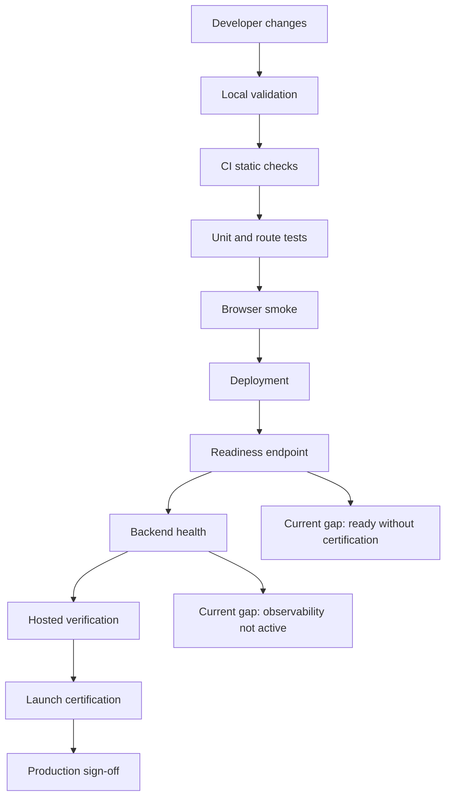
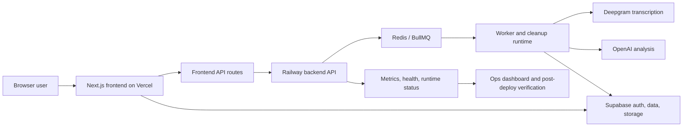
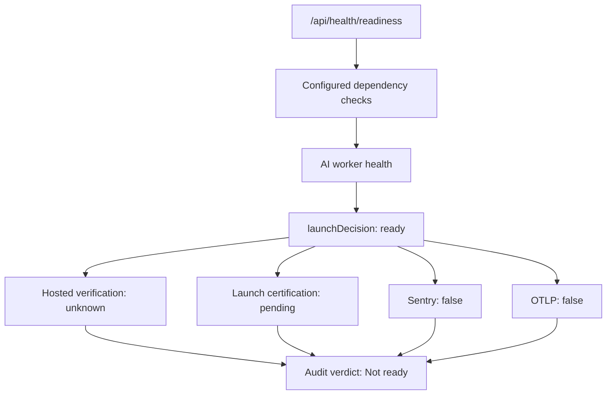
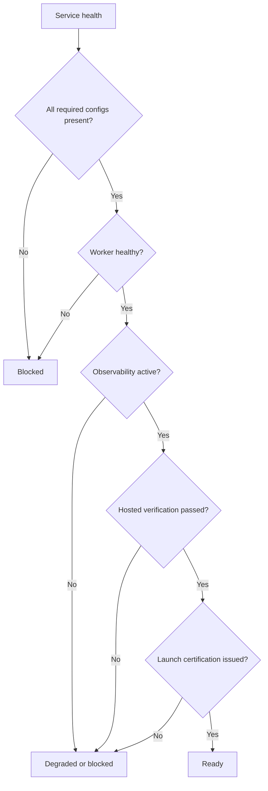

# NextStop.ai Web Readiness And Production Audit Report

Date: April 24, 2026
Repository: `nextstop.ai-web`
Scope: Web product, frontend, backend, CI/CD, deployment readiness, security, observability, and current uncommitted web changes
Prepared for: Product, engineering, launch, and operations stakeholders
Audit style: Production readiness review, code-risk review, operational audit, release evidence review, and user-experience readiness assessment
Prepared from: Repo inspection, workflow inspection, local validation, live readiness inspection, deployed smoke validation, and current worktree review

## Document Status

- Version: `v1`
- Audit depth: extensive
- Current recommendation: `Not ready for full production sign-off`
- Controlled rollout recommendation: `Possible only with explicit known-risk acceptance`
- Confidence level: high for local validation and repo-grounded findings
- Confidence level for live hosted behavior: medium-high for the public readiness and smoke paths exercised during this audit
- Confidence level for private dashboards, third-party consoles, and secret values: not directly verified
- Primary reason for current no-go decision: production proof is weaker than the app's own `ready` signal suggests
- Most important engineering theme: the project has strong foundations, but launch governance and test coverage have not caught up with product surface area
- Most important product theme: current marketing and pricing changes are user-visible and under-tested
- Most important operations theme: live observability and certification signals are incomplete
- Most important security theme: dependency audit is not clean and compliance/legal surfacing is incomplete

## Audit Intent

This report answers one practical launch question:

Is the `nextstop.ai-web` project ready to be put into production as a public, trusted web application?

The answer is not based only on whether the app builds.

The answer considers:

- whether the frontend builds and behaves reliably
- whether the backend is sufficiently verified for production responsibility
- whether CI/CD gates are strong enough
- whether the live environment is honestly reporting readiness
- whether observability is active enough for incident response
- whether security controls are sufficient for public launch
- whether privacy and retention behavior is clear
- whether billing, auth, integrations, and AI workflows are covered by tests
- whether current user-facing changes have been verified
- whether the application gives users a clear and trustworthy experience

This report treats "ready" as a full production claim.

It does not treat "the site loads" as the same thing as "the product is production-ready."

## Reading Guide

If you want the fastest answer, read these sections:

1. High-Level Verdict
2. Current Go Or No-Go Call
3. Critical Findings
4. Production Readiness Scorecard
5. Remediation Priorities

If you want the full engineering story, read the category audits in order.

If you are planning the next implementation pass, start with Remediation Plan and Acceptance Criteria.

## Evidence Legend

- `Repo-confirmed`: verified directly from files, scripts, package manifests, workflows, or source code
- `Locally validated`: verified by running commands in this workspace
- `Live-validated`: verified against the public deployed URL
- `Inferred with high confidence`: derived from multiple repo and runtime signals
- `Requires hosted verification`: plausible from code, but not fully exercised in the live production path
- `Not verified`: outside this audit's direct access or not proven by available evidence

## Commands Run During This Audit

- `npm run typecheck` in `frontend`
- `npm run lint` in `frontend`
- `npm run test -- --coverage` in `frontend`
- `npm run build` in `frontend`
- `npm run typecheck` in `backend`
- `npm run test` in `backend`
- `npm run test:repo-contract` in `frontend`
- `npm run test:e2e -- tests/e2e/smoke.spec.ts` in `frontend`
- `npm audit --omit=dev --audit-level=high` at repo root
- `GET https://next-stop-ai-web.vercel.app/api/health/readiness`
- `PLAYWRIGHT_BASE_URL=https://next-stop-ai-web.vercel.app npm run test:e2e -- tests/e2e/deployed-smoke.spec.ts`

## Validation Snapshot

| Check | Result | Evidence Level | Notes |
|---|---:|---|---|
| Frontend typecheck | Pass | Locally validated | `tsc --noEmit` passed |
| Frontend lint | Pass | Locally validated | `eslint .` passed |
| Frontend unit, route, component tests | Pass | Locally validated | 17 files and 36 tests passed |
| Frontend coverage | Weak | Locally validated | Overall configured coverage around 31.35 percent |
| Frontend production build | Pass | Locally validated | Next.js production build succeeded |
| Backend typecheck | Pass | Locally validated | `tsc --noEmit` passed |
| Backend tests | Pass but thin | Locally validated | 1 file and 4 tests passed |
| Repo contract | Pass | Locally validated | Required repo contract files passed |
| Local Playwright smoke | Pass | Locally validated | Deterministic smoke route passed |
| Production dependency audit | Fail / warning | Locally validated | `bullmq -> uuid` vulnerability chain remains |
| Deployed smoke | Pass | Live-validated | Homepage, login, readiness path passed |
| Live readiness endpoint | Pass but misleading | Live-validated | Returns `ready` despite missing certification and observability proof |
| Hosted verification state | Not ready | Live-validated | `unknown` in readiness payload |
| Launch certification state | Not ready | Live-validated | `pending` in readiness payload |
| Observability state | Not ready | Live-validated | Environment reports `development`; Sentry and OTLP false |

## High-Level Verdict

The project is real, substantial, and closer to production shape than a prototype.

It has:

- a working Next.js frontend
- a separate backend runtime
- Redis-backed worker architecture
- Supabase-backed auth and storage assumptions
- CI workflows
- security workflows
- post-deploy verification workflows
- readiness endpoints
- local stack scripts
- production-oriented docs and env examples
- meaningful tests in several areas

However, the project is not fully production-ready today.

The core reason is not that the app fails basic engineering checks.

The core reason is that the evidence does not support a full production sign-off.

The readiness endpoint returns `launchDecision: ready`, but the same payload reports:

- hosted verification status: `unknown`
- launch certification status: `pending`
- observability environment: `development`
- Sentry configured: `false`
- OTLP configured: `false`

That combination is the center of the audit.

The system says it is ready while also admitting that key production proof is missing.

That is a release-governance issue.

It should block full production approval until fixed or explicitly risk-accepted.

## Current Go Or No-Go Call

### Short answer

`No` for full production launch.

`Maybe` for controlled rollout or continued preview usage with explicit risk acceptance.

### Why this is not a clean yes

The application builds.

The main frontend gates pass.

The deployed smoke test passes.

The live readiness endpoint responds.

But production readiness means more than availability.

A production-ready system must be:

- observable
- test-backed
- rollback-aware
- security-conscious
- truthful about degraded state
- legally and commercially clear
- supportable during incidents

This project is partly there.

It is not fully there.

## Executive Summary

### What is working well

- Frontend typecheck passed.
- Frontend lint passed.
- Frontend tests passed.
- Frontend production build passed.
- Frontend route manifest builds successfully.
- Backend typecheck passed.
- Backend tests passed.
- Local Playwright smoke passed.
- Deployed Playwright smoke passed.
- Repo contract check passed.
- The architecture separates frontend and backend responsibilities.
- The backend models worker health, cleanup state, security counters, hosted verification, and launch certification.
- The project has security workflows.
- The project has post-deploy verification workflow design.
- The app has explicit readiness and health surfaces.
- The transcript policy is conservative in the live payload.
- The AI worker appears healthy in the live readiness payload.

### What is partially working

- The readiness endpoint is useful, but it is too permissive.
- Observability code exists, but live observability is not active enough.
- CI exists, but backend test enforcement is thin.
- Post-deploy verification exists, but runtime state does not show the loop has completed.
- Security posture has good scaffolding, but dependency audit is not clean.
- Marketing pages are polished, but changed surfaces are not directly tested.

### What is not working well enough

- Production dependency audit reports a `bullmq -> uuid` vulnerability chain.
- Backend tests are far too narrow for the backend's production role.
- Many frontend API routes have zero coverage in the configured coverage report.
- Recent marketing and pricing changes have no dedicated test coverage.
- The live readiness endpoint can report `ready` while hosted verification is `unknown`.
- The live readiness endpoint can report `ready` while launch certification is `pending`.
- The live readiness endpoint can report `ready` while production observability appears disabled.
- Legal and compliance discoverability is weak.
- The hero CTA text appears inconsistent with its destination.
- Generated local directories are untracked and not fully covered by git ignore rules.

## Production Readiness Scorecard

| Category | Score | Verdict |
|---|---:|---|
| Product flow readiness | 3.6 / 5 | Good foundation, under-proven launch paths |
| Frontend build and code health | 4.4 / 5 | Strong |
| Frontend test coverage | 2.7 / 5 | Passing but shallow for total surface area |
| Marketing and pricing readiness | 2.6 / 5 | Polished but under-tested and copy-risky |
| Backend structural readiness | 3.7 / 5 | Good architecture, thin tests |
| Backend verification | 1.8 / 5 | Too narrow for production responsibility |
| AI and worker readiness | 3.5 / 5 | Live worker healthy, full behavior under-proven |
| Security posture | 3.1 / 5 | Good scaffolding, dependency and legal gaps |
| Privacy and retention posture | 3.6 / 5 | Conservative transcript mode, cleanup proof incomplete |
| Observability and incident readiness | 2.0 / 5 | Code exists, live activation missing |
| CI/CD readiness | 3.7 / 5 | Useful workflows, not fully closed-loop |
| Deployment readiness | 3.4 / 5 | App deploys and responds, production proof incomplete |
| Repo hygiene | 2.8 / 5 | Mostly good, artifact drift visible |
| Production launch confidence | 2.8 / 5 | Not ready for full sign-off |

## Current Recommendation

Do not issue a full production launch certification today.

Continue development, preview usage, or limited controlled rollout only if the risks are known and accepted.

Before full production launch, the project should:

- make readiness truthfully reflect certification and observability gaps
- enable and verify production observability
- publish hosted verification into runtime status
- publish launch certification into runtime status
- resolve or risk-accept the dependency audit issue
- add direct tests for current marketing and pricing changes
- add stronger backend route and runtime tests
- restore or create legal/compliance surface links

## Critical Findings

### Finding 1: Readiness endpoint overstates production readiness

Severity: `Critical`

Evidence level: `Live-validated` and `Repo-confirmed`

Observed state:

- `launchDecision` is `ready`
- `hostedVerification.lastHostedVerificationStatus` is `unknown`
- `launchCertification.lastLaunchCertificationStatus` is `pending`
- `observability.sentryConfigured` is `false`
- `observability.otlpConfigured` is `false`
- `observability.environment` is `development`

Why it matters:

The readiness endpoint is a release-governance surface.

If it says `ready`, stakeholders may believe the system has passed production gates.

Right now it can say `ready` while key production controls are absent.

That is more dangerous than a failing readiness endpoint because it can create false confidence.

Recommendation:

- Add production-mode checks for hosted verification, launch certification, and observability.
- Return `degraded` or `blocked` when those controls are incomplete.
- Make the readiness response distinguish service health from launch certification.

### Finding 2: Production observability is not active in the live readiness payload

Severity: `Critical`

Evidence level: `Live-validated`

Observed state:

- backend observability reports environment `development`
- Sentry configured is `false`
- OTLP configured is `false`

Why it matters:

This is a queue-backed AI product.

Failures can happen asynchronously.

Without error monitoring, traces, and metrics ingestion, production incidents become harder to detect, diagnose, and resolve.

Recommendation:

- Configure production Sentry for frontend and backend.
- Configure OTLP export for backend traces.
- Verify real error and trace ingestion.
- Add an observability verification line to launch certification.

### Finding 3: Hosted verification and launch certification are missing from runtime state

Severity: `Critical`

Evidence level: `Live-validated`

Observed state:

- hosted verification is `unknown`
- launch certification is `pending`
- validation flags are false

Why it matters:

The repo has a strong post-deploy verification workflow concept.

The live system does not show that the loop has completed.

This creates a gap between release-process design and release-process reality.

Recommendation:

- Run the post-deploy verification workflow with production URLs.
- Publish hosted verification to backend runtime state.
- Publish launch certification only after readiness, backend health, smoke, and manual critical flows pass.

### Finding 4: Dependency audit is not clean

Severity: `High`

Evidence level: `Locally validated`

Observed state:

- `npm audit --omit=dev --audit-level=high` reports `uuid <14.0.0`
- affected chain: `bullmq -> uuid`
- npm suggests `npm audit fix --force`, but that would install `bullmq@0.0.1`, which is not a safe automatic fix

Why it matters:

The issue is moderate in npm output, but dependency audit cleanliness is a production-release control.

The forced fix path is breaking, so this requires deliberate remediation.

Recommendation:

- Check for an upstream `bullmq` patch or override path.
- Document temporary risk acceptance if no safe patch exists.
- Track owner and expiration date for the acceptance.

### Finding 5: Backend test coverage is too thin

Severity: `High`

Evidence level: `Locally validated`

Observed state:

- backend tests pass
- only 1 backend test file exists in the executed suite
- only 4 backend tests ran

Why it matters:

The backend owns queue behavior, worker state, runtime certification status, desktop sync, health, metrics, auth-protected routes, and secret-protected routes.

That responsibility is much larger than the current test suite.

Recommendation:

- Add backend route tests for `/health`, `/metrics`, `/runtime/hosted-verification`, and `/runtime/launch-certification`.
- Add auth tests for secret-protected job routes.
- Add tests for desktop sync route validation and ownership checks.
- Add worker-state and cleanup-state edge-case tests.

### Finding 6: Many frontend API routes have zero coverage

Severity: `High`

Evidence level: `Locally validated`

Observed state:

Coverage output shows zero coverage for many routes, including:

- billing subscription create
- billing subscription verify
- billing trial start
- Razorpay webhook
- internal AI regenerate
- internal AI transcribe
- Google integration routes
- meeting finalize
- meeting process
- meeting upload-url
- meeting start
- Notion callback and connect

Why it matters:

These are not decorative routes.

They represent billing, integrations, AI work, meeting lifecycle, auth redirects, and data movement.

Recommendation:

- Prioritize tests by business criticality.
- Start with billing, webhook, finalize, process, upload-url, and OAuth callback routes.
- Add negative tests for missing auth, invalid payloads, and unavailable dependencies.

### Finding 7: Current marketing and pricing changes are not directly tested

Severity: `High`

Evidence level: `Repo-confirmed` and `Locally validated`

Observed state:

- current diff heavily changes marketing and pricing surfaces
- existing tests do not directly assert those changes
- deployed smoke only checks broad page loading

Why it matters:

The current worktree changes are user-facing.

They affect first impression, conversion, plan expectations, trust, and navigation.

Recommendation:

- Add Playwright tests for homepage hero, navbar, pricing plan cards, footer links, and primary CTAs.
- Add at least one mobile viewport check for homepage and pricing.
- Add assertions that CTA labels match destinations.

### Finding 8: Footer and legal/compliance surface are incomplete

Severity: `High`

Evidence level: `Repo-confirmed`

Observed state:

- footer no longer links privacy policy
- footer no longer links terms of service
- footer no longer links cookie policy
- no obvious `privacy`, `terms`, or `legal` app routes were discovered

Why it matters:

This product handles auth, billing, meeting data, AI processing, integrations, and workspace exports.

Public production launch needs visible policy and trust surfaces.

Recommendation:

- Add or restore privacy, terms, and cookie/legal links.
- Ensure pages are real, not placeholders.
- Link them from the footer and potentially signup/billing flows.

### Finding 9: Hero CTA copy appears misleading

Severity: `Medium`

Evidence level: `Repo-confirmed`

Observed state:

- CTA text says `Open Web Dashboard`
- destination is `/pricing`

Why it matters:

Users expect `Open Web Dashboard` to navigate into the app or app-entry flow.

Sending users to pricing may be an intentional funnel, but the label is likely too direct.

Recommendation:

- If destination stays `/pricing`, rename CTA to `View Plans`, `See Pricing`, or `Compare Plans`.
- If label stays `Open Web Dashboard`, change destination to `/app-entry` or another app-entry route.

### Finding 10: Repo hygiene has generated artifact drift

Severity: `Medium`

Evidence level: `Repo-confirmed`

Observed state:

- untracked `frontend/.playwright-cli/`
- untracked `frontend/output/`
- `.gitignore` does not appear to cover those exact generated directories
- ESLint ignores them, but Git still sees them

Why it matters:

Generated artifacts can pollute reviews and create accidental check-ins.

Recommendation:

- Add these directories to `.gitignore` if they are generated.
- Keep ESLint ignore and Git ignore aligned.

## Production Readiness Diagram



## Runtime Architecture Diagram



## Readiness Truthfulness Diagram



## Suggested Launch-Gate Model



## UI Sketch: Current Public Funnel Risk

```text
+--------------------------------------------------------------+
| Navbar: Logo | About | Pricing | Security | Log in | Download |
+--------------------------------------------------------------+
| Hero                                                         |
| Desktop + Web Meeting Intelligence                           |
| Run meetings locally. Let NextStop.ai finish the follow-up.   |
|                                                              |
| [Download Desktop App]  [Open Web Dashboard]                  |
|                         currently goes to /pricing            |
+--------------------------------------------------------------+
| Risk: CTA label implies app entry, but destination is pricing |
+--------------------------------------------------------------+
```

## UI Sketch: Recommended Footer Trust Surface

```text
+--------------------------------------------------------------+
| Product        | Company        | Legal and Trust             |
| Overview       | About          | Privacy Policy              |
| Pricing        | Contact        | Terms of Service            |
| Security       | Plans          | Cookie Policy               |
| FAQ            |                | Security                    |
+--------------------------------------------------------------+
| Status: link to ops/status or clear operational statement     |
+--------------------------------------------------------------+
```

## UI Sketch: Recommended Ops Readiness Card

```text
+--------------------------------------------------------------+
| Production Readiness                                         |
+--------------------------------------------------------------+
| Service health:             Pass                             |
| Worker health:              Pass                             |
| Hosted verification:        Missing                          |
| Launch certification:       Pending                          |
| Observability:              Missing Sentry / OTLP             |
| Dependency audit:           Open uuid advisory                |
+--------------------------------------------------------------+
| Decision: Not Ready                                           |
+--------------------------------------------------------------+
```

## Category Audit: Frontend Build And Code Health

Verdict: `Strong`

Evidence:

- frontend typecheck passed
- frontend lint passed
- frontend production build passed
- Next.js generated 41 app routes
- public and dashboard routes are present
- security headers are configured

Positive notes:

- The app is using a modern Next.js stack.
- The build result is clean.
- The route set is coherent.
- The project has a meaningful app router structure.
- Security headers are not an afterthought.

Concerns:

- Build success does not prove behavior of changed marketing sections.
- Route count is high relative to current coverage depth.
- Several business-critical API routes are untested.

Recommended next steps:

- Keep build and lint gates as required checks.
- Add targeted route tests for top-risk API paths.
- Add Playwright tests for public route structure and CTAs.

## Category Audit: Marketing And Pricing Readiness

Verdict: `Needs work before production launch`

Evidence:

- major current diffs are concentrated in marketing and pricing surfaces
- homepage composition changed
- pricing plan copy changed
- navbar changed
- footer changed
- hero CTA changed

Positive notes:

- The revised messaging is cleaner.
- The web plus desktop positioning is clearer than a desktop-only story.
- The pricing cards are more polished.
- The use-case section is simpler and easier to scan.

Concerns:

- The homepage removed several trust and explanation sections.
- The footer removed visible legal links.
- The hero CTA label appears mismatched with its destination.
- There is no direct automated coverage for these changes.
- The pricing copy must match actual entitlements and onboarding behavior.

Recommended next steps:

- Add Playwright coverage for homepage and pricing.
- Run a manual copy review focused on truthfulness.
- Restore legal links or create a replacement trust/legal surface.
- Correct the hero CTA label or destination.

## Category Audit: Backend Structural Readiness

Verdict: `Good architecture, insufficient verification`

Evidence:

- backend typecheck passed
- backend tests passed
- backend exposes health and metrics
- backend models runtime status
- backend models worker state
- backend models cleanup status
- backend exposes runtime hosted verification and launch certification endpoints

Positive notes:

- The backend is structurally thoughtful.
- It is not a thin toy API.
- Runtime status is modeled explicitly.
- Worker health and stale state are modeled.
- Metrics are present.

Concerns:

- Backend test coverage is far too narrow.
- Auth behavior is under-tested.
- Secret-protected routes are under-tested.
- Runtime verification publish routes are under-tested.
- Desktop sync routes are under-tested.

Recommended next steps:

- Add backend route tests.
- Add negative auth tests.
- Add runtime-status integration tests.
- Add health and metrics contract tests.

## Category Audit: AI And Worker Readiness

Verdict: `Promising, but not fully certified`

Evidence:

- live readiness reports AI worker healthy
- live readiness reports direct execution true
- live readiness reports worker stale false
- backend has worker-state and runtime-status code
- backend has queue dependencies

Positive notes:

- The architecture correctly avoids doing all AI work in the frontend runtime.
- Worker state is visible to readiness.
- Queue-backed execution is appropriate for AI processing.

Concerns:

- Full AI job lifecycle was not exercised end-to-end in this audit.
- Queue behavior is not deeply covered by tests.
- Worker health being green does not prove all AI workflows are correct.
- Hosted verification does not show recent scenario pass data.

Recommended next steps:

- Add a hosted verification scenario for a representative meeting lifecycle.
- Add worker queue integration tests.
- Add failure-mode tests for AI job retry, cancel, and partial output.

## Category Audit: Security

Verdict: `Reasonable baseline, not final`

Evidence:

- security workflow exists
- Gitleaks workflow exists
- CodeQL workflow exists
- npm audit workflow exists
- frontend security headers exist
- transcript downloads are disabled in live readiness payload
- dependency audit currently reports issues

Positive notes:

- Security is clearly part of the project.
- Headers are set thoughtfully.
- Transcript posture is conservative.
- Secret scanning and CodeQL are present.

Concerns:

- dependency audit is not clean
- legal/compliance surface is incomplete
- billing and webhook routes have weak coverage
- OAuth callback routes have weak coverage
- production observability is incomplete, which weakens incident response

Recommended next steps:

- Resolve or risk-accept the dependency advisory.
- Add tests for billing and webhook routes.
- Add tests for OAuth callbacks.
- Restore public legal links.
- Enable Sentry and trace telemetry for production.

## Category Audit: Privacy And Retention

Verdict: `Conservative policy, proof still needed`

Evidence:

- live readiness reports `TRANSCRIPT_STORAGE_MODE` as disabled
- live readiness reports transcript downloads disabled
- live readiness reports findings-only launch mode
- raw asset and transcript retention values are represented

Positive notes:

- Findings-only launch mode is a sensible privacy-reducing choice.
- Transcript downloads being disabled lowers exposure.
- Cleanup status is represented in backend health.

Concerns:

- cleanup success is null in live payload
- cleanup is considered not required under disabled transcript mode
- privacy policy surface is not visible
- live retention behavior was not end-to-end verified in this audit

Recommended next steps:

- Add privacy policy route and footer link.
- Add retention behavior documentation.
- Add cleanup verification to hosted launch checklist even if transcript mode stays disabled.

## Category Audit: Observability And Operations

Verdict: `Not production-ready`

Evidence:

- backend has metrics and observability code
- live readiness reports Sentry false
- live readiness reports OTLP false
- live readiness reports environment development
- hosted verification unknown
- launch certification pending

Positive notes:

- The codebase has serious observability intent.
- Metrics route exists.
- Runtime status is modeled.
- Ops information is visible through readiness and backend health payloads.

Concerns:

- live production observability is not active enough
- release certification loop is incomplete
- readiness does not gate on missing observability
- incident detection and triage confidence is therefore low

Recommended next steps:

- Configure production Sentry.
- Configure OTLP export.
- Confirm telemetry ingestion.
- Gate launch readiness on observability status.
- Publish hosted verification and launch certification into runtime state.

## Category Audit: CI/CD

Verdict: `Good foundation, incomplete enforcement`

Evidence:

- CI workflow exists
- security workflow exists
- post-deploy verification workflow exists
- CI runs frontend build, lint, typecheck, tests, and smoke
- CI runs backend typecheck
- security workflow runs Gitleaks, npm audit, and CodeQL

Positive notes:

- CI coverage is not superficial.
- Post-deploy verification workflow is thoughtfully designed.
- Security workflow is useful.

Concerns:

- backend tests are not obviously enforced in main CI
- post-deploy runtime state suggests verification loop is not closed
- changed marketing surfaces are not directly tested
- readiness can succeed despite missing launch evidence

Recommended next steps:

- Add backend tests to CI.
- Add marketing smoke assertions to CI.
- Require post-deploy verification before production sign-off.
- Require launch certification for public release.

## Category Audit: Repository Hygiene

Verdict: `Mostly good with current drift`

Evidence:

- repo contract check passed
- `.gitignore` protects many generated and sensitive files
- docs are intentionally ignored
- generated frontend artifact directories are untracked

Positive notes:

- The repo has conscious hygiene rules.
- Env files are protected.
- contract script catches forbidden tracked artifacts.

Concerns:

- `frontend/.playwright-cli/` is untracked
- `frontend/output/` is untracked
- ESLint ignores these paths, but Git still sees them
- docs are ignored, so this audit file may remain local unless policy changes

Recommended next steps:

- Add generated frontend paths to `.gitignore` if they are artifacts.
- Decide whether audit reports should be tracked or kept local.

## User Experience Readiness

Verdict: `Promising but not launch-polished`

Positive experience signals:

- The landing page messaging is sharper.
- The desktop plus web story is clearer.
- The pricing cards look more intentional.
- Navigation is simpler.
- Use-case framing is easier to scan.

Experience risks:

- CTA label mismatch can reduce trust.
- Missing legal links can reduce purchase confidence.
- Removed explanatory sections may weaken understanding.
- Pricing copy may overpromise if entitlement behavior differs.
- No targeted tests validate changed public flows.

Recommendations:

- Review every public CTA for destination accuracy.
- Restore legal/trust links.
- Add a small "how it works" or trust section back into homepage flow if conversion clarity drops.
- Add Playwright assertions for public navigation.

## Production Issues List

| ID | Issue | Criticality | Owner Area | Release Impact |
|---|---|---|---|---|
| P0-01 | Readiness says ready despite missing certification and observability proof | Critical | Platform / Ops | Blocks full launch |
| P0-02 | Production observability appears inactive | Critical | Ops / Backend | Blocks full launch |
| P0-03 | Hosted verification is unknown | Critical | CI/CD / Ops | Blocks full launch |
| P0-04 | Launch certification is pending | Critical | CI/CD / Ops | Blocks full launch |
| P1-01 | Dependency audit reports `bullmq -> uuid` issue | High | Backend / Security | Requires fix or risk acceptance |
| P1-02 | Backend tests are too thin | High | Backend | Blocks confidence |
| P1-03 | Many frontend API routes have zero coverage | High | Frontend | Blocks confidence |
| P1-04 | Current marketing changes lack direct tests | High | Frontend / Product | Blocks confident public release |
| P1-05 | Legal/compliance links are missing | High | Product / Legal | Blocks public trust readiness |
| P2-01 | Hero CTA label does not match destination | Medium | Product / Frontend | Should fix before launch |
| P2-02 | Generated frontend artifact directories are untracked | Medium | Repo hygiene | Should fix before merge |
| P2-03 | Metadata is generic relative to current product positioning | Medium | Frontend / Marketing | Should improve before launch |
| P2-04 | Mobile and accessibility checks are not evidenced | Medium | Frontend | Should verify before launch |
| P3-01 | Homepage removed deeper explanatory sections | Low / Medium | Product | Monitor and consider restoring trust content |

## Remediation Priorities

### Priority 0: Launch blockers

- Fix readiness semantics so `ready` cannot ignore missing certification and observability.
- Enable production Sentry and OTLP or explicitly mark launch as degraded.
- Run hosted verification and publish the result to runtime state.
- Issue launch certification only after all required checks pass.

### Priority 1: High-confidence engineering hardening

- Resolve or risk-accept the `bullmq -> uuid` audit issue.
- Add backend tests for health, metrics, runtime certification, and job routes.
- Add frontend tests for high-risk API routes.
- Add marketing and pricing Playwright checks.
- Restore legal/compliance links.

### Priority 2: Launch polish

- Fix hero CTA text or destination.
- Improve metadata.
- Add mobile visual checks.
- Add accessibility checks.
- Clean untracked generated artifacts.

## Suggested Acceptance Criteria For Production Sign-Off

A future production sign-off should require:

- frontend typecheck passing
- frontend lint passing
- frontend tests passing
- frontend production build passing
- backend typecheck passing
- backend tests passing
- backend tests enforced in CI
- repo contract passing
- dependency audit clean or risk-accepted
- local smoke passing
- deployed smoke passing
- readiness route passing with stricter semantics
- backend health passing
- hosted verification status `pass`
- launch certification status `certified`
- Sentry active in production
- OTLP or equivalent tracing active in production
- legal links visible
- hero and pricing CTAs verified
- billing and webhook routes covered by tests
- OAuth callback routes covered by tests
- no unexpected generated artifacts in worktree

## Suggested Production Launch Checklist

- Freeze a release candidate commit.
- Ensure worktree is clean except intended release artifacts.
- Run local validation.
- Run CI on the release candidate.
- Deploy to preview.
- Run preview smoke.
- Verify public marketing pages.
- Verify login and signup.
- Verify billing trial and subscription flows.
- Verify Google and Notion connection flows.
- Verify representative meeting lifecycle.
- Verify AI worker health.
- Verify backend health.
- Verify metrics ingestion.
- Verify Sentry event ingestion.
- Verify launch certification publishing.
- Verify rollback plan.
- Approve launch only after all required evidence is attached.

## Risk-Based Test Plan To Add

| Test Area | Why It Matters | Suggested Test |
|---|---|---|
| Hero CTA | Prevent misleading navigation | Assert label and destination match |
| Pricing cards | Prevent plan expectation drift | Assert Starter, Pro, Team copy and CTA paths |
| Footer legal links | Public trust and compliance | Assert Privacy, Terms, Security links exist |
| Billing create | Revenue path | Unit or route tests for success and failure |
| Razorpay webhook | Billing integrity | Signature and payload tests |
| Meeting finalize | Core workflow | Auth, invalid payload, queue enqueue tests |
| Meeting process | Core workflow | Failure and partial-state tests |
| Upload URL | Data ingress | Auth and storage-policy tests |
| Notion callback | OAuth trust | State validation and redirect tests |
| Backend health | Ops trust | Contract test for expected fields |
| Backend runtime publish | Release governance | Secret auth and schema validation tests |
| Metrics | Observability | Content type and metric presence tests |

## Controlled Rollout Guidance

If a launch must happen before all blockers are closed:

- call it a controlled rollout, not production certification
- document known risks
- assign owners for every blocker
- keep the rollout audience small
- monitor worker health continuously
- monitor billing and auth errors manually
- run manual hosted verification immediately after deploy
- keep rollback instructions ready
- avoid public claims that imply full operational maturity

## Final Verdict

The web application is not ready for full production sign-off today.

It is technically alive and has many good foundations.

It builds.

It passes core local checks.

It passes smoke checks.

It has a thoughtful architecture.

But production readiness is about proof.

The current proof is incomplete in the exact places that matter most for launch:

- production observability
- hosted verification
- launch certification
- backend test depth
- route coverage
- public marketing validation
- dependency audit cleanliness
- compliance/legal discoverability

The recommended verdict is:

`Not Ready for full production launch`

The recommended next state is:

`Ready for a focused hardening sprint and then re-audit`

## Appendix A: Current Worktree Change Summary

- Modified frontend lint config.
- Modified frontend package script for lint.
- Modified marketing homepage composition.
- Modified pricing page copy and card structure.
- Modified marketing template animation.
- Modified global CSS overflow behavior and navbar shell styles.
- Modified root layout overflow classes.
- Modified FAQ spacing and typography.
- Modified footer content and links.
- Modified hero copy and CTA.
- Modified navbar structure and styling.
- Modified pricing component copy and layout.
- Modified testimonials layout.
- Modified use-cases layout.
- Modified local stack up/down scripts.
- Added untracked `CoreFeaturesDeck`.
- Added untracked `CtaSection`.
- Added untracked local output artifacts.

## Appendix B: Evidence Notes

- The local frontend test run passed 36 tests across 17 files.
- The local backend test run passed 4 tests across 1 file.
- The frontend coverage summary reports all configured files at 31.35 percent statement and line coverage.
- The production build generated 41 app routes.
- The live readiness endpoint responded successfully.
- The live readiness endpoint currently reports no blocking failures.
- The audit disagrees with that release interpretation because the payload also exposes missing production controls.

## Appendix C: Re-Audit Triggers

Re-run this audit after:

- readiness gating changes
- observability activation
- dependency audit remediation
- backend test expansion
- marketing Playwright coverage
- footer/legal restoration
- launch certification publishing
- any major pricing or billing copy change
- any change to AI worker execution mode
- any change to transcript retention mode

## Appendix D: Suggested Report Owner Notes

- This report is intentionally conservative.
- The goal is not to slow the project down.
- The goal is to prevent a misleading launch decision.
- The codebase has enough strong pieces that a focused hardening pass should pay off quickly.
- The highest-value work is not more visual polish right now.
- The highest-value work is release truth, observability, and targeted verification.

