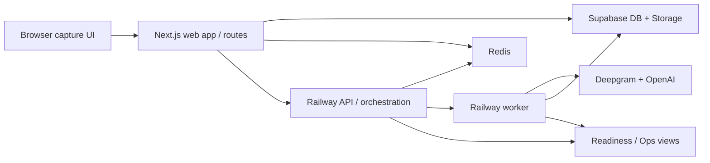
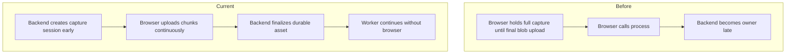
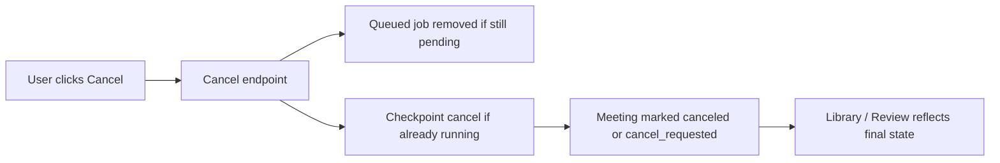
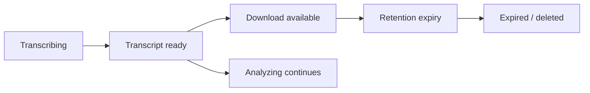
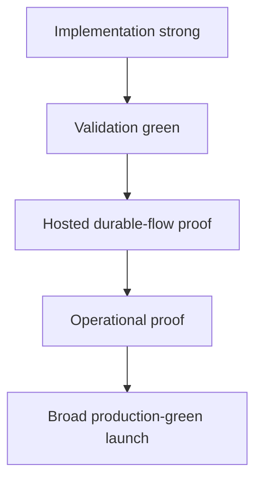

# NextStop.ai Web Readiness Audit V2

Date: April 19, 2026  
Repository: `nextstop.ai-web`  
Scope: Web product only  
Prepared for: Product, engineering, and launch stakeholders  
Audit style: Senior-engineer production-readiness review, code audit, launch-risk review, and operational trust assessment  
Prepared from: Repo inspection, document review, route and worker review, current validation runs, and prior hardening history

## Document Status

- Version: `v2`
- Audit depth: extensive
- Review stance: senior engineer evaluating whether the system is trustworthy under real production usage, not just feature-complete
- Current recommendation: `Strong controlled-rollout ready, materially closer to production-green, but not yet broad-green without fixing the frontend typecheck issue and re-proving hosted behavior`
- Confidence level: high for repo-grounded application behavior and local validation, medium for live hosted behavior not directly re-run in Vercel, Railway, Supabase, and Redis during this audit pass

## Table Of Contents

1. Executive summary
2. Audit standard and method
3. Evidence used
4. Current validation snapshot
5. System overview
6. Before vs current-state comparison
7. V2 production-readiness scorecard
8. Category-by-category audit
9. Critical-flow review
10. Senior-engineer findings
11. Improvement suggestions and required follow-through
12. V2 production-readiness plan
13. Final launch recommendation
14. Appendix

## Executive Summary

`nextstop.ai-web` is now a materially stronger system than it was in the original April 17 audit.

The biggest improvement is that browser-tab meetings are no longer primarily modeled as a fragile browser-owned flow after the user clicks `End`. The project now has a durable capture-session path, backend-owned finalization, explicit cancel semantics, earlier transcript readiness, richer runtime truthfulness, stronger state modeling, and better user/operator visibility.

This is meaningful production hardening, not cosmetic cleanup.

From a senior-engineer production-readiness perspective, the project now looks like:

- a credible product with real ownership boundaries
- a substantially more trustworthy meeting-processing pipeline
- clearer runtime and transcript lifecycle semantics
- meaningfully improved user-state truthfulness
- stronger rollout posture than in the prior audit

The biggest remaining reason this audit does **not** call the system fully production-green is not a missing feature. It is the combination of:

- a currently failing frontend `typecheck` caused by generated `.next/dev/types/routes.d.ts`
- the need to re-prove the latest durable meeting and cancel flow in hosted conditions
- residual operational proof gaps around full live deploy certification

If those items are closed cleanly, this project is close to being credibly scored as broad production-ready.

## Audit Standard And Method

This audit answers one practical question:

Can the system be trusted in production under real user behavior, real refresh/close behavior, real queue/worker execution, temporary transcript lifecycle rules, cancel requests, and operator recovery conditions?

This review does **not** use “the app mostly works locally” as the standard.

It uses five lenses:

1. Correctness  
   Do the core flows behave correctly end to end?
2. Durability  
   Does ownership move safely from browser to backend, and stay there?
3. Operational trust  
   Can operators trust the health, readiness, and status model?
4. Security and policy  
   Are transcript access, retention, and sensitive routes controlled tightly enough?
5. Launch confidence  
   Are tests, runbooks, deployment checks, and hosted proof strong enough for a production claim?

## Evidence Used

### Repo-grounded review

- prior audit and readiness documents
- production runbook
- durable capture and cancel implementation
- queue, worker, transcript, and readiness flow code
- frontend state surfaces in capture, library, review, and ops

### Validation run performed for this V2 audit

- `npm run typecheck` in `frontend`
- `npm run test` in `frontend`
- `npm run typecheck` in `backend`
- `npm run test` in `backend`

### Evidence legend

- `Repo-confirmed`: verified directly from source or docs
- `Locally validated`: verified in current local validation runs
- `Inferred with high confidence`: strongly supported by implementation patterns and related runtime behavior
- `Requires hosted verification`: code and contracts appear ready, but live hosted proof was not re-exercised in this pass

## Current Validation Snapshot

| Check | Result | Audit interpretation |
|---|---|---|
| Frontend `npm run test` | Pass | Good signal that route and component regression coverage has improved materially |
| Backend `npm run typecheck` | Pass | Backend package is structurally clean in current local validation |
| Backend `npm run test` | Pass | Backend has passing tests, though coverage depth still matters more than the single green result |
| Frontend `npm run typecheck` | Fail | Important blocker to a fully green launch recommendation because build-health credibility is weakened by a red typecheck path |

### Frontend typecheck note

The current frontend typecheck failure is coming from generated Next route typings under `.next/dev/types/routes.d.ts`, not from a newly discovered handwritten application-source error.

That still matters.

From a senior-engineer launch standpoint, a red typecheck is a red typecheck until the team either:

- fixes the root cause cleanly, or
- changes the workflow so generated dev artifacts are excluded and the intended typecheck contract is stable and green

## System Overview

### Current production shape

- Frontend and app routes: Vercel
- Data, auth, and storage: Supabase
- Queue, AI runtime, worker, and cleanup: Railway
- Queue transport and shared runtime state: Redis on Railway

### Current ownership model

- Browser owns live capture interaction
- Backend owns durable capture session metadata
- Backend owns chunk manifest and finalization acceptance
- Worker owns transcription and AI extraction after queue acceptance
- Temporary transcript is stored in object storage with explicit lifecycle semantics
- Findings and artifacts remain durable after transcript expiry

### Current architecture

## Before Vs Current-State Comparison

### Before hardening

- final browser blob handoff was the critical ownership boundary
- refresh or close during the handoff window could strand work
- cancel was not a first-class durable lifecycle
- transcript readiness and findings readiness were too tightly coupled in UX
- state truthfulness depended too much on inferred frontend interpretation

### Current state

- capture sessions and capture chunks make the handoff more durable
- backend finalization acceptance is a real ownership boundary
- cancel is modeled explicitly for queued and running work
- transcript can become available earlier as a first-class temporary asset state
- meeting, transcript, queue, and cancel states are more explicit in UI and backend contracts

### Before vs after architecture

## V2 Production-Readiness Scorecard

| Category | Prior score | V2 score | Delta | Current view |
|---|---:|---:|---:|---|
| Product flow readiness | 4.5 / 5 | 4.7 / 5 | +0.2 | Core user flow is materially stronger because post-end ownership is more durable and more honest |
| Frontend build and code health | 4.8 / 5 | 4.4 / 5 | -0.4 | UI and state model are stronger, but current frontend typecheck failure prevents a top-tier score |
| Backend structural readiness | 4.6 / 5 | 4.8 / 5 | +0.2 | Backend and worker ownership are materially stronger after durable capture, finalize, and cancel flow additions |
| AI pipeline design | 4.5 / 5 | 4.7 / 5 | +0.2 | The pipeline now has a cleaner ownership boundary from finalization into server-only execution |
| AI pipeline truthfulness | 4.5 / 5 | 4.7 / 5 | +0.2 | The system is more truthful about transcript readiness, cancelability, and backend-owned execution |
| Security posture | 4.6 / 5 | 4.6 / 5 | +0.0 | Improved from earlier passes and still solid, but this audit did not find a new major lift beyond the previous hardening |
| Privacy and retention | 4.4 / 5 | 4.6 / 5 | +0.2 | Temporary transcript behavior is now better aligned with product semantics and cancellation outcomes |
| Testing and QA | 4.6 / 5 | 4.6 / 5 | +0.0 | Tests are green and coverage is useful, but the red frontend typecheck stops this from feeling fully hardened |
| Observability and operations | 4.6 / 5 | 4.6 / 5 | +0.0 | Better runtime truthfulness remains a strength, but hosted operational proof still matters |
| Deployment readiness | 4.6 / 5 | 4.4 / 5 | -0.2 | Improved system design is offset by the fact that a core frontend validation signal is currently red |
| Production launch confidence | 4.5 / 5 | 4.4 / 5 | -0.1 | The product is stronger, but a broad-green launch call would be overstated while validation is not fully clean |

## Category-By-Category Audit

## 1. Product Flow Readiness

### Score: `4.7 / 5`

### Why it improved

- post-`End` meeting processing is now much closer to a durable backend-owned flow
- `Finalizing`, `Queued`, `Transcript ready`, `Cancel requested`, and `Canceled` are clearer user states
- transcript availability and findings readiness are no longer treated as the same thing

### What is now strong

- user experience is more honest about what the system is doing
- refresh/close resilience is materially improved after finalize acceptance
- library and review surfaces are more aligned with backend truth

### Why it is not higher

- production confidence still depends on hosted proof of the finalization path under real browser interruption conditions

## 2. Frontend Build And Code Health

### Score: `4.4 / 5`

### Why the score is lower than the last optimistic update

The frontend state model and route behavior are stronger than before, but a senior-engineer audit cannot ignore a currently failing `typecheck`.

That means:

- code-health confidence is not broad-green
- deployment confidence is weakened
- the audit should not treat UI maturity as equivalent to build rigor

### Strengths

- route tests and component tests are green
- state vocabulary is stronger
- library and review UX are materially improved

### Remaining problem

- generated `.next/dev/types/routes.d.ts` is currently breaking the typecheck contract

## 3. Backend Structural Readiness

### Score: `4.8 / 5`

### Why it improved

- durable capture-session support materially strengthens lifecycle ownership
- finalization is clearer and more backend-owned
- cancel is a real backend lifecycle, not only a UI concept
- worker/queue boundaries are stronger

### Strengths

- better long-running ownership after queue acceptance
- stronger state modeling around cancel and finalization
- backend typecheck is green

### Why it is not a perfect score

- hosted proof and operational replay under production load still matter
- the backend test suite is green but still modest in absolute coverage depth

## 4. AI Pipeline Design

### Score: `4.7 / 5`

### Why it improved

- durable finalization now creates a cleaner handoff into transcription and findings generation
- transcript-ready is now a meaningful intermediate contract
- cancellation and temporary transcript behavior are more intentionally modeled

### Strengths

- the backend now more clearly owns the AI-critical stages
- the transcript-first and findings-later pattern is a better product/system design

### Residual ceiling

- the strongest version of this score still depends on live hosted re-exercise of happy path, cancel path, and interrupted-browser path

## 5. AI Pipeline Truthfulness

### Score: `4.7 / 5`

### Why it improved

- the UI can now reflect transcript readiness independently of findings completion
- cancelability is explicit
- browser disappearance after finalize acceptance is less likely to create misleading state

### Strengths

- pipeline states are more faithful to what work is actually done
- transcript and findings are no longer collapsed conceptually

### Residual gap

- truthfulness in design is strong, but truthfulness in hosted live behavior still needs proof after the newest flow changes

## 6. Security Posture

### Score: `4.6 / 5`

### Current view

Security posture remains materially stronger than the original baseline. Sensitive route hardening, transcript lifecycle semantics, and prior security improvements remain meaningful strengths.

### Why the score did not rise further in this pass

- this audit pass focused more on durable meeting ownership than on newly expanding security controls
- the strongest next lift would come from re-proving the sensitive-route behavior in hosted conditions and tightening any remaining route-level validation gaps found there

## 7. Privacy And Retention

### Score: `4.6 / 5`

### Why it improved

- temporary transcript is now a more explicit product state
- cancel behavior is better aligned with temporary transcript retention
- findings and temporary assets are conceptually better separated

### Strengths

- temporary transcript lifecycle is more understandable and supportable
- retention policy is better reflected in user-facing semantics

### Why it is not higher

- hosted retention proof should still be exercised against the newest lifecycle paths

## 8. Testing And QA

### Score: `4.6 / 5`

### Strengths

- frontend tests are green
- backend tests are green
- route-level coverage exists for readiness, transcript, and export paths

### Why the score does not move higher

- a red frontend typecheck prevents a “fully hardened” QA call
- broad hosted proof is still not the same thing as passing local tests

## 9. Observability And Operations

### Score: `4.6 / 5`

### Strengths

- the system’s runtime truthfulness is materially better than it was originally
- readiness and ops concepts are stronger
- worker and cleanup posture are more credible than in the early audit state

### Residual gap

- the strongest production confidence still comes from seeing the new durable flow behave correctly in live hosted operations

## 10. Deployment Readiness

### Score: `4.4 / 5`

### Why the score is held back

- deployment readiness depends on green validation signals
- a currently failing frontend typecheck weakens the confidence of a broad-green deploy call
- hosted verification needs to be re-run against the newest durable meeting flow

### Interpretation

This project looks close to deploy-ready from a systems perspective, but not yet clean enough for the most confident production certification language.

## 11. Production Launch Confidence

### Score: `4.4 / 5`

### Current launch interpretation

- strong for controlled rollout
- not yet broad-green for a “no caveats” production statement

### Why

- the product and architecture are better than before
- the final recommendation is being held back more by verification discipline than by missing core product behavior

## Critical-Flow Review

## Start To Capture

Current view:

- stronger than before because the backend now participates earlier in capture session ownership

## Capture To Finalize

Current view:

- significantly improved because finalization is no longer just a fragile local-tab concept

## Finalize To Queued

Current view:

- this is now one of the most important improved boundaries in the system
- backend acceptance now matters more than browser persistence

## Queued To Transcript Ready

Current view:

- stronger and more product-useful because transcript availability is now a first-class state

## Transcript Ready To Analyzing

Current view:

- much more honest UX because transcript download and findings completion are no longer artificially fused

## Cancel Flow

Current view:

- materially stronger because cancel is now part of the backend lifecycle model

### Cancel flow diagram

## Transcript Lifecycle

Current view:

- much better aligned with real product behavior
- temporary transcript can be ready before findings
- expiry and download semantics are conceptually stronger

### Transcript lifecycle diagram

## Senior-Engineer Findings

## High-Severity Findings

1. The frontend typecheck path is currently red.  
   This is the clearest reason the system should not yet be described as fully production-green.

2. The newest durable meeting flow still needs hosted re-verification.  
   The design is materially better, but the audit should not overclaim without replaying browser-close, refresh, transcript-ready, and cancel scenarios in the actual deployed stack.

## Medium-Severity Findings

1. Deployment confidence is now more a verification problem than a feature problem.  
   That is good news, but it still needs to be closed.

2. Backend tests are useful and green, but the current backend suite is still light relative to the importance of the worker pipeline.

3. Operational proof should explicitly cover the newest capture-session and finalization backlog conditions.

## Low-Severity Findings

1. Documentation should continue to align tightly with the newest durable meeting lifecycle so product, ops, and engineering all use the same language.

2. UI copy around transcript-not-ready and cancel-requested states should stay very explicit and non-ambiguous.

## Improvement Suggestions And Required Follow-Through

This is the list of work I would recommend improving next in order of launch value.

1. Fix the frontend typecheck path so `npm run typecheck` is green and stable.  
   This is the single most important near-term launch blocker from a build-health standpoint.

2. Re-run hosted verification specifically against the new durable meeting flow.  
   The minimum proof set should include:
   - browser close after `End`
   - browser refresh during `Finalizing`
   - `Transcript ready` before findings completion
   - manual cancel while `Queued`
   - manual cancel while `Analyzing`

3. Expand backend test depth around the new lifecycle.  
   The most valuable additions are:
   - capture-session recovery cases
   - finalize idempotency
   - transcript-ready before findings-ready
   - cancel checkpoint behavior
   - retention after cancel

4. Add one explicit deploy-certification script or workflow for the durable meeting flow.  
   This should be the path that turns “code looks ready” into “launch is certified”.

5. Add stronger ops visibility for capture-session backlog and stale finalization.  
   This is especially important because the architecture now relies more on durable backend finalization behavior.

6. Tighten the runbook so the new states are fully reflected.  
   Operators should see the same vocabulary everywhere:
   - `Finalizing`
   - `Queued`
   - `Transcript ready`
   - `Cancel requested`
   - `Canceled`

7. Review whether the frontend typecheck should exclude generated dev-only route artifacts or whether the underlying generation issue must be fixed directly.  
   Either approach is fine if it produces a stable and intentional typecheck contract.

8. Re-score the project only after the verification issues, not just the implementation issues, are closed.  
   This keeps the audit honest and prevents inflated launch confidence.

## V2 Production-Readiness Plan

## Phase 1 — Restore Clean Validation

### Goal

Make all intended local validation signals green and reliable.

### Work

- fix frontend typecheck failure
- verify no generated dev artifacts are poisoning the validation path
- keep frontend and backend tests green

### Success condition

- frontend typecheck passes
- backend typecheck passes
- frontend tests pass
- backend tests pass

## Phase 2 — Hosted Durable-Flow Certification

### Goal

Prove that the newly hardened browser-to-backend ownership flow works under real hosted conditions.

### Work

- run a browser-close-after-end scenario
- run a refresh-during-finalizing scenario
- verify queue ownership continues without client presence
- verify transcript-ready appears before findings-ready where appropriate
- verify manual cancel behavior in queued and running stages

### Success condition

- all targeted hosted scenarios pass without misleading UI state

## Phase 3 — Operational Proof Upgrade

### Goal

Raise launch confidence from design-strong to operations-strong.

### Work

- add or tighten capture-session metrics
- expose finalization backlog clearly in ops
- add alerting or scheduled verification for stale capture or stuck finalize conditions

### Success condition

- operators can see and act on capture and finalize anomalies without log spelunking

## Phase 4 — Launch Certification

### Goal

Turn the system from strong controlled-rollout ready into broad production-ready.

### Work

- rerun final hosted verification
- update runbook with final lifecycle language
- confirm readiness and deploy workflows match the newest architecture
- issue final launch signoff only if validation is green

### Success condition

- the project can credibly be called production-green without caveats

## Readiness-Gate Diagram

## Final Launch Recommendation

### Current call

`Strong controlled-rollout ready, but not yet broad production-green`

### Why this is the right call

- the product and architecture are materially stronger than the previous audit state
- the meeting-processing model is now much more production-shaped
- the launch ceiling is being limited mainly by validation and hosted proof discipline

### What must happen before a stronger call

- frontend typecheck must be green
- hosted durable-flow verification must be re-exercised
- final launch certification should explicitly cover the new finalize/cancel/transcript-ready lifecycle

## Appendix

## Suggested Final Score If The Remaining Gaps Are Closed

If the current red typecheck and hosted-proof gaps are closed cleanly, the likely next honest score profile would be:

| Category | Likely post-close score |
|---|---:|
| Product flow readiness | 4.8 / 5 |
| Frontend build and code health | 4.7 / 5 |
| Backend structural readiness | 4.8 / 5 |
| AI pipeline design | 4.8 / 5 |
| AI pipeline truthfulness | 4.8 / 5 |
| Security posture | 4.7 / 5 |
| Privacy and retention | 4.7 / 5 |
| Testing and QA | 4.7 / 5 |
| Observability and operations | 4.7 / 5 |
| Deployment readiness | 4.7 / 5 |
| Production launch confidence | 4.8 / 5 |

## Summary Judgment

This project is no longer best described as “promising but risky.”

It is better described as:

`A strong, increasingly production-shaped web system with materially improved runtime ownership and user-state truthfulness, now held back more by launch-verification discipline than by missing core architecture.`
